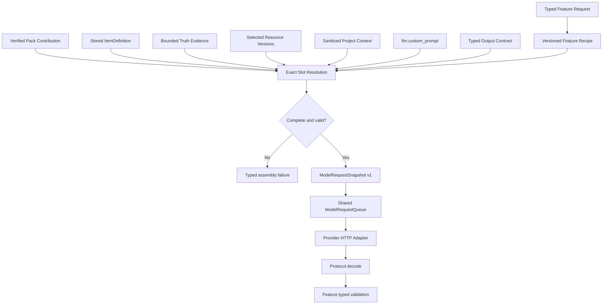

# Prompt、Game Pack 与真相源文本资源总览

> 文档定位：生产 Prompt、Pack Contribution、Truth Evidence、Item/Resource 与 Provider transport 的唯一所有权说明。
>
> 不包含：具体游戏的全部 guidance 文本或当前 candidate 验收状态。
>
> 架构入口：[`project architecture`](./项目架构总览.md)。
>
> 最后更新：2026-08-11

## 1. 一次模型请求如何形成



公式：

```text
Feature Recipe
+ Pack Contribution / selected Item descriptor
+ stored ItemDefinition
+ bounded Truth Evidence
+ selected Resource versions
+ sanitized Project Context
+ llm.custom_prompt
+ typed output contract
= run-scoped ModelRequestSnapshot v1
```

所有 slot 精确匹配、顺序确定并参与请求 hash。缺失、重复、未知 slot、schema 或 hash 不匹配都必须在 HTTP 请求前失败。

## 2. 唯一所有者

| 内容 | 唯一真源 | 不得替代它的位置 |
| --- | --- | --- |
| 跨游戏任务结构 | `crates/ats-features/recipes/*.json` | Tauri handler、React、Adapter |
| Feature request/result 和 domain validation | `crates/ats-features/src/*.rs` | Prompt 自然语言、Provider schema |
| 游戏类型、字段、guidance、resource/reference/profile 规则 | `game_packs/<id>/stage2-game-pack.json` | Runtime、React、通用 Feature 分支 |
| 当前游戏/API 事实 | verified Truth Snapshot v2 | Pack prose、用户描述、模型记忆 |
| 工程 Item 语义 | ItemDefinition v2 | Prompt 中重复定义、caller-authored Plan |
| 媒体版本和选择 | ResourceAsset v2 | 文件路径字符串、模型自行选择 |
| 用户本次补充偏好 | `llm.custom_prompt` | Pack、Recipe、全局硬编码 |
| Model transport | Runtime `ModelClient` + Adapter | Feature 中的 HTTP SDK 调用 |
| Provider response format | typed LLM config | 失败后自动猜测或降级 |

Feature Recipe 不包含 STS2 hook、BaseLib 类型或具体资源路径。Pack 不拥有完整工作流。Truth 不保存用户偏好。`llm.custom_prompt` 不能覆盖 schema、安全、Pack/Truth identity 或 typed validation。

## 3. Recipe 目录

`crates/ats-features/recipes/` 当前包含：

```text
mod-plan.json
mod-generate-single.json
composition-plan.json
composition-suite-brief.json
composition-plan-node.json
composition-retry-node.json
log-analyze.json
```

职责：

- `mod-plan` 为一个 Item 产生 typed ModPlan。
- `mod-generate-single` 消费精确 ItemDefinition/Plan/Resource 并返回 role-keyed generated contents。
- `composition-plan` 定义组合规划总任务和最终 Draft 合同。
- `composition-suite-brief` 先产生稳定的整套内容方向，后续 nodes 共享它。
- `composition-plan-node` 为 Blueprint 中一个有界逻辑节点产生内容。
- `composition-retry-node` 只替换已有 Draft 中一个逻辑节点。
- `log-analyze` 使用 Pack 日志贡献和有界日志输入返回 typed analysis。

Batch 复用 Plan + Single，Complex 复用 Batch + Build + Package。`composition.generate` 对 resolved graph 中每个 Item 复用 `mod-plan` 与 `mod-generate-single`，末尾执行无模型 finalize。Build、Package、Project Create 和 file-based Resource prepare 是确定性执行，不需要 Recipe。

Recipe 以编译期 bytes 和 pinned SHA 加载。修改 Recipe 必须同步 hash，并通过 loader/assembly 测试证明 schema、slot、容量上限和渲染顺序。

## 4. Typed Output Contract

Provider 原生 structured output 不是 domain validation 的替代品。同一份 typed contract 必须：

1. 进入 Recipe 的 `output.contract` slot，让模型看到。
2. 进入 `ModelRequestSnapshot`，用于 hash 和复验。
3. 映射到 Provider 原生 response format。
4. 响应返回后经过协议 decode 和 Feature domain validation。

`mod.generate.single` 按 selected item descriptor 的 `generatedFiles[].role` 编译 run-scoped role-keyed schema：所有声明 roles 都 required，`additionalProperties=false`。目标路径由 Feature 确定性展开，不由模型作者化。

`composition.plan` 从 Pack/Profile 编译 Blueprint 和 run-scoped schema，固定 total nodes、可用 Item types、fields、locales 和 reference slots。模型只返回节点内容和逻辑引用；Feature 计算 stable IDs、pinned hashes、quantity binding、profile provenance 和 root closure。

## 5. Pack Contribution

Game Pack 先通过 schema 和 pinned SHA 校验，再由 `ContributionResolver` 按 Feature required slots 精确选择贡献。

Pack v4 拥有：

- Item type identity、canonical/localization fields 和 required locales。
- `evidenceQueries { symbols, terms }`。
- typed identity/pinned reference slots。
- conditional Resource profiles。
- composition profiles、node groups、dependencies 和 binding rules。
- generated file roles、targets、merge mode 和必需 Primitive IDs。
- 按 Feature 分组的游戏 guidance。

Single Prompt 只加载 common guidance 和当前 Item type guidance，不把其他类型的领域规则混入请求。

Character 的 fields、localization、typed references、Placeholder/Branded 规则、BaseLib 指导、file roles 和 static Resource targets 都在 STS2 Pack 中。Feature/Runtime/React 不包含 Character 专用 Prompt 或属性分支。

## 6. Truth 与 Evidence

Truth Snapshot 是内容寻址、不可变、可验证的当前游戏/API 事实。模型只接收 bounded Evidence，不接收未验证目录、调用者宣称的“最新事实”或整份反编译输出。

每条 Evidence 至少保留：

```text
source_id
symbol
purpose
bounded_excerpt
relative_path
```

Plan result 的 `evidenceRequirements` 只保留业务证据意图，不直接执行索引查询。精确 `symbols/terms` 只来自经过 schema/hash 校验的 Pack item descriptor。Readiness 和 Generate 复用同一 query catalog。

缺少 current Snapshot、Pack identity 不匹配、source/index hash 失败或任一必需 query group 无命中时，依赖 Truth 的 Feature 必须在模型调用前返回 typed failure。

## 7. Item、Reference 与 Composition

ItemDefinition v2 的 canonical fields、Pack-keyed localization fields、behavior intent、Resource bindings、typed references 和 composition parameters 都是结构化数据。Prompt 可接收 resolver 已验证的 run-scoped 投影，但不得：

- 从自然语言猜测 references。
- 自动升级 pinned definition hash。
- 把 Profile 数量常量写回 Recipe 或 Feature。
- 选择 Resource 或更新 Item current pointer。

Composition staged generation 将 Suite Brief 投影到后续节点，以稳定跨节点语义。每个 checkpoint 只保存 strict-decoded normalized domain payload。Resume 从 persisted Blueprint、Pack/Truth/definition/Resource identities 重建请求，不从 checkpoint 取回 Prompt 或 Provider envelope。

## 8. Resource 文本与媒体

Selected Resource 通过 `resourceId + selectedVersion` 进入 Feature。模型看到的是已验证 role、media shape 和有界 provenance，不是任意本地路径。

Upload、Pack default 和 AI media 进入同一 Resource Workspace：

```text
typed Resource request
-> Pack resource spec
-> bytes/provider response
-> media probe
-> deterministic transforms
-> immutable candidates
-> preview
-> explicit select
-> ItemDefinition binding
```

`defaultAsset {id, sha256}` 不是 Prompt，也不是调用方路径。Shell 只以精确 Pack ID/SHA 和 asset ID 解析内嵌 bytes，Feature 在媒体解码前复核 asset hash。

AI media 请求由 typed `resource.prepare` request 和 Pack spec 组装，不使用 handler 中的隐藏 Prompt。未来动画、音频或新媒体类型仍应先进入 Resource Workspace，再由 Mod Feature 消费显式 selected version。

## 9. Provider Queue 与 Response Format

桌面 composition root 持有唯一 `ModelRequestQueue`：

- FIFO，默认并发度 1。
- 一个逻辑请求连同全部 transport retries 占有一个席位。
- 逻辑请求成功、耗尽或取消后才释放。
- 排队期间取消不发 HTTP 请求。
- 队列状态不进入 Run 或 Artifact。

OpenAI-compatible response format 必须在 Run 前显式选择：

| 配置 | 用途 |
| --- | --- |
| `json_schema` | Provider 真正支持 strict schema forwarding |
| `json_object` | 代理不转发 schema，但已证明支持 JSON Object |

两种模式都在 Recipe Prompt 中携带完整 typed contract，并使用 Feature validation 收口。Provider 失败后不自动换格式、换模型、接受 Markdown 代码块、截取首个 JSON 对象或伪造成功。

## 10. 哪些文本应留在代码中

可以且必须留在代码中：

- message roles、slot/schema/Feature/Primitive/failure IDs。
- JSON field names、枚举值、结构化输出合同和有限 registry。
- 转义、容量上限、路径规范化、脱敏和取消规则。
- 安全 fallback 和可行动错误文案。
- 测试 fixture 中的确定性模型输出。

不得作为生产长字符串放入 handler、Shell 或 Adapter：

- 如何生成某类 Mod 的任务指导。
- 具体游戏 hook、type、library 或资源路径规则。
- 当前版本 API/symbol 事实。
- 用户风格偏好或资源选择。
- Provider 专属业务 Prompt。

## 11. 安全与复验

Run/Artifact 可以保存 schema/hash、Pack/Snapshot/definition/Resource identity 和安全 provenance，但不能保存：

- API key、Authorization 或密钥派生值。
- 完整 Provider request/response body。
- 未经边界控制的 Prompt 或 raw completion。
- 绝对私有路径。
- 未分类 SDK/IO 原文。

`ModelRequestSnapshot` 是 run-scoped 可复验请求合同，日志不成为第二真源。Checkpoint 只保存 strict-decoded normalized domain payload，不保存 Snapshot messages 或 Provider envelope。

修改 Prompt/Pack/Truth/Resource 装配时，至少需要验证：

```text
Recipe hash and slot assembly
Pack contribution schema and resolver
Truth query/readiness behavior
dynamic output contract
provider request mapping
Feature typed validation
Run/Artifact redaction and provenance
facade or desktop boundary
legacy Prompt entry guards
```
