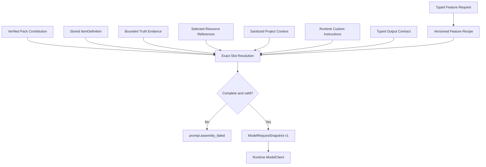

# Prompt、Game Pack 与真相源文本资源总览

> 本文描述 Stage 2 当前生产 Prompt 的唯一所有权与装配链。旧 `crates/ats-core/prompts/`、Prompt preview 和旧 assembler 已删除。
>
> 最后更新：2026-08-04

## 1. 一次请求如何形成



公式：

```text
Feature Prompt Recipe
+ Pack Contribution
+ Stored ItemDefinition
+ Truth Evidence
+ Selected Resources
+ Project Context
+ Runtime Custom Instructions
+ Typed Output Contract
= Run-scoped Model Request
```

所有 slot 精确匹配、顺序确定并参与请求 hash。缺失、重复、未知或 schema/hash 不匹配都在模型调用前失败。

`mod.generate.single` request v3 在验证精确 StoredItemDefinition/hash 与 Pack item type 后，将其 `generatedFiles[].role` 编译为
run-scoped bundle v2 Schema：`files` 是以角色为固定键的对象，所有声明角色均 required，且
`additionalProperties=false`。同一份动态 Schema 同时进入 `output.contract` Prompt slot、
`ModelRequestSnapshot` 和 provider 原生结构化输出。Recipe 的 `item.definition` slot 同时绑定 canonical fields、behavior、locale 和 resource bindings；Runtime 保留二次校验，但不再隐藏比模型可见
Schema 更严格的文件数量/角色合同。

规划与证据检索使用两个不同合同：`mod.plan` result v2 的 `evidenceRequirements`
只描述生成时需要证明的事实；Game Pack v3 顶层 `itemTypes` 为每个类型声明结构化
`evidenceQueries { symbols, terms }`。Readiness 和 Single Generate 消费同一目录；模型不需要
知道 Truth 索引键，Feature 也不把自然语言要求临时拆词或猜测为 symbol。

## 2. 唯一所有者

| 内容 | 唯一真源 | 示例 |
| --- | --- | --- |
| 跨游戏任务结构 | `crates/ats-features/recipes/*.json` | plan、single generate、log analyze |
| Feature request/result | `crates/ats-features/src/*.rs` | typed schema、验证和组合 |
| 游戏 Mod 类型目录与指导 | `game_packs/<id>/stage2-game-pack.json` | Pack v3 item fields/locales/Truth queries/Resource roles + Feature contributions |
| 工程 Item 定义 | `.ats/items-v1` Item repository | stable item ID、canonical fields、locale status、resource version binding、definition hash |
| 当前游戏事实 | verified Truth Snapshot v2 | symbol、purpose、bounded excerpt、source hash |
| 用户/AI/Pack 资源 | ResourceAsset / Workspace v2 | resource ID、candidate/selected version、provenance |
| 工程上下文 | composition root 生成的脱敏摘要 | 工程名、Mod ID、Pack ID |
| 用户运行时补充指令 | `llm.custom_prompt` | 本次运行附加偏好 |
| 模型 transport | `ats-runtime::ModelClient` + `ats-adapters::HttpModelClient` | provider-neutral request/response；原生严格 JSON Schema 输出 |

Feature Recipe 不包含 STS2 hook、BaseLib 类型或具体资源路径；Pack 不拥有完整工作流；Truth 不保存用户偏好；runtime custom instructions 不能覆盖 schema、安全、证据或验证合同。

## 3. 当前 Recipe

`crates/ats-features/recipes/` 当前包含：

```text
mod-plan.json
mod-generate-single.json
log-analyze.json
```

Batch 复用 Single，Complex 组合 Plan、Batch/Single、Build 和 Package，因此不再维护第二套长 Prompt。Build、Package、Project create 和 file-based Resource prepare 是确定性执行，不需要模型 Recipe。

Recipe 文件以编译时字节和 pinned SHA 加载。修改文本必须同时更新 hash，并由 loader/assembly 测试证明 schema、slot 与渲染顺序。

`mod-plan` 会把完整 verified `itemTypes` 目录与规划 guidance 以 pretty JSON 装入 `pack.guidance`；该槽位保持 32,000 字符有界，当前 Recipe SHA-256 为 `efd695f87099d9c1bebc670e61885210641dbd3abd89d11099568fd8e8b5954c`。新增 Pack 类型必须通过 desktop facade Plan Gate，不能因目录增长在模型调用前退化为 `feature.recipe_invalid`。

## 4. Game Pack Contribution

STS2 当前真源是：

```text
game_packs/sts2/stage2-game-pack.json
```

它声明 Feature contribution、item type、生成文件角色/目标、Evidence 查询、资源规格、日志规则、验证/build/package Primitive 和工程模板引用。Pack 先经过 schema 与 pinned SHA 校验，再由 `ContributionResolver` 按 Feature required slot 选择。`pack.mod-generate-single` v4 分离全局 `guidance` 与 `itemTypes[].guidance`；Single Prompt 只序列化 `commonGuidance` 和当前类型的 `itemGuidance`，Card、Potion、Power 等类型专属规则不得进入其他类型请求。目标路径仍由 Feature 确定性展开，不由模型作者化。`evidenceQueries` 是 Pack 的可执行数据合同：每组查询必须至少命中一条当前 Truth，最终 Evidence 有界去重；任一组无命中即返回 `truth.evidence_missing`，不能继续调用模型。

新增游戏应新增独立 Pack 与 Truth 来源。不得把游戏自然语言、hook、C#/Godot/BaseLib 约束重新写入通用 Feature 或 Shell。

## 5. Truth 与 Evidence

Truth Snapshot 是内容寻址、不可变、可验证的当前游戏事实。模型只接收 bounded Evidence，不接收未验证目录、调用者声明的“最新”事实或整个反编译输出。

每条 Evidence 至少包含：

```text
source_id
symbol
purpose
bounded_excerpt
relative_path
```

缺少 current Snapshot、Pack 身份不匹配或任一 source/index hash 失败时，依赖 Truth 的 Feature 必须返回 typed failure，不能退回手写知识或旧 Prompt。

Plan 的 `evidenceRequirements` 用于保留用户意图和验收语义，不直接进入 Truth 索引查询。
精确 `symbols` 和全文 `terms` 只来自经过 schema/hash 校验的 Pack contribution。新增游戏或
item type 必须同时提供可在其 Truth Snapshot 中命中的查询；不得要求最终用户在需求中填写
内部 symbol 才能生成。

## 6. Resource 文本与媒体

Selected Resource 通过 `resourceId + selectedVersion` 进入请求，模型看到的是验证后的角色、媒体类型和 provenance 摘要。用户上传、Pack default 与 AI media 都进入同一 Resource Workspace；AI 请求来自 typed `resource.prepare` payload 和 Pack resource spec，不使用隐藏的 handler Prompt。

未来扩展动画或新的媒体类型时，媒体模型请求仍应由 typed Feature request + Pack resource contribution 装配，生成结果先进入 Resource Workspace，再由 Mod Feature 显式选择。

## 7. 哪些文本留在代码中

以下文本可以且必须留在代码，因为它们是协议和安全合同，不是 Mod 领域 Prompt：

- message role、section/slot ID、schema ID/version、Feature/Primitive/failure code；
- JSON field、结构化输出合同、枚举值和有限注册表；
- 转义、截断、token budget、路径规范化和脱敏规则；
- 固定的安全 fallback 和可行动错误文案；
- 测试夹具中的确定性模型输出。

以下内容不得作为生产长字符串写入 handler、Shell 或 Adapter：

- “如何生成某类 Mod”的自然语言任务说明；
- STS2 hook、类型、BaseLib/Godot 规则或日志解释；
- 当前版本 API/符号事实；
- 用户风格偏好或资源选择；
- provider 专属业务 Prompt。

## 8. 安全与复验

Run/Artifact 可以保存 schema/hash、Pack/Snapshot/Resource identity 和安全 provenance，但不能保存 API key、Authorization、完整 provider body、绝对私有路径或未经边界控制的 Prompt/输出。`ModelRequestSnapshot` 是 run-scoped 可复验请求合同，日志不成为第二真源。

HTTP Adapter 必须把 Snapshot 的 typed output contract 映射到 provider 原生结构化输出：
OpenAI-compatible 使用 `response_format.type=json_schema`，Anthropic 使用
`output_config.format.type=json_schema`。provider 不支持时保持 typed failure；不得接受代码块、
截取首个 JSON 对象或静默重试为 prompt-only 模式。

当前残留门禁：

```powershell
rg -n "single_asset_plan|submit_text_generate_run|codegen_.*_prompt|llm_complete|llm_start_stream|SYSTEM_PROMPT|crates/ats-core/prompts" src src-tauri crates
```

生产路径预期零结果。修改 Prompt/Pack/Truth/Resource 装配时还必须运行相关 Feature、Pack、Snapshot、Artifact 与 facade E2E，而不能只检查字符串输出。
