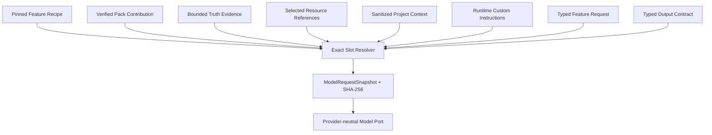

# Prompt、Game Pack 与真相源文本资源总览

> 文档定位：本文说明当前 Rust 实现中通用 Prompt、Game Pack guidance/template、Truth Snapshot 与生成证据的加载边界。
>
> 事实依据：`crates/ats-features/recipes/`、`crates/ats-features/src/prompt/`、`crates/ats-runtime/src/model.rs`、`game_packs/*/stage2-game-pack.json`，以及迁移期间仍服务当前 Shell 的 `crates/ats-core/prompts/` 和旧 Prompt assembler。
>
> 权威入口：系统结构见 [`项目架构总览`](./项目架构总览.md)。
>
> 最后更新：2026-08-02

## 1. Stage 2 目标装配



Work Order 4-5 已实现 `log.analyze`、`mod.plan` 和 `mod.generate.single` 的隔离纵切面：

- `crates/ats-features/recipes/log-analyze.json` 拥有通用诊断任务、消息角色和输出 JSON 合同，exact bytes SHA-256 固定为 `2c745f0ab0dffd260373ff9fe86a3b9d1ea488ba7e7c3e39fe33c4503b1973e2`。
- `mod-plan.json` 和 `mod-generate-single.json` 分别拥有通用规划与单项文本 bundle 合同，exact bytes SHA-256 为 `2a5a1dd5004f0fa1798decc921fa28798155022695c5a4b9191f3680134a83c2` 和 `ca176463b8c05058bdb49d359e4098b0b5ae9450004bb3c0ab83fc84de86e3e2`。
- `game_packs/sts2/stage2-game-pack.json` 的日志、规划、单项生成和资源 Contribution 拥有具体游戏/工具链依据、文件角色、目标模板和资源规格；Pack exact bytes SHA-256 为 `e0f8b8c063c69393a77cc19bc868bb4102d90676f93d943235adeced3e12c20e`。
- Truth Evidence 仍只表示当前版本的 bounded 事实；Resource slot 只传递已选择版本的 identity/role/media type，不嵌入未验证文件。
- `runtime.custom_instructions` 在 Recipe 中恰好出现一次。Loader 拒绝未知、重复、遗漏、未消费或超长 slot，插入值中的 `{{...}}` 不会被二次解释。
- `ats-runtime::ModelRequestSnapshot` 保存 Feature、Recipe、Pack、Truth、Resource、消息、输出合同和限制，并对除 `requestSha256` 自身外的规范字段计算 SHA-256。反序列化重新校验内容身份。
- `mod.generate.single` 的模型输出只有声明过的文本角色和内容，模型不能提供目标路径或二进制资源。Feature 使用 Pack 模板展开路径，读取 Resource 当前 selected version，完成可回滚写入、注册 compile gate、ArtifactManifest v3 发布和 RunRecord v3 成功转换。

新 Runtime 和通用 Recipe 不包含游戏分支或游戏/工具链专属术语。

## 2. 迁移期间的生产事实

```text
通用 Prompt（编译时内嵌）
  crates/ats-core/prompts/
           |
           v
Game Pack（游戏声明、guidance、工程模板）
  game_packs/<game-id>/
           |
           v
VerifiedGameContext（一次 Run 固定 Pack + 当前 Snapshot）
           |
           v
Truth Snapshot（外部 app-data 中不可变的当前游戏事实）
  <runtime>/game-packs/<game-id>/snapshots/<snapshot-id>/
           |
           v
PromptAssembler -> 模型请求 -> ArtifactManifest.evidence[]
```

- 通用 Prompt 定义跨游戏稳定的请求结构、输出协议和工作流要求。
- Game Pack 声明某个游戏的能力、事实源、验证规则、资源规格、guidance、工程模板、构建和打包契约。
- Truth Snapshot 保存从当前游戏版本和依赖中取得、经过索引与完整性校验的不可变事实。
- `VerifiedGameContext` 在一次 Run 内固定 Game Pack 和 Snapshot identity，防止生成中途切换事实版本。

## 3. 旧通用 Prompt

当前内置 Prompt 位于：

```text
crates/ats-core/prompts/
  analyzer.md
  codegen.md
  image.md
  runtime_agent.md
  runtime_system.md
  runtime_workflow.md
```

`PromptLoader::built_in()` 通过 `include_str!` 将六个文件编译进二进制，生产运行时不从磁盘读取这些文件。`codegen.md` 等文件可按 Markdown `## section_key` 读取 bundle 分段；分段键必须匹配 `^[a-z0-9_]+$`，模板变量使用 `{{ name }}`。

这些旧文件和 handler 目前仍服务 Shell，其中 `codegen.md`、`single_asset_plan` 和旧 `log_analysis` 混有已经在新层建立替代合同、但尚未切换生产入口的 Feature 任务、游戏/工具链指导或长生产 Prompt。它们不是 Stage 2 的目标所有权；WO7 切换 Shell 后删除被替代入口。在此之前不得把新纵切面描述成当前 UI 已使用。

## 4. Game Pack 文本与工程资源

STS2 的当前资源位于：

```text
game_packs/sts2/
  game-pack.json          能力、事实源、规则、资源、构建和打包声明
  guidance/               按 scenario / asset type 选择的游戏专属指导
  template/               创建工程时使用的稳定工程骨架
```

`GamePackRegistry::built_in()` 将当前 STS2 manifest、guidance 和 template 字节编译进应用。`GamePackLoader` 在 Pack 可用前校验声明、允许的有限 runner/provider/indexer、文件列表和目录校验和；加载失败不得退回隐藏的 Core 内置 STS2 规则。

边界如下：

- guidance 可以表达稳定的游戏约束和工程习惯，但不能持久化容易随版本变化的行为答案。
- template 只负责工程骨架；具体 API、生命周期 hook 和调用顺序必须从当前 Truth Snapshot 取证。
- validation rules 由 Pack 提供规则数据，通用验证引擎执行有限、可测试的算法。
- `resource_specs[].localization.allowed_rich_text_tags` 声明生成本地化可使用的精确标签；Prompt 展示同一白名单，通用 bundle 校验器在写文件和 compile gate 之前拒绝未知、属性式、未闭合、错配或裸方括号文本。
- 新游戏应新增独立 Game Pack，并复用通用 Core 能力；不得在通用 handler 中增加 `game_id == "sts2"` 分支。

## 5. Truth Snapshot 与 `VerifiedGameContext`

Truth Snapshot 不在仓库内，也不使用旧 `runtime/knowledge/` 布局。`TruthSnapshotStore` 以应用 runtime/app-data 目录为根，使用以下结构：

```text
<runtime>/game-packs/<game-id>/
  current.json
  snapshots/<snapshot-id>/
    snapshot.json
    sources/...
    indexes/...
```

Snapshot refresh 先在 `.staging/` 中复制声明的 source、运行有限 indexer、计算内容摘要并完成验证，随后才原子更新 `current.json`。生产生成入口通过 `VerifiedGameContext::open_current(...)` 同时取得：

- 已加载且校验通过的 Game Pack；
- 当前指针指向且完整性校验通过的不可变 Snapshot；
- Pack/Snapshot schema、SHA-256、source、index、工具版本和创建时间。

缺少 current Snapshot 或完整性校验失败时，生产生成必须停止，不能使用陈旧目录或手写 Prompt 冒充已验证事实。

## 6. 旧生产装配与生成证据

`PromptAssembler` 接收 `VerifiedGameContext`，按请求 scenario 和 asset type 组合：

1. `PromptLoader` 提供的通用 Prompt bundle；
2. Game Pack 选择出的 guidance 和资源契约；
3. 当前 Snapshot provider 返回的 bounded code facts、lookup 和 warning；
4. 当前工程的 ModId、`MainFile.cs` 及本次请求上下文。

事实引用使用逻辑 URI，而不是本机绝对路径：

```text
snapshot://<snapshot-id>/<source-id>/...
```

结构化资产和 custom code 生成会把本次实际选择的 `source`、`symbol`、`purpose`、`boundedExcerpt` 写入对应 `ArtifactManifest.evidence[]`，并同时记录 Pack/Snapshot identity。Evidence 是某次产物的可复验事实，不是独立的持久化行为契约，也不创建 `evidence.md`。

## 7. 维护与验证

- 新 Feature 的跨游戏稳定任务结构放入 `crates/ats-features/recipes/`；旧生产入口在 WO7 前仍从 `crates/ats-core/prompts/` 加载。
- Recipe 和 Stage 2 Pack manifest 使用 LF exact bytes，并在 Loader 旁固定 SHA-256；修改内容必须同步 pin 和 loader test。
- 游戏专属 guidance、模板和声明放入 `game_packs/<game-id>/`，并同步 manifest 文件列表和 SHA-256。
- 当前游戏/依赖事实只通过 Truth Snapshot refresh 进入生产上下文。
- 修改 Prompt 装配、Pack guidance 或事实选择时，至少验证 loader、Game Pack loader、knowledge resolver、prompt assembler 和相关生成 handler。
- 旧 Python Prompt、`crates/ats-core/templates/sts2/` 和 `runtime/knowledge/` 都不是当前产品真源；历史迁移文档可以提及它们，但活跃架构文档不得将其描述为现行路径。
