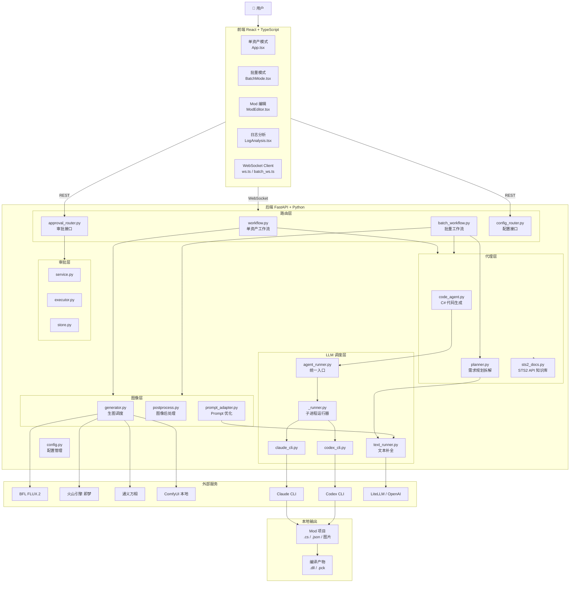
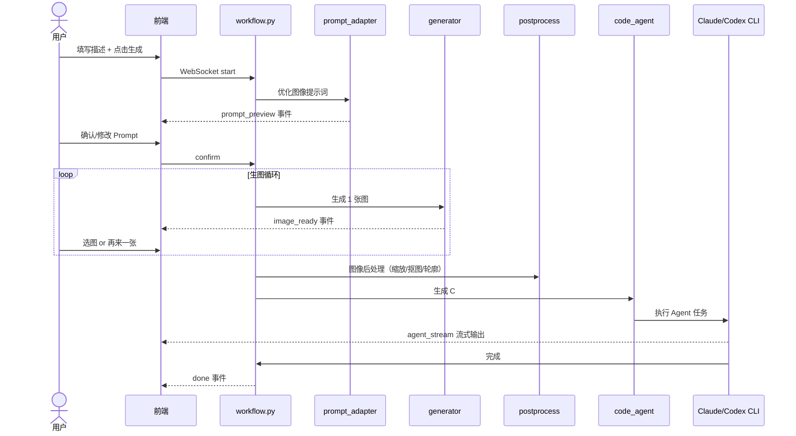
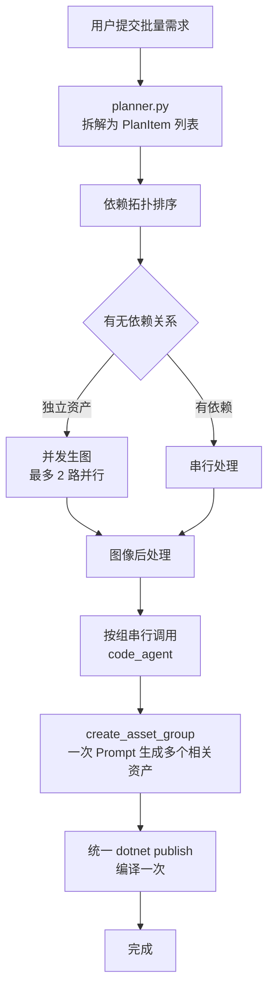
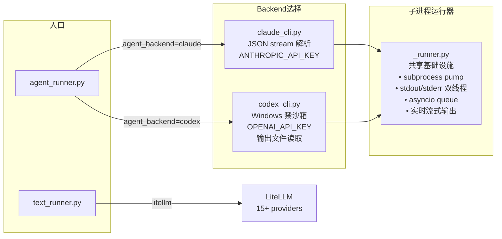
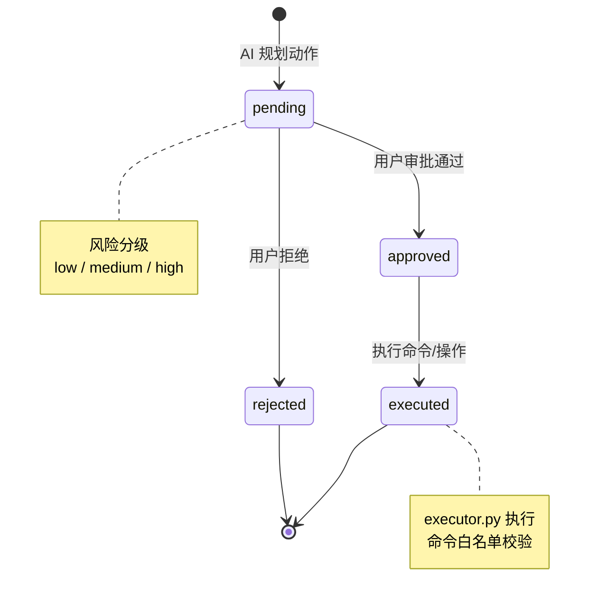
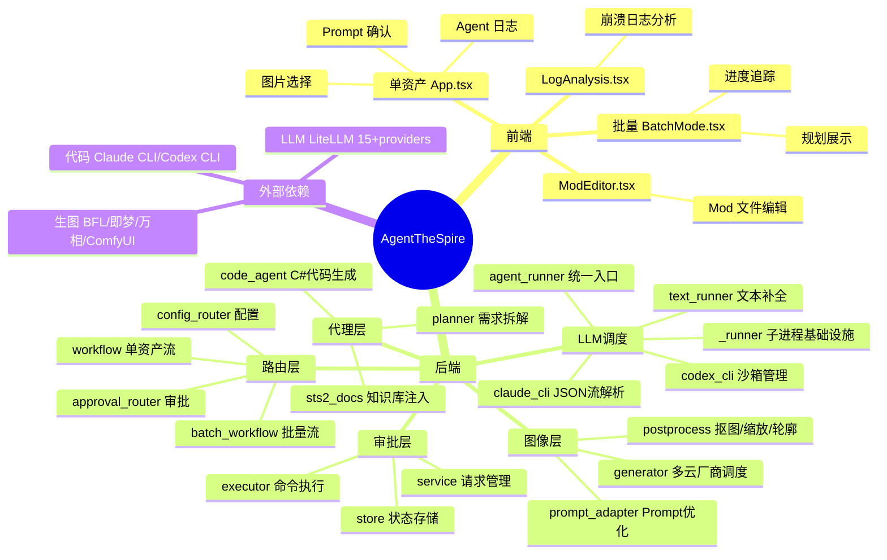

# AgentTheSpire 项目架构分析

## 项目定位

**AgentTheSpire** 是一个 AI 驱动的《杀戮尖塔 2》Mod 生成器，核心链路：**自然语言描述 → AI 生图 → AI 写代码 → 编译部署**，全程自动化。

---

## 整体架构

---

## 单资产工作流

---

## 批量工作流

---

## LLM 调度层

---

## 审批模块状态机

---

## 模块全景

---

## 模块职责一览

| 模块 | 文件 | 职责 |
|------|------|------|
| **工作流路由** | `routers/workflow.py` | WebSocket 驱动单资产完整链路，管理 13 个流式事件阶段 |
| **批量工作流** | `routers/batch_workflow.py` | 依赖拓扑排序 + 2路并发生图 + 串行代码生成 |
| **代码代理** | `agents/code_agent.py` | 将 STS2 游戏知识注入 Prompt，驱动 CLI 写 C#、本地化文件并编译 |
| **规划器** | `agents/planner.py` | 将自然语言需求拆解为 PlanItem，处理资产间依赖关系 |
| **图像生成** | `image/generator.py` | 统一调度 BFL/即梦/万相/ComfyUI，处理轮询、超时、下载 |
| **图像后处理** | `image/postprocess.py` | 自动抠图、生成轮廓、按资产类型输出多尺寸版本 |
| **LLM 运行器** | `llm/_runner.py` | 共享子进程基础设施，双线程 pump stdout/stderr，实时推流 |
| **审批模块** | `approval/` | 风险分级（low/medium/high）+ 人工审批 + 安全执行隔离 |
| **配置管理** | `config.py` | 单例配置，支持环境变量覆盖，Windows 持久化写入 |
| **WebSocket 客户端** | `frontend/lib/ws.ts` | 持久断线检测，连接异常实时反馈到 UI |
