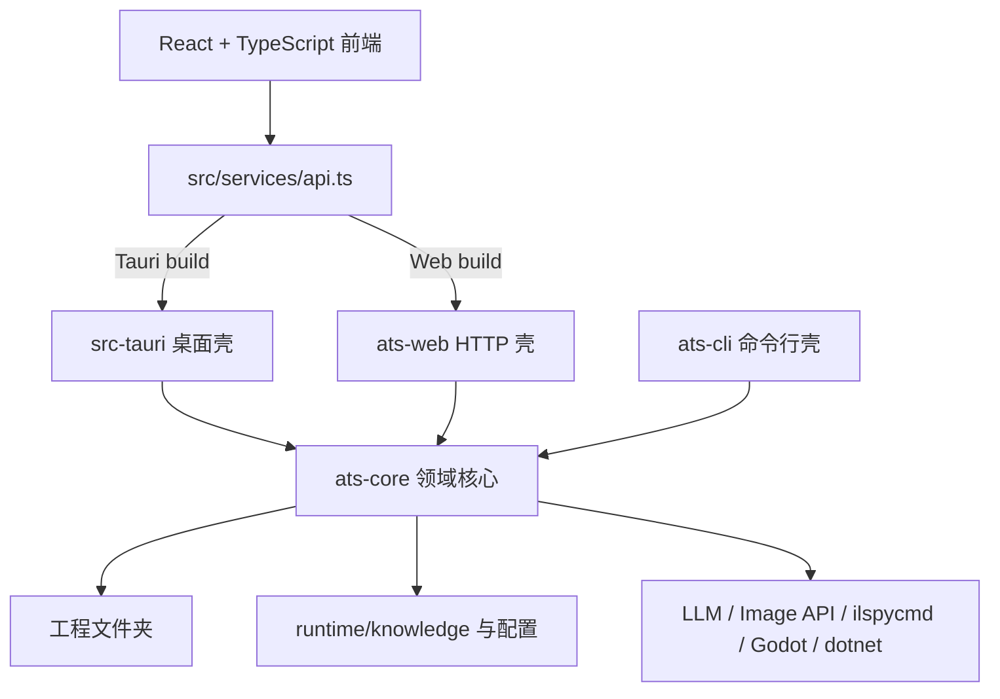

# 项目架构总览

> 文档定位：本文描述 AgentTheSpire 当前 Rust/Tauri 实现的稳定结构、模块职责和关键数据流。
>
> 事实依据：`Cargo.toml`、`crates/`、`src-tauri/`、`src/` 和当前配置/工程实现。
>
> 权威入口：阶段方向见 `docs/03-当前方案/当前方案.md`。
>
> 最后更新：2026-07-29

## 项目定位

AgentTheSpire 是 AI 驱动的 Mod 生产工具。当前首要目标游戏是《杀戮尖塔 2》，核心链路为：

```text
自然语言需求
  → 知识检索与规划
  → LLM/图像生成
  → 结构与编译验证
  → 构建和打包
  → 真实游戏人工验收
```

## 总体结构


```mermaid
flowchart TB
    UI[React + TypeScript 前端]
    API[src/services/api.ts]
    Desktop[src-tauri 桌面壳]
    Web[ats-web HTTP 壳]
    CLI[ats-cli 命令行壳]
    Core[ats-core 领域核心]
    Project[工程文件夹]
    Runtime[runtime/knowledge 与配置]
    External[LLM / Image API / ilspycmd / Godot / dotnet]

    UI --> API
    API -->|Tauri build| Desktop
    API -->|Web build| Web
    Desktop --> Core
    Web --> Core
    CLI --> Core
    Core --> Project
    Core --> Runtime
    Core --> External
```

## Workspace

```text
.
├─ Cargo.toml
├─ crates/
│  ├─ ats-core/       领域逻辑、Prompt、STS2 模板
│  ├─ ats-web/        axum HTTP 与静态资源壳
│  └─ ats-cli/        构建、部署、日志和停止命令
├─ src-tauri/         Tauri v2 桌面壳与 IPC commands
├─ src/               React 19 + TypeScript 共享前端
├─ runtime/           运行配置、知识库和运行产物入口
└─ scripts/           CI、E2E 和辅助脚本
```

Cargo workspace 使用 Rust edition 2024，并禁止 `unsafe_code`。`ats-core` 不依赖具体 UI 或传输框架，桌面/Web/CLI 只负责装配和 IO 边界。

## 核心模块

`ats-core` 当前导出以下主要能力：

| 范围 | 主要模块 | 职责 |
| --- | --- | --- |
| 工程 | `project`、`project_utils`、`fs_atomic` | 工程目录、recent、锁、路径和原子文件更新 |
| 任务 | `platform`、`audit`、`plan_artifact` | job 生命周期、handler、history、audit 和计划产物 |
| AI | `llm`、`image_gen`、`prompting`、`codegen`、`planning` | 模型调用、Prompt 组装、需求规划和代码/图片生成 |
| 知识 | `knowledge` | STS2/BaseLib 反编译、manifest、事实检索和知识包 |
| 图片 | `image_proc` | 背景去除、资源派生和可选 ML 处理 |
| 工具链 | `toolchain`、`mod_analyzer`、`capabilities` | Godot/.NET/游戏环境、项目分析和能力探测 |
| 基础设施 | `config`、`health`、`errors` | 配置、健康状态和统一错误 |

## 桌面壳

`src-tauri` 以 Tauri IPC 暴露 core 能力，不在桌面进程内启动 HTTP 服务。主要托管：

- 当前配置快照及保存后的热替换。
- app data 路径和 recent projects。
- 当前工程及操作系统文件锁。
- image processing prewarm 状态。
- project、job、knowledge、planning、codegen、LLM、settings 和 audit commands。

启动期非致命预热通过后台任务执行，窗口不等待 ML 模型或缓存准备完成。

## Web 与 CLI 壳

`ats-web` 当前是轻量 Web 入口，装配 health、knowledge、planning、codegen、LLM 和静态前端。它不是完整 SaaS 平台，也没有开放端口所需的完整应用鉴权，因此默认只应绑定本机或放在外部鉴权代理之后。

`ats-cli` 提供自动化和运维入口。壳层不得复制 core 中的任务、构建或错误分类逻辑。

## 共享前端

前端使用 React 19、TypeScript 5.6、Vite 6、Zustand 5 和 HashRouter。主要页面包括 Dashboard、Mod Editor、Batch Generation、Log Analysis、System、Settings 和 DevTools。

`src/services/api.ts` 根据构建期 `__IS_TAURI__` 选择：

- `tauriApi.ts`：通过 Tauri `invoke` 调用桌面 commands，并作为 API 类型权威。
- `webApi.ts`：通过 HTTP 调用 `ats-web`，必须满足与 `tauriApi.ts` 相同的导出签名。

页面组件只消费统一 API，不自行维护桌面/Web 两套业务流程。

## 工程数据

桌面端不依赖数据库，每个 Mod 工程是可复制、可归档的自包含目录。核心内容包括：

```text
<project>/
├─ project.json
├─ plan.json
├─ items/
├─ artifacts/
├─ history/
├─ Generated/
└─ .ats/
   ├─ lock
   └─ audit.log
```

任务写入由文件仓储、audit 包装和文件事务共同约束。失败产物保留诊断证据，但不能污染正式生成文件。

## Mod 生产边界

长期目标是“一条通用 Mod 生产流水线 + 多个 Game Pack”：

- 通用引擎实现获取、索引、生成、验证、构建、打包和追踪机制。
- Game Pack 声明游戏真相源、专属资源、工程骨架、资源规格、验证规则和交付布局。
- STS2 的 C#、Godot、BaseLib、DLL/PCK 与具体 hook 属于 STS2 Game Pack 内容，不进入通用领域接口。

当前实现仍以 STS2 为第一个样本，Game Pack 目标边界已确定，但尚未完成全面资源化重构。
