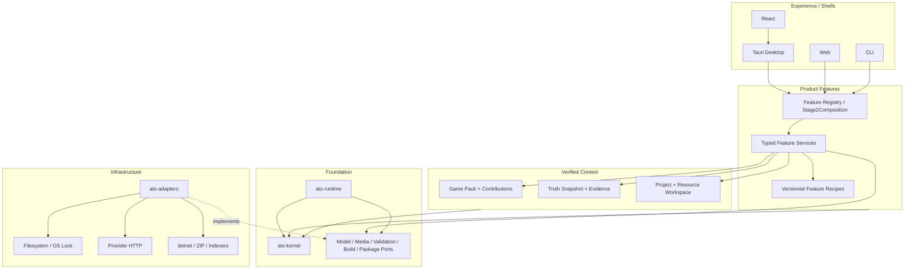
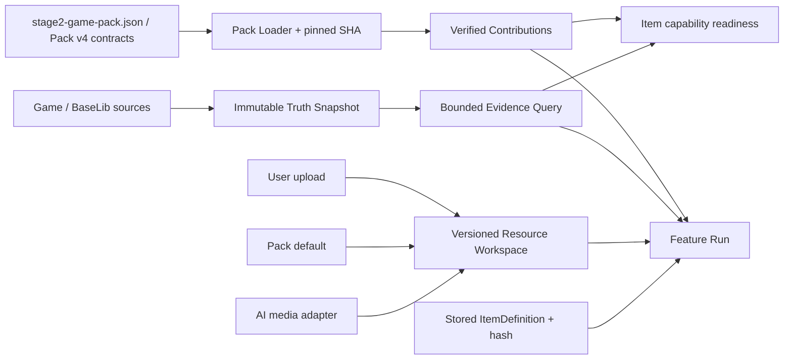
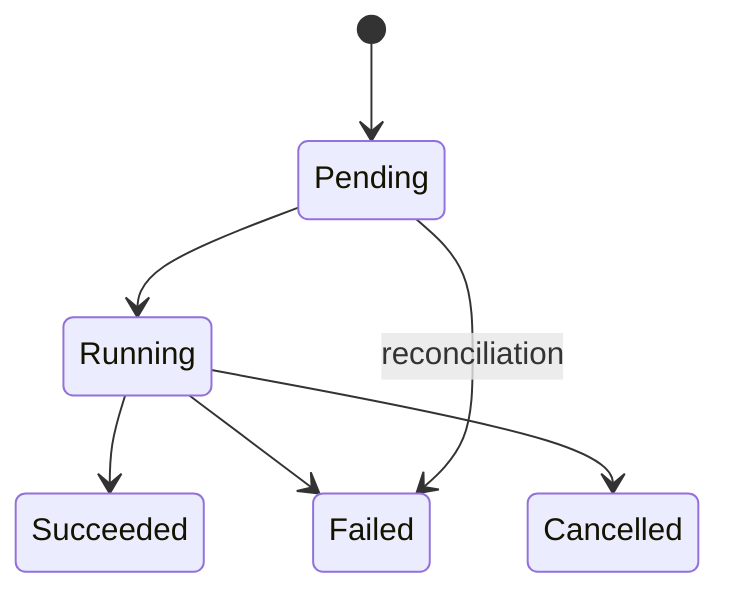

# 项目架构总览

> 本文描述 `rust` 分支当前生产架构。事实依据是 Cargo workspace、Tauri composition root、共享 Feature catalog、v3 Run/Artifact 合同与 STS2 Stage 2 Pack。
>
> 最后更新：2026-08-05

## 1. 总体结构

AgentTheSpire 当前是单仓库、单进程优先、编译期约束依赖方向的模块化单体。旧 `ats-core` 已删除；Shell 不能绕过 Feature facade 直接执行产品生成逻辑。


```mermaid
flowchart TB
    subgraph Shells[Experience / Shells]
        React[React]
        Tauri[Tauri Desktop]
        Web[Web]
        CLI[CLI]
    end

    subgraph Product[Product Features]
        Facade[Feature Registry / Stage2Composition]
        Features[Typed Feature Services]
        Recipes[Versioned Feature Recipes]
    end

    subgraph Context[Verified Context]
        Pack[Game Pack + Contributions]
        Truth[Truth Snapshot + Evidence]
        Workspace[Project + Resource Workspace]
    end

    subgraph Foundation[Foundation]
        Kernel[ats-kernel]
        Runtime[ats-runtime]
        Ports[Model / Media / Validation / Build / Package Ports]
    end

    subgraph Infra[Infrastructure]
        Adapters[ats-adapters]
        FS[Filesystem / OS Lock]
        HTTP[Provider HTTP]
        Tools[dotnet / ZIP / Indexers]
    end

    React --> Tauri
    Tauri --> Facade
    Web --> Facade
    CLI --> Facade
    Facade --> Features
    Features --> Recipes
    Features --> Pack
    Features --> Truth
    Features --> Workspace
    Features --> Ports
    Runtime --> Ports
    Adapters -. implements .-> Ports
    Adapters --> FS
    Adapters --> HTTP
    Adapters --> Tools
    Product --> Kernel
    Context --> Kernel
    Runtime --> Kernel
```

主执行流：

```text
typed Shell request
-> Feature Registry schema validation
-> Stage2Composition
-> Pack contribution / Truth / Resources resolution
-> typed Feature service
-> Runtime ports + registered Adapters
-> RunRecord v3 / ArtifactManifest v3
-> versioned typed result
```

## 2. Crate 职责

| Crate | 拥有 | 不拥有 |
| --- | --- | --- |
| `ats-kernel` | 稳定 ID、schema ref、hash、`ActionableFailure`、`BuildInfo`、工程模板值合同 | IO、产品 Feature、游戏分支 |
| `ats-runtime` | `RunRecord` v3、`ArtifactManifest` v3、取消、repository/publisher/model 等 ports | 中心 `RunKind/RunResult`、Pack、Prompt 自然语言 |
| `ats-game-context` | Pack loader、Contribution resolver、Truth/Evidence、STS2 模板加载 | 产品工作流、HTTP/文件实现 |
| `ats-workspace` | `ProjectFolder`、OS lock、recents、Resource v1/version/selection | 模型调用、游戏规则 |
| `ats-features` | typed Feature、Recipe、请求/结果、Feature 组合 | provider SDK、Tauri/Axum、任意 Pack 代码 |
| `ats-adapters` | HTTP model、Settings、v3 Run/Truth/Resource/Artifact store、dotnet/ZIP runner | Feature 编排和 Shell DTO |
| `src-tauri` | composition、IPC、ProjectSession、任务监督、退出排空 | Prompt、游戏规则、文件事务算法 |
| `ats-web` | health、Feature catalog、静态 SPA | 旧 planning/codegen/raw LLM API |
| `ats-cli` | deploy 运维和共享 Feature catalog 输出 | 第二套产品实现 |

依赖门禁由 `scripts/check-stage2-dependency-dag.mjs` 校验。Foundation/Context/Workspace/Adapters 不得反向依赖 `ats-features`，六个 Stage 2 crate 不得依赖已删除的 `ats-core`。

## 3. Feature 边界

当前共享 catalog 有 10 个 Feature：

```text
project.create
mod.plan
composition.plan
resource.prepare
mod.generate.single
mod.generate.batch
mod.generate.complex
log.analyze
project.build
project.package
```

每个 Feature 拥有自己的 request/result schema。新增 Feature 不修改 Runtime 中心枚举；`composition.plan` 只生成并持久化可审阅 Draft，不写 Item current pointer 或工程文件；Batch v4 接受精确 `StoredItemDefinition`，在 Feature 内按项组合 Plan 与 Single 并持久化 child Runs；Complex v3 直接复用同一 Batch request/result，只有全项成功才继续 Build/Package。Shell 不装配 Plan，也不建立平行 Prompt、生成器或 Artifact Store。

`resource.prepare` 注册用户文件、Pack default 和 AI media 路径。AI Adapter 支持 OpenAI Images 与 Chat Completions 图片协议，结果通过同一 Resource version/provenance/selection 合同入库；health 报告 `mediaGenerationRegistered=true`。provider 配置或调用错误保持 typed failure。

## 4. Game Pack、Truth 与 Resource


```mermaid
flowchart LR
    PackFile[stage2-game-pack.json / Pack v4 contracts] --> Loader[Pack Loader + pinned SHA]
    Loader --> Contributions[Verified Contributions]
    Source[Game / BaseLib sources] --> Snapshot[Immutable Truth Snapshot]
    Snapshot --> Evidence[Bounded Evidence Query]
    Contributions --> Readiness[Item capability readiness]
    Evidence --> Readiness
    Upload[User upload] --> Resource[Versioned Resource Workspace]
    PackDefault[Pack default] --> Resource
    AI[AI media adapter] --> Resource
    Contributions --> Feature[Feature Run]
    Evidence --> Feature
    Resource --> Feature
    Item[Stored ItemDefinition + hash] --> Feature
```

Game Pack 提供游戏声明、模板、日志依据、资源规格和已注册 Primitive ID，不携带任意 PowerShell、原生库或未审查代码。Truth 是当前版本事实；Resource 是用户工程中的可变版本资源，二者不能互相替代。

Plan result v2 只用 `evidenceRequirements` 描述需要证明什么；具体检索、通用字段、Pack-keyed
localization fields、typed reference slots 和 conditional Resource profiles 由 Pack v4 顶层
`itemTypes` 目录提供。顶层 `compositionProfiles` 另声明有界 preset/custom 参数合同。Readiness 与 Single Generate 使用同一组
`evidenceQueries` 逐组查询当前 verified Truth，每组至少命中一条才允许执行。Plan guidance v3
和 Single generation v3 不再复制类型目录。这个边界既避免把模型自然语言误当 Truth symbol，
也避免通用 Feature、贡献和 React 各自维护 STS2 类型事实。

当前只有 STS2 完整 Pack。新游戏通过新增 Pack 和证据扩展，不在通用 Feature 中增加 `game_id == "sts2"` 分支。

ItemDefinition 已升级为 v2：本地化内容按 Pack field ID 保存；identity 引用保存
`itemId + expectedItemType`，pinned 组合引用保存 `itemId + definitionHash + quantity`；可选
composition profile 保存 preset/custom 来源与完整参数。新定义存于 `.ats/items-v2`，旧
`.ats/items-v1` 作为历史证据保留但不被静默改写。

CompositionDraft v1 是独立的可编辑审阅状态，保存于 `.ats/composition-drafts-v1`，通过
revision CAS 防止并发覆盖。确认服务只接受闭合子图，并使用 prepared/committed journal
一次更新全部 Item current pointers；中途失败回滚，进程中断后在下次访问时恢复。
ProjectSession 持有唯一 Draft repository；Tauri 暴露 guarded list/get/update/delete/confirm，
React Composition Studio 只解释 Pack profile、Draft nodes、过滤/分页和闭合选择。
`ResolvedItemGraph` 只沿 pinned 边展开精确版本，identity 边在闭包内验证归属类型；返回前
统一检查 Pack、Truth、locale、Resource readiness、cycle/type/hash 和 128 节点上限，并将
排序后的 definitions/edges 与 Pack/Truth/Draft/profile provenance 计算为稳定 graph digest。

## 5. Prompt 与模型请求

```text
Feature Recipe
+ Pack Contribution
+ Stored ItemDefinition
+ bounded Truth Evidence
+ Selected Resources
+ sanitized Project Context
+ Runtime Custom Instructions
+ typed output contract
= ModelRequestSnapshot v1
```

模型端口在 Runtime，HTTP 实现在 Adapters，自然语言任务结构在 Feature Recipe，游戏指导在 Pack，事实在 Truth，用户临时偏好在 `llm.custom_prompt`。Run 只持有可哈希请求快照和安全 provenance，不持有密钥或 provider 原始错误正文。

## 6. Run、Artifact 与工程锁


```mermaid
stateDiagram-v2
    [*] --> Pending
    Pending --> Running
    Running --> Succeeded
    Running --> Failed
    Running --> Cancelled
    Pending --> Failed: reconciliation
```

- `ProjectSession` 持有一个 `ProjectFolder` OS lock、共享 `FileRunRepository`、CancellationToken 和 task handle。
- submit 先创建 Pending，再 CAS 为 Running；supervisor 只持久化一次终态。
- close/switch/exit 先拒绝新任务、发布取消、等待真实清理，再释放锁；超时不强制解锁。
- RunRecord v3 使用 `featureId + VersionedPayload`，没有产品中心 `RunKind/RunResult`。
- Artifact 先在同目录 `.staging-*` 完整写入并校验，再原子 rename 为不可变 final；Windows 只对已分类的短暂 sharing/access 冲突有界重试。
- 发布失败清理本轮 staging，不伪造成功；历史证据和用户数据不得由门禁清理。

工程主要布局：

```text
<project>/
  project.json
  Generated/
  items/
  artifacts/<artifact-id>/runs/<run-id>/artifact-manifest.json
  .ats/lock
  .ats/version
  .ats/runs-v3/<run-id>.json
  .ats/items-v2/<item-id>/definitions/<definition-hash>.json
  .ats/composition-drafts-v1/<draft-id>.json
```

## 7. Shell 合同

Tauri 注册 health/settings/project、Feature catalog、Truth status/import、Draft repository/confirmation、generic `submit_feature`、v3 run get/list/cancel。React 的 `tauriApi.ts` 是 v3 transport 与 runtime guard 权威，终态以持久化 `get_run` 为准，不以事件流或页面本地状态替代。

Web 当前只提供 `/api/health`、`/api/features` 和 SPA；工程与执行操作明确返回 desktop-only typed failure。CLI 的 `features` 命令输出同一共享 catalog。

## 8. 失败与安全

Kernel `ActionableFailure` 是唯一跨 IPC/UI 的失败形状。Feature 内部使用 `RunFailure`，composition/shell 在边界映射为稳定 code、stage、action 和安全 details。Single Generate 保留 `truth.*`、`pack.*`、`resource.*`、`model.*`、`validation.*`、`artifact.*` 和 `run.*` 分类，Batch 子 Run 复用同一分类，不再统一压成 `feature.execution_failed`。未知 Rust/SDK/IO 文本、绝对路径、Prompt、响应正文和 secret 不得进入 Run、Artifact、IPC 或 verification。

## 9. 构建与验证

候选 `BuildInfo` 由 `src-tauri/build.rs` 和 `ats-kernel` 合同生成。baseline/`ml-rembg` 表示实际编译 feature 身份；它不自动表示媒体 adapter ready。

架构机器门禁至少包括 DAG self-test/real check、workspace check/test/clippy、桌面 baseline/ML/e2e feature check、前端 test/type/build、legacy entry 搜索、rustfmt 和 `git diff --check`。完整 release candidate、安装器启动和真实游戏行为是独立人工门禁。
