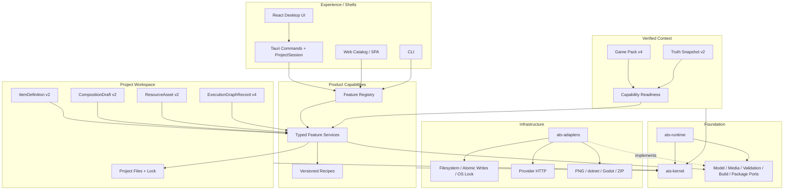
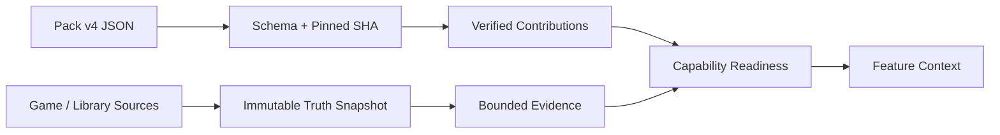

# 项目架构总览

> 文档定位：`rust` 分支跨阶段稳定架构、模块责任和主要执行流入口。
>
> 不包含：当前任务状态、candidate 账本或单个游戏的完整 Pack 细节。
>
> 事实入口：[`current progress`](../02-现状/当前进度说明.md)。
>
> 最后更新：2026-08-11

## 1. 架构原则

AgentTheSpire 是一个单仓库、桌面端优先、编译期约束依赖方向的模块化单体。

核心原则：

- Shell 不绕过 Feature 执行产品逻辑。
- Runtime 只提供跨游戏稳定机制，不认识具体游戏或 Mod 类型。
- Feature 拥有工作流、typed request/result、验证和组合。
- Game Pack 声明游戏差异，Truth 证明当前版本事实。
- Workspace 保存用户工程中的可变版本状态和不可变证据。
- Adapter 实现 IO 和外部工具，不编排 Feature。
- 任何成功都必须有持久化 Run/Graph/Artifact 事实，不以 UI 临时状态代替。

## 2. 总体结构


```mermaid
flowchart TB
    subgraph Shells[Experience / Shells]
        React[React Desktop UI]
        Tauri[Tauri Commands + ProjectSession]
        Web[Web Catalog / SPA]
        CLI[CLI]
    end

    subgraph Product[Product Capabilities]
        Registry[Feature Registry]
        Features[Typed Feature Services]
        Recipes[Versioned Recipes]
    end

    subgraph Context[Verified Context]
        Pack[Game Pack v4]
        Truth[Truth Snapshot v2]
        Ready[Capability Readiness]
    end

    subgraph Workspace[Project Workspace]
        Item[ItemDefinition v2]
        Draft[CompositionDraft v2]
        Resource[ResourceAsset v2]
        Graph[ExecutionGraphRecord v4]
        Project[Project Files + Lock]
    end

    subgraph Foundation[Foundation]
        Kernel[ats-kernel]
        Runtime[ats-runtime]
        Ports[Model / Media / Validation / Build / Package Ports]
    end

    subgraph Infrastructure[Infrastructure]
        Adapters[ats-adapters]
        FS[Filesystem / Atomic Writes / OS Lock]
        HTTP[Provider HTTP]
        Tools[PNG / dotnet / Godot / ZIP]
    end

    React --> Tauri
    Tauri --> Registry
    Web --> Registry
    CLI --> Registry
    Registry --> Features
    Features --> Recipes
    Pack --> Ready
    Truth --> Ready
    Ready --> Features
    Item --> Features
    Draft --> Features
    Resource --> Features
    Graph --> Features
    Features --> Ports
    Features --> Project
    Runtime --> Ports
    Adapters -. implements .-> Ports
    Adapters --> FS
    Adapters --> HTTP
    Adapters --> Tools
    Product --> Kernel
    Context --> Kernel
    Workspace --> Kernel
    Runtime --> Kernel
```

普通执行流：

```text
typed Shell request
-> Feature registry validation
-> ProjectSession composition root
-> Pack / Truth / Item / Resource resolution
-> typed Feature service
-> Runtime ports
-> registered Adapter
-> persisted RunRecord / ArtifactManifest
-> versioned typed result
```

大型可恢复执行在 Feature service 之外多一个 durable graph 边界：

```text
typed submission
-> claim ExecutionGraph
-> create parent Run
-> execute one ready node
-> validate and persist checkpoint
-> release claim or continue
-> registered validation / policy-bound repair
-> prepare commit intent only after validation passes
-> finalize domain result
-> reconcile parent Run
```

## 3. Cargo Workspace 与责任

| Crate | 拥有 | 不拥有 |
| --- | --- | --- |
| `ats-kernel` | 稳定 IDs、schema refs、hash、`ActionableFailure`、`BuildInfo`、工程模板值合同 | IO、Feature、Pack、游戏分支 |
| `ats-runtime` | RunRecord v3、ArtifactManifest v3、ExecutionGraphRecord v4、取消、ports、typed validation issues | Pack、Prompt 自然语言、中心产品枚举 |
| `ats-game-context` | Pack loader/schema/hash、Contribution resolver、Truth/Evidence、工程模板加载 | 产品工作流、HTTP/filesystem 实现 |
| `ats-workspace` | ProjectFolder、OS lock、recents、Item/Draft/Resource 合同、受控 `local.props` 同步 | 模型调用、游戏规则 |
| `ats-features` | 12 个 Feature、Recipe、typed request/result、验证与组合 | Provider SDK、Tauri/Axum、Pack 硬编码 |
| `ats-adapters` | Settings、HTTP model/media、filesystem repositories、PNG、dotnet、ZIP | Feature 编排、Shell DTO |
| `src-tauri` | Desktop composition root、IPC、ProjectSession、task supervision、shutdown drain | Prompt、游戏规则、事务算法 |
| `ats-web` | health、Feature catalog、SPA | project execution、raw LLM API |
| `ats-cli` | 运维入口和共享 Feature catalog 输出 | 第二套产品实现 |

`scripts/check-stage2-dependency-dag.mjs` 校验依赖方向。Foundation、Context、Workspace 和 Adapters 不得反向依赖 `ats-features`；生产路径不得依赖已删除的 `ats-core`。

## 4. Feature Registry

共享 catalog 精确包含 12 个 Feature：

```text
project.create
mod.plan
composition.plan
composition.retry-node
composition.generate
resource.prepare
mod.generate.single
mod.generate.batch
mod.generate.complex
log.analyze
project.build
project.package
```

每个 Feature 拥有独立 request/result schema 和 required contributions。新 Feature 通过 registry 扩展，不修改 Runtime 中心枚举。

- `mod.plan` 产生单 Item 的 typed plan。
- `mod.generate.single` 使用精确 ItemDefinition/Resource 生成一个 Item。
- Batch 复用 Plan + Single，Complex 复用 Batch + Build + Package。
- `composition.plan` 产生可审阅 Draft，不写 Item pointers 或工程。
- `composition.retry-node` 只替换一个逻辑 Draft node，然后重跑完整 graph validator。
- `composition.generate` 消费 resolved closure，在所有 Plan/Single checkpoints 成功后只发布一次。

Execution graph node 是 Feature 内部可恢复步骤，不是 catalog Feature，不创建第二套公开 API。

## 5. Pack、Truth 与 Capability


```mermaid
flowchart LR
    PackFile[Pack v4 JSON] --> Loader[Schema + Pinned SHA]
    Loader --> Contribution[Verified Contributions]
    Source[Game / Library Sources] --> Snapshot[Immutable Truth Snapshot]
    Snapshot --> Evidence[Bounded Evidence]
    Contribution --> Ready[Capability Readiness]
    Evidence --> Ready
    Ready --> Feature[Feature Context]
```

Pack 只声明受控数据和已注册 Primitive IDs，不携带任意 PowerShell、原生库或未审查代码。

Pack v4 顶层 `itemTypes` 声明：

- Item type identity 和 canonical/localization fields。
- required locales 和 `evidenceQueries`。
- typed identity/pinned reference slots。
- conditional Resource profiles。
- generated file roles 与 targets。

`compositionProfiles` 声明 preset/custom 数量、交叉约束、node groups、dependencies 和 binding rules。通用 Feature 不写死任何游戏的数量。

Truth Snapshot 是内容寻址、不可变、可验证的当前版本事实。Readiness 对 Pack 中每组 query 执行有界检索；任一必需 query 无命中时，在 Run 和模型调用前返回 typed blocker。

当前只有 STS2 完整 Pack。新游戏通过新 Pack、Truth sources 和必需 Primitive 扩展，不在 Feature/Runtime/React 中增加 `game_id == ...` 分支。

## 6. Workspace 持久化模型

```text
<project>/
  project.json
  Generated/
  items/
  artifacts/<artifact-id>/runs/<run-id>/artifact-manifest.json
  .ats/lock
  .ats/version
  .ats/runs-v3/<run-id>.json
  .ats/items-v2/<item-id>/definitions/<definition-hash>.json
  .ats/composition-drafts-v2/<draft-id>.json
  .ats/execution-graphs-v4/<execution-graph-id>.json
  .ats/composition-staging/<run-id>/
  .ats/transactions/<run-id>/
```

### ItemDefinition v2

ItemDefinition 保存稳定 `itemId`、type、canonical/localization fields、behavior intent、Resource bindings、typed references 和可选 composition provenance。Identity reference 绑定 `itemId + expectedItemType`；pinned reference 绑定 `itemId + definitionHash + quantity`。

### CompositionDraft v2

Draft 是可编辑审阅状态，使用 revision CAS。它保存 `sourceExecutionGraphId` 和 `validatedContentDigest`，修订时自底向上重算内部 pinned hashes。`createOrMatch` 只允许精确创建或幂等匹配。

### ResolvedItemGraph

Resolver 只沿 pinned references 展开精确 closure，identity references 只在闭包内验证归属。返回前校验 Pack/Truth、definition hash、type、locale、Resource readiness、cycle 和 node limit，并计算稳定 graph digest。

### ResourceAsset v2

Upload、Pack default 和 AI media 都先产生 `selectedVersion=null` 的不可变 candidate。媒体 probe/transform/preview 成功后，只有显式 select 才更新 pointer。派生 provenance 绑定 source role/version、transform Primitive/version/parameters hash 和 Pack identity。

## 7. Durable Execution Graph

ExecutionGraphRecord v4 属于 Runtime，保存当前候选和安全反馈状态，而不是修订历史：

```text
owner feature
original request identity
compiled Blueprint identity
ordered nodes and dependencies
attempt count / active logical attempt
active hashed normalized checkpoint
feedback round / phase / latest diagnostic fingerprint
candidate SHA-256 or checkpoint hash / hashed typed feedback envelope
active and previous parent Runs
commit intent
final result reference
revision
```

核心约束：

- Run 创建前先通过 revision CAS 获得 active claim。
- 一个 graph 最多一个 active parent Run，claim loser 不留伪 Running Run。
- Checkpoint 只保存 strict-decoded normalized domain payload，不保存 Prompt、Provider body 或 raw completion。
- Direct Single 的模型/typed output 失败保持单次严格返回。Composition 内可修订的 output-contract failure 与 registered-validation generated-content issue 共用 Feature-owned feedback controller。
- 每次反馈调用前先 CAS 持久化 versioned/hashed safe envelope；不保存 raw completion。Graph 总轮次受 `until_passed` 或 `max_rounds(1..20)` 约束，不按节点放大；`until_passed` 仍有 20 轮绝对安全上限。
- Resume 创建新父 Run，只执行未成功节点。
- Repair 只接受完整 role 文件替换，CAS 覆盖当前 checkpoint，不保留旧生成文件历史，并重跑完整 validator suite。
- 本地环境、不可修订、共享 merge 文件无法唯一归因、轮次耗尽、无内容变化、同一 fingerprint + 同一 candidate SHA，或同一 fingerprint + 同一 checkpoint 会稳定暂停。
- `commit_prepared` 只在 registered validation 通过后创建并只前滚；冲突进入稳定 `commit_blocked`。
- Project open 先恢复 publication，再恢复 graph 结构，最后 reconcile Runs。

Desktop 在创建、打开，以及 Generate/Build/Package 前从当前 Settings 原子同步工程根
`local.props` 的 `Sts2AssemblyPath` 与 `GodotPath`。同步保留 `ModsPath` 和未知 XML 节点；绝对机器路径不进入 Run、Artifact 或 IPC。

详细状态机见已完成基线中的
[`可恢复分阶段 Mod 生成架构方案`](../90-归档/已完成基线/2026-08-10-可恢复分阶段Mod生成架构方案.md)。

## 8. Publication 与 Artifact

Whole-closure generation 不调用 Single 的即时工程发布。每个 Single 只产生可恢复 proposal/checkpoint。全部节点成功后：

```text
restore and revalidate all proposals
-> merge generated files
-> apply to bounded composition stage
-> validate once
-> build once
-> package once
-> commit source + ZIP in one rollback-capable transaction
-> publish one immutable composition Artifact
```

工程 transaction 使用 prepared/committed journal 和同目录 rename 作为 durable commit decision。Prepared 恢复旧文件；committed 保留新文件并只清理 journal。损坏、重复或越界 record 会拒绝打开工程，不猜测成功。

Artifact 在同目录 staging 中完整写入和校验后原子 rename 为 final。最终 manifest 绑定 Run、graph digest、definition/model/resource provenance 和文件 hashes。

## 9. Prompt 与 Model Transport

```text
Feature Recipe
+ Pack Contribution / selected Item descriptor
+ bounded Truth Evidence
+ selected Resource versions
+ sanitized Project Context
+ llm.custom_prompt
+ typed output contract
= ModelRequestSnapshot v1
```

模型端口在 Runtime，HTTP 实现在 Adapters，自然语言任务结构在 Recipe，游戏指导在 Pack，事实在 Truth，用户偏好在 `llm.custom_prompt`。

桌面 composition root 持有唯一 FIFO `ModelRequestQueue`。一个逻辑请求在全部 HTTP retries 期间占用一个席位，排队取消不发请求。OpenAI-compatible response format 由 typed `json_schema`/`json_object` 配置在 Run 前固定，运行中不降级、不换模型、不宽松解码。

详细所有权见 [`Prompt、Game Pack 与真相源文本资源总览`](./Prompt-文本资源总览.md)。

## 10. Shell 与 Session

ProjectSession 持有一个 ProjectFolder OS lock、共享 repositories、CancellationToken 和 task supervisor。Close/switch/exit 先拒绝新任务、发送 typed cancellation、等待真实清理，再释放锁；超时不强制解锁。

Tauri 暴露 health/settings/project、catalog、Truth、Item/Resource/Draft、ExecutionGraph controls、feature submit 和 Run get/list/cancel。React 的 transport guards 验证 IPC wire，持久化 Run/Graph 是终态权威。React 不解码 checkpoint，不自行推导 DAG readiness。

Web 只提供 `/api/health`、`/api/features` 和 SPA；project execution 是 desktop-only。CLI `features` 输出同一 registry。

## 11. 失败、脱敏与验证

Kernel `ActionableFailure` 是唯一跨 IPC/UI 失败形状。失败 code/stage/action/details 必须稳定、typed 且有界。Prompt、provider body、raw completion、secret、未分类 SDK/IO 文本和绝对私有路径不得进入 Run、Artifact、IPC 或 release verification。

最小架构门禁：

```text
workspace check/test/clippy
desktop baseline/ml-rembg/e2e feature checks
frontend tests/type/build
DAG self-test and real check
CLI exact Feature catalog
legacy entry guards
rustfmt
git diff --check
```

完整 release candidate、安装器启动、真实 Provider 和真实游戏行为是独立高成本门禁，不由局部测试通过自动推导。
