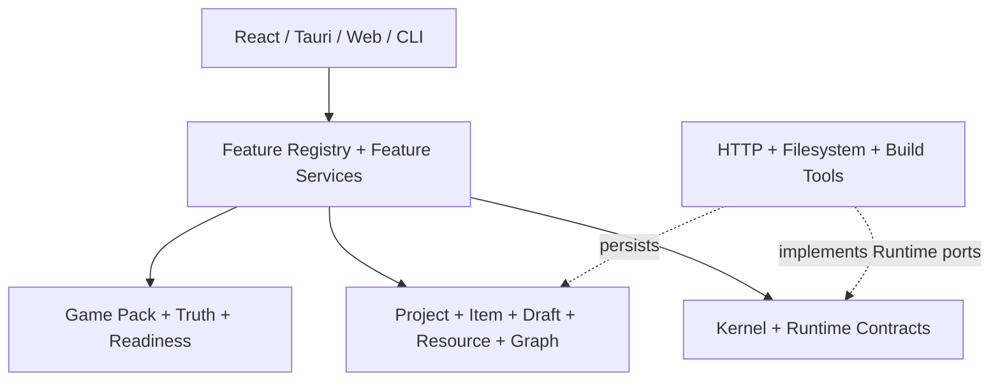
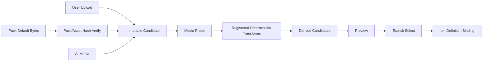

# Stage 2 分层能力与资源架构

> 文档定位：Game Pack Stage 2 已实现的分层基线和扩展边界。
>
> 历史定位：源自 2026-08-02 方案，现已按当前代码事实收敛；不再保留过时的实施顺序。
>
> 可执行合同：[`stage2-contracts.md`](../../.trellis/spec/backend/stage2-contracts.md)。
>
> 最后更新：2026-08-11

## 1. 目标

Stage 2 将 AgentTheSpire 建立为一个可通过 Game Pack 和 Truth 扩展的通用 Mod 生成工作站，而不是把游戏、Mod 类型、Prompt 和资源规则分散在 handler 中。

完成条件：

- 稳定基础合同与产品 Feature 解耦。
- 游戏差异集中在可验证 Pack。
- 当前版本事实由不可变 Truth Snapshot 证明。
- Item、Resource、Run、Artifact 和 Composition 都有版本化、可哈希、可恢复合同。
- Desktop、Web 和 CLI 共享同一 Feature registry，不存在平行产品实现。
- 新游戏或 Item type 的主要扩展面是 Pack/Truth/Primitive，不是 Runtime/React 分支。

## 2. 术语

| 术语 | 定义 |
| --- | --- |
| Feature | 跨游戏产品能力，拥有 typed request/result、Recipe、验证和编排 |
| Game Pack | 游戏和 Item type 差异的版本化受控声明 |
| Contribution | Pack 向某个 Feature 提供的精确槽位数据 |
| Truth Snapshot | 当前游戏/library 版本事实的内容寻址不可变快照 |
| Evidence | 从 verified Truth 中有界提取、供一次 Run 使用的事实子集 |
| ItemDefinition | 稳定 Item identity 下的不可变内容版本 |
| ResourceAsset | 用户/AI/Pack 媒体的 candidate、selected version 和 provenance |
| CompositionDraft | 组合内容的可编辑审阅状态，不是已发布 Item |
| ResolvedItemGraph | 沿 pinned references 展开的精确 Item closure |
| ExecutionGraph | 大型任务的可持久化 DAG、checkpoint、claim 和 commit 状态 |
| Run | 一次 Feature 逻辑执行的终态证据 |
| Artifact | 不可变文件输出和 provenance manifest |
| Primitive | Pack 可引用、但必须由代码注册和审查的确定性执行能力 |

## 3. 分层模型



### Experience / Shell

负责收集 typed input、渲染 catalog/state、调用 command 和展示持久化证据。Shell 不拥有 Prompt、Pack 规则、graph readiness、项目事务或 Provider retry 逻辑。

### Product Capability

负责产品动作的 typed request/result、Recipe、Pack contribution requirements、Truth/Resource/Item validation、子 Feature 组合和结果收敛。

### Game Context

负责 Pack schema/hash/loading、Contribution resolution、Truth import/index/query 和 capability readiness。Game Context 不调用模型，不写用户工程。

### Project Workspace

负责 ProjectFolder/OS lock、版本仓库、CAS、原子 pointer update、可恢复 journals 和有界 staging。Workspace 不理解 Provider 协议或游戏业务 Prompt。

### Foundation Runtime

负责稳定 IDs/schema/hash、Run/Artifact、ExecutionGraph、typed failure/cancellation 和 provider-neutral ports。Runtime 不引用 Pack、Feature 或游戏类型。

### Infrastructure Adapters

负责 Settings、Provider HTTP、filesystem repositories、media transforms、dotnet/Godot/ZIP 等 IO 实现。Adapter 不决定产品步骤和游戏规则。

## 4. 编译期模块化单体

```text
ats-kernel
  ^
  +-- ats-runtime
  +-- ats-game-context
  +-- ats-workspace

ats-runtime + ats-game-context + ats-workspace
  ^
  +-- ats-features

ats-runtime + ats-game-context + ats-workspace
  ^
  +-- ats-adapters

ats-features + ats-adapters + context/workspace/runtime
  ^
  +-- src-tauri / ats-web / ats-cli
```

实际依赖由 Cargo 和 `scripts/check-stage2-dependency-dag.mjs` 校验。不采用运行时动态插件、WASM 或第三方任意代码 Pack，因为 Stage 2 优先需要编译期边界、审查过的 Primitive 和可复现构建。

## 5. Feature 模型

Feature 合同的核心形状：

```text
FeatureSpec
  id
  requestSchema
  resultSchema
  requiredContributions[]
```

每个 Feature 的 request/result 是版本化 payload。RunRecord v3 保存 `featureId + VersionedPayload`，不在 Runtime 维护产品中心 `RunKind/RunResult` 枚举。

组合方式：

```text
Batch = per Item Plan + Single
Complex = Batch + Build + Package
Composition Plan = Blueprint + Suite Brief + nodes + Draft commit
Composition Generate = per Item Plan + Single + finalize + one publication
```

子执行保存精确 child Runs，父 Run 保存编排结果。父 Run `succeeded` 表示编排完整收敛，不覆盖子 Item 的 typed 失败事实。

## 6. Game Pack 边界

Pack v4 是受控 JSON 声明，包含：

```text
pack identity and schema version
itemTypes
  canonical fields
  localization fields
  required locales
  evidence queries
  reference slots
  resource profiles
  generated file roles
compositionProfiles
feature contributions
resource specs
project template references
registered Primitive IDs
```

Pack 不得携带：

- 任意 script 或原生库。
- 未注册 transform/build/package Primitive。
- Provider API key 或 endpoint credentials。
- 用户工程的可变状态。
- 未验证的“最新 API”事实。

新游戏优先通过 Pack + Truth + 必需 Primitive 扩展。只有当现有 12 个 Feature 无法表达一个新的跨游戏产品动作时，才新增 Feature。

## 7. Truth 与 Readiness

Truth Snapshot v2 绑定 source identities、indexes 和 hashes。Pack item descriptor 为每组必需事实声明 `symbols/terms`。Readiness 规则：

```text
Pack does not declare type -> capability absent
Pack declares type but no current Truth -> blocked
one required query group misses -> only affected capability blocked
all groups match -> capability ready
```

Truth 不保存用户偏好、ItemDefinition 或 Resource 选择。Pack guidance 也不能代替当前 Truth Evidence。

## 8. Item 与 Composition

ItemDefinition v2 将 Item identity 和定义版本分开。定义 hash 覆盖 canonical/localization fields、behavior、Resource bindings、references 和 composition provenance。

Reference 分为：

| 语义 | 绑定 |
| --- | --- |
| Identity affiliation | `itemId + expectedItemType` |
| Pinned composition | `itemId + definitionHash + quantity` |

CompositionDraft v2 是审阅状态，不直接更新 Item current pointer。用户可分页、过滤、修订、替换、绑定 Resource 和确认闭合子图。确认服务重新验证全部 references、readiness 和 optimistic-current baselines，然后原子更新所有 selected Item pointers。

ResolvedItemGraph 是生成输入，不是新的可编辑数据源。它固定 root hash、所有 pinned definitions、Pack/Truth、Resource versions、Draft/profile provenance 和 graph digest。

## 9. Resource Workspace



资源不以“某个路径存在”作为完整证据。ResourceAsset v2 保存 candidate/version/hash/media shape/provenance。Pack default 只以 Pack ID/SHA + asset ID/hash 解析已审查内嵌 bytes，不接受 caller path。

Master/derived graph 由 Pack resource spec 和已注册 transform Primitive 描述。一批派生在同一 staging batch 中生成，任一失败不更改已有 selected pointers。

## 10. Prompt 与 Provider

Prompt 所有权：

```text
cross-game task language -> Feature Recipe
game-specific guidance -> Pack Contribution
current API facts -> Truth Evidence
user content -> ItemDefinition
media identity -> selected Resource version
runtime preference -> llm.custom_prompt
transport/retry/format -> Runtime + Adapter typed config
```

桌面模型任务共享 FIFO 单飞队列。OpenAI-compatible response format 在 Run 前固定为 `json_schema` 或 `json_object`，失败后不自动降级。Feature domain validation 永远是最终权威。

definition-bound Plan 在不改变公开请求 wire 的前提下，通过 Feature context 接收完整、已验证的 StoredItemDefinition。Recipe 只能补充实现、证据和验收建议；canonical/localization/Resource/reference 事实始终来自 definition，typed decode 后的 identity/type/behavior 也由本地重新绑定。Single 遇到 Plan prose 冲突时采用 definition，不做自由文本事实推断。Single 输出失败只持久化闭集 reason code，不保存 raw completion 或解析器文本。

详细说明见 [`Prompt-文本资源总览`](../01-总览/Prompt-文本资源总览.md)。

## 11. Run、ExecutionGraph 与 Artifact

### RunRecord v3

Run 是 Feature 逻辑调用证据，使用 `featureId + VersionedPayload`。普通 Feature 从 Pending CAS 为 Running 后执行并只持久化一次终态。

### ExecutionGraphRecord v1

大型 Plan/Generate 的可恢复状态。Graph 保存 Blueprint identity、nodes、logical attempts、normalized checkpoints、active/previous Runs、commit intent 和 final result ref。一个 graph 最多一个 active Run。

### ArtifactManifest v3

Artifact 是不可变 final 输出。Manifest 绑定 Feature/Run、Pack/Truth、definition/resource/model provenance、graph digest 和 files/hashes。Artifact 在同目录 staging 完整写入和校验后原子 rename。

## 12. 关键执行流

### Single

```text
typed Item request
-> validate Pack/Truth/definition/Resource
-> create Run
-> Plan
-> Single model generation
-> validate project writes
-> publish files and one Artifact
-> terminal Run
```

### Composition Plan

```text
Pack profile
-> Blueprint
-> ExecutionGraph
-> Suite Brief + node checkpoints
-> local reference binding
-> whole graph validation
-> Draft createOrMatch
```

### Composition Generate

```text
root definition hash
-> ResolvedItemGraph
-> ExecutionGraph
-> per Item Plan/Single checkpoints
-> local finalize
-> one staged validation/build/package
-> one project transaction
-> one composition Artifact
```

### Project Open

```text
acquire OS lock
-> recover publication journals
-> recover execution graph structure
-> reconcile nonterminal Runs
-> expose ProjectSession
```

## 13. 扩展决策

新需求按以下顺序选择扩展点：

1. 只是新游戏知识或类型：扩展 Pack + Truth。
2. 需要新的确定性 transform/build/package 能力：注册 Primitive + Adapter。
3. 需要新媒体类型：扩展 typed Resource contracts + Adapter，继续使用 candidate/select/bind 流程。
4. 需要新的跨游戏产品动作：新增 Feature + Recipe + registry contract。
5. 需要新的跨产品稳定机制：经架构审查后才能扩展 Runtime。

不得因为某个游戏方便，把类型常量、Prompt、文件路径或上游特例提升到 Runtime、Tauri 或 React。

## 14. 非目标

- 运行时下载任意 Pack 代码。
- 第三方 WASM/原生插件 ABI。
- 从 Prompt 反向生成 Truth 或 Pack contracts。
- 自动切换模型、endpoint 或 response format。
- 部分 Draft 或部分 composition publication。
- 使用旧版本证据代表当前代码。
- 将签名、SmartScreen 或对外发布视为普通机器门禁的自动结论。

## 15. 验证基线

变更 Stage 2 架构至少要求：

```text
Cargo dependency DAG
workspace check/test/clippy
desktop baseline/ml-rembg/e2e feature checks
Feature catalog exactness
Pack/schema/hash tests
Truth/readiness tests
Item/Draft/Resource repository and failure tests
Prompt assembly and provider mapping tests
Run/Graph/Artifact recovery tests
frontend transport guards and production build
legacy path guards
rustfmt and git diff --check
```

完整 release candidate、安装、真实 Provider 和真实游戏行为依然是独立高成本门禁。
