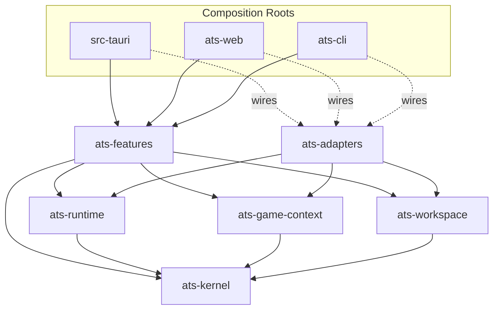
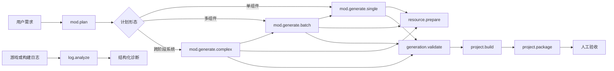
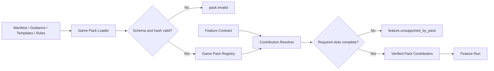
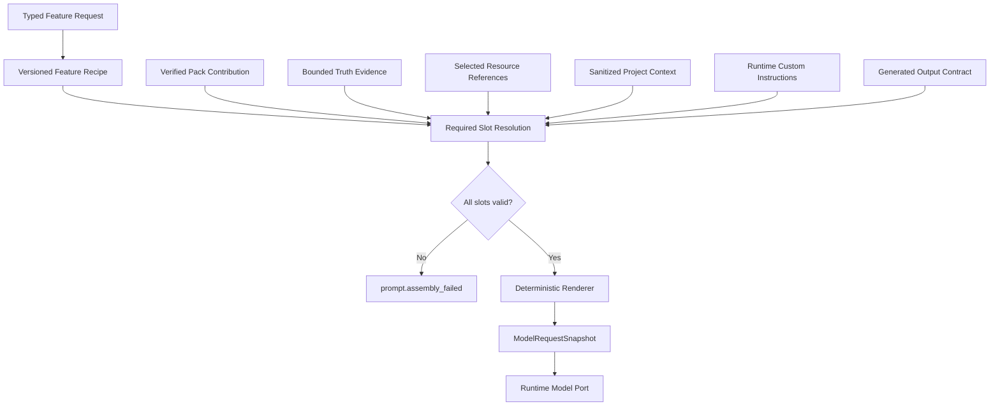
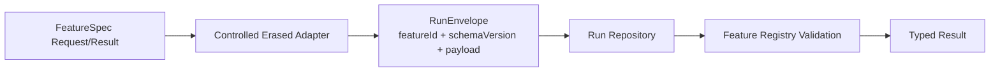
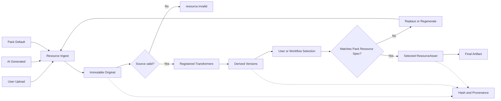
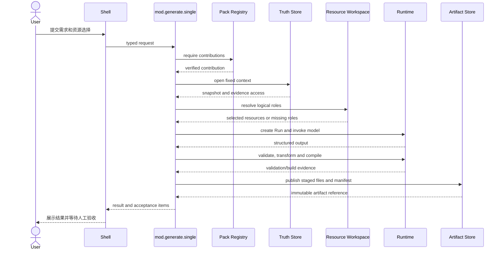

# Stage 2 分层能力与资源架构方案

> 文档定位：本文是 Game Pack Stage 2 的正式架构与实施方案，定义基础运行时、产品 Feature、游戏贡献、事实证据和工程资源的目标边界。
>
> 事实依据：当前 `rust` 分支、已完成的 Stage 1 与 Stage 2 readiness gate、现有 Prompt/Run/Artifact/Game Pack 实现，以及 2026-08-02 用户确认的破坏性收口方向。
>
> 权威入口：阶段总入口见 [`当前方案`](./当前方案.md)；当前实现事实见 [`当前进度说明`](../02-现状/当前进度说明.md)；既有长期原则见 [`通用 Mod 流水线与 Game Pack 边界`](./通用Mod流水线与Game-Pack边界.md)。
>
> 最后更新：2026-08-03

| 项 | 决策 |
| --- | --- |
| 状态 | Implemented through Work Order 7; Work Order 8 verification pending |
| 目标形态 | 编译期分层的模块化单体 |
| 兼容策略 | 允许 Rust API、crate、IPC DTO 和持久化 schema 的破坏性变更 |
| Game Pack 执行边界 | 声明数据、版本化资源和 Core 预注册 Primitive；不携带任意可执行代码 |
| Prompt 策略 | Feature Recipe + Pack Contribution + Truth Evidence + Runtime Context |
| 资源策略 | 用户上传、AI 生成和 Pack 默认资源进入统一 Resource Workspace |
| 实施进度 | Work Order 1-7 已完成目标 DAG、Run/Artifact v3、Pack/Truth/Resource、9 个 Feature、Shell 切换与旧 `ats-core` 删除；等待 Work Order 8 独立门禁和人工复验 |

## 1. 目标

Stage 2 将当前过宽的 `ats-core` 拆分为职责明确、依赖方向可由 Cargo 验证的模块化单体，使项目能够沿两个独立维度扩展：

1. 增加产品 Feature，例如批量 Mod、复杂自定义 Mod、日志分析、资源生成和后续 Mod 修改。
2. 增加 Game Pack，为不同游戏提供证据、工程模板、Mod 类型模板、日志依据、资源规格和构建声明。

目标不是把现有 STS2 字符串机械移动到新目录，也不是提前建立动态插件平台。目标是修复当前所有权倒置：基础 Runtime 不再认识每个产品 Feature，Feature 不再硬编码具体游戏，Game Pack 不再承担完整后端工作流。

## 2. 当前问题

当前主线已经具备可靠的 Run、Artifact、typed failure、ProjectSession、Game Pack 和 Truth Snapshot 基础，但以下中心类型正在积累上层语义：

- `RunResult` 集中包含 text、artifact、batch、build、package、plan、log analysis 和 truth refresh。每增加一个 Feature 都要修改 Runtime domain。
- `ArtifactManifest` 直接引用 codegen evidence、Game Pack snapshot 和 image processing provenance。Artifact 基础设施因此依赖多个上层领域。
- `platform/contracts.rs` 集中声明全部 Feature 请求，新的产品功能继续扩大同一模块。
- `PromptAssembler` 同时处理 Feature 任务结构、STS2 guidance、Truth evidence、工程上下文和输出协议。
- `single_asset_plan` 与 `log_analysis` 仍直接包含生产自然语言 Prompt。
- `codegen.md` 名义上是通用模板，实际包含 STS2、Godot、C# 和 BaseLib 规则。

仅在单个 crate 中重新排列目录不能阻止这些依赖重新出现。

## 3. 术语

| 术语 | 定义 | 示例 |
| --- | --- | --- |
| `Feature` | 用户可见、由产品承诺的完整功能 | `mod.generate.single`、`log.analyze` |
| `Core Primitive` | Runtime 提供的可复用执行原语 | LLM stream、受控进程、原子发布 |
| `Pack Contribution` | Game Pack 为一个 Feature 提供的游戏声明 | STS2 日志规则、遗物模板 |
| `Truth Evidence` | 当前游戏版本下不可变、可追溯的事实 | API 签名、hook 调用方、源码片段 |
| `Project Resource` | 用户工程中的可变资源及其版本 | 上传图片、AI 动画、派生图标 |
| `Feature Recipe` | Feature 拥有的模型任务结构和装配合同 | 规划、生成、日志分析 Recipe |

这些术语不得共用含义模糊的 capability ID。所有权按“为什么变化”判断，而不是按“是否与 Mod 有关”判断。

## 4. 总体架构

```mermaid
flowchart TB
    subgraph Experience["Experience / Shells"]
        Desktop["Tauri Desktop"]
        Web["Web Shell"]
        CLI["CLI"]
    end

    subgraph Features["Feature Layer"]
        Gateway["Feature Gateway"]
        ProjectCreate["project.create"]
        ModPlan["mod.plan"]
        Single["mod.generate.single"]
        Batch["mod.generate.batch"]
        Complex["mod.generate.complex"]
        LogAnalyze["log.analyze"]
        ResourcePrepare["resource.prepare"]
        Build["project.build"]
        Package["project.package"]
    end

    subgraph Context["Verified Context And Workspace"]
        PackRegistry["Game Pack Registry"]
        Contribution["Verified Pack Contribution"]
        Truth["Truth Snapshot Store"]
        VerifiedContext["Verified Game Context"]
        Project["Project Workspace"]
        Resource["Resource Workspace"]
    end

    subgraph Runtime["Foundation Runtime"]
        Run["Run Lifecycle / Cancellation"]
        LLM["LLM Port / Structured Output"]
        Media["Media Provider Ports"]
        Workflow["Task Graph / Retry / Timeout"]
        SafeIO["Safe File And Process"]
        Validate["Generic Validation"]
        Artifact["Artifact Transaction / Manifest"]
        Failure["Typed Failure / Redaction"]
    end

    subgraph Adapters["Infrastructure Adapters"]
        LLMAdapters["Anthropic / OpenAI-compatible"]
        MediaAdapters["Image And Future Media Models"]
        ToolAdapters["dotnet / Godot / Indexers"]
        StorageAdapters["Filesystem / App-data / Locks"]
    end

    Desktop --> Gateway
    Web --> Gateway
    CLI --> Gateway
    Gateway --> ProjectCreate
    Gateway --> ModPlan
    Gateway --> Single
    Gateway --> Batch
    Gateway --> Complex
    Gateway --> LogAnalyze

    PackRegistry --> Contribution
    PackRegistry --> VerifiedContext
    Truth --> VerifiedContext
    Project --> Resource

    Features --> Contribution
    Features --> VerifiedContext
    Features --> Resource
    Features --> Run
    Features --> LLM
    Features --> Media
    Features --> Workflow
    Features --> SafeIO
    Features --> Validate
    Features --> Artifact
    Features --> Failure

    LLM --> LLMAdapters
    Media --> MediaAdapters
    SafeIO --> ToolAdapters
    SafeIO --> StorageAdapters
```



总体框架由四个垂直执行层和三个横向贡献/数据面组成：

| 类型 | 名称 | 主要变化原因 |
| --- | --- | --- |
| 垂直层 | Experience / Shells | 用户入口和交互方式变化 |
| 垂直层 | Feature Layer | 产品增加或调整完整功能 |
| 垂直层 | Foundation Runtime | 通用执行机制变化 |
| 垂直层 | Infrastructure Adapters | 外部模型、工具和存储变化 |
| 横向面 | Game Pack Contribution | 接入或更新具体游戏 |
| 横向面 | Truth Evidence | 当前游戏版本事实变化 |
| 横向面 | Project / Resource Workspace | 用户工程和可变资源变化 |

Feature Layer 是工作流中心。它使用 Runtime 的机制，并在执行前取得经过校验的 Pack Contribution、固定 Truth Evidence 和工程资源上下文。

## 5. 分层职责

### 5.1 Experience / Shells

负责：

- 页面、表单、预览、进度、错误和人工确认。
- Tauri、HTTP 和 CLI 传输映射。
- composition root 中的依赖装配。

不负责：

- 解释原始 Game Pack JSON。
- 拼装最终 Prompt。
- 直接写工程文件或 final Artifact。
- 按 `game_id` 分叉产品工作流。

### 5.2 Feature Layer

负责：

- typed request/result、Feature ID 和 schema version。
- 产品工作流、阶段、失败命名空间和人工验收项。
- Feature Recipe 和输出合同。
- 调用 Runtime Primitive，并组合 Pack、Truth、Resource 和 Project Context。

不负责：

- provider HTTP、外部工具启动和底层文件锁实现。
- STS2 API、Godot 路径或其他游戏专属知识。
- 读取未经 Loader 验证的 Pack 文件。

### 5.3 Foundation Runtime

负责：

- LLM/media/process/storage ports。
- Run 生命周期、取消、重试、超时和任务图。
- Artifact staging、hash、原子发布和回滚。
- typed failure envelope、脱敏和 diagnostics。
- 通用模板渲染、结构化输出解码和验证机制。

不负责：

- `game_id == "sts2"` 分支。
- “生成一个 Mod”或“分析某游戏日志”的完整业务流程。
- Card、Relic、Mod Loader、Godot、C# 或 BaseLib 语义。

### 5.4 Infrastructure Adapters

负责 Anthropic、OpenAI-compatible、图像模型、文件系统、受控进程、dotnet、Godot 和 indexer 的具体实现。

Adapter 实现 Runtime/Game/Workspace 定义的 ports，不得依赖 Feature 业务模块。

### 5.5 Game Pack

负责：

- 游戏身份、版本兼容范围和 Mod 框架身份。
- Truth Source 声明和 provider/indexer 选择。
- 按 Feature/scenario/Mod type 选择的 guidance。
- 工程骨架、特定 Mod 类型模板和资源规格。
- 日志规则、validation 数据、build recipe 和 package layout。

Game Pack 不是独立后端，不拥有 RunRepository、Artifact Store、Shell 或完整 Feature handler。

### 5.6 Truth Evidence

Game Pack 说明“应从哪里获取和检索事实”；Truth Snapshot 保存“当前版本事实是什么”。

- Guidance 只保存稳定工程惯例和检索要求。
- API、hook、生命周期和调用顺序来自固定 Snapshot。
- 一次 Run 使用同一个 `VerifiedGameContext`，不能中途切换 current。
- Artifact 只记录本次实际使用的 bounded evidence。

### 5.7 Project / Resource Workspace

Project Workspace 管理工程身份、会话和持久状态。Resource Workspace 管理用户上传、AI 生成、Pack 默认资源、派生版本、选择和 provenance。

Game Pack 只声明资源角色、格式、尺寸、变体和目标映射；它不拥有用户文件。

## 6. 编译期模块化单体



| Crate | 负责 | 不负责 |
| --- | --- | --- |
| `ats-kernel` | 稳定 ID、schema envelope、基础 failure、hash/ref 值对象 | IO、LLM、游戏、Feature |
| `ats-runtime` | Run、Artifact、工作流、取消和通用 ports | 具体游戏、Feature、HTTP provider |
| `ats-game-context` | Pack、Contribution、Truth Snapshot 和 Evidence | 用户资源版本、Feature 编排 |
| `ats-workspace` | Project、ResourceInput、版本、选择和 provenance | 游戏资源尺寸、AI 网络请求 |
| `ats-features` | Feature request/result、工作流、Prompt Recipe | provider HTTP、原始 Pack JSON |
| `ats-adapters` | 外部模型、文件、进程、工具和 indexer 实现 | 产品功能和 UI |

约束：

- `ats-kernel` 不依赖其他项目 crate。
- Runtime、Game Context 和 Workspace 不得反向依赖 Feature。
- 不为每个 Feature 单独创建 crate，先在 `ats-features` 中按 vertical slice 分模块。
- `ats-core` 在迁移完成后删除，不保留永久兼容 facade。
- Shell 可以在 composition root 构造 Adapter，但命令层只调用 Feature facade。

## 7. Feature 模型

首批标准 Feature：

| Feature | 责任 |
| --- | --- |
| `project.create` | 按 Pack 工程模板创建工程 |
| `mod.plan` | 将需求转换为可执行计划 |
| `mod.generate.single` | 生成一个结构化或自定义 Mod 单元 |
| `mod.generate.batch` | 依赖排序、批量执行和共享构建 |
| `mod.generate.complex` | 多组件、多阶段的复杂自定义 Mod 工作流 |
| `log.analyze` | 结合 Pack 日志依据输出结构化诊断 |
| `resource.prepare` | 接受、生成、转换、选择和验证资源 |
| `project.build` | 执行 Pack 声明的构建图 |
| `project.package` | 收集并发布交付物 |



规则：

- Batch 组合 Single，不复制 codegen。
- Complex 组合 Plan、Batch、Resource、Build 和 Package，不维护平行生成器。
- 所有正式 Game Pack 必须支持标准 Feature 所需的 Contributions。
- 游戏特有的角色、地图、剧情或动画类型作为扩展 Contribution/Recipe 显式声明。
- 缺少 required contribution 时在执行前返回 typed failure，不静默降级。

## 8. Game Pack Contribution 边界



Stage 2 中 Game Pack 只能提供：

- 经过 hash 和 schema 校验的数据、模板和 guidance。
- 对 Runtime/Adapter 已注册 provider、runner、indexer、validator 和 transformer 的 ID 引用。
- 版本化的 build/resource/log/validation recipe。

Game Pack 不能携带任意 PowerShell、原生动态库或未审查脚本。出现新算法需求时，先判断是否是可复用 Primitive；若是，加入 Runtime/Adapter 注册表，再由 Pack 选择。

动态 WASM 或原生插件不进入 Stage 2。只有第三方 Pack 生态和 Core 发布节奏成为真实瓶颈后再重新评估。

## 9. Prompt 与模型请求

### 9.1 目标结构



公式：

```text
Feature Prompt Recipe
+ Pack Contribution
+ Truth Evidence
+ Selected Resources
+ Project Context
+ Runtime Custom Instructions
+ Typed Output Contract
= Run-scoped Model Request
```

### 9.2 所有权

| 内容 | 所有者 |
| --- | --- |
| 通用任务说明、消息角色和输出目标 | Feature Recipe |
| 游戏术语、框架和稳定工程惯例 | Game Pack Contribution |
| 当前 API、hook 和源码调用顺序 | Truth Evidence |
| 用户全局偏好 | Runtime Custom Instructions |
| 本次需求、资源选择和工程上下文 | Run-scoped assembly |
| JSON schema、枚举和 required fields | Feature typed contract |

内置 Feature Recipe 版本化并随应用发布，Stage 2 不支持未签名热更新。用户只通过统一 Custom Instructions slot 增加偏好，不能覆盖结构化安全合同。

### 9.3 当前硬编码迁移

| 当前内容 | 目标 |
| --- | --- |
| `single_asset_plan::SYSTEM_PROMPT` | `mod.plan` Feature Recipe |
| `PlanItem` 字段说明 | 从 typed contract 生成 |
| `single_asset_plan::build_user_prompt()` | Feature `user.md` |
| `log_analysis::SYSTEM_PROMPT` | `log.analyze` Feature Recipe |
| `.NET/MSBuild/dotnet publish` 知识 | 对应 Game Pack log contribution |
| `codegen.md` 通用输出规则 | `mod.generate.*` Feature Recipe |
| `codegen.md` 中 STS2/Godot/BaseLib 内容 | STS2 Pack Contribution |
| API、hook 和生命周期 | Truth Evidence |
| `llm.custom_prompt` | Runtime Custom Instructions slot |

保留在代码中的 section ID、message role、schema、枚举、转义、截断、token budget、failure code 和脱敏算法不是自然语言 Prompt 硬编码。

### 9.4 防回流门禁

- Feature handler 不允许定义长生产自然语言 Prompt 常量。
- 每次模型请求必须记录 `feature_id`、`recipe_id` 和 `recipe_version`。
- Loader 验证 template、slot、output contract 和 Pack contribution 完整性。
- CI 拒绝 STS2、Godot、BaseLib 术语进入 Runtime 或通用 Feature 模板。
- `ModelRequestSnapshot` 覆盖完整、可选缺失、必需缺失和越权内容测试。

## 10. Run 与 Artifact 破坏性合同

### 10.1 Run Envelope

删除 Runtime 中心 `RunKind + RunResult` 产品枚举，改为：



- Feature 内部保持强类型。
- Runtime 只持久化带 Feature identity 和 schema version 的 envelope。
- Feature Registry 负责解码和验证自己的 payload。
- 任意 `serde_json::Value` 不能绕过 Registry。
- 新增 Feature 不修改 Runtime 中心枚举。

### 10.2 Artifact Manifest

```text
ArtifactManifest
  identity                 Runtime-owned
  producing_run_ref        Runtime-owned
  files[] / hashes         Runtime-owned
  contexts[]               Pack/Snapshot identity records
  provenance[]             model/resource/processor/evidence records
  feature_extension        versioned Feature-owned envelope
```

Artifact Store 只校验路径、文件、hash、原子发布和基础 envelope，不再直接 import codegen、Game Pack 或 image processing 类型。

## 11. Resource Workspace



统一输入：

```text
ResourceInput
  source: user_upload | ai_generated | pack_default
  original
  metadata
  provenance
```

统一选择结果：

```text
ResourceAsset
  logical_role
  original_ref
  selected_version
  derived_variants[]
  validation
  provenance
```

原件不可被派生文件覆盖。重新生成产生新版本，不能覆盖已经验收的版本。ArtifactManifest 只记录最终选择的资源及其 provenance。

## 12. 关键执行流



required contribution、Truth Snapshot、必需资源或 validation gate 缺失时，都必须在 final Artifact 发布前停止。

## 13. 破坏性变更边界

允许：

- 拆除 `ats-core` 并调整 Cargo workspace。
- 修改 Rust public API、模块、Feature DTO 和 Tauri/Web 命令映射。
- 升级 Run、Artifact、Workspace 和 Prompt recipe schema。
- 删除被新主线替代的兼容 facade、旧 Prompt loader 入口和死资源。
- 使用新的测试工程和 synthetic Pack fixture。

不自动授权：

- 删除现有用户工程。
- 删除 release、verification、`.tmp` 或真实成功/失败证据。
- 原地修改历史 ArtifactManifest 或 RunRecord 冒充新 schema 产物。
- 未经确认重新构建已验收 Windows candidate。

旧 schema 数据默认保留原文件。新代码可以明确拒绝不支持的 schema，但必须返回 typed、可行动错误；是否提供一次性迁移工具在对应 Work Order 中单独决定。

## 14. 实施顺序

### Work Order 1：合同与依赖骨架

- 建立六个目标 crate 和 Cargo DAG 门禁。
- 定义 Kernel 最小值对象准入规则。
- 定义 Feature ID、Contribution ID、schema envelope 和错误命名空间。
- 不迁移业务行为。

验收：禁止依赖可由编译或自动化检查证明，workspace check/test 保持通过。

### Work Order 2：Run 与 Artifact 解耦

- 引入 Feature Run envelope 和受控 typed-erasure。
- 引入 Artifact 基础 manifest、context/provenance records 和 Feature extension。
- 保持 staging、原子发布、回滚和 CAS 顺序不变。

验收：新 Feature fixture 不修改 Runtime 中心枚举即可持久化；Artifact Store 不 import 上层领域类型。

### Work Order 3：Game Context 与 Workspace

- 迁出 Pack loader/registry、Truth Snapshot 和 Evidence query。
- 建立 Contribution Resolver。
- 建立 ResourceInput、ResourceAsset、版本和 provenance store。
- 加入最小 synthetic Pack 反例。

验收：STS2 与 synthetic Pack 使用同一合同；缺 slot、错误 hash 和不兼容 schema 在执行前失败。

### Work Order 4：Prompt 与日志分析纵切面

- 建立 Feature Recipe loader、slot resolver 和 ModelRequestSnapshot。
- 迁移 `log.analyze`，拆出通用诊断结构与游戏日志依据。
- 建立 Runtime Custom Instructions 唯一注入点。

验收：日志分析 handler 无长生产 Prompt；不同 Pack 可贡献不同日志依据；请求可通过版本和 hash 复验。

实现结论：已建立 pinned Feature Recipe schema v1、exact-slot renderer、Runtime model port 和
`ModelRequestSnapshot` schema v1；STS2 与 synthetic Pack 通过同一 `log.analyze.rules` typed
contribution 改变请求内容和 hash。Runtime Custom Instructions 仅通过一个 Recipe slot 注入。
实现结论补充：Work Order 7 已将 Shell 切换到共享 Feature facade，并删除旧 handler 与旧 Prompt bundle。

### Work Order 5：单 Mod 与资源纵切面

- 已迁移 `mod.plan`、`mod.generate.single` 和 `resource.prepare` 的新层合同；Work Order 7 已删除旧 Shell 入口。
- 通用规划/生成任务已进入 pinned Feature Recipe；STS2 guidance、文件角色/模板、验证 Primitive 和资源规格进入 Pack Contribution；版本事实只来自 Truth Evidence。
- 用户上传、AI 生成和 Pack 默认输入进入同一个 immutable Resource v1 repository；单项生成只读取 manifest 当前选择版本。
- 单项生成按可回滚项目写入、注册 compile、ArtifactManifest v3、RunRecord v3 success、transaction commit 的顺序执行；compile、Artifact 和取消失败均有真实文件回滚测试。

验收：已完成 STS2 单项生成、真实 `dotnet build`、Artifact 发布、manifest/hash 复算和无 staging 残留主链；Prompt、Evidence 和资源来源可复验。

### Work Order 6：组合 Feature

- Batch 已改为组合 Single；每项拥有独立 child Run，`fail_fast`、继续执行和取消保留已完成 child 的真实终态。
- Complex 已固定组合 Plan、Batch/Single、已准备 Resource、Build 和 Package，不建立平行 codegen、Prompt、资源或文件事务。
- Build Pack recipe 只持有 step/Primitive ID，Adapter 固定实现 `process.dotnet-publish`；Package Pack layout 只持有 required-file 模板，Adapter 以同目录临时 ZIP、旧输出备份和 commit/rollback 发布。

验收：两项 Batch、部分失败、fail-fast、取消、真实 `dotnet publish`、六文件 ZIP、ArtifactManifest v3、旧输出恢复和无 run-scoped transaction residue 均已通过；Runtime/Adapter 无游戏分支，Pack 无命令、参数、环境变量或脚本。

### Work Order 7：Shell 切换与旧 Core 删除

- Tauri、Web、CLI 切换到 Feature facade 和新 composition roots。
- 同步 TypeScript API、页面 Feature 状态和错误映射。
- 删除 `ats-core` 兼容 facade、未使用 Prompt 和旧路径。

验收：仓库搜索无旧入口；三壳编译；关键桌面 E2E 通过。

实现结论：Tauri 生产执行统一进入 `Stage2Composition`，React 使用 RunRecord v3 transport 和持久化 polling，Web/CLI 共享 Feature catalog；旧 `ats-core`、raw LLM、Prompt preview、旧 planning/codegen route 与 v2 handler 已物理删除。确定性 desktop facade E2E 已覆盖 project lock、Truth、plan、single generation、真实 compile、Run/Artifact v3/hash、无 staging 和 reopen lock。

### Work Order 8：门禁、文档与真实复验

- 执行 workspace、frontend、Tauri、Pack、Prompt、Run、Artifact 和资源门禁。
- 更新架构总览、Prompt 总览、当前进度和 backend spec。
- 使用新的 Stage 2 候选完成安装版与真实 Mod 验收；不复用旧 candidate 冒充。

## 15. 优点、缺点与替代方案

| 方案 | 优点 | 缺点 | 结论 |
| --- | --- | --- | --- |
| 单 crate 逻辑分层 | 迁移较快、接口调整较少 | 边界不能由编译器强制，容易重新膨胀 | 只作为迁移中间态 |
| 编译期模块化单体 | 边界强、长期清晰、仍保持单进程 | 迁移成本高、跨 crate 合同和 fixture 增加 | 目标方案 |
| 全量 Workflow DSL | 新流程可能无需 Rust | DSL 会演化为难调试语言，类型安全下降 | 仅用于局部 build/resource 图 |
| 动态插件/WASM | 第三方扩展最强 | ABI、安全、签名和兼容成本过高 | Stage 2 不采用 |

目标方案的主要风险：

- crate 过多导致编译和 API 样板增加。
- `ats-kernel` 变成共享类型垃圾抽屉。
- 只有一个真实游戏导致过度抽象。
- typed-erasure 和 schema registry 实现不当导致类型安全退化。
- 大规模重构期间主线可能长时间无法编译。

控制措施：

- 不为每个 Feature 单独建 crate。
- Kernel 只接受至少被两个独立领域使用且语义稳定的值对象。
- 每个 Work Order 保持可编译、可验证，不做一次性全仓搬迁。
- 同时使用 STS2、pack-neutral fixture 和最小 synthetic Pack 验证边界。
- 任意 JSON payload 必须经过 Feature Registry 解码，不能直接进入业务逻辑。

## 16. 完成标准

- Cargo DAG 阻止 Runtime、Game Context 和 Workspace 反向依赖 Feature。
- Foundation Runtime 不包含游戏分支或完整产品工作流。
- 新 Feature 不修改 Runtime 中心结果枚举。
- Artifact Store 不依赖 codegen、Game Pack 或 image processing 领域类型。
- Game Pack 缺失 required contribution 时在执行前 typed failure。
- Prompt 自然语言、游戏 guidance、当前事实、用户偏好和结构化合同有唯一所有者。
- Handler 中不再存在当前已知的生产长 Prompt 硬编码。
- 用户上传、AI 生成和 Pack 默认资源使用同一版本、验证、选择和发布流程。
- STS2 单项、批量、复杂生成、日志分析、构建和打包通过新 Feature facade。
- 旧 `ats-core` 和被替代入口被删除，仓库文档与实际依赖一致。
- 新 Stage 2 候选通过独立机器门禁和真实安装/Mod 验收。

## 17. 不纳入范围

- Stage 2 直接交付第二个真实游戏。
- Game Pack marketplace、在线安装和自动更新。
- Game Pack 自带任意原生代码、脚本或动态插件。
- 完整动画、音频或 3D 编辑器。
- Web auth、数据库、平台额度和 SaaS 任务队列。
- 为旧 Python/Web 主线保留兼容接口。
- 修改或重新描述已经验收的 Windows candidate。
