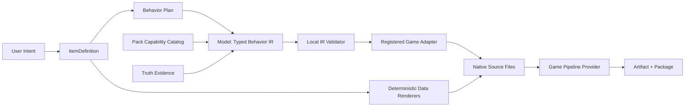

# Typed Behavior IR 与 Game Pack 确定性生成架构方案

> 文档定位：定义并记录 AI 语义生成、通用执行内核、Game Pack 能力声明和游戏专属确定性适配之间的已实施合同。
>
> 事实依据：`rc-20260817T093831Z-b7d8e698ace8` 安装态 Composition E2E 中，35/35 生成节点成功，但 17 个原生文件都进入编译修复，Repair Campaign 在 11/17 时因 Graph 总语义请求达到 20 而暂停。
>
> 权威入口：[`current plan`](./当前方案.md) 和 Trellis 任务 `08-18-typed-behavior-ir-game-pack-adapter`。
>
> 最后更新：2026-08-21

## 1. 决议摘要

项目不再通过“扩大 Prompt、增加重试、提高 Graph 总请求上限”让模型更稳定地编写原生游戏代码。目标边界是：

```text
用户与 ItemDefinition  -> 权威事实和创作意图
AI                     -> 受 Schema 约束的 Typed Behavior IR
Feature / Runtime      -> DAG、队列、checkpoint、恢复、事务与证据
Game Pack              -> 能力目录、文件角色和已注册 Adapter 身份
Truth                  -> 当前游戏/API/工具链事实
Game Adapter           -> 确定性渲染原生文件
Game Pipeline Provider -> 游戏专属 Validate / Build / Package / Publish
```

禁止保留“新 IR 失败时回退到旧的 AI 直接 C#/JSON 生成”兼容路径。旧 Graph、Run、Artifact 和 candidate 仅保留为历史证据。

当前工作区已经实现 Pack v5、ExecutionGraph v5、Behavior/Render checkpoints、STS2 五类 Adapter、
baseline/shared feedback accounting 和 Behavior-scoped 单 Item adjustment。实现已通过定点门禁，
但尚未通过完整机器门禁或 fresh candidate 验收，因此本文保持当前方案身份而不归档。

## 2. Scope / Trigger

### 2.1 Trigger

当前 E2E 证明了两个系统性问题：

1. Pack 虽然提供 guidance 和 Truth Evidence，但模型仍然拥有最终原生文件的作者权，因而会虚构类型、命名空间、继承关系和生命周期。
2. 修复机制要求模型重新输出完整 source/localization bundle，即使问题只属于 source，也会引入 `merge_shape`、`json_decode` 和 `output_truncated`。

### 2.2 纳入范围

- 跨游戏 Typed Behavior IR 包络、能力调用、参数、引用和证据绑定。
- Game Pack Capability Catalog 与已注册 Game Adapter 的精确身份绑定。
- confirmed localization、Resource、identity、reference 和文件路径的确定性渲染。
- Composition Graph 的 `Plan -> Behavior -> Render -> Validate -> Deliver` 分阶段 checkpoint。
- transport retry、output feedback、IR 修订、Adapter 错误和构建错误的分层路由。
- STS2 Character、Card、Relic、Potion 和 Power 的首个确定性 Adapter 闭包。

### 2.3 不纳入范围

- 为旧 generated-file Graph 提供迁移或双读。
- 运行时自动切换 Provider、模型、endpoint 或 response format。
- 向普通用户暴露请求预算、编译器诊断或 Graph 节点控制。
- 无限制的 AI 原生代码 escape hatch。真正任意原生代码只能是用户明确导入的受信资源，不由生成链路暗中开启。

## 3. 目标数据流



模型只能改变 `BehaviorProposal`。模型不能作者化 target path、localization table、Resource path、namespace、class name、project file 或 package manifest。

## 4. Signatures

以下为目标概念合同；实现时必须在 Runtime/Feature/Game Context 中形成等价的 versioned typed payload：

```rust
struct BehaviorProposal {
    schema_version: u32,
    item_id: ItemId,
    item_type: ItemTypeId,
    definition_hash: Sha256Digest,
    catalog: CapabilityCatalogIdentity,
    adapter: BehaviorAdapterIdentity,
    invocations: Vec<CapabilityInvocation>,
}

struct CapabilityInvocation {
    capability_id: BehaviorCapabilityId,
    arguments: BTreeMap<CapabilityParameterId, CapabilityValue>,
}

struct CapabilityCatalog {
    schema_version: u32,
    id: CapabilityCatalogId,
    version: u32,
    adapter: BehaviorAdapterIdentity,
    capabilities: Vec<CapabilitySpec>,
    item_types: Vec<BehaviorCapabilitySet>,
}

trait GameBehaviorAdapter {
    fn identity(&self) -> AdapterIdentity;
    fn validate_ir(&self, context: &BehaviorRenderContext, ir: &BehaviorProposal)
        -> Result<(), BehaviorAdapterError>;
    fn render(&self, context: &BehaviorRenderContext, ir: &BehaviorProposal)
        -> Result<RenderedItemBundle, BehaviorAdapterError>;
}
```

`RenderedItemBundle` 是本地产物，不是 Model output：

```text
RenderedItemBundle
+-- behaviorSha256
+-- adapterId / version / sha256
+-- definitionHash
+-- files[] { role, relativePath, bytes, sha256 }
```

Pack、Truth、Catalog 和 ModelRequestSnapshot identity 由 Behavior/Render checkpoint provenance
额外绑定，不伪装成 `RenderedItemBundle` 自身字段。

## 5. 所有权合同

| 内容 | 唯一所有者 | 禁止边界 |
| --- | --- | --- |
| canonical fields / confirmed localization | ItemDefinition + Pack schema | AI 不得重写 |
| behavior semantics | Typed Behavior IR | 不得携带原生类型名或 source |
| capability schema | Pack Capability Catalog | Prompt 不得临时发明 capability |
| 当前 API/工具链事实 | Truth Snapshot | 模型记忆不是事实源 |
| namespace/class/path/localization key | Game Adapter / deterministic renderer | AI 不得作者化 |
| validation/build/package graph | Game Pipeline Provider | Core 不得写 STS2 分支 |
| queue/checkpoint/transaction/evidence | Runtime | Game Adapter 不得建第二套状态机 |

## 6. 确定性渲染

```text
ItemDefinition.localizations ----> Localization Renderer
ResourceBinding -----------------> Asset Publisher
ReferenceBinding ----------------> Identity / Pool Resolver
BehaviorProposal ----------------> Game Behavior Adapter
Pack Pipeline -------------------> Validate / Build / Package
```

已确认的中英文本地化不进入 Behavior Model response。资源只按 `resourceId + selectedVersion`消费。跨 Item 类型和 Pool 身份从 pinned/identity reference 解析，不从类名字符串推断。

## 7. 多游戏边界

```text
                       Typed Behavior IR
                              |
          +-------------------+-------------------+
          |                   |                   |
          v                   v                   v
     STS2 Adapter        Data-only Adapter    Other SDK Adapter
          |                   |                   |
     C# / BaseLib          JSON / tables       Lua / Java / etc.
          |                   |                   |
     dotnet + PCK          schema/package      game build tools
```

Pack 只能按精确 `adapterId + version + sha256` 选择已注册 Adapter，不携带任意 native plugin 或 shell。Core 只看到 provider-neutral node、checkpoint 和 typed failure。

## 8. Execution Graph 合同

目标 Graph 使用破坏性 schema 升级，不兼容读取 generated-file Graph v4：

```text
item.N.plan       semantic, optional by pipeline profile
     |
item.N.behavior   semantic, checkpoint = normalized BehaviorProposal
     |
item.N.render     local, checkpoint = RenderedItemBundle manifest
     |
composition.finalize
     |
provider.validate -> provider.build -> provider.package -> atomic publish
```

不变量：

- Resume 不重跑已成功的 semantic 或 render checkpoint。
- Behavior checkpoint 绑定 definition、Pack、Truth、Capability Catalog、Adapter 和 ModelRequestSnapshot hash。
- Render 失败不消耗模型请求；Adapter 缺陷不得被伪装成 semantic feedback。
- 发布仍只能在完整闭包验证成功后一次原子进行。
- Artifact provenance 必须包含 Behavior IR 和 Adapter 身份/hash。

## 9. 请求队列与预算

请求计数从“唯一正确性闸门”改为“审计与额外反馈限制”：

```text
baseline semantic allowance = 每个已规划 semantic node 一次
shared feedback allowance   = 整个 Graph 的额外语义修订余量
transport attempts          = Adapter 层有界退避，不计 semantic revision
semanticRequestCount        = 实际请求审计值，不剥夺其他节点首次执行权
```

默认情况下，用户不配置这些值。同一节点的输出契约修订有独立上限；相同诊断指纹+相同 candidate、无变化 replacement 或明确不受支持的 capability 立即停止。

## 10. Validation & Error Matrix

| 阶段 | 错误类 | 处理 | 是否请求 AI |
| --- | --- | --- | --- |
| HTTP | timeout/429/5xx | FIFO 内有界退避 | 同一语义请求，不计修订 |
| Behavior decode | JSON/schema/shape | 当前 Behavior 节点输出反馈 | 是 |
| IR validation | capability/argument/reference invalid | 当前 Item typed feedback | 是 |
| Render | Adapter 不支持已声明 capability | `game.adapter_unsupported` | 否，本地缺陷 |
| Compile | 确定性输出无法编译 | `game.adapter_invalid` | 否，本地缺陷 |
| Whole closure | IR 跨 Item 冲突 | DAG 定位最小 Item 集 | 只修订可归属 IR |
| Build/package | 工具、路径、锁、存储错误 | typed local failure | 否 |
| Publication | CAS/事务冲突 | 安全暂停/恢复 | 否 |

## 11. Good / Base / Bad Cases

### Good

Card 行为使用 `spend_resource + draw_cards`，IR 通过 Catalog 验证，STS2 Adapter 产生固定 BaseLib 结构，confirmed localization 本地合并，整个过程不要求模型知道任何 C# 类名。

### Base

模型返回未知 capability。Feature 在 Render 前返回有界 `behavior.capability_unknown`，只修订当前 Item 的 BehaviorProposal。

### Bad

Adapter 将合法 IR 渲染成无法编译的 C#。系统若将编译器诊断交给模型重写 source，就再次混淆了本地缺陷和语义缺陷，必须拒绝。

## 12. Wrong vs Correct

### Wrong

```text
AI -> source.cs + localization.json
compiler error -> AI rewrites complete bundle
Graph total requests exhausted -> raise constant again
```

### Correct

```text
AI -> normalized BehaviorProposal
local schema rejects invalid semantics
registered Adapter deterministically renders native files
Adapter compile error -> local typed defect
only IR diagnosis -> item-local semantic revision
```

## 13. 已执行的破坏性迁移

1. 已新增 versioned Behavior IR 和 Capability Catalog，没有修改旧 generated-file payload 伪装兼容。
2. 已提升 Pack/Blueprint/ExecutionGraph/Checkpoint schema；仅读新目录，旧目录原样保留证据。
3. 已将 localization/resource/reference/path 从 Composition Model output 移至确定性 renderer。
4. 已实现 STS2 Character/Card/Relic/Potion/Power Adapter 和 contract fixtures。
5. 已将 Composition Generate 切换到 Behavior/Render Graph，删除生产原生文件 Model output。
6. 已将单 Item 调整收口为目标 BehaviorProposal 修订、确定性重渲染和 whole-closure 复验。
7. 当前有效文档已同步；完整机器门禁和 fresh candidate 仍待独立授权。

## 14. Tests Required

### Contract tests

- Capability Catalog 的 ID/version/hash、Item type 覆盖、参数类型和未知字段拒绝。
- BehaviorProposal 严格 decode、normalize、hash 和 definition/reference 绑定。
- Model output contract 不存在 source/path/localization/resource 作者字段。

### Adapter tests

- 同一 pinned context + IR 必须产生字节级相同的 RenderedItemBundle。
- STS2 五类 Item 的基本 capability 都必须产生可编译的真实 BaseLib/STS2 代码。
- Adapter 缺陷稳定映射为 local typed failure，不进入 AI feedback。

### Graph tests

- 每个已规划 semantic node 至少可执行一次，不因其他 Item 消耗共享反馈额度而饿饿。
- Resume 不重跑已成功 Behavior/Render checkpoint。
- transport retry 不增加 semantic revision count。
- 无进展、重复 candidate、轮次耗尽和用户取消都保持安全终止。

### End-to-end tests

- synthetic data-only Provider 继续证明 Core 不固定 AI 或 native build。
- STS2 fresh closure 使用全新 candidate/Truth/Project/Item/Run/Graph/Artifact。
- 完成 ArtifactManifest/hash、ZIP、最终目录、零事务残留和工程锁重获。
- 真实 STS2 UI 仍只由用户执行 Character、战斗、奖励、Continue 和存档验收。

## 15. 完成定义

本方案仅在以下事实同时成立时完成：

1. 生产生成链路不再让模型作者化原生 source、localization、path 或 identity。
2. STS2 五类结构化 Item 通过同一 Behavior IR 和确定性 Adapter 闭包。
3. 不同游戏可拥有不同 Adapter 和 Pipeline，Core/Feature/React 无 game-ID 分支。
4. 用户单 Item 调整只修订目标 IR，不重生成其他 Item 或已确认数据。
5. 全量机器门禁和全新 candidate installed closure 通过。
6. 用户明确确认真实 STS2 行为验收。
