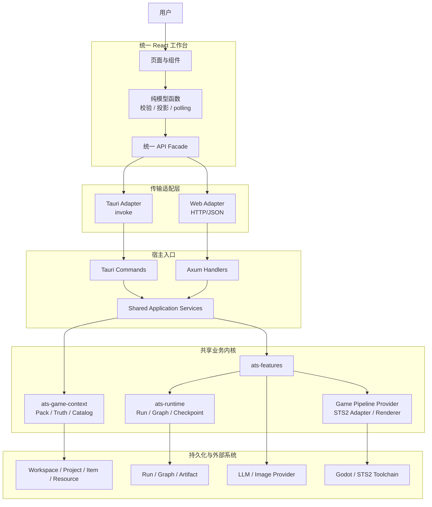
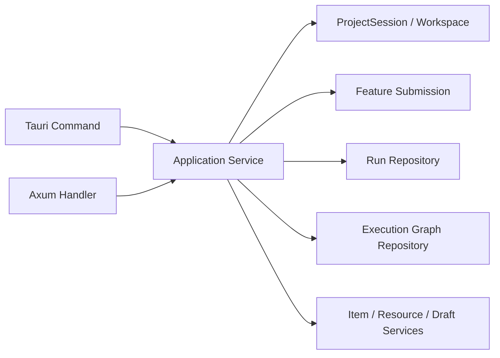
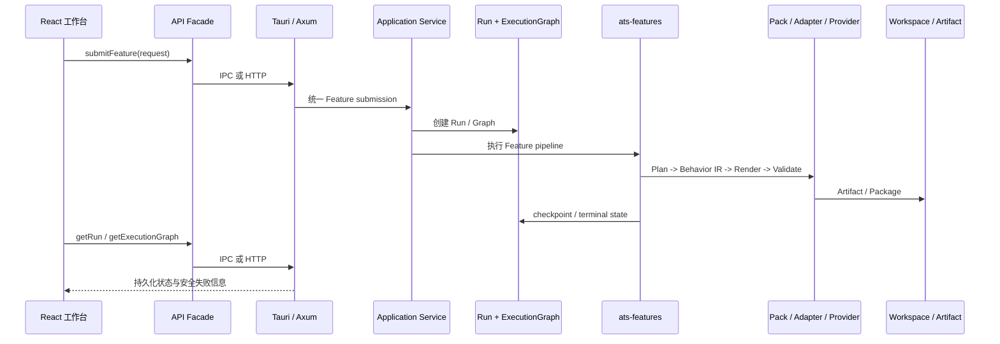

# Web 端与桌面端统一架构方案

> 文档定位：定义 AgentTheSpire Web 端与桌面端保持能力、状态和用户流程一致时的目标架构、边界、实施顺序和验收合同。
>
> 事实依据：当前 `rust` 分支代码、`src/services/tauriApi.ts`、`src/services/webApi.ts`、`crates/ats-web` 以及现有 Stage 2 稳定合同。
>
> 权威入口：[`当前方案.md`](./当前方案.md) 与 [`docs/README.md`](../README.md)。
>
> 当前状态：架构设计；W0 回环绑定安全门禁已实现，其余 W0-W5 能力尚未实现。
>
> 最后更新：2026-08-22

## 1. 目标与定义

本方案的目标不是另做一套简化 Web 页面，而是让 Web 端成为与桌面端共享业务合同的另一种运行载体：

- React 页面、导航、交互流程和用户可见状态保持一致。
- `tauriApi.ts` 与 `webApi.ts` 实现同一组 TypeScript API 合同。
- Item、Resource、Composition、Run、Execution Graph、Build 和 Package 的业务语义一致。
- Run 的持久化状态、轮询、暂停、恢复、取消、失败分类和安全展示一致。
- Tauri IPC 与 HTTP 只承担传输差异，不复制业务决策。

“一致”不表示两端拥有相同的操作系统能力。桌面端可以使用本地路径、系统文件对话框和本地工具链；Web 端必须通过服务端 Workspace、Project ID、上传/下载和服务端工具链表达相同用户流程。

## 2. 当前基线

### 已有基础

- `src/pages` 和 `src/components` 已形成完整的 React 工作台路由。
- `src/services/api.ts` 已在编译期要求 Web adapter 完整实现 Tauri API 导出。
- `src/services/tauriApi.ts` 已定义 Run、Graph、Item、Resource、Composition 和 Feature submission 的主要前端合同。
- `src/services/runPolling.ts`、runtime guards 和 actionable failure 已定义跨页面的状态与错误约束。
- `ats-features`、`ats-runtime`、`ats-game-context` 和 STS2 Game Adapter 已提供共享业务内核。

### 当前缺口

- `src/services/webApi.ts` 大部分操作仍为 `web.desktop_only` 或空列表。
- `crates/ats-web` 当前只提供 `/api/health` 和 `/api/features`，尚未承载项目、Item、Resource、Run 或 Feature 执行。
- Tauri commands 仍承担部分应用编排职责，尚未形成 Tauri 与 Axum 可共同调用的完整 Application Service 边界。
- Web 的 ProjectSession、认证/授权、Workspace 隔离、文件上传下载和后台任务生命周期尚未定义。

审查确认以下事项必须作为实现前置门禁，而不能留到远程 Web 阶段：

- 非回环 Web 启动必须默认拒绝，或先具备 principal、Workspace 和 Project 授权上下文。
- 桌面 `sourcePath` 和 Web 上传都必须转换为受控的对象引用，不能把客户端路径直接带入共享执行服务。
- Application Service 必须接收显式 `ExecutionContext`，覆盖配置快照、Pack/runtime root、ProjectMeta、仓储、模型队列、Pipeline registry、CancellationToken 和任务 supervisor。
- Run/Graph 的 claim、owner、重启恢复和优雅停机必须有持久化或可恢复合同，不能只依赖进程内 JoinHandle。
- Web wire response 必须复用与 Tauri 等价的 runtime codec/guard 和 failure mapping，TypeScript 编译通过不构成 parity 证据。

### 已落地的安全修复

`crates/ats-web` 在认证和 Workspace 授权中间件尚未就绪前，只允许绑定 `localhost`、`127.0.0.1` 或 `::1`。对 `0.0.0.0`、`::`、局域网地址和其他非回环地址启动会直接失败，并由单元测试锁定默认拒绝行为。这不是远程认证实现，不能替代后续 W0/W5 的身份和授权合同。

## 3. 目标架构

### 分层职责

| 层 | 负责 | 不负责 |
| --- | --- | --- |
| React 页面 | 交互、表单、状态投影、可访问展示 | 业务编排、路径推断、Graph 内部策略 |
| API Facade | 统一函数签名和版本化请求 | 选择业务结果、绕过运行时校验 |
| Tauri/Web Adapter | IPC 或 HTTP 序列化、传输错误转换 | 复制 Feature 或 Runtime 逻辑 |
| Tauri/Axum Host | 参数解析、认证/宿主上下文、调用应用服务 | 独立实现第二套业务流程 |
| Application Services | ProjectSession、请求校验、Run 创建、Feature 调度、资源和 Draft 操作 | React 展示和游戏特定渲染 |
| `ats-features` | Plan、Generate、Build、Package、Resource 等业务 Feature | 传输协议和页面状态 |
| `ats-runtime` | Run、ExecutionGraph、checkpoint、claim、取消、事务和 Artifact | 游戏分支和 UI 语义 |
| Pack/Adapter/Provider | 游戏能力、Truth、确定性渲染、Validate/Build/Package | 通用 Runtime 状态机 |

## 4. 统一 API 合同

前端以 `tauriApi.ts` 为行为合同，`webApi.ts` 必须实现相同导出和相同运行时校验。每个 API 需要记录：

| 字段 | 要求 |
| --- | --- |
| 方法 | 与 `tauriApi.ts` 保持同名、同参数、同返回类型 |
| 请求 | 使用现有 versioned payload 和 camelCase wire fields |
| 成功结果 | 经过与桌面端相同的 runtime guard |
| 失败结果 | 映射到相同 `ActionableFailure` code/category/stage/action |
| 长任务 | 只返回持久化 Run ID，前端继续读取 Run/Graph |
| 写入 | 使用相同 revision/CAS、definitionHash 和 ProjectSession 约束 |

Web 端不得通过“返回更宽松的数据”来绕过桌面端的 guard，也不得在浏览器端重新构造成功的 Run、Graph 或 Artifact。

## 5. 共享 Application Service

目标调用关系如下：

Application Service 负责：

1. 解析和校验宿主上下文。
2. 加载当前 ProjectSession 或服务端 Workspace。
3. 校验 Item、Resource、Pack、Truth 和 revision 合同。
4. 创建持久化 Run 和 Execution Graph。
5. 调用 `ats-features` 并返回稳定的 Run/Graph 句柄。
6. 读取终态 Run、Artifact 和安全失败详情。
7. 对 Web 和桌面统一执行取消、恢复、调整和发布门禁。

Tauri command 与 Axum handler 只负责传输层参数、身份/权限和响应序列化，不应分别组织 Plan、Generate、Build 或 Package 流程。

## 6. 一致的执行链路

前端成功标准必须保持一致：提交返回 Run ID 不代表成功；必须读取持久化 RunRecord，并在 Composition 场景继续读取对应 ExecutionGraphView 和最终 Artifact 引用。

## 7. Web 运行模型

### 本机 Web

浏览器访问本机 `ats-web`，项目、工具链和配置仍由本机服务端持有。适合第一阶段验证 API parity，风险和部署复杂度较低。

### 远程 Web

浏览器不再提交本地绝对路径，而是使用：

- 用户身份和 Workspace 权限。
- `projectId` / `workspaceId` 作为资源边界。
- 上传、下载和预览接口传输资源。
- 服务端任务队列执行 Run、Build 和 Package。
- 服务端对工具链、凭证和输出目录做隔离。

远程访问不改变 Feature 和 Run 语义，但会增加认证、授权、并发、配额、审计和文件安全合同，不能只把 Tauri command 包成 HTTP。

## 8. 实施阶段

### W0：宿主安全与执行上下文门禁

- 默认只允许 loopback Web；任何非回环绑定必须显式启用并经过认证配置校验。
- 定义 `Principal`、`WorkspaceContext`、`ProjectRef`、`UploadObjectRef` 和权限失败合同。
- 定义跨宿主共享的 `ExecutionContext`，显式承载配置快照、Pack/runtime root、ProjectMeta、仓储、模型队列、Pipeline registry、CancellationToken 和任务 supervisor。
- 固定服务端不接受任意绝对路径、任意 shell 参数或未经授权的 Provider 凭证。

### W1：合同盘点与共享入口

- 建立 `tauriApi.ts` 全量 API parity matrix。
- 按查询、编辑、上传、Feature submission、Run control 分类。
- 划定现有 Tauri command 中需要抽取的 Application Service。
- 固定 Web 与桌面共用的 schema、runtime codec/guard 和 failure mapping。
- 将桌面文件对话框选择的路径转换为受控 `UploadObjectRef`，与 Web 上传使用同一对象合同。

### W2：Web 只读闭环

- `health`、Feature catalog、Project、Item、Resource、Run、Execution Graph、日志查询。
- Web 页面使用真实持久化数据，不再返回空数组或 desktop-only 假状态。
- 覆盖 HTTP schema、错误映射和 Run polling。

### W3：Web 编辑闭环

- ProjectSession、ItemDefinition、Resource binding、Composition Draft。
- revision/CAS、definitionHash、Pack/Truth readiness 和资源选择。
- 从第一版就使用 `WorkspaceContext + ProjectRef`；本机实现把路径映射为服务端内部句柄，浏览器永远不提交绝对路径。

### W4：Web 执行闭环

- Plan、Composition Generate、Batch、Build、Package。
- Pause、Resume、Cancel、单 Item Adjustment 和 Graph monitoring。
- 后台任务使用可恢复的 supervisor/queue/claim 合同；服务退出、重启、取消竞态和 owner 变更必须复用现有 Runtime 合同。

### W5：远程访问与一致性门禁

- 在 W0/W1 已有宿主门禁基础上，补齐远程身份、Workspace 授权、项目隔离、上传下载和审计。
- 同一 fixture 经过 Tauri adapter 与 Web adapter，验证结果、failure code 和 Run 状态一致。

## 9. 不纳入本方案

- 不在 React 中增加第二套 Web 专属页面。
- 不让浏览器直接执行 shell、访问任意本地路径或读取任意 Provider 凭证；非回环 Web 在认证和 Workspace 隔离缺失时必须拒绝启动。
- 不把 Graph checkpoint、模型原始输出、内部修复策略暴露给普通 UI。
- 不通过放宽 Web 校验来兼容旧的空接口。
- 不在本方案内改变现有 Pack、Behavior IR、ExecutionGraph 或 Artifact 的业务合同。
- 不在没有认证和 Workspace 隔离方案前开放远程多人执行。

## 10. 验收标准

方案实现前后应满足：

1. 同一 React 页面在 Tauri 和 Web 构建中无需业务分支即可完成相同流程。
2. `tauriApi.ts` 与 `webApi.ts` 的方法、请求 schema、响应 guard 和 failure mapping 完整一致。
3. Tauri command 与 Axum handler 调用同一 Application Service，不存在两套 Feature 编排。
4. Web 与桌面都只以持久化 RunRecord、ExecutionGraphView 和 Artifact 作为状态权威。
5. Item、Resource、Composition、Build、Package 的 revision、hash、Pack/Truth readiness 门禁一致。
6. 长任务在刷新页面、服务重启或桌面重启后仍遵守现有 Run/Graph 恢复和取消语义。
7. 远程模式下项目、凭证、资源、工具链和输出目录不能跨 Workspace 越权访问。
8. 远程模式下项目、凭证、资源、工具链和输出目录不能跨 Workspace 越权访问。
9. 服务重启、优雅停机、Run owner、claim/cancel 竞态和断线重连不破坏 Run/Graph 合同。
10. 前端测试、Web API 测试、共享服务测试和至少一条双适配器一致性测试通过。

## 11. 关键风险与决策门

| 决策 | 推荐结论 | 原因 |
| --- | --- | --- |
| Web 是否另做页面 | 否 | 页面与交互一致是本方案的核心目标 |
| 业务逻辑放在哪里 | 共享 Application Service + 现有 Feature/Runtime | 避免 Tauri/Web 分叉 |
| 第一阶段部署 | 本机 Web | 先验证合同 parity，避免同时引入远程安全问题 |
| 远程项目标识 | `workspaceId + projectId` | 不能把桌面绝对路径暴露给浏览器 |
| 长任务协议 | 统一 Run ID + Run/Graph polling | 与现有桌面可靠性合同一致 |
| 文件操作 | 桌面本地对话框；Web 上传/下载 | 保持用户流程，不复用错误的路径语义 |
| 认证范围 | W0 先建立 loopback/拒绝非回环门禁；远程身份在 W5 完整化 | 远程执行涉及凭证、项目和工具链权限 |

本方案只确定架构和实施边界，不授权 W0-W5 的代码实现。进入实现前，需要单独确认 Web 运行模式（本机或远程）以及第一阶段是否从 W0/W1 开始。
