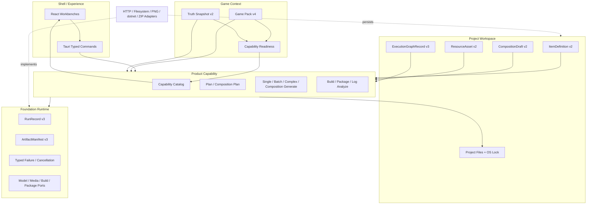

# 当前方案

> 文档定位：当前阶段的架构方案、核心不变量和验收边界入口。
>
> 当前事实：[`current progress`](../02-现状/当前进度说明.md)。
>
> 可执行合同：[Stage 2 backend contracts](../../.trellis/spec/backend/stage2-contracts.md)。
>
> 最后更新：2026-08-12

## 1. 目标与状态

当前目标是在 Game Pack Stage 2 通用流水线上完成 STS2 Character 与跨 Item 组合。Character、Card、Relic、Potion 和 Power 保持独立 ItemDefinition，通过 typed reference graph 形成可审阅、可重现、可原子发布的角色套件。

可恢复生成与 validation-guided repair 主体已提交。绑定 `660d513a` 的 replacement candidate `rc-20260812T104652Z-660d513ac582` 已完成安装态 fresh Graph 验证，但 `item.000.single` 在连续 typed-output `merge_content` 后保持 paused。当前实现已落地统一 Generation Feedback Controller、ExecutionGraphRecord v3、Composition Generate request v4/Blueprint v2 和 Shell phase/round 投影，并删除旧非持久化 Composition 执行入口；workspace 232/232、frontend 36/36、check/clippy/build、Desktop feature matrix、DAG/catalog/script guards 和全新隔离 GUI E2E 8/8 均通过。绑定该实现的新 candidate、fresh installed Provider closure 和用户真实 STS2 单人验收仍未完成。

## 2. 架构分层



### Kernel / Runtime

Runtime 只实现跨游戏稳定合同：ID/schema/hash、Run/Artifact、provider-neutral ports、typed failure、cancellation、ExecutionGraph DAG/CAS/claim/checkpoint/commit 状态机和原子发布。Runtime 不认识 `character`、STS2、Profile 数量或游戏 Prompt。

### Feature

Feature 定义产品能力和编排：Plan、Single、Batch、Complex、Composition Plan/Retry/Generate、Resource Prepare、Build、Package 和 Log Analyze。

大型任务由 Feature 将 Pack 声明编译为 deterministic Blueprint，执行有界模型节点、typed validation、本地 reference binding 和最终收敛。Execution node 不是新 Feature，不进入 12-Feature catalog。

### Pack / Truth

Pack v4 声明游戏类型、字段、locales、Truth Queries、typed reference slots、Resource profiles、composition profiles、generated file roles 和 Feature contributions。Truth 固定当前游戏/API 事实。Capability readiness 由 pinned Pack 和 verified Truth 确定性计算，不由 UI 或 Prompt 猜测。

### Workspace

Workspace 持有 Project、OS lock、Item definitions、Composition drafts、Resources、Execution graphs、Runs、Artifacts 和 publication journals。各类记录都使用稳定 ID、schema version、content hash 和原子写入合同。

### Shell

React 渲染 capability catalog 和 typed state，不维护 STS2 类型分支。Tauri 负责 transport、session ownership 和 Feature 组装，不拥有 Prompt、游戏规则或文件事务算法。

## 3. 核心用户流程

```text
Create/Open Project
-> import and verify Truth
-> inspect Pack-driven capability catalog
-> create or select Item definitions
-> create Composition Plan execution graph
-> review Draft nodes
-> prepare/select/bind Resources
-> confirm a closed typed subgraph
-> resolve exact Item closure
-> create Composition Generate execution graph
-> resume failed nodes when needed
-> finalize once
-> validate/build/package/publish once
-> inspect Run/Graph/Artifact evidence
```

Character Studio 在同一工作台中组织 Character 和子 Item，但子 Item 仍保存为独立 ItemDefinition，可从 Item Library 单独打开。Plan 只创建 Draft，不选 Resource、不发布 Item、不写工程。

## 4. 可恢复的大型生成

长整图请求已被真实 Provider 证据证明不可靠：一次传输或 typed output 失败会使整个长响应作废。当前方案不依赖上游恰好稳定，而是把大型生成分解为可持久化的有界节点。

### Composition Plan

```text
Pack profile
-> deterministic Blueprint
-> Suite Brief checkpoint
-> serial model node checkpoints
-> local reference binding
-> complete graph validation
-> commit intent
-> Draft createOrMatch
```

### Composition Generate

```text
ResolvedItemGraph
-> item.000.plan checkpoint
-> item.000.single checkpoint
-> ...
-> item.NNN.single checkpoint
-> local composition.finalize
-> registered validation
   -> pass: commit intent
   -> repairable: complete-file replacement -> full revalidation
   -> local/unsafe/limit: paused
-> one build/package transaction
-> one project publication
-> one composition Artifact
```

### Resume 语义

- 成功 checkpoint 不重跑。
- 失败节点回到可恢复状态，graph 进入 paused。
- Resume 创建新父 Run，使用同一 graph 和 Blueprint。
- 进程重启后先执行结构恢复，业务 checkpoint 在 Feature resume 时按 pinned Pack/definition/Resource 重新校验。
- `commit_prepared` 只在 registered validation 通过后创建，创建后只前滚，不回到模型节点。
- Succeeded graph 的父 Run reconciliation 不再调用模型、Build、Package 或 Artifact publication。

详细合同见 [`可恢复分阶段 Mod 生成架构方案`](./2026-08-10-可恢复分阶段Mod生成架构方案.md)。

## 5. Provider 稳定性策略

所有桌面 HTTP model 任务共享一个 FIFO 单飞队列。每个逻辑请求在成功、耗尽或取消前始终占用一个席位；排队取消不发请求。

OpenAI-compatible response format 使用 typed 配置：

- `json_schema` 用于真正支持 strict schema forwarding 的 Provider。
- `json_object` 用于已证明不转发 schema 但支持 JSON Object 的代理。
- 旧配置默认 `json_schema`。
- 一个 Run 内不自动换格式、换模型或宽松解码。

HTTP retry 只处理 transport 层面的有界重试。Direct Single 保持单次严格行为；Composition 中可修订的 output-contract 与 generated-content diagnosis 共用一个 Feature-owned Generation Feedback Controller。每次反馈调用前，Graph v3 CAS 持久化 versioned/hashed safe envelope；checkpoint 前按完整 candidate SHA 判断无进展，checkpoint 后同时绑定有效 checkpoint hash。每轮返回完整 bundle/role set并重走同一严格 decode 与完整 validator。Graph 总预算不按节点放大，`until_passed` 也有 20 轮绝对安全上限。运行中不换策略、模型、endpoint 或 response format。

该实现不接受双重编码 JSON，不从 Markdown/自然语言猜测结构，不保存 raw completion，也不包含模型、Provider、STS2、Character 或 `merge_content` retry 分支。详细设计与落地边界见 [`统一生成反馈闭环架构方案`](./2026-08-12-统一生成反馈闭环架构方案.md)。

definition-bound Plan 不再只接收 `behaviorIntent` 拼接文本。Feature context 同时携带完整、已验证的 `StoredItemDefinition`；Recipe 将其中的 canonical fields、localizations、Resource/reference bindings 视为权威事实，模型只补充实现、证据和验收建议。typed decode 后，Feature 仍会从 definition 本地回填 `itemId`、`itemType` 和 `behaviorIntent`。Single Prompt 若与 Plan prose 冲突，必须采用 definition；不得用自由文本启发式重新推断 HP、Card、Relic 或其他 canonical/reference 事实。

Single 多文件 bundle 的输出上限为 16,384 tokens。`model.output_invalid` 和 `model.output_truncated` 只附带闭集 `reasonCode`，不持久化 raw completion、解析器文本、Provider body 或模型生成的未知 role。

Single 的 run-scoped 输出合同按 Pack file role 区分内容类型：普通源码 role 是 bounded string，`compositionMerge=json_object` 的 localization role 直接是 flat `{key: string}` 对象。本地 Feature 负责确定性排序、序列化、合并和 checkpoint 规范化，不再要求模型在外层 JSON 中手写第二层 JSON 字符串。

## 6. Character 范围

### 已纳入

- Pack-driven `character` descriptor、fields、locales、Truth Queries 和 typed reference slots。
- Character 对 Starting Card、Starter Relic、CardPool、RelicPool、PotionPool 和 Power 的 typed references。
- Prototype、Standard 和有界 Custom profiles。
- Placeholder 和 Branded Placeholder Resource profiles。
- 512x512 identity master 与五个确定性静态派生资源。
- whole-closure compile、PCK、ZIP、Artifact 和原子工程发布。

### 未纳入

- Full custom Godot scenes、动画状态机、trail、角色音频、休息/商店/转场场景。
- 多人、随机角色、Compendium 全量和完整通关验收。
- 自动平衡、AI 美术质量保证和签名/SmartScreen。

## 7. 不变量

- 保持 Cargo DAG；Adapter 不依赖 Feature，Runtime 不认识游戏类型。
- Pack 是游戏差异的唯一主动声明源，React/Runtime 不添加 Character 分支。
- Truth/Pack/definition/Resource 在 Run 前精确固定，不从 Prompt 反向猜测。
- RunRecord v3、ArtifactManifest v3、definition hash、graph digest 和 manifest hash 可重算。
- Checkpoint 不保存 Prompt、Provider body 或 raw completion，不进入 Draft/Artifact/project files。
- Composition 在所有 Item 完成前不发布工程或 Artifact。
- 历史 evidence 不删除、不覆盖、不重命名冒充新验收。
- 代码变化后不继续使用旧 candidate 代表当前实现。

## 8. O8 剩余验收

当前 candidate `rc-20260812T104652Z-660d513ac582` 已因统一反馈闭环代码变化失效。剩余顺序：

1. 在明确授权后构建并安装绑定新最终 HEAD 的 replacement ML candidate，核对 BuildInfo、variant、features、catalog 和 Provider format。
2. 创建全新物理 Truth/Project/Draft/Run/Item/Artifact/Package 证据，不复用当前暂停 Graph。
3. 完成安装态 Character Plan、Resource binding 和 whole-closure Generate。
4. 核对 Run/Graph/Artifact/hash、最终目录、零残留和工程锁恢复。
5. 由用户在真实 STS2 中完成角色选择、初始状态、一场战斗、自定义奖励、选卡和 Continue/存档恢复。
6. 检查本轮 Mod 日志后，由用户明确确认人工结果，再完成 PRD 与归档。

完整 checklist 和 candidate ledger 见本地 Trellis 任务的 `acceptance.md`。

## 9. 专题文档

- [`Stage 2 分层能力与资源架构`](./2026-08-02-Stage-2分层能力与资源架构方案.md)：跨阶段分层基线。
- [`可恢复分阶段 Mod 生成`](./2026-08-10-可恢复分阶段Mod生成架构方案.md)：ExecutionGraph、checkpoint、resume 和 commit protocol。
- [`统一生成反馈闭环`](./2026-08-12-统一生成反馈闭环架构方案.md)：strict output、typed diagnosis、semantic feedback、统一 repair controller 和安全停止语义。
- [`通用 Mod 流水线与 Game Pack 边界`](./通用Mod流水线与Game-Pack边界.md)：通用能力与游戏差异的分界。
- [`Prompt、Game Pack 与真相源文本资源`](../01-总览/Prompt-文本资源总览.md)：Prompt 组装与所有权。
