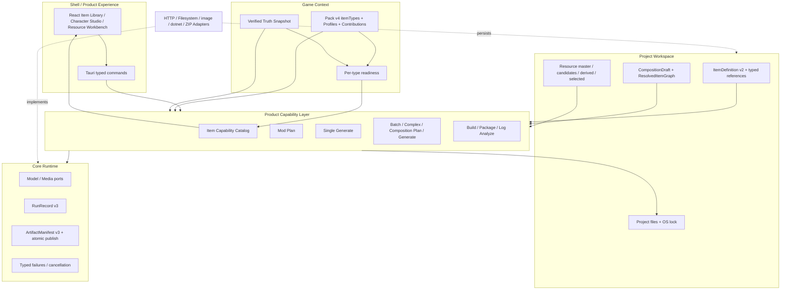

# 当前方案

> 本文是当前阶段目标和稳定架构约束入口；事实状态见 [`当前进度说明`](../02-现状/当前进度说明.md)，详细任务见 `.trellis/tasks/`。
>
> 最后更新：2026-08-07

## 1. 当前目标

在已验收的 Game Pack Stage 2 通用流水线上实现 STS2 Character 与跨 Item 组合。目标不是生成一个内联大文件，而是让 Character、Card、Relic、Potion、Power 保持独立 ItemDefinition，通过 typed reference graph、CompositionDraft 和 whole-closure transaction 形成可审阅、可重现、可原子发布的角色套装。

本轮允许破坏性合同升级，不保留无价值兼容层。O1 先升级 Pack v4 / ItemDefinition v2；O2-O4 建立 Draft、graph 与原子发布；O5-O7 顺序证明 Placeholder、Standard/Custom 和 Branded Placeholder；O8 使用全新候选和证据完成安装态与真实 STS2 单人闭环。Full custom scene/动画/音频留到后续独立阶段。

## 2. 总体框架



## 3. 分层与边界

### Core / Runtime

`ats-kernel` 与 `ats-runtime` 只处理稳定基础合同：ID/schema/hash、Model/Media/Validation/Build/Package ports、Run/Artifact、取消、typed failure 和原子发布。它们不认识 `relic/card/potion/power`，也不包含游戏 Mod Prompt。

### Product Capability

`ats-features` 定义产品能做什么：Plan、Single/Batch/Complex/Composition Mod generation、composition targeted retry、Resource prepare、Build、Package、Log analyze。功能扩展发生在这里并要求所有 Pack 补齐相应 Contribution；游戏类型扩展不新增通用 Feature，也不复制工作流。Composition targeted retry 复用 Plan 的整图约束，只替换一个逻辑节点；Composition generation 只提升 publication transaction 的范围，继续复用现有 Plan、Single proposal、Build 与 Package 服务。

### Game Context / Pack / Truth

Pack v4 顶层 `itemTypes` 是类型身份、canonical/localization fields、required locale、Evidence Query、typed reference slot 和 conditional Resource profile 的唯一真源。`compositionProfiles` 声明 Prototype/Standard preset、默认 Standard、Custom base/bounds、cross-parameter constraints 与 <=128 node limit。Feature contributions 只补充该功能所需的游戏指导、输出文件角色和受控 Primitive ID。

Truth 是当前游戏/API 事实。Readiness 使用 Pack query + 当前 verified Truth 确定性计算：未声明类型不展示；已声明但 Truth 不满足的类型 disabled；只有 ready 类型可创建、Batch 或 Generate。

### Workspace / Item

ItemDefinition v2 使用稳定 `itemId`，保存 canonical fields、Pack-keyed localization、behavior intent、精确 Resource bindings、typed references 和可选 composition profile provenance。Identity 边保存 `itemId + expectedItemType`；pinned 边保存 `itemId + definitionHash + quantity`。新定义进入 `.ats/items-v2`；旧 v1 证据保留但不静默升级。

### Workspace / Resource

资源采用 ResourceAsset v2 + master + deterministic derivation。Upload、AI 和 Pack default 都先产生 `selectedVersion=null` 的不可变 candidate；真实 PNG 探测、派生和预览成功后由用户显式确认 selected。`pack.resource-specs` v3 只引用注册的 v1 transform Primitive，并允许 master 声明 `defaultAsset {id, sha256}`；Pack default 请求不带调用方路径，Shell 按精确 Pack ID/SHA + asset ID 解析内嵌 bytes，Feature 在解码前复核 hash。派生记录 source role/version、transform primitive/version/parameters hash、Pack identity 和输出 hash。一个 master 的全部派生使用同一 staging batch，任一 candidate 失败不得改变既有 selected。ProjectSession 持有唯一 Resource repository；Single 只接受 exact media shape 且已显式 selected 的精确版本。

### Shell

React 只渲染 Pack descriptor 和 typed state，不维护 STS2 类型常量。Batch/Complex 从 Item Library 可视化选择 definition；原始 typed request 只读预览，不是第二个可编辑来源。Composition Studio 保留真实 Plan terminal Run，并只显示经过 schema/字段校验的安全 failure details。共享单 Run 轮询默认以持久化终态为截止，不再设置可能短于 Provider retry、build 或 package 最坏预算的固定前端超时；只有调用方具有独立截止合同时才显式传入 timeout。Tauri 负责 transport 和 composition，不拥有 Prompt、游戏规则或文件事务。桌面设置默认锚定用户 AppData，允许 `SPIREFORGE_CONFIG_PATH` 显式覆盖，不再根据进程 cwd 搜索仓库配置；AppData 尚无配置时可从安装 EXE 旁验证并非破坏性迁移一次旧配置，且迁移只持久化文件值，不写入 `SPIREFORGE_*` 运行时覆盖。

Composition Plan 按合同不让模型选择 Resource。Studio 在节点审查区复用同一个通用 Resource Workbench，required roles 来自该节点的 Pack capability；显式选择后只替换该节点的 `ItemDefinition.resourceBindings`，保留 `expectedCurrentDefinitionHash`，并等待 `updateCompositionDraft` revision-CAS 完成。确认阶段的 `NotReady`/graph readiness 固定映射为 `composition.confirm.not_ready`、`replace_resource`、non-retryable，使用户回到资源修复流程，而不是得到误导性的 invalid-Draft 提示。

## 4. Prompt 装配

```text
Feature Prompt Recipe
+ Pack Contribution / selected Item descriptor
+ Truth Evidence
+ Selected Resources
+ Project Context
+ Runtime Custom Instructions
+ Typed Output Contract
= Run-scoped ModelRequestSnapshot
```

这套装配解决 Mod 领域 Prompt 硬编码：跨游戏任务语言在 Recipe；游戏类型知识、模板和查询在 Pack；版本事实在 Truth；用户资产在 Workspace；运行偏好在 `llm.custom_prompt`。代码只保留 provider role、schema/slot、JSON、转义、截断、脱敏和安全验证等协议文本，这些内容与具体 Mod 生成知识无关，不应塞入 Game Pack。

Pack v4 顶层 item catalog 继续保持 Plan、Single 和 UI 的单一事实来源，并把 localization/reference/resource profile 扩展纳入同一 descriptor。`pack.mod-plan-guidance` v3 与 `pack.mod-generate-single` v4 contribution schema 暂不因 Pack envelope 升级而改号。

## 5. 连续 Orders


- Order 1（已完成机器门禁）：Pack v4 / ItemDefinition v2、localization/reference/resource/composition contracts、旧五类型破坏性迁移和通用 Editor 适配。
- Order 2（已完成机器门禁）：持久化 CompositionDraft、原子多定义确认、identity/pinned resolver、cycle/type/hash/readiness failures 和 graph digest。
- Order 3（已完成机器门禁）：新增 composition-plan Recipe/Feature、默认 Standard 的 profile editor、Custom 参数、分页/过滤 Draft review 和通用 Composition Studio；STS2 Character catalog 仍由 Order 5 声明。
- Order 4（已完成机器门禁）：proposed files、single composition staging、whole-closure validation/build/package、rollback/CAS、parent/child Runs 和 composition Artifact。
- Order 5（已完成机器门禁）：加入 STS2 Character descriptor/guidance、Prototype/Standard profiles 和通用 reference binding rules；11-node PlaceholderCharacterModel closure 已通过真实 build/publish/PCK/package、单一 Artifact/hash 与零 staging 纵向 Gate。
- Order 6（已完成机器门禁）：Standard 35 nodes 与 Custom 43 nodes 整图/批量确认、revision-pinned 单节点 retry、部分闭包校验，以及 prepared/committed publication journal 的进程中断和工程打开恢复。
- Order 7（已完成机器门禁）：接入 512x512 Pack default master 与五类 Pack-declared Branded Placeholder 静态身份图片，复用 ResourceAsset v2 的 prepare/preview/select/binding/provenance/whole-closure 全链路；真实 STS2/BaseLib compile、Godot PCK、Package 和 composition Artifact 均已通过。
- Order 8（进行中）：`rc-20260809T083538Z-c9c63a1e4ac5` 已通过 10/10 release steps、ML 安装、BuildInfo、隔离 Truth/工程、`project.create`、共享 FIFO 队列和长退避前置。`qwen3.7-plus` 在 Character Plan 分别出现上游 500/`model.transport_failed` 和非 JSON/`json_decode`，独立 Card `mod.plan` 也 `model.output_invalid`。直连对照证明 Provider 未转发 OpenAI `json_schema`：`qwen3.7-plus` 返回自称 Claude 的 Markdown，`deepseek-v4-flash` 在同格式下 reasoning-only 并截断，但在 `json_object` 下 8.852 秒返回精确 JSON。当前修复增加显式 `llm.openai_response_format=json_schema|json_object`，默认保持 strict schema，不做失败后自动降级重发，并在两种格式下保留完整 Prompt contract 与本地 typed validation。源码 debug binary 使用 `deepseek-v4-flash/json_object` 的 Card `mod.plan` 已以单 attempt succeeded，并通过 result v2、UI 终态、退出锁重新获取和零残留验证。完整机器门禁已通过 workspace 188 tests、frontend 35 tests、GUI E2E 5/5、workspace check/clippy、双 desktop feature checks、TypeScript/build、DAG、12 Features 和 release/build-plan self-tests。该源码变化使已安装 candidate 失效；新 candidate、Character Draft/Item/Artifact/Package 和全新存档的 STS2 单人可玩闭环仍待完成。

## 6. 不变量与验收

- 保持现有 Cargo DAG；Adapter 不依赖 Feature；Runtime 不认识游戏类型。
- RunRecord v3、ArtifactManifest v3、工程写入回滚、Run CAS 顺序和同目录原子发布合同不变。
- typed failure 保持 `truth.*`、`resource.*`、`model.*`、`validation.*`、`artifact.*`；不得用 unclassified 或 provider 原文替代。
- 所有桌面 HTTP 模型任务共享一个 FIFO 单飞队列；前一个逻辑任务成功、耗尽失败或取消并释放席位后，下一个任务才能发出 HTTP attempt。排队取消不得发请求，队列状态不得进入 Run/Artifact。
- OpenAI-compatible 输出格式在 Run 前由 typed config 显式选择；旧配置默认 `json_schema`，只有经证明不转发 schema 但支持 JSON Object 的代理才使用 `json_object`。失败后不得自动降级重发或宽松提取。
- 不删除或覆盖 release、verification、`.tmp`、Truth、Run、Artifact 和真实验证证据。
- 每个 Order 先跑受影响测试、workspace check/test/clippy、DAG、fmt/diff；机器门禁通过后按已获授权自动 Git commit，再进入下一 Order。
- `e00f0fa8` 候选只证明上一轮 Pack v3 / ItemDefinition v1；从 `rc-20260806T161945Z-366203d42b3e` 到 `rc-20260809T083538Z-c9c63a1e4ac5` 的已安装 candidates 均保留为对应缺陷/上游失败证据，不能用于当前格式修复后的最终验收。O8 最终验收必须安装绑定当前修复提交的新 candidate，并使用新的 Item graph、Run/Artifact/Package 和新游戏存档，不得复用或重命名旧结果。
- O8 包含真实 STS2 单人行为验收；真实外部 Provider、AI 图片质量、签名/SmartScreen 和发布仍是独立门禁。
