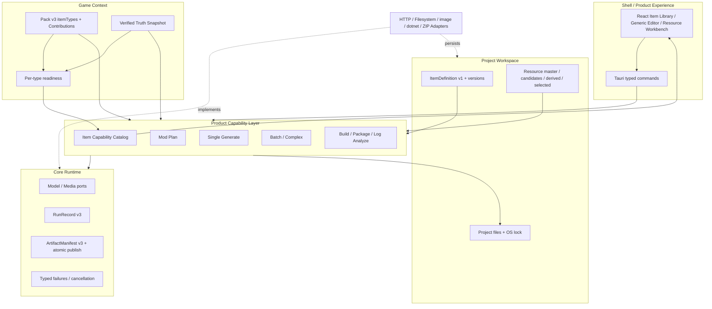
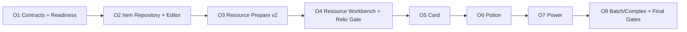

# 当前方案

> 本文是当前阶段目标和稳定架构约束入口；事实状态见 [`当前进度说明`](../02-现状/当前进度说明.md)，详细任务见 `.trellis/tasks/`。
>
> 最后更新：2026-08-04

## 1. 当前目标

在已验收的 Game Pack Stage 2 通用流水线上，先一次性建立 Pack-driven Item/Resource 地基，再连续扩充 STS2 `relic/card/potion/power`。现有 `custom_code` 迁移到同一 Item 体验，但不算新增类型；`character`、动画、音频、3D 和跨 Item 引用留到后续。

本轮允许破坏性合同升级，不保留会形成双重事实来源的临时兼容层。Order 1-2 已完成 Pack/Item/readiness、版本化 Item Library 和通用编辑器地基；当前从 Order 3 开始建立 Resource master/derived/candidate/selected。每个 Order 完成受影响机器门禁后自动提交；最终集中执行新候选与人工安装验收。

## 2. 总体框架



## 3. 分层与边界

### Core / Runtime

`ats-kernel` 与 `ats-runtime` 只处理稳定基础合同：ID/schema/hash、Model/Media/Validation/Build/Package ports、Run/Artifact、取消、typed failure 和原子发布。它们不认识 `relic/card/potion/power`，也不包含游戏 Mod Prompt。

### Product Capability

`ats-features` 定义产品能做什么：Plan、Single/Batch/Complex Mod generation、Resource prepare、Build、Package、Log analyze。功能扩展发生在这里并要求所有 Pack 补齐相应 Contribution；游戏类型扩展不新增通用 Feature，也不复制工作流。

### Game Context / Pack / Truth

Pack v3 顶层 `itemTypes` 是类型身份、通用字段 descriptor、required locale、Evidence Query 和 Resource role 的唯一真源。Feature contributions 只补充该功能所需的游戏指导、输出文件角色和受控 Primitive ID。Pack 是声明数据，不得携带任意脚本、原生插件、Provider credential 或完整工作流。

Truth 是当前游戏/API 事实。Readiness 使用 Pack query + 当前 verified Truth 确定性计算：未声明类型不展示；已声明但 Truth 不满足的类型 disabled；只有 ready 类型可创建、Batch 或 Generate。

### Workspace / Item

ItemDefinition v1 使用稳定 `itemId`，保存 canonical structured fields、behavior intent、显式 locale 状态和精确 Resource version bindings，并计算确定性 definition hash。编辑产生新 definition snapshot；旧 Run/Artifact 不变。Plan/Generate/Batch 必须绑定 hash，不能从 prose 重新猜测锁定字段。

### Workspace / Resource

资源采用 master + deterministic derivation。Upload、AI 和 Pack default 都先产生不可变 candidate；探测、派生和预览成功后由用户显式确认 selected。派生记录 source version、transform primitive/version、Pack identity 和输出 hash；任一 candidate 失败不得改变已选版本，单槽位允许覆盖。

### Shell

React 只渲染 Pack descriptor 和 typed state，不维护 STS2 类型常量。Batch/Complex 从 Item Library 可视化选择 definition；原始 typed request 只读预览，不是第二个可编辑来源。Tauri 负责 transport 和 composition，不拥有 Prompt、游戏规则或文件事务。

## 4. Prompt 装配

```text
Feature Prompt Recipe
+ Pack Contribution / selected Item descriptor
+ Truth Evidence
+ Selected Resources
+ Project Context
+ Runtime Custom Instructions
+ Typed Output Contract
= Run-scoped ModelRequestSnapshot
```

这套装配解决 Mod 领域 Prompt 硬编码：跨游戏任务语言在 Recipe；游戏类型知识、模板和查询在 Pack；版本事实在 Truth；用户资产在 Workspace；运行偏好在 `llm.custom_prompt`。代码只保留 provider role、schema/slot、JSON、转义、截断、脱敏和安全验证等协议文本，这些内容与具体 Mod 生成知识无关，不应塞入 Game Pack。

Pack v3 顶层 item catalog 已消除 Plan、Single 和 UI 三处类型/Resource/Truth 事实重复。`pack.mod-plan-guidance` v3 只保留规划指导；`pack.mod-generate-single` v3 只保留生成指导、validation Primitive 和 exact generated-file roles。

## 5. 连续 Orders



- Order 1（已完成）：Pack/Item contracts、ItemDefinition/hash、Truth capability readiness。
- Order 2（已完成）：Item repository、Item Library、通用混合编辑器、英中 confirmed/outdated。
- Order 3（下一步）：真实图片探测、master/derived、deterministic transform、candidate/selected。
- Order 4：可视化 Resource Workbench，并用 Relic 通过真实纵向 Gate。
- Order 5-7：只在同一地基上增加 Card、Potion、Power 的 Pack/Truth/Recipe 内容和纵向测试。
- Order 8：Item Library Batch/Complex、child Run/retry、Build/Package、全量机器门禁与最终人工验收。

## 6. 不变量与验收

- 保持现有 Cargo DAG；Adapter 不依赖 Feature；Runtime 不认识游戏类型。
- RunRecord v3、ArtifactManifest v3、工程写入回滚、Run CAS 顺序和同目录原子发布合同不变。
- typed failure 保持 `truth.*`、`resource.*`、`model.*`、`validation.*`、`artifact.*`；不得用 unclassified 或 provider 原文替代。
- 不删除或覆盖 release、verification、`.tmp`、Truth、Run、Artifact 和真实验证证据。
- 每个 Order 先跑受影响测试、workspace check/test/clippy、DAG、fmt/diff；机器门禁通过后按已获授权自动 Git commit。
- 新完整 release candidate、安装器、真实图片 Provider 和真实游戏行为验收需要独立授权，不复用旧候选或旧 Run。
