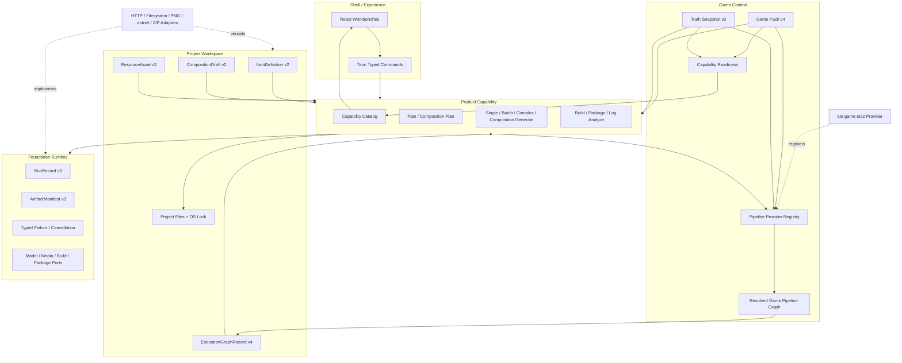

# 当前方案

> 文档定位：当前阶段的架构方案、核心不变量和验收边界入口。
>
> 当前事实：[`current progress`](../02-现状/当前进度说明.md)。
>
> 可执行合同：[Stage 2 backend contracts](../../.trellis/spec/backend/stage2-contracts.md)。
>
> 最后更新：2026-08-16

## 1. 目标与状态

当前目标是在 Game Pack Stage 2 通用流水线上完成 STS2 Character 与跨 Item 组合。Character、Card、Relic、Potion 和 Power 保持独立 ItemDefinition，通过 typed reference graph 形成可审阅、可重现、可原子发布的角色套件。

跨游戏长期边界已经进一步确认：不同游戏不共享一张固定的生成/构建阶段表。Core 只提供 DAG、queue、checkpoint、Run/Artifact、retry、transaction 和 atomic publish；受信任的 Game Pipeline Provider 依据 pinned Pack/Truth 物化游戏专属执行图。当前已实现 Provider v1/registry、独立 `ats-game-sts2`、完整 graph 持久化、Provider-driven validation/build/package 和受信任 Prepare executor 编译边界。synthetic data-only Provider 已通过真实 Composition service 路径证明可以省略 Plan/Single/AI/validator/build/package，同时仍产生 succeeded Run/Graph、Artifact 和最终文件。

O8 已实现并通过机器门禁：多 Item 技术修复按 ownership/DAG 稳定串行，单 Item 调整绑定当前 definition 并派生新版本，普通 UI 不暴露内部诊断控制面。

Provider foundation 已通过其原始机器门禁；叠加当前 SSE transport 修复后的工作树现为 workspace 258/258、Game Context 18/18、STS2 Provider 2/2、desktop composition 10/10、Character 2/2、frontend 39/39、isolated GUI E2E 8/8 及完整静态/构建门禁。GUI 暴露的 frontend request v5/backend v6 envelope 漂移已按破坏性合同同步修复，没有加入兼容 reader 或放宽 Pack/Draft identity。

当前 candidate `rc-20260816T084051Z-b9d4547665be` 精确绑定提交 `b9d4547665be6d916a1ede279875356eb5d795ac`，完成 release 10/10、baseline/ML 双变体验证、四个 installer 独立 hash 复算、ML 安装和 BuildInfo 核对。它包含 `ec8b3311` 的通用 SSE 修复。当前尚未启动 fresh installed closure；旧 candidate 及其 Graph 只保留诊断价值。

## 2. 架构分层



### Kernel / Runtime

Runtime 只实现跨游戏稳定合同：ID/schema/hash、Run/Artifact、provider-neutral ports、typed failure、cancellation、ExecutionGraph DAG/CAS/claim/checkpoint/commit 状态机和原子发布。Runtime 不认识 `character`、STS2、Profile 数量或游戏 Prompt。

### Feature

Feature 定义产品能力和编排：Plan、Single、Batch、Complex、Composition Plan/Retry/Generate、Resource Prepare、Build、Package 和 Log Analyze。

大型任务由 Feature 将 Pack 声明编译为 deterministic Blueprint，执行有界模型节点、typed validation、本地 reference binding 和最终收敛。Execution node 不是新 Feature，不进入 12-Feature catalog。

### Pack / Truth

Pack v4 声明游戏类型、字段、locales、Truth Queries、typed reference slots、Resource profiles、composition profiles、generated file roles 和 Feature contributions。Truth 固定当前游戏/API 事实。Capability readiness 由 pinned Pack 和 verified Truth 确定性计算，不由 UI 或 Prompt 猜测。

Pack 通过精确 ID/version/SHA 选择一个已注册的 Pipeline Provider/profile；Pack 本身不能携带任意 shell、native plugin 或完整工作流实现。STS2 的 validation、Build、Package 和 publish 顺序现由 STS2 Provider graph 驱动；当前 Pack SHA-256 为 `9dfb4d80a8fb5abae41abcb57869b13443038d6ba60ff1129060137bc3d55254`。详细边界见 [`通用执行内核、Game Pipeline Provider 与 Game Pack 边界`](./通用Mod流水线与Game-Pack边界.md)。

### Workspace

Workspace 持有 Project、OS lock、Item definitions、Composition drafts、Resources、Execution graphs、Runs、Artifacts 和 publication journals。各类记录都使用稳定 ID、schema version、content hash 和原子写入合同。

### Shell

React 渲染 capability catalog 和 typed state，不维护 STS2 类型分支。Tauri 负责 transport、session ownership 和 Feature 组装，不拥有 Prompt、游戏规则或文件事务算法。

## 3. 核心用户流程

```text
Create/Open Project
-> import and verify Truth
-> inspect Pack-driven capability catalog
-> create or select Item definitions
-> create Composition Plan execution graph
-> review Draft nodes
-> prepare/select/bind Resources
-> confirm a closed typed subgraph
-> resolve exact Item closure
-> create Composition Generate execution graph
-> resume failed nodes when needed
-> finalize once
-> validate/build/package/publish once
-> inspect Run/Graph/Artifact evidence
```

Character Studio 在同一工作台中组织 Character 和子 Item，但子 Item 仍保存为独立 ItemDefinition，可从 Item Library 单独打开。Plan 只创建 Draft，不选 Resource、不发布 Item、不写工程。

## 4. 可恢复的大型生成

长整图请求已被真实 Provider 证据证明不可靠：一次传输或 typed output 失败会使整个长响应作废。当前方案不依赖上游恰好稳定，而是把大型生成分解为可持久化的有界节点。

### Composition Plan

```text
Pack profile
-> deterministic Blueprint
-> Suite Brief checkpoint
-> serial model node checkpoints
-> local reference binding
-> complete graph validation
-> commit intent
-> Draft createOrMatch
```

### Composition Generate

```text
ResolvedItemGraph
-> item.000.plan checkpoint
-> item.000.single checkpoint
-> ...
-> item.NNN.single checkpoint
-> local composition.finalize
-> registered validation
   -> pass: commit intent
   -> repairable: complete-file replacement -> full revalidation
   -> local/unsafe/limit: paused
-> one build/package transaction
-> one project publication
-> one composition Artifact
```

### Resume 语义

- 成功 checkpoint 不重跑。
- 失败节点回到可恢复状态，graph 进入 paused。
- Resume 创建新父 Run，使用同一 graph 和 Blueprint。
- 进程重启后先执行结构恢复，业务 checkpoint 在 Feature resume 时按 pinned Pack/definition/Resource 重新校验。
- `commit_prepared` 只在 registered validation 通过后创建，创建后只前滚，不回到模型节点。
- Succeeded graph 的父 Run reconciliation 不再调用模型、Build、Package 或 Artifact publication。

详细合同见已完成基线中的
[`可恢复分阶段 Mod 生成架构方案`](../90-归档/已完成基线/2026-08-10-可恢复分阶段Mod生成架构方案.md)。

## 5. Provider 稳定性策略

所有桌面 HTTP model 任务共享一个 FIFO 单飞队列。每个逻辑请求在成功、耗尽或取消前始终占用一个席位；排队取消不发请求。

OpenAI-compatible Chat Completions 统一使用 SSE 传输；Feature 仍接收聚合后的 `ModelResponse`，不感知 Provider 协议细节。180 秒限制分别作用于响应头等待和相邻数据块停滞，不再把持续有增量的长生成按总时长切断。流必须以 `[DONE]` 完成；中途 EOF、读失败或停滞仍作为可重试 transport failure，畸形/空事件作为 invalid response，取消会直接丢弃活动响应。

最终输出优先使用有序 `delta.content`。OpenAI-compatible reasoning 扩展可以同时出现，但不会混入正常 content；只有整条流完全没有 content 时，才把完整 `reasoning_content` 作为确定性 fallback 交给同一严格 JSON/type 校验。这里不按模型名或 Provider 名分支，也不做 Markdown 清理、JSON 片段抽取或宽松修复。

OpenAI-compatible response format 使用 typed 配置：

- `json_schema` 用于真正支持 strict schema forwarding 的 Provider。
- `json_object` 用于已证明不转发 schema 但支持 JSON Object 的代理。
- 旧配置默认 `json_schema`。
- 一个 Run 内不自动换格式、换模型或宽松解码。

HTTP retry 只处理 transport 层面的有界重试。Direct Single 保持单次严格行为；Composition 中可修订的 output-contract 与 generated-content diagnosis 共用一个 Feature-owned Generation Feedback Controller。每次反馈调用前，Graph v4 CAS 持久化 versioned/hashed safe envelope；checkpoint 前按完整 candidate SHA 判断无进展，checkpoint 后同时绑定有效 checkpoint hash。多 Item issues 按 ownership 和 DAG 顺序形成持久化 campaign，每个 target 返回完整 bundle/role set并重走同一严格 decode，campaign 后重跑完整 validator。Graph 总预算不按节点或 Item 放大，`until_passed` 也有 20 次绝对安全上限。运行中不换策略、模型、endpoint 或 response format。

该实现不接受双重编码 JSON，不从 Markdown/自然语言猜测结构，不保存 raw completion，也不包含模型、Provider、STS2、Character 或 `merge_content` retry 分支。详细设计与落地边界见已完成基线中的 [`统一生成反馈闭环架构方案`](../90-归档/已完成基线/2026-08-12-统一生成反馈闭环架构方案.md)。

旧安装态 closure 暴露的 cross-owner 缺口已在 O8 根因层修复。系统内部按 Item ownership 和依赖顺序串行修复技术错误，只向用户展示生成、检查、自动调整、需要处理和预览状态；生成后的创作调整绑定一个具体 Item 和当前 definition 版本，调整后重新验证完整组合。完整合同见已完成基线中的 [`批次生成自动修复与单项调整架构方案`](../90-归档/已完成基线/2026-08-13-批次生成自动修复与单项调整架构方案.md)。

definition-bound Plan 不再只接收 `behaviorIntent` 拼接文本。Feature context 同时携带完整、已验证的 `StoredItemDefinition`；Recipe 将其中的 canonical fields、localizations、Resource/reference bindings 视为权威事实，模型只补充实现、证据和验收建议。typed decode 后，Feature 仍会从 definition 本地回填 `itemId`、`itemType` 和 `behaviorIntent`。Single Prompt 若与 Plan prose 冲突，必须采用 definition；不得用自由文本启发式重新推断 HP、Card、Relic 或其他 canonical/reference 事实。

Single 多文件 bundle 的输出上限为 16,384 tokens。`model.output_invalid` 和 `model.output_truncated` 只附带闭集 `reasonCode`，不持久化 raw completion、解析器文本、Provider body 或模型生成的未知 role。

Single 的 run-scoped 输出合同按 Pack file role 区分内容类型：普通源码 role 是 bounded string，`compositionMerge=json_object` 的 localization role 直接是 flat `{key: string}` 对象。本地 Feature 负责确定性排序、序列化、合并和 checkpoint 规范化，不再要求模型在外层 JSON 中手写第二层 JSON 字符串。

## 6. Character 范围

### 已纳入

- Pack-driven `character` descriptor、fields、locales、Truth Queries 和 typed reference slots。
- Character 对 Starting Card、Starter Relic、CardPool、RelicPool、PotionPool 和 Power 的 typed references。
- Prototype、Standard 和有界 Custom profiles。
- Placeholder 和 Branded Placeholder Resource profiles。
- 512x512 identity master 与五个确定性静态派生资源。
- whole-closure compile、PCK、ZIP、Artifact 和原子工程发布。

### 未纳入

- Full custom Godot scenes、动画状态机、trail、角色音频、休息/商店/转场场景。
- 多人、随机角色、Compendium 全量和完整通关验收。
- 自动平衡、AI 美术质量保证和签名/SmartScreen。

## 7. 不变量

- 保持 Cargo DAG；Adapter 不依赖 Feature，Runtime 不认识游戏类型。
- Pack 是游戏差异的数据声明源；受信任的 Game Pipeline Provider 是游戏专属执行语义所有者。React/Runtime 不添加 Character 或 STS2 分支。
- AI 是可选 Primitive，不是所有游戏生成或构建链路的固定阶段。
- Truth/Pack/definition/Resource 在 Run 前精确固定，不从 Prompt 反向猜测。
- RunRecord v3、ArtifactManifest v3、definition hash、graph digest 和 manifest hash 可重算。
- Checkpoint 不保存 Prompt、Provider body 或 raw completion，不进入 Draft/Artifact/project files。
- Composition 在所有 Item 完成前不发布工程或 Artifact。
- 历史 evidence 不删除、不覆盖、不重命名冒充新验收。
- 代码变化后不继续使用旧 candidate 代表当前实现。

## 8. 当前执行顺序

### O8 - 多 Item 自动修复与单项调整（已完成）

1. ExecutionGraph v4 持久化多 Item ownership、依赖有序 repair campaign、cursor 和 bounded typed evidence。
2. 共享 FIFO 下串行执行多 target 修复；完成后重新验证完整闭包。
3. `itemId + expectedDefinitionHash` 绑定的单 Item 用户调整只重生成目标 Item，随后完整复验。
4. 普通 UI 只展示产品状态和逐 Item 调整，不暴露 Graph、Run、compiler code 或 repair budget。
5. O8、Provider foundation 与 SSE transport 回归保持通过；当前工作树为 workspace 258/258、frontend 39/39、DAG、12-Feature catalog 和 isolated GUI E2E 8/8。

### O9 - 新候选与真实验收

1. [已完成] 构建并安装绑定当前提交的 ML candidate，完成 release、hash 和安装身份核对。
2. [待独立授权] 为当前 candidate 创建全新物理 Truth、Project、Draft、Items、Resources、Run、Graph、Artifact 和 Package 证据。
3. 证明真实 multi-Item failure 可自动修复并使 parent Run、Graph 和 whole closure succeeded。
4. 核对 ArtifactManifest/hash、ZIP、最终目录、零残留和工程锁恢复。
5. 由用户在真实 STS2 中完成角色、战斗、奖励、选卡、Continue、存档恢复和单 Item 调整验收。

完整 checklist、当前 candidate hashes 和旧 Run/Graph 诊断边界见本地 Trellis 任务的 `acceptance.md`。candidate 构建与安装授权已经完成；installed acceptance 启动仍保持独立授权，真实游戏 UI 只由用户操作。

## 9. 长期边界与已完成基线

- [`通用执行内核、Game Pipeline Provider 与 Game Pack 边界`](./通用Mod流水线与Game-Pack边界.md)：跨游戏可靠性内核、游戏专属构建链和 Pack 权限边界。
- [`Prompt、Game Pack 与真相源文本资源`](../01-总览/Prompt-文本资源总览.md)：Prompt 组装与所有权。
- [`Stage 2 分层能力与资源架构`](../90-归档/已完成基线/2026-08-02-Stage-2分层能力与资源架构方案.md)：跨阶段分层已完成基线。
- [`可恢复分阶段 Mod 生成`](../90-归档/已完成基线/2026-08-10-可恢复分阶段Mod生成架构方案.md)：ExecutionGraph、checkpoint、resume 和 commit protocol 已完成设计。
- [`统一生成反馈闭环`](../90-归档/已完成基线/2026-08-12-统一生成反馈闭环架构方案.md)：strict output、typed diagnosis、semantic feedback 和安全停止语义已完成设计。
- [`批次生成自动修复与单项调整`](../90-归档/已完成基线/2026-08-13-批次生成自动修复与单项调整架构方案.md)：多 Item 自动修复和单 Item 调整已完成设计。
