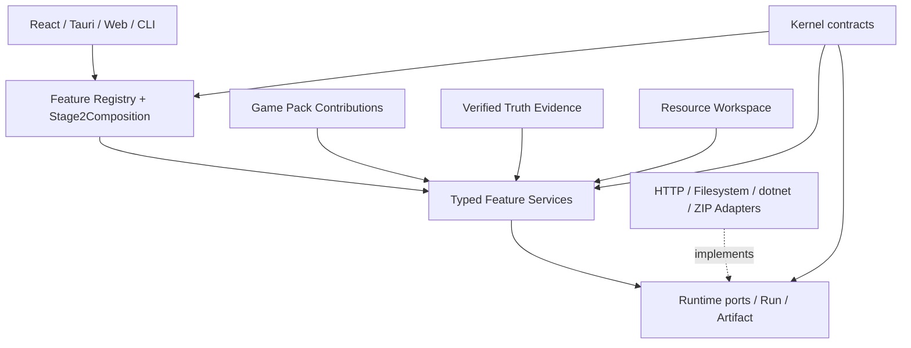

# 当前方案

> 本文是当前阶段目标和稳定架构约束入口；事实状态见 [`当前进度说明`](../02-现状/当前进度说明.md)，详细任务见 `.trellis/tasks/`。
>
> 最后更新：2026-08-03

## 1. 当前目标

Game Pack Stage 2 Work Order 1-7 已落地，Work Order 8 的首轮机器门禁和候选已完成。首轮安装版 E2E 发现 Plan 的自然语言证据要求被误作 Truth symbol；当前收口重点是完成 Plan v2 / Pack Evidence Query v2 修复、重新门禁并生成不可复用旧结果的新候选。

在 Stage 2 完成前不混入第二个真实游戏、动态插件、marketplace、Web/SaaS、签名或自动发布。既有 Windows 候选是 Stage 2 之前的历史证据，不能复用或人工重命名为新代码候选。

正式设计见 [`Stage 2 分层能力与资源架构方案`](./2026-08-02-Stage-2分层能力与资源架构方案.md)。

## 2. 稳定分层



### Kernel

`ats-kernel` 只拥有稳定值合同：ID、schema、hash、`ActionableFailure`、`BuildInfo` 和工程模板。它不认识具体 Feature、游戏或 provider。

### Runtime

`ats-runtime` 拥有 Run/Artifact envelope、取消和 Model/Media/Validation/Build/Package 等 ports。新增 Feature 不修改中心 `RunKind/RunResult`，因为该枚举已删除。

### Feature

`ats-features` 定义产品能做什么：Project create、Plan、Resource prepare、Single/Batch/Complex generate、Log analyze、Build、Package。Feature 拥有 typed request/result、Recipe 和组合，不拥有 provider 或游戏特例。

### Game Context

`ats-game-context` 负责 Pack、Contribution 和 Truth/Evidence。Game Pack 提供特定游戏的生成依据、Mod 类型模板、日志规则、资源规格和已注册 Primitive ID，不复制通用产品功能，也不携带任意可执行代码。

### Workspace

`ats-workspace` 负责工程文件夹、OS lock、recents 和版本化 Resource。用户上传、Pack default 以及未来 AI 图片/动画都应进入同一 Resource Workspace，再由生成 Feature 显式选择。

### Adapters 与 Shell

`ats-adapters` 实现外部 IO；Tauri/Web/CLI 只装配、验证 transport 和管理状态。Shell 不得拥有 Prompt、游戏规则、模型输出解码或文件事务。

## 3. Prompt 方案

```text
Feature Prompt Recipe
+ Pack Contribution
+ Truth Evidence
+ Selected Resources
+ Project Context
+ Runtime Custom Instructions
+ Typed Output Contract
= Run-scoped ModelRequestSnapshot
```

该方案消除 Mod 领域 Prompt 的代码硬编码：任务自然语言在 Feature Recipe，游戏指导和可执行 Evidence Query 在 Pack，当前事实在 Truth，资源在 Workspace，用户偏好在 `llm.custom_prompt`。Plan v2 的 `evidenceRequirements` 只记录业务证据意图；Pack v2 的 `evidenceQueries` 才能提供 `symbols/terms`。Pack 内部 `requiredResourceRoles` 也不由模型猜测或回显，而由 `pack.mod-plan-guidance` v2 按 item type 确定性写入最终 Plan。代码保留的 role、schema、slot、JSON、枚举、安全、截断和脱敏是协议合同，不放入 Game Pack。Adapter 必须将 typed output contract 作为 provider 原生严格 JSON Schema 发送；不支持该能力的网关直接失败，不能降级为 prompt-only JSON 或宽松提取。

## 4. 当前产品合同

- Tauri 只暴露 health/settings/project、Feature catalog、Truth status/import、generic submit 和 v3 Run get/list/cancel。
- React 使用 v3 runtime guard 和持久化 polling；页面不使用旧事件流、raw LLM 或 Prompt preview。
- Web 只暴露 health/catalog/SPA，不维护平行 planning/codegen。
- CLI `features` 输出相同 catalog，deploy 命令保持独立运维职责。
- `resource.prepare` 的 file、Pack default 和 AI media 已统一进入 Resource Workspace；AI Adapter 支持 OpenAI Images/Chat Completions 并记录 provider/model/request hash。
- ProjectSession 在 close/switch/exit 时取消并排空任务，再释放 OS lock。
- Artifact final 只通过同目录 staging + 原子 rename 发布；失败清理本轮 staging，不伪造成功。

## 5. Work Order 8

Work Order 8 负责：

1. 从干净的 WO7 提交运行完整 workspace、frontend、Tauri feature、DAG、legacy guard 和确定性 facade E2E。
2. 审核 active docs/spec、Cargo metadata、9 个 Feature catalog、v3 schema 与候选身份。
3. 只有机器门禁证明代码稳定后，评估是否必须生成新的 Stage 2 baseline/ML candidate。
4. 新候选构建属于高成本 release gate；按既定约束在执行前取得用户确认，不复用旧候选。
5. 安装器、桌面 UI、真实工程/Mod/Run/Artifact/lock 由用户做最终人工验收，Agent 只检查文件、日志、Run、manifest、目录和 hash。

## 6. Stage 2 完成标准

- Cargo DAG 阻止基础层反向依赖 Feature，仓库无生产 `ats-core` 引用。
- 9 个 Feature 通过共享 catalog 和版本化 request/result 执行。
- Shell 全部使用 v3 Run/Artifact 与 Kernel typed failure。
- Prompt、Pack、Truth、Resource、Project 和用户指令各有唯一所有者。
- deterministic facade E2E 覆盖 project lock、plan、single generation、compile、Run v3、Artifact v3/hash、无 staging 和 reopen。
- baseline、`ml-rembg`、`e2e` feature 组合可编译，health 只声明已注册媒体 Adapter，不把配置/网络/图片质量伪装为 ready。
- 新 Stage 2 候选若被要求，必须有独立 build ID、绑定当前提交、manifest/hash/identity verification，且由用户完成安装版人工验收。

## 7. 后续边界

Stage 2 完成后再定义第二个真实 Game Pack 或新 Feature。优先用新增 Pack 验证“游戏可扩展”，用新增 Feature 验证“功能可扩展”；只有这两类扩展暴露真实瓶颈时才评估动态插件。Web auth/SQLx、签名、自动更新和跨平台发布继续使用独立 Trellis 任务。
