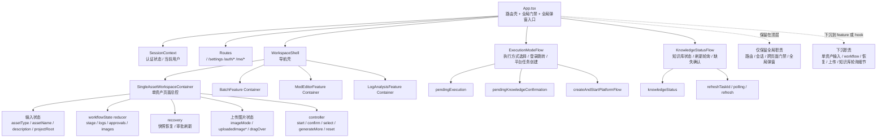

# App 状态边界与拆分实施计划 Implementation Plan

> **For agentic workers:** REQUIRED: Use superpowers:subagent-driven-development (if subagents available) or superpowers:executing-plans to implement this plan. Steps use checkbox (`- [ ]`) syntax for tracking.

**Goal:** 收口 [App.tsx](/I:/WebCode/AgentTheSpire/frontend/src/App.tsx) 的顶层状态边界，把当前“路由壳 + 多功能总控”的大组件拆回可维护的前端结构，同时不破坏现有工作流、用户中心和执行模式切换行为。

**Architecture:** 以“顶层只保留全局职责，feature 自治自己的局部状态”为原则，将 `App.tsx` 收口为 `路由壳 + 全局门禁 + 全局弹窗入口`。单资产工作流、知识库轮询、执行模式选择等横切状态分别下沉到独立 container / hook，使页面职责边界清晰、测试范围缩小、后续修改不再牵动整棵入口组件。

**Tech Stack:** React 18, TypeScript, React Router, Vite

---

## 2026-04-13 执行计划调整

基于当前项目仍处于未上线阶段，本轮不再以“最小修改”作为优先原则，而是允许先做一轮更彻底的入口重组，减少后续继续拆分时的返工。

### 当前主线

1. 先解除会阻碍重构的结构绑定测试
2. 再下沉单资产入口状态与装配逻辑
3. 然后拆执行模式 flow
4. 再拆知识库 flow
5. 最后收口 `App.tsx` 为纯路由壳

### 先做测试基线调整的原因

- 当前有多条测试直接匹配 `App.tsx` 的源码形状，会把旧结构误当成正确行为
- 如果不先改测试，后续即使做了正确的 feature 边界重构，也会被旧的 adoption test 阻塞
- 本轮需要优先保护“边界归属”和“入口行为”，而不是保护 `App.tsx` 的具体写法

### 本轮执行边界

- 允许新增 `SingleAssetWorkspaceContainer`
- 允许把单资产相关 hook、controller、recovery 接线整体迁出 `App.tsx`
- 暂不在本轮同时改执行模式 flow 与知识库 flow 的行为实现
- 暂不引入新的测试库，优先沿用现有 `node:test` 基线完成测试去耦

---

## 背景

- 当前 [App.tsx](/I:/WebCode/AgentTheSpire/frontend/src/App.tsx) 约 808 行。
- 顶层组件同时承担：
  - 路由定义
  - 工作区壳层渲染
  - 单资产工作流输入与 reducer 状态
  - 知识库状态与轮询
  - 执行模式切换与平台任务创建
  - 登录跳转与平台门禁
  - 多个确认弹窗和恢复逻辑
- 这不是单纯“文件太长”的问题，而是“职责边界过于集中”，会持续提高维护成本、测试成本和修改风险。

## 现状判断

### 当前 `App.tsx` 同时管理的状态域

1. 顶层路由与门禁
2. 单资产工作流输入状态
3. 单资产工作流 reducer / socket / 恢复状态
4. 知识库状态与刷新轮询
5. 执行模式选择与平台任务创建状态
6. 跨页面弹窗显示状态

### 当前主要问题

- 顶层组件同时持有过多局部状态
- 多个 `useEffect` 分属不同问题域，彼此靠近但没有明确边界
- 单资产模块虽然已经有 `controller / state / recovery / view`，但关键状态仍留在 `App.tsx`
- 新需求很容易继续向 `App.tsx` 堆积，导致入口组件继续膨胀

## 状态边界图

## 边界决策

### 应保留在 `App.tsx` 的职责

- 路由定义与页面装配
- `SessionContext` 消费与认证门禁
- 跨页面的执行方式选择入口
- 全局级弹窗入口
- `WorkspaceShell` 作为壳组件的组装

### 应从 `App.tsx` 下沉的职责

- 单资产输入状态：
  - `assetType`
  - `assetName`
  - `description`
  - `projectRoot`
- 单资产工作流状态：
  - `workflowState`
  - `socket`
  - `autoMode`
  - `imageMode`
  - 上传图片相关状态
- 单资产恢复与审批刷新逻辑
- 知识库轮询细节
- 本机/服务器执行模式的细粒度流程状态

## 目标结构

### 顶层结构

- `App.tsx`
  - 只负责路由、全局门禁和全局弹窗装配

### 建议新增或收口的前端单元

- `frontend/src/features/single-asset/SingleAssetWorkspaceContainer.tsx`
  - 接管单资产输入、workflow reducer、上传图片状态、恢复逻辑和 controller 调度
- `frontend/src/features/workspace/useExecutionModeFlow.ts`
  - 接管 `pendingExecution`、`pendingKnowledgeConfirmation`、平台任务创建与登录跳转
- `frontend/src/features/workspace/useKnowledgeStatusFlow.ts`
  - 接管 `knowledgeStatus`、刷新轮询、刷新任务追踪
- `frontend/src/features/workspace/WorkspaceRoutes.tsx`
  - 如需要，可承接首页工作区内容装配，替代 `renderWorkspaceContent()`

## 拆分策略

### 原则

- 不做一次性大重构
- 优先拆“状态最多、耦合最重、已有基础”的单元
- 每一步都保证外部行为不变

### 推荐顺序

1. 先拆单资产 container
2. 再拆执行模式协调 flow
3. 再拆知识库状态 flow
4. 最后视情况决定是否把 workspace 内容装配独立出去

## 分阶段实施计划

### 进度更新（2026-04-13）

- [x] 已把单资产入口从 `App.tsx` 下沉到 `frontend/src/features/single-asset/SingleAssetWorkspaceContainer.tsx`
- [x] 已把单资产快照恢复、上传图片、workflow controller、审批动作和项目创建接线迁入 container
- [x] 已把 `App.tsx` 中直接绑定单资产实现细节的 adoption test 改为检查 feature 边界归属
- [x] 已把执行模式选择、本机能力探测、登录跳转和平台任务创建下沉到 `frontend/src/features/workspace/useExecutionModeFlow.ts`
- [x] 已把知识库状态加载、刷新轮询和刷新动作下沉到 `frontend/src/features/workspace/useKnowledgeStatusFlow.ts`
- [x] 已把首页工作区内容装配从 `App.tsx` 抽成 `frontend/src/features/workspace/WorkspaceHome.tsx`
- [x] 已引入 `frontend/src/features/workspace/WorkspaceContext.tsx`，让单资产、批量、Mod 编辑和日志分析统一消费 workspace 级共享动作与状态
- [x] 已把 workspace feature 的 context 回退逻辑收口到共享 hook，减少 `batch/mod/log` 三处重复适配代码
- [x] 已通过单资产相关定向测试与 `npx tsc --noEmit -p frontend/tsconfig.json` 的轻量类型校验

## Chunk 1: 单资产状态下沉

### Task 1: 把单资产输入与 workflow 状态从 `App.tsx` 下沉

**Files:**
- Create: `frontend/src/features/single-asset/SingleAssetWorkspaceContainer.tsx`
- Modify: `frontend/src/App.tsx`
- Modify: `frontend/src/features/single-asset/controller.ts`
- Modify: `frontend/src/features/single-asset/view.tsx`
- Test: `frontend/tests/singleAssetController.test.ts`
- Test: `frontend/tests/singleAssetState.test.ts`

- [x] **Step 1: 写定向 failing tests**
  验证单资产入口在拆分后仍能完成输入、启动 workflow、选择图片、审批继续和 reset。

- [x] **Step 2: 创建 `SingleAssetWorkspaceContainer`**
  将单资产相关局部状态整体迁入 container，包括输入、上传状态、workflow reducer、恢复逻辑和 controller 使用。

- [x] **Step 3: 精简 `App.tsx`**
  顶层只保留把 `onRequestExecution`、知识库状态和打开设置/说明等跨 feature 依赖传给 container。

- [x] **Step 4: 运行定向测试**

**Commands:**
- `node --experimental-strip-types frontend/tests/feature-shell.test.ts`
- `node --experimental-strip-types frontend/tests/workspaceConsoleShell.test.ts`
- `node --experimental-strip-types frontend/tests/singleAssetControllerAdoption.test.ts`
- `node --experimental-strip-types frontend/tests/singleAssetErrorNamingAdoption.test.ts`
- `node --experimental-strip-types frontend/tests/singleAssetProjectCreation.test.ts`
- `node --experimental-strip-types frontend/tests/singleAssetWorkspaceContainerAdoption.test.ts`
- `node --experimental-strip-types frontend/tests/projectCreationHookAdoption.test.ts`
- `node --experimental-strip-types frontend/tests/singleAssetController.test.ts`
- `node --experimental-strip-types frontend/tests/singleAssetState.test.ts`
- `node --experimental-strip-types frontend/tests/singleAssetRecovery.test.ts`
- `npx tsc --noEmit -p frontend/tsconfig.json`

**Expected:**
- `App.tsx` 不再直接持有单资产 workflow 局部状态。

## Chunk 2: 执行模式流程下沉

### Task 2: 抽离执行模式选择与平台任务创建流程

**Files:**
- Create: `frontend/src/features/workspace/useExecutionModeFlow.ts`
- Modify: `frontend/src/App.tsx`
- Modify: `frontend/src/features/platform-run/createAndStartFlow.ts`
- Test: `frontend/tests/executionModeDialog.test.ts`
- Test: `frontend/tests/platformRunFlow.test.ts`

- [x] **Step 1: 写定向 failing tests**
  验证本机执行 / 服务器执行、登录跳转和平台任务创建仍保持原行为。

- [x] **Step 2: 抽出 `useExecutionModeFlow`**
  统一封装：
  - `pendingExecution`
  - `handleExecutionRequest`
  - `handleChooseLocalExecution`
  - `handleChooseServerExecution`
  - 登录跳转与平台 job 创建

- [x] **Step 3: `App.tsx` 改为消费 hook 返回值**
  顶层只负责把结果接到全局弹窗入口。

- [x] **Step 4: 运行定向测试**

**Commands:**
- `node --experimental-strip-types frontend/tests/executionModeDialog.test.ts`
- `node --experimental-strip-types frontend/tests/platformRunFlow.test.ts`
- `node --experimental-strip-types frontend/tests/serverFlowGate.test.ts`
- `node --experimental-strip-types frontend/tests/executionModeFlowAdoption.test.ts`
- `npx tsc --noEmit -p frontend/tsconfig.json`

**Expected:**
- 执行模式流程不再与顶层路由和单资产 workflow 状态混写。

## Chunk 3: 知识库状态流下沉

### Task 3: 把知识库轮询与刷新状态抽成独立 flow

**Files:**
- Create: `frontend/src/features/workspace/useKnowledgeStatusFlow.ts`
- Modify: `frontend/src/App.tsx`
- Test: `frontend/tests/knowledgeWorkflowBanner.test.ts`
- Test: `frontend/tests/knowledgeGuideDialog.test.js`
- Test: `frontend/tests/knowledgeSettingsPanel.test.js`

- [x] **Step 1: 写定向 failing tests**
  验证知识库加载、刷新、轮询完成和说明弹窗联动仍正确。

- [x] **Step 2: 抽出 `useKnowledgeStatusFlow`**
  封装：
  - `knowledgeStatus`
  - `knowledgeRefreshTaskId`
  - 轮询副作用
  - `handleRefreshKnowledge`

- [x] **Step 3: 在 `App.tsx` 中移除知识库轮询细节**
  顶层仅消费 hook 提供的最终状态和事件。

- [x] **Step 4: 运行定向测试**

**Commands:**
- `node --experimental-strip-types frontend/tests/knowledgeWorkflowBanner.test.ts`
- `node --experimental-strip-types frontend/tests/knowledgeGuideDialog.test.js`
- `node --experimental-strip-types frontend/tests/knowledgeStatusFlowAdoption.test.ts`
- `npx tsc --noEmit -p frontend/tsconfig.json`

**Expected:**
- `App.tsx` 不再直接承载知识库轮询副作用。

## Chunk 4: 入口组件收口

### Task 4: 让 `App.tsx` 回到路由壳职责

**Files:**
- Modify: `frontend/src/App.tsx`
- Create: `frontend/src/features/workspace/WorkspaceHome.tsx`
- Test: `frontend/tests/feature-shell.test.ts`
- Test: `frontend/tests/settingsPageRoute.test.ts`
- Test: `frontend/tests/authPages.test.ts`

- [x] **Step 1: 写/改定向 failing tests**
  验证：
  - 路由可正常进入首页、设置页、认证页、用户中心页
  - 工作区壳层仍能正确切换 tab

- [x] **Step 2: 把 `renderWorkspaceContent()` 收口为独立组件**
  避免 `App.tsx` 同时充当路由器和内容编排器。

- [x] **Step 3: 清理无关局部状态与多余 helper**
  确保顶层只保留真正全局的状态和 handler。

- [x] **Step 4: 运行定向测试**

**Commands:**
- `node --experimental-strip-types frontend/tests/feature-shell.test.ts`
- `node --experimental-strip-types frontend/tests/workspaceConsoleShell.test.ts`
- `node --experimental-strip-types frontend/tests/workspaceHomeAdoption.test.ts`
- `node --experimental-strip-types frontend/tests/settingsPageRoute.test.ts`
- `node --experimental-strip-types frontend/tests/authPages.test.ts`
- `npx tsc --noEmit -p frontend/tsconfig.json`

**Expected:**
- `App.tsx` 的职责可被一句话清楚描述为“路由壳 + 全局门禁 + 全局弹窗入口”。

## 风险与防线

- 风险：拆分后 prop 透传层数增加，反而形成新的胶水层。
  - 防线：优先用 container / hook 聚合，而不是简单把状态从顶层搬到下一层。

- 风险：一次拆太多，回归面变大。
  - 防线：按 chunk 逐步执行，每个 chunk 都有定向测试。

- 风险：把真正应该留在顶层的全局门禁也拆散。
  - 防线：始终坚持“路由、会话、跨页面弹窗入口”保留在 `App.tsx`。

## 验收标准

- `App.tsx` 不再直接持有单资产 workflow 的输入、上传、恢复和 reducer 状态
- 执行模式流程与知识库轮询细节不再直接写在 `App.tsx`
- `renderWorkspaceContent()` 被收口为独立组件或 container
- 顶层组件职责清晰，可由一句话描述
- 相关定向测试通过

## 本轮建议起手点

如果只做第一步，优先从 **Task 1: 单资产状态下沉** 开始。

原因：

- 当前单资产状态是 `App.tsx` 中最重的一块
- 仓库已经有 `controller / state / recovery / view` 基础，最容易落地
- 拆完这一块后，`App.tsx` 会马上瘦一截，后续拆执行模式和知识库状态也更自然
