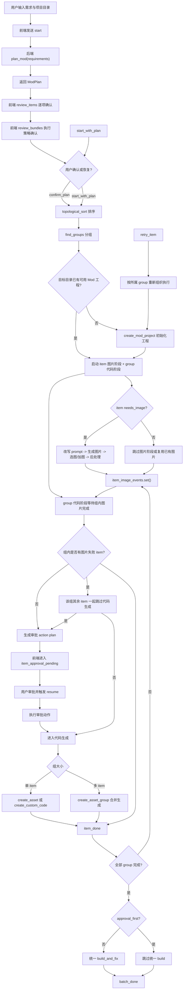

# 2026-04-09 复杂 Mod 生成功能评估与优化建议

本文用于收口当前仓库里“复杂 Mod 生成”能力的实际运作逻辑、现阶段优缺点，以及后续优化优先级。目的不是重写实现计划，而是给后续产品讨论、后端改造和前端播报优化提供一份统一判断依据。

## 0.1 2026-04-09 落地状态补记

- 当前实现已经从单一 `review_plan` 落到双阶段确认流：
  - `review_items`：逐项确认目标、详细描述、范围边界、依赖原因、验收说明等字段。
  - `review_bundles`：查看 `dependency_groups` 与 `execution_bundles` 预览、风险标签与分组理由。
- 前端已支持三档严格程度：
  - `efficient`
  - `balanced`
  - `strict`
- 当前页面在用户编辑 item 或切换严格程度后，会通过轻量 `/api/plan/review` 复核接口重新请求 review 结果，而不是沿用旧结论。
- 后端 `confirm_plan/start_with_plan` 仍保留最终 gate，即使前端状态异常，也不能带着 `needs_user_input / invalid / needs_confirmation / split_recommended` 直接执行。
- 已完成定向验证：
  - `python -m pytest backend/tests/test_batch_approval_mode.py backend/tests/test_planning_module.py backend/tests/test_planner.py -q`
  - `node --test --experimental-strip-types frontend/tests/batchWorkflowState.test.ts frontend/tests/batchRecovery.test.ts frontend/tests/batchPlanReviewFlow.test.ts frontend/tests/batchExecutionBundleReview.test.ts`
  - `npm exec -- tsc --noEmit`（`frontend/`）

## 1. 结论

当前“复杂 Mod 生成”已经不是单次大 prompt 直接生成完整 Mod，而是一个“先规划、再审阅、再按依赖和分组执行、最后统一构建”的批量资产工作流。

它的方向是对的，优点在于：

- 已经具备规划层、依赖层、人工确认层和恢复重试层，明显强于“一把梭”的单轮生成。
- 已经把复杂度从“一个超长 prompt”转成“多个可管理的计划项 + 工作流编排”。

它的主要问题也很明确：

- 规划层已经比较复杂，但执行层的确定性还不够强。
- 工作流编排比以前更像工程系统，但代码生成本身仍偏向大 prompt 驱动。
- 用户能看到很多状态，但还不够清楚“为什么卡在这里、下一步在等什么”。

## 2. 当前实际运作逻辑

### 2.1 用户侧链路

1. 用户输入自然语言需求和项目目录。
2. 前端通过 WebSocket 发起 `start`。
3. 后端调用规划服务生成 `ModPlan`。
4. 前端先进入 `review_items`，逐项确认计划项；通过后再进入 `review_bundles` 确认执行策略。
5. 两层确认都通过后，后端才开始按计划项执行图片和代码工作流。
6. 全部资产完成后，系统统一执行一次构建修复。

### 2.2 后端核心链路

- 规划入口位于 `backend/app/modules/planning/application/services.py` 的 `plan_mod()`。
- 规划结果为 `ModPlan`，内部由多个 `PlanItem` 构成。
- `PlanItem` 当前核心字段包括：
  - `id`
  - `type`
  - `name`
  - `description`
  - `implementation_notes`
  - `needs_image`
  - `image_description`
  - `depends_on`
  - `provided_image_b64`
- 依赖处理分两步：
  - `topological_sort()` 负责保证依赖先后顺序。
  - `find_groups()` 负责把存在依赖关系的 item 聚成执行组。
- 批量执行入口位于 `backend/routers/batch_workflow.py`。

### 2.3 执行阶段拆分

当前执行不是一步到位，而是两段式：

#### 图片阶段

- 每个 item 先独立判断是否需要图片。
- 需要图片时，系统先做 prompt adapting，再生成图片，再等待用户选图或继续加生成，最后做后处理。
- 不需要图片或已经提供图片时，直接跳过或复用现有输入。
- 图片生成允许并发，但并发数受 `image_gen_sem` 控制。

#### 代码阶段

- 代码阶段会等待组内所有图片准备完成后再继续。
- 单 item 组：
  - 有图时走 `create_asset(...)`
  - 纯代码时走 `create_custom_code(...)`
- 多 item 组：
  - 走 `create_asset_group(...)` 一次性合并生成
- 代码阶段当前由 `code_gen_lock` 串行控制。
- 非 `approval_first` 模式下，全部组执行完成后才会统一调用 `build_and_fix(...)`。

### 2.4 当前复杂性的真正来源

当前这套能力的“复杂”主要不在单次代码生成，而在以下几层编排：

- 自然语言需求先转结构化计划
- 计划项之间存在依赖关系
- 依赖项会影响执行顺序和分组
- 图片阶段与代码阶段分离
- 用户可在计划、选图、审批、恢复、重试多个节点介入
- 最后统一构建，而不是逐项构建

### 2.5 复杂 Mod 执行流程

为了避免“只知道有规划和执行，但不知道中间到底怎么串”的理解落差，这里按真实运行顺序把复杂 Mod 的主流程展开。

#### 主流程

1. 用户在批量生成页输入自然语言需求和项目目录。
2. 前端通过 WebSocket 发 `start`，后端进入规划阶段。
3. 后端调用 `plan_mod(requirements)`，让 LLM 先把需求拆成 `ModPlan`。
4. 后端把计划返回前端，前端先切到 `review_items`，允许用户补充 item 字段、切换严格程度，并通过 `/api/plan/review` 重新获取最新 review。
5. item review 通过后，前端进入 `review_bundles` 查看执行策略分组；bundle review 通过后，前端才发送 `confirm_plan`；如果是从中断状态恢复，则发送 `start_with_plan`。
6. 后端对计划项执行 `topological_sort()`，保证依赖项优先。
7. 后端执行 `find_groups()`，把有依赖关系的 item 聚成代码执行组。
8. 如果目标目录还不是一个可用 Mod 工程，后端会先调用 `create_mod_project(...)` 初始化工程骨架。
9. 系统为每个 item 启动图片阶段任务，同时为每个 group 启动代码阶段任务。
10. 图片阶段先独立推进：
    - `needs_image=true` 的 item 会先改写出图 prompt，再生成图片，再等待用户选图或继续加图，最后做后处理。
    - `needs_image=false` 或已提供图片的 item，直接跳过图片生成。
11. 每个 group 的代码阶段会等待组内所有 item 的图片阶段结束。
12. 如果组内存在图片失败 item，该组其余 item 会被一起标记为跳过代码生成。
13. 如果组内没有失败，进入代码生成：
    - 单 item 组：
      - 有图时走 `create_asset(...)`
      - 纯代码时走 `create_custom_code(...)`
    - 多 item 组：
      - 走 `create_asset_group(...)` 合并生成
14. 全部 group 跑完后，如果不是 `approval_first` 模式，系统才会统一执行一次 `build_and_fix(...)`。
15. 最终前端收到 `batch_done`，展示成功数和失败数。

#### 审批分支

当 `execution_mode == "approval_first"` 时，代码阶段不会直接开跑，而是先进入审批分支：

1. 后端为 group 生成审批 action plan。
2. 前端收到 `item_approval_pending`，进入等待审批状态。
3. 用户完成审批后，系统执行审批动作。
4. 用户或前端触发 `resume` 后，该 group 才继续进入真正的代码生成阶段。

#### 重试与恢复分支

当前复杂 Mod 工作流并不是“一次失败就整批作废”，而是支持局部重启：

1. 某个 item 失败后，前端可以发送 `retry_item`。
2. 后端会按该 item 所属 group 重新组织本轮执行。
3. 如果失败 item 需要重新出图，会重新进入图片阶段；否则直接复用现有图片结果。
4. 审批中断的 group 可以通过 `resume` 恢复继续执行。
5. 已有计划也可以通过 `start_with_plan` 直接恢复，不必重新做整轮规划。

#### 为什么这条流程天然更复杂

它比单资产生成复杂，不只是因为 item 变多，而是因为它同时叠加了四层控制：

- 计划控制：先拆计划，再执行
- 依赖控制：有先后顺序和分组关系
- 人工控制：用户可以在计划、选图、审批、恢复节点介入
- 收口控制：最终统一 build，而不是逐项结束即完成

这也是为什么当前能力更准确的定义不是“一个很强的复杂 Mod 生成模型”，而是“一个围绕复杂 Mod 场景搭起来的多 item 编排工作流”。

## 3. 现阶段优点

### 3.1 已经摆脱单轮大 prompt 工作流

当前链路先产出 `ModPlan`，再进入执行，至少具备了中间审查点和结构化编排能力。相比“直接让模型一次性写完整 Mod”，可控性明显更高。

### 3.2 依赖排序和分组方向正确

`topological_sort()` 和 `find_groups()` 虽然简单，但已经把“先后顺序”和“相关项合并处理”这两个核心问题显式化了，避免明显的执行乱序。

### 3.3 人在环能力比较完整

当前支持：

- 审计划
- 选图
- 审批
- 重试
- 恢复

对复杂 Mod 来说，这些节点是必要的安全阀。

### 3.4 统一 build 思路合理

把构建放到最后统一执行，避免了每个 item 单独 build 的重复成本，也减少了无效的重型操作。

## 4. 现阶段缺点

### 4.1 计划质量不稳定

当前计划拆分依赖 LLM 一次性产出 JSON。虽然结构上已经有 `ModPlan` 和 `PlanItem`，但 item 粒度、命名、依赖质量仍然容易波动。

直接后果：

- 同一类需求不同轮次可能拆成完全不同的计划
- 有些 item 过粗，有些 item 过碎
- `depends_on` 合理性不稳定，影响后续执行质量

### 4.2 分组语义还偏粗

当前 `find_groups()` 本质上是“依赖连通分组”，它更像一种图论上的连通组，而不是“最适合合并生成代码的一组”。

直接后果：

- 有依赖关系的 item 会被放进同一组
- 但同组并不一定意味着应该一次性合并写代码
- 一旦组过大，代码生成 prompt 会迅速膨胀

### 4.3 代码生成粒度偏大

当前代码阶段从“组”直接跳到 `create_asset_group(...)` 或 `create_asset(...)`。中间缺少“实现草案”“修改文件清单”“注册点映射”等更细的结构化中间产物。

直接后果：

- 出错时不容易判断是计划错了，还是代码生成跑偏了
- 同一组里多个资产问题容易相互污染
- 回溯和定向修复成本偏高

### 4.4 错误暴露偏晚

当前许多问题要到组级代码生成或最终统一 build 时才暴露，前面缺少足够清晰的局部校验点。

### 4.5 用户感知的“黑箱感”仍然偏强

虽然前端已经有阶段和日志，但用户仍然不容易分辨：

- 当前是在等图片、等审批、等依赖，还是等代码生成
- 当前组内完成了多少
- 这一步到底在处理哪些文件或哪些资产

## 5. 主要矛盾判断

当前涉及的辩证关系：

1. 灵活性 ↔ 稳定性：目前偏向灵活性，偏向程度为明显。
2. 编排能力 ↔ 执行确定性：目前偏向编排能力，偏向程度为明显。
3. 可审阅性 ↔ 操作负担：目前偏向可审阅性，偏向程度为轻微到明显。
4. 吞吐效率 ↔ 一致性控制：目前偏向一致性控制，偏向程度为明显。

当前阶段的主要矛盾：

- 规划和编排层已经扩展得比较丰富，但计划到执行之间缺少足够硬的结构化约束，导致系统“看起来很完整”，实际落地稳定性仍然依赖 prompt 质量。

当前阶段平衡点建议：

- 优先补“计划到执行的确定性”，而不是继续增加更多外层阶段。
- 在保证可审阅性的前提下，降低黑箱感和回溯成本。
- 在不放开危险并发的前提下，先提升局部校验与组策略质量。

## 6. 优化建议

## 6.1 P0：加强计划约束与验收规则

目标：

- 让 `ModPlan` 不只是“结构像 JSON”，而是真正可执行、可检查、可与用户逐项确认的计划。

P0 的核心定位不是“让 planner 更聪明”，而是建立一套进入执行前的计划质量闸门：

- 先由系统把自然语言需求拆成 item
- 再把 item 以“详细确认卡”的形式列给用户确认
- 只有 item 达到可执行状态，才允许进入后续图片和代码执行阶段

### 6.1.1 P0 主流程调整

建议把当前“规划后直接确认执行”的链路，调整为：

1. 用户输入自然语言需求
2. 系统生成 `ModPlan`
3. 前端进入 `item 详细确认页`
4. 系统对每个 item 做计划校验
5. 前端按 item 展示：
   - 详细目标
   - 详细行为说明
   - 边界与依赖
   - 资源需求
   - 当前校验状态
6. 用户逐项执行：
   - `确认无误`
   - `补充说明`
   - `重新生成该项`
7. 只有全部 item 都达到“已明确”状态，才允许确认进入执行

这一步的本质不是简单“看列表”，而是把规划阶段产出的 item 变成一组待确认的执行规格卡。

### 6.1.2 item 详细确认卡

P0 不再把 item 当作“标题 + 简短描述”，而是当作一张需要用户确认的详细规格卡。

所有 item 默认至少展示以下通用字段：

| 字段 | 说明 | P0 要求 |
|---|---|---|
| `id` | 唯一标识 | 必须 |
| `type` | item 类型 | 必须 |
| `name` | item 名称 | 必须 |
| `goal` | 该 item 在整个 Mod 中的目标 | 必须 |
| `detailed_description` | 详细行为说明 | 必须 |
| `implementation_notes` | 实现补充说明 | 建议；部分类型必填 |
| `depends_on` | 依赖的其他 item | 必须展示 |
| `dependency_reason` | 依赖原因 | 有依赖时必须 |
| `needs_image` | 是否需要图片 | 必须 |
| `image_description` | 图像需求说明 | `needs_image=true` 时至少建议填写 |
| `scope_boundary` | 负责什么 / 不负责什么 | 必须 |
| `acceptance_notes` | 用户确认后的执行口径 | 必须 |
| `open_questions` | 当前仍不明确的问题 | 有问题时必须列出 |

其中最关键的是把原先偏笼统的 `description` 拆成三层：

- `goal`
- `detailed_description`
- `scope_boundary`

这样用户确认的不是“名字差不多对”，而是“目标、行为、边界都对”。

### 6.1.3 各类型 item 的详细字段要求

除通用字段外，不同类型 item 还需要补充各自的详细信息。

| 类型 | P0 必须确认的详细字段 | 备注 |
|---|---|---|
| `card` | 费用、类型、稀有度、使用效果、目标、升级效果、联动关系 | 若需要图片，还应补充配图重点 |
| `card_fullscreen` | 全画面用途、绑定对象、视觉重点、资源使用位置 | 不能只写“做一张全图” |
| `relic` | 触发条件、效果、频率限制、生效范围、是否一次性 | 至少要说清“何时触发、做什么” |
| `power` | 获得方式、层数规则、每层效果、触发时机、移除条件 | 不能只写题材或风格 |
| `character` | 核心机制、起始卡组、起始遗物、资源体系、专属内容范围 | 至少要有玩法定位 |
| `custom_code` | 修改目标、涉及模块、预期行为、触发条件、影响范围、不允许改动的部分 | 必须说清“改什么、改到哪、不要改什么” |

### 6.1.4 计划校验分级

P0 建议正式冻结为三档状态，而不是把所有 warning 混在一起：

| 状态 | 含义 | 是否允许进入执行 |
|---|---|---|
| `已明确` | 信息足够，语义清晰，可执行 | 允许 |
| `待补充` | 结构没错，但描述不足以稳定执行 | 不允许 |
| `有错误` | 结构、类型、依赖存在硬错误 | 不允许 |

这里不再把“描述不精确”当作普通 warning，而是直接归到 `待补充`。

原因：

- 这类问题不是“质量一般”，而是“模型会自由发挥太多”
- 如果放行，后续执行偏差会很大
- 这类问题最适合在计划确认页直接和用户补充澄清

### 6.1.5 哪些情况判为待补充

以下情况在 P0 阶段应直接进入 `待补充`，要求用户补充说明后再重新校验：

- `goal` 为空，或只有泛泛表述
- `detailed_description` 太抽象，无法判断具体行为
- 有依赖，但没有 `dependency_reason`
- `needs_image=true`，但没有可理解的 `image_description`
- `custom_code` 没写清修改目标或影响范围
- `card` / `relic` / `power` 只有题材描述，没有机制描述
- `character` 只有概念，没有核心玩法和资源说明

典型模糊描述包括：

- “做一个火焰风格的遗物”
- “加一张联动卡”
- “改一下战斗逻辑”
- “做一个控制型角色”

以上这类 item 不应直接进入执行，而应要求用户补充说明。

### 6.1.6 哪些情况判为有错误

以下情况应直接进入 `有错误`，阻断执行：

- `id` 缺失或重复
- `type` 非法
- `depends_on` 指向不存在的 item
- 自依赖
- 循环依赖
- 计划项为空
- 明显不成立的类型组合或执行前提

### 6.1.7 用户补充说明机制

对于 `待补充` 的 item，系统不应只给一句“请补充描述”，而应给定向补充入口。

建议交互：

- 每个 `待补充` item 自动展开
- 明确显示：
  - 问题标签：`描述不够明确`
  - 原因说明：`当前信息不足以稳定执行`
  - 需要补充的字段
- 用户可以直接在卡片内补充信息
- 补充后立即重新校验

建议按类型给模板化补充提示，而不是纯自由输入。

示例：

- `custom_code`
  - 要修改哪个模块
  - 预期新增或修改什么行为
  - 触发条件是什么
  - 影响哪些对象
  - 哪些部分不要改
- `card`
  - 费用
  - 使用效果
  - 目标
  - 升级效果
  - 是否与其他 item 联动
- `relic`
  - 触发条件
  - 效果
  - 频率限制
  - 生效范围

### 6.1.8 确认页放行规则

P0 阶段建议冻结以下放行规则：

- 只要存在 `待补充` item，禁用“确认进入执行”
- 只要存在 `有错误` item，禁用“确认进入执行”
- 只有全部 item 达到 `已明确` 状态，才允许进入执行

在这个页面中，用户的主要动作应是：

- `确认无误`
- `补充说明`
- `重新生成该项`

P0 的放行门槛建议再叠加一层“严格程度选择权”，让用户可自行调节补充说明的严格度，以缓解确认页过重和补充成本上升的问题。

建议三档固定模式：

| 模式 | `待补充` 判定口径 |
|---|---|
| `高效模式` | 只拦明显模糊、明显不可执行的 item |
| `平衡模式` | 拦会显著影响执行稳定性的模糊 item |
| `严谨模式` | 只要关键字段不完整、依赖原因不清或行为边界不清，就要求补充 |

示例口径：

- `card` 只写了核心效果，没写升级效果
  - `高效模式`：可放行
  - `平衡模式`：提示或视情况 `待补充`
  - `严谨模式`：进入 `待补充`
- `custom_code` 只写“改一下战斗逻辑”，没写改哪里
  - 三档都应进入 `待补充`

### 6.1.9 P0 的范围边界

P0 先做“计划闸门”，不做过度智能化处理。

建议：

- 为不同 `PlanItem.type` 增加规则约束
- 明确哪些类型默认需要图片，哪些类型默认纯代码
- 为 `depends_on` 增加约束校验，减少无意义或错误依赖
- 为计划项增加粒度规则，避免单 item 过大或过碎
- 在计划确认前补一轮本地计划校验
- 增加 item 详细确认页与用户补充说明交互

P0 暂不建议直接做：

- 自动重写整份计划
- 自动拆分复杂 item
- 基于项目扫描做深层语义推断
- 一开始就引入特别细的类型专属规则引擎

预期收益：

- 计划稳定性提高
- 后续执行失败率下降
- 用户审阅计划时更容易看出问题
- 在执行前把语义歧义显式暴露出来
- 降低 planner 和用户之间的理解偏差

### 6.1.10 P0 与 P1 的联动接口

P0 不应只确认“item 是否写得像样”，还要为后续 P1 的执行策略分组提供足够稳定的语义输入。

建议把 P0 和 P1 明确分工为：

- `P0` 负责确认“做什么”
- `P1` 负责确认“怎么一起做”

这意味着在 P0 完成后，不能直接把 `depends_on` 连通关系等同于代码执行分组，而应先把用户确认过的 item 语义、依赖原因和边界信息传递给 P1，再生成真正的执行策略分组。

建议 P0 至少向 P1 传递以下字段：

| 字段 | 对 P1 的作用 | P0 是否建议冻结 |
|---|---|---|
| `id` | 分组和依赖引用键 | 是 |
| `type` | 判断是否适合同组执行 | 是 |
| `name` | 供用户识别和分组预览 | 是 |
| `goal` | 判断是否属于同一功能块 | 是 |
| `detailed_description` | 判断行为是否强耦合 | 是 |
| `implementation_notes` | 判断是否共享改动点 | 是 |
| `depends_on` | 生成顺序依赖图 | 是 |
| `dependency_reason` | 判断依赖是顺序依赖还是强耦合 | 是 |
| `scope_boundary` | 防止把边界不同的 item 误合并 | 是 |
| `needs_image` | 判断资源流和执行路径 | 是 |
| `image_description` | 判断图像资源是否共享上下文 | 建议 |
| `acceptance_notes` | 判断是否应联合验收 | 是 |
| `affected_targets` | 判断是否共享模块、文件、注册点 | 强烈建议 |
| `coupling_kind` | 告诉 P1 依赖关系属于哪种耦合 | 强烈建议 |

其中最关键的新增字段是：

- `affected_targets`
- `coupling_kind`

如果没有这两个字段，P1 很容易只能根据 `depends_on` 做粗糙分组。

### 6.1.11 严格程度选择权

为缓解以下问题：

- 前端确认页过重
- 用户补充说明成本上升
- P1 分组规则过严导致 bundle 过碎

建议把 P0/P1 的判断强度设计成一层显式策略，而不是写死成单一保守规则。

建议提供三档固定模式，而不是自由滑杆：

| 模式 | 目标 | 适用场景 |
|---|---|---|
| `高效模式` | 尽快进入执行 | 用户需求较清楚，接受系统更多主动决策 |
| `平衡模式` | 质量与交互成本折中 | 默认推荐 |
| `严谨模式` | 尽量减少语义偏差 | 复杂 Mod、联动较多、用户不希望执行中返工 |

这不是单纯的前端展示偏好，而是会同时影响：

- P0 的 item 补充说明门槛
- P1 的执行策略分组保守程度
- 最终放行条件

建议默认值固定为：`平衡模式`

原因：

- `高效模式` 容易放过模糊 item
- `严谨模式` 容易让确认链过重
- `平衡模式` 更适合作为首版默认口径收集真实反馈

## 6.2 P1：把“依赖分组”升级为“执行策略分组”

目标：

- 让分组不仅反映依赖关系，还能服务代码生成质量，并且与 P0 确认后的 item 语义保持一致。

P1 的核心不是把“有依赖关系的 item”自动并成一个大组，而是把“依赖排序”和“执行合并”拆成两层。

### 6.2.1 两层概念拆分

建议正式区分：

| 概念 | 作用 | 回答的问题 | 是否需要用户确认 |
|---|---|---|---|
| `dependency group` | 表示先后顺序关系 | 谁先跑，谁后跑 | 需要展示 |
| `execution bundle` | 表示是否作为一个执行单元合并生成 | 哪些 item 一起做 | 必须确认 |

一句话口径：

- `dependency group` 回答“先后关系”
- `execution bundle` 回答“是否一起执行”

### 6.2.2 推荐的 P0/P1 两段确认流

建议把当前 review 流程升级成两段：

1. `P0：Item 语义确认`
   - 用户确认每个 item 的目标、行为、边界、依赖原因
   - 只要存在 `待补充` 或 `有错误` item，就不能进入下一段
2. `P1：执行策略预览与确认`
   - 系统基于 P0 冻结后的字段生成 `dependency group` 和 `execution bundle`
   - 向用户展示哪些 item 只是顺序依赖，哪些 item 会一起执行
   - 用户确认后，才允许进入真正执行阶段

这样做的目的，是避免用户只确认了 item，却没有确认“系统会怎么把它们组合起来执行”。

### 6.2.3 `coupling_kind` 建议取值

为支持更稳定的执行策略分组，建议在 P0 结束后，为 item 或 item 之间关系补充耦合类型：

| `coupling_kind` | 含义 | 默认策略 |
|---|---|---|
| `order_only` | 只是先后顺序依赖 | 分开执行 |
| `shared_logic` | 共享同一段核心逻辑 | 倾向合并 |
| `shared_resource` | 共享图像或资源上下文 | 倾向合并，但应人工确认 |
| `shared_registration` | 共享同一注册点或入口改动 | 倾向合并 |
| `feature_bundle` | 本来就是同一功能块的多个子项 | 合并优先 |
| `unclear` | 目前还判断不清 | 进入待确认分组 |

关键原则：

- `order_only` 不默认合并
- `unclear` 不自动决策，直接进入待确认分组

### 6.2.4 什么时候只形成依赖组

以下情况只说明存在顺序关系，不应自动合并成一个执行单元：

- A 依赖 B，只是因为 B 必须先存在
- A 使用 B 的产物，但不共享核心改动点
- 两个 item 只是逻辑相关，并不共享同一实现上下文
- 两个 item 只是都属于同一角色体系，但没有明确共享实现边界

### 6.2.5 什么时候形成执行策略分组

以下情况更适合合并成同一个 `execution bundle`：

- 多个 item 明确共享同一批代码改动点
- 多个 item 共享同一注册入口
- 多个 item 明确组成同一功能块
- 用户在 `dependency_reason` 或 `implementation_notes` 中明确说明需要联合实现

一句话规则：

- `有依赖` 不等于 `应合并`
- `强耦合` 才更接近 `应合并`

建议：

- 将“依赖排序”和“是否合并生成”拆成两层决策。
- 保留 `dependency group` 用于排序和等待。
- 新增 `execution bundle` 用于判断是否值得一次性合并生成。
- 对组大小、资产类型混合程度、预估 prompt 体量设置阈值。

预期收益：

- 避免不合理的大组合并生成
- 降低 prompt 膨胀
- 提高代码生成可控性

### 6.2.6 `待确认分组` 机制

建议 P1 单独引入一种 bundle 状态：`待确认分组`。

其意义是：

- item 本身已经清楚
- 但“这些 item 是否应该一起执行”还不够清楚

建议以下情况进入 `待确认分组`：

- 组内 item 数量超过阈值
- 组内类型过杂
- 只有 `depends_on`，但没有明确耦合理由
- `coupling_kind=unclear`
- `affected_targets` 过于分散
- 用户补充说明后仍看不出共享实现上下文

建议初版保守阈值：

- `bundle item 数 > 3`：待确认
- `bundle item 数 > 5`：默认不建议合并
- `affected_targets` 涉及 3 个以上明显不同模块：待确认

### 6.2.7 执行策略预览页建议

P1 生成分组后，前端应展示一个执行策略预览，而不是直接进入执行。

每个 bundle 至少展示：

| 展示项 | 说明 |
|---|---|
| `bundle 名称` | 系统生成的执行组名 |
| `包含 item` | 组内 item 列表 |
| `分组理由` | 为什么被放在一起 |
| `依赖关系` | 依赖哪些组或 item |
| `改动范围摘要` | 预计影响哪些模块或资源 |
| `风险标签` | 正常 / 待确认分组 |
| `建议动作` | 接受 / 拆开 / 补充说明后重算 |

P1 第一版不建议直接支持任意拖拽分组，优先采用：

- 系统建议
- 用户确认
- 用户要求拆开
- 用户补充说明后重算

### 6.2.8 P0/P1 联合放行规则

最终进入执行前，建议同时满足两层闸门：

- 所有 item 都是 `已明确`
- 没有 `待补充` item
- 没有 `有错误` item
- 没有 `待确认分组` bundle
- 所有 bundle 都有明确分组理由

这意味着：

- `P0` 过的是 item 语义闸门
- `P1` 过的是执行策略闸门

“严格程度选择权”也应同时作用于 P1，而不是只影响 P0。

建议口径：

| 模式 | P1 分组策略 |
|---|---|
| `高效模式` | 更愿意合并，只要存在较强相关性即可成组 |
| `平衡模式` | 保守合并，优先强耦合场景 |
| `严谨模式` | 宁可拆开，也不轻易大组合并 |

建议初版阈值可按模式分层：

| 模式 | `待确认分组` 参考阈值 |
|---|---|
| `高效模式` | `bundle item 数 > 4` 再进入待确认 |
| `平衡模式` | `bundle item 数 > 3` 进入待确认 |
| `严谨模式` | `bundle item 数 > 2` 即进入待确认 |

补充规则：

- 严格程度一旦在本轮规划会话中切换，应重新执行：
  - item 校验
  - execution bundle 计算
  - 待确认分组判定
- 不建议让用户在执行阶段中途切换严格程度，避免前后口径不一致

### 6.2.9 `coupling_kind` 定义表

为避免后续实现时把 `coupling_kind` 用成一个模糊字段，建议在设计期先冻结最小定义表。

| `coupling_kind` | 定义 | 常见信号 | 默认执行建议 | 是否需要人工确认 |
|---|---|---|---|---|
| `order_only` | 只是执行顺序上的先后依赖，不共享核心实现上下文 | A 先生成，B 才能引用；B 需要 A 的产物或注册结果 | 分开执行，仅保留顺序约束 | 否 |
| `shared_logic` | 多个 item 共享同一段核心逻辑或同一批代码改动点 | 都会改同一类、同一效果分发逻辑、同一算法入口 | 倾向合并 | 视组规模而定 |
| `shared_resource` | 多个 item 共享图像、素材、文案或资源上下文 | 使用同一视觉主题、同一资源集合、同一资源产出链 | 倾向合并，但资源和代码可视情况拆开 | 是 |
| `shared_registration` | 多个 item 共享同一注册点、同一入口或同一初始化流程 | 都要挂到同一注册表、同一初始化方法、同一 patch 点 | 倾向合并 | 视改动范围而定 |
| `feature_bundle` | 多个 item 本质上属于一个不可自然拆开的完整功能块 | 一组卡牌 + 专属 relic + 共同机制本来就是同一玩法包 | 合并优先 | 是 |
| `unclear` | 现有信息不足，无法稳定判断耦合性质 | 只有 `depends_on`，没有 `dependency_reason`；描述太泛 | 不自动决策 | 必须 |

补充口径：

- `order_only` 不得因为“看起来相关”就自动升级成合并执行。
- `shared_logic` 与 `shared_registration` 更偏代码耦合。
- `shared_resource` 更偏资源上下文耦合，不一定等同于必须共享代码生成。
- `feature_bundle` 需要用户在 P0 阶段明确承认“这些 item 属于同一个整体功能块”。
- `unclear` 一律不自动放行，必须转入 `待确认分组`。

### 6.2.10 `待确认分组` 触发条件表

为避免 P1 直接把高风险 bundle 静默放行，建议把 `待确认分组` 的触发条件显式冻结。

| 触发条件 | 风险解释 | 默认动作 |
|---|---|---|
| `bundle item 数 > 3` | 组内上下文开始变重，代码生成 prompt 更容易失控 | 标记 `待确认分组` |
| `bundle item 数 > 5` | 组过大，单次合并生成风险明显升高 | 默认不建议合并，要求拆分或重算 |
| 组内类型过杂 | 说明这些 item 可能不是自然执行单元 | 标记 `待确认分组` |
| 只有 `depends_on`，没有明确耦合理由 | 只能证明顺序关系，不能证明应合并 | 标记 `待确认分组` |
| `coupling_kind=unclear` | 当前语义不足，系统无法稳定判断执行策略 | 标记 `待确认分组` |
| `affected_targets` 涉及 3 个以上明显不同模块 | 改动面过散，说明合并收益存疑 | 标记 `待确认分组` |
| 同组同时包含大型资源生成和复杂纯代码改动，且理由不充分 | 资源链和代码链耦合方式不清 | 标记 `待确认分组` |
| 用户补充说明后仍无法说明“为什么必须一起做” | 说明当前合并依据仍然不足 | 不放行，要求拆开或继续补充 |

建议的用户侧响应动作：

| 分组状态 | 用户可选动作 |
|---|---|
| 正常 | 接受分组 |
| `待确认分组` | 接受分组 / 要求拆开 / 补充说明后重算 |
| 默认不建议合并 | 必须拆开或补充更强耦合理由后重算 |

P1 第一版建议遵守以下保守原则：

- 宁可多拆，不要为了省一次执行而盲目大组合并
- 只要系统说不清“为什么必须一起做”，就不要自动合并
- `待确认分组` 是保护执行稳定性的闸门，不是可忽略提示

## 6.3 P1：在计划与代码生成之间增加结构化中间产物

目标：

- 缩短“计划”到“写代码”之间的语义跳跃。

建议：

- 为每个组先生成一份轻量实现草案。
- 草案至少包含：
  - 预期修改文件
  - 目标类/资源/注册点
  - 每个 item 的责任边界
  - 组内共享符号和依赖说明
- 代码生成阶段优先消费这份草案，而不是直接从自然语言计划跳到最终写代码。

预期收益：

- 排错更容易
- 回溯更清晰
- 后续做局部重试和差异修复更容易

## 6.4 P1：把执行播报改成“原因可见”的状态说明

目标：

- 降低用户等待时的黑箱感。

建议：

- 除了展示阶段名，还要展示“为什么正在等”。
- 建议增加以下播报文案维度：
  - 当前等待原因：选图 / 审批 / 依赖项 / 代码生成 / 构建
  - 当前组进度：例如 `1 / 3 资产已完成`
  - 当前关注对象：当前 item 或当前组名称
  - 关键动作摘要：本轮准备生成或修改哪些内容
- 对批量模式也逐步引入类似单资产“执行播报”的展示心智。

预期收益：

- 用户更容易理解系统状态
- 用户更愿意在中途节点做确认
- 遇到卡点时更容易判断该不该干预

## 6.5 P2：补局部校验，不只依赖最终统一 build

目标：

- 把明显错误更早暴露出来。

建议：

- 组级代码生成后增加轻量校验。
- 优先选择低成本校验：
  - 目标文件是否生成
  - 关键注册点是否落盘
  - 关键资源文件是否存在
  - 关键命名是否一致
- 不默认自动跑重型 build，但应尽量前置显式错误。

## 6.6 P2：建立 item 级失败分类

目标：

- 提高重试和故障定位效率。

建议：

- 对失败类型做最小分类：
  - 规划失败
  - 图片失败
  - 代码失败
  - 构建失败
  - 审批阻塞
- 前端和日志都按同一分类体系展示。

## 6.7 P2：纯代码 item 走更独立的策略

目标：

- 让 `custom_code` 能力不再被资产生成心智绑住。

建议：

- 对纯代码 item 增加项目扫描、改动点定位、目标文件映射等步骤。
- 尽量把纯代码路径做成更接近“代码代理修改”的执行方式，而不是复用图像资产工作流的默认心智。

## 7. 分阶段路线图

### 7.1 最小可落地版本

优先做：

- 计划校验规则
- 执行播报中的等待原因和组进度
- 失败分类

目标：

- 不重写主工作流，先提高可解释性和基础稳定性。

### 7.2 中期版本

优先做：

- 执行策略分组
- 结构化实现草案
- 组级轻量校验

目标：

- 把“计划到执行”的质量做实，降低组级大 prompt 失控风险。

### 7.3 理想版本

优先做：

- 纯代码 item 专门执行链路
- 更细粒度的组内重试
- 更稳定的批量执行播报与回溯体系

目标：

- 让复杂 Mod 生成从“有编排的批量生成器”升级成“可解释、可回溯、可局部修复的复杂任务执行器”。

## 8. 当前建议的主攻方向

如果当前阶段只能选一个主攻目标，建议优先做：

- 在计划与代码生成之间补一层“结构化实现草案”

原因：

- 它同时改善稳定性、可解释性、排错效率和后续进展播报质量。
- 这比单纯继续扩外层阶段更能提升复杂 Mod 生成的真实可用性。
