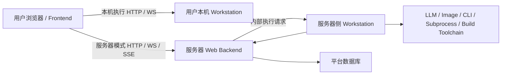
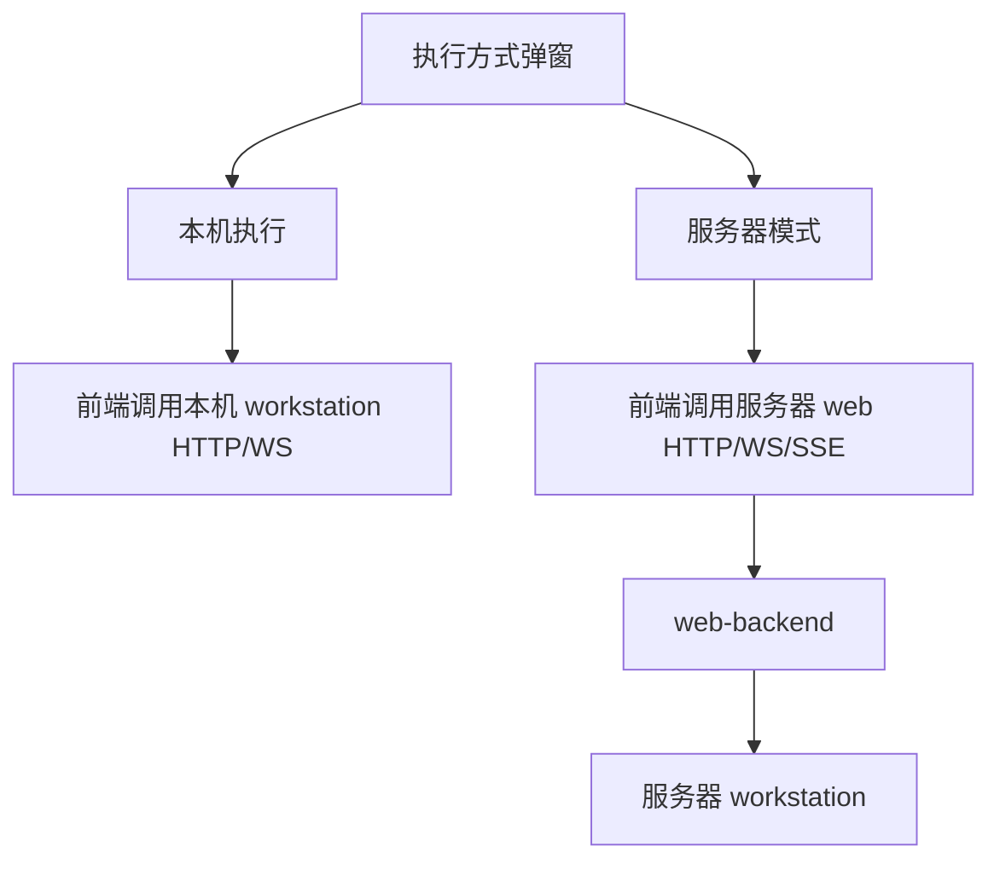
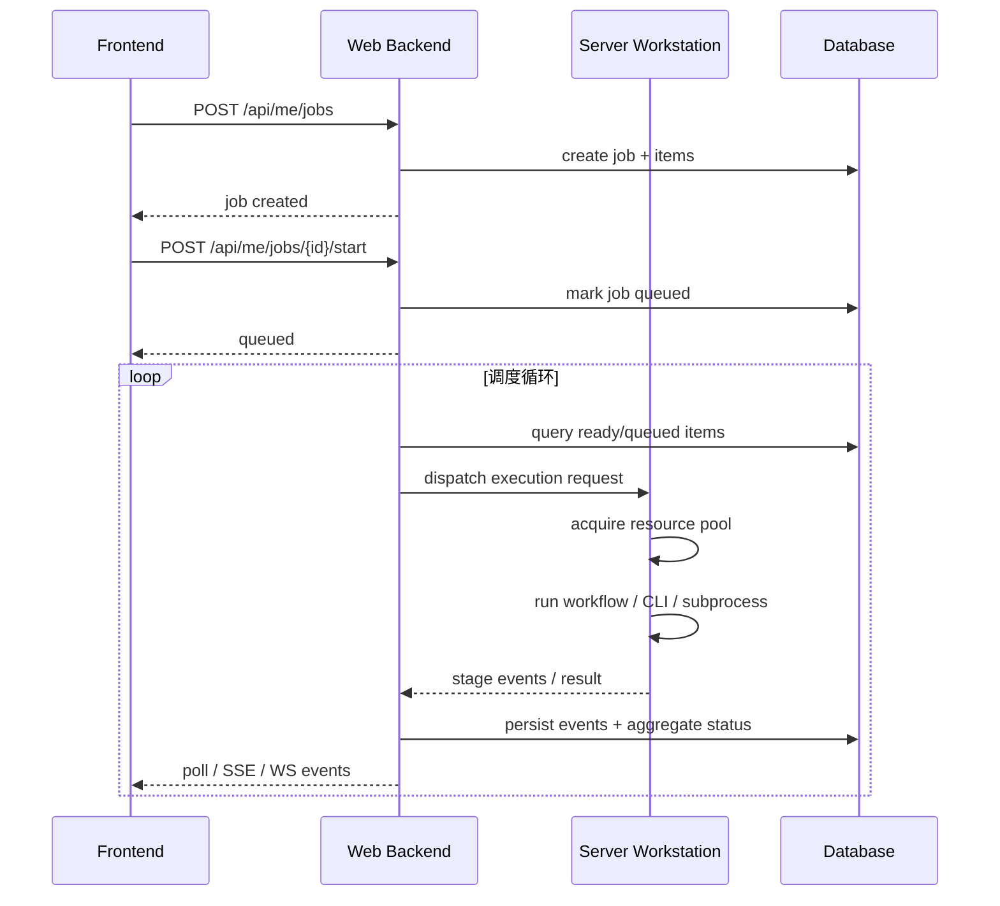

# 2026-04-09 服务器侧独立 Workstation 架构审查与并行执行方案

> 适用范围：本文用于收敛“用户侧 `frontend + workstation`、服务器侧 `web + workstation`”这一运行形态下的架构边界、前端影响、并行执行方案与实施顺序。本文是当前讨论结果的审查稿，不等于最终实现规格；若后续对服务器执行器形态、内部协议或流式传输方式有新结论，需要同步更新本文。

## 一、结论先行

### 1.1 已确认前提

- 用户侧交付形态：`frontend + workstation`
- 服务器侧部署形态：`web + workstation`
- 前端**不能直接连接服务器侧 workstation**
- 本机执行继续走用户本机 `workstation`
- 服务器模式继续只通过 `web-backend` 进入
- `workstation` 代码允许复用，但复用应优先发生在服务器内部，而不是通过新增前端公网地址实现

### 1.2 当前推荐结论

- 服务器侧 `workstation` 推荐保留为**独立进程、独立服务**
- `web-backend` 是服务器模式的**唯一公开入口**
- 前端继续只认识两个公开后端：
  - `workstation`：用户本机
  - `web`：服务器平台
- 服务器侧 `workstation` 只作为 `web-backend` 的**内部执行器**
- 服务器模式的实时状态、事件流、结果查询都应由 `web-backend` 对前端统一输出

### 1.3 为什么现在定这个方向

核心原因不是“多一个进程更高级”，而是以下边界已经被确认：

- 前端不能直连服务器 `workstation`
- 服务器模式必须由 `web-backend` 统一对外
- 现有 `workstation` 执行链仍然有复用价值

在这三个约束同时成立时，最稳的形态就是：

- 前端公开入口保持简单
- 服务器内部保留控制面与执行面的清晰分离

## 二、与 2026-03-27 后端设计详情的关系

本文与 [2026-03-27-后端设计详情.md](/F:/WebCode/AgentForSTS2/docs/03-方案/后端专题/2026-03-27-后端设计详情.md) 的大方向一致，但比那份文档更具体。

### 2.1 一致点

- 产品主形态仍是工作站，Web 是平台控制台
- 平台模式由服务器承接 AI 调用、持久化结果、计费与审计
- BYOK / 本机执行不进入服务器数据库主链
- 本地与服务器共享同一套 Python 核心工作流定义
- 后端长期方向仍是“控制面与执行面分层”，而不是继续把所有职责混在 API 层

### 2.2 本文新增并固化的结论

- “工作站”不再只作为抽象执行端概念存在，而是拆成两个运行实体：
  - 用户本机 `workstation`
  - 服务器侧 `workstation`
- 前端不能直连服务器 `workstation`
- 服务器模式下，服务器 `workstation` 只能作为 `web-backend` 的内部执行器
- 服务器并行执行不由前端触发，而由服务器内部队列与调度器控制

## 三、当前实现现状

### 3.1 前端当前公开地址模型

当前前端在 [frontend/src/shared/api/http.ts](/F:/WebCode/AgentForSTS2/frontend/src/shared/api/http.ts) 中只定义了：

- HTTP 目标：`same-origin | workstation | web`
- WebSocket 目标：`workstation`

这说明当前前端天然只适合识别：

- 一个用户本机 `workstation`
- 一个服务器 `web`

它**不适合**继续暴露“服务器 workstation”第三个公开入口。

### 3.2 当前前端执行模式分流

当前 UI 口径已经是：

- 本机执行：继续走工作站链路
- 服务器模式：先创建平台任务，再确认开始，并进入用户中心

相关实现见：

- [frontend/src/components/ExecutionModeDialog.tsx](/F:/WebCode/AgentForSTS2/frontend/src/components/ExecutionModeDialog.tsx)
- [frontend/src/features/platform-run/createAndStartFlow.ts](/F:/WebCode/AgentForSTS2/frontend/src/features/platform-run/createAndStartFlow.ts)
- [frontend/src/shared/api/me.ts](/F:/WebCode/AgentForSTS2/frontend/src/shared/api/me.ts)

### 3.3 当前后端实现缺口

当前代码已经具备：

- `web-backend` 创建平台任务
- `web-backend` 把任务推进为 `queued`
- 兼容 runner 在部分工作站 WebSocket 路由上可执行平台链路

但当前仍缺：

- `web-backend` 对 queued job 的正式后台消费主链
- `web-backend` 到服务器侧执行器的稳定内部调用链
- 服务器模式统一对前端输出实时事件的正式传输层

因此，当前实现还没有真正达到“服务器模式完整在服务器端执行”的目标状态。

## 四、架构边界

### 4.1 推荐运行拓扑

### 4.2 对前端公开的边界

前端只应公开和消费以下两个地址族：

- `workstation`
  - 用户本机工作站
  - 服务本机执行链路
- `web`
  - 服务器平台入口
  - 服务服务器模式任务创建、启动、取消、查询、事件流

前端不应暴露：

- `serverWorkstation`
- `remoteWorkstation`
- 任何“服务器执行器直连地址”

### 4.3 对服务器内部的边界

#### `web-backend` 负责

- 认证
- 用户中心
- 任务创建、开始、取消
- 计费、返还、审计、状态真源
- 对前端统一输出任务状态和事件流
- 将执行请求转发到服务器 `workstation`

#### 服务器 `workstation` 负责

- 复用现有 workflow / runner / subprocess 执行链
- 负责真正的执行、阶段事件、结果回传
- 不对前端公开
- 不成为平台数据真源

## 五、为什么推荐独立进程、独立服务

### 5.1 与“web 进程内共享模块”的对比

| 维度 | 独立 `workstation` 服务 | `web` 进程内共享模块 |
| --- | --- | --- |
| 前端公开模型 | 不变 | 不变 |
| 运行时边界 | 清晰，控制面/执行面分离 | 容易耦合 |
| 代码复用 | 更容易复用现有服务形态 | 更适合复用纯核心模块 |
| 故障隔离 | 好，执行链故障不直接拖垮 `web` | 差，执行链容易影响 API 进程 |
| 部署复杂度 | 更高 | 更低 |
| 后续扩展到 worker/多节点 | 更顺 | 未来还得再拆一次 |
| 适合当前项目 | 更稳 | 只适合执行链很轻时 |

### 5.2 对运行负载的判断

独立服务会增加一些固定成本：

- 多一个 Python 进程
- 多一份依赖初始化和健康检查
- `web -> workstation` 的内部调用开销

但真正的负载大头并不在这里，而在：

- LLM 调用
- 图像生成
- CLI / subprocess
- 构建 / 打包
- 文件 IO 和结果处理

也就是说：

- 独立服务会增加固定成本
- 但不会显著增加主要执行成本
- 中期并发上来后，独立服务通常比进程内执行更稳

## 六、前端影响与约束

### 6.1 前端保持不变的部分

- 继续保留 `workstation` 和 `web` 两个公开目标
- 本机模式下，前端仍然直接连接用户本机 `workstation`
- 服务器模式下，前端仍然只请求 `web`
- 不需要在 `runtime-config.js` 里新增“服务器 workstation 地址”

### 6.2 前端需要调整的部分

服务器模式如果需要实时状态与流式输出，前端不能继续复用现有“直接连 workstation WS”的方式，而应新增或统一为：

- `web` 侧轮询接口
- 或 `web` 侧 SSE
- 或 `web` 侧 WebSocket

推荐顺序：

1. 第一阶段先用轮询跑通
2. 第二阶段再补 `web` 侧流式传输
3. 无论使用 SSE 还是 WebSocket，前端都只连 `web`

### 6.3 推荐前端分流口径

### 6.4 前端审查重点

- 是否新增第三个公开 backend target
- 是否新增服务器 `workstation` 的运行时配置项
- 服务器模式是否仍然统一从 `web` 进入
- 服务器模式的状态与流是否统一由 `web` 输出

只要这四条守住，前端模型仍然是收敛的。

## 七、服务器侧独立 Workstation 的并行执行方案

### 7.1 基本原则

- 并行不由前端驱动
- 并行不由浏览器控制
- 前端只负责：
  - 创建任务
  - 查看状态
  - 取消任务
- 真正的并行发生在服务器内部：
  - `web` 负责控制面与任务真源
  - `server workstation` 负责执行面与资源调度

### 7.2 推荐的三层模型

#### 控制层：`web-backend`

- 创建 `job`
- 把 `job` 推进为 `queued`
- 记录事件
- 处理取消
- 对前端输出状态和事件流

#### 调度层：任务分发

- 从可执行 `job_item` 中挑选可启动项
- 根据资源、取消状态、配额状态决定是否下发
- 把执行请求发给某个服务器 `workstation`

#### 执行层：服务器 `workstation`

- 执行工作流步骤
- 调用现有 workflow / CLI / subprocess
- 发送阶段事件
- 返回结果摘要和错误摘要

### 7.3 并行粒度

推荐分三层理解：

#### 1. `job` 级并行

- 多个用户任务同时执行

#### 2. `job_item` 级并行

- 一个批量任务中的多个 item 同时执行

#### 3. `step` 级并行

- 单个 item 内部只有部分步骤允许并行

建议：

- 第一阶段先做 `job` / `job_item` 级并行
- `step` 级并行只在明确安全的步骤上开启

### 7.4 为什么不能简单开一个“全局最大并发”

因为不同步骤吃的资源不同：

- 文本生成：外部 LLM 配额 + 少量 CPU
- 图像生成：可能更慢，网络/显存/后处理开销更大
- 构建：CPU + 磁盘 IO
- 部署：文件锁、本地环境依赖、目录冲突

所以推荐在 `server workstation` 内部按资源池限流，而不是只设一个统一并发数。

### 7.5 推荐的资源池模型

第一阶段建议：

- `codegen_pool = 2`
- `image_pool = 2`
- `build_pool = 1`
- `deploy_pool = 1`

这不是最终规格，而是第一版建议的保守起点。

### 7.6 推荐执行流程

### 7.7 单节点第一版的建议做法

如果第一版服务器上只有一个 `workstation`，建议这样：

- `web` 是唯一任务真源
- `server workstation` 是单节点执行器
- 执行器内部维护多个 semaphore / queue
- 各资源池分别限流
- `web` 不直接执行 workflow，只做控制与持久化

这版已经足够验证架构。

### 7.8 多节点扩展方式

当单节点不够时，再扩成多 `server workstation` 节点：

- `web` 仍然是唯一控制面
- 多节点 `workstation` 向 `web` 注册或被 `web` 配置化感知
- `web` 按简单策略分发：
  - 轮询
  - 当前负载最小
  - 按任务类型分配

多节点时，并行就变成两层：

- `web` 在节点之间分发
- 每个节点在本地资源池内并发执行

### 7.9 取消与失败处理

#### 取消

- 用户取消只打到 `web`
- `web` 是取消真源
- `server workstation` 在新步骤开始前检查取消状态
- 未启动项不再启动
- 已启动步骤尽量在可中断点停下，或跑完当前步骤后停止

#### 失败

- `server workstation` 负责上报失败类型和错误摘要
- `web` 负责：
  - 落库
  - 推进聚合状态
  - 决定返还
  - 向前端暴露最终状态

## 八、实施顺序建议

### 第一阶段：边界收口

- 明确前端服务器模式只走 `web`
- 不再讨论前端直连服务器 `workstation`
- 明确服务器侧 `workstation` 是内部执行器

### 第二阶段：最小执行闭环

- `web` 完成任务创建 / 开始 / 取消 / 查询
- 单个服务器 `workstation` 完成内部执行
- `web -> workstation` 建立最小内部调用协议
- 前端先用轮询读平台状态

### 第三阶段：并行与流式增强

- 给 `server workstation` 加资源池并发
- `web` 增加统一事件流输出
- 按需要补 SSE 或 WebSocket

### 第四阶段：多节点和更强调度

- 多 `server workstation` 节点
- 节点负载感知
- 更细的调度、重试、熔断与隔离

## 九、当前开放问题

以下问题仍待进一步设计冻结：

1. `web -> workstation` 使用内部 HTTP、内部 WebSocket 还是队列
2. 服务器模式第一版对前端采用轮询、SSE 还是 WebSocket
3. `server workstation` 是否需要独立健康检查与注册机制
4. 哪些现有 `workstation` 能力直接复用，哪些应继续下沉到 shared/service
5. 构建、部署、文件系统强依赖步骤是否允许进入服务器模式第一版

## 十、当前建议的最终口径

- 用户手上的正式交付：`frontend + workstation`
- 服务器上的正式部署：`web + workstation`
- 前端公开只连：
  - 用户本机 `workstation`
  - 服务器 `web`
- 服务器 `workstation` 仅作为 `web` 的内部执行器
- 服务器模式执行入口、状态、历史、计费、事件都由 `web` 对外统一输出
- 并行由服务器内部调度器控制，不由前端直接控制

这套口径的核心价值在于：

- 前端模型保持简单
- `workstation` 代码能够继续复用
- 服务器模式职责不再漂移
- 后续扩展到 worker/多节点时路径清晰
