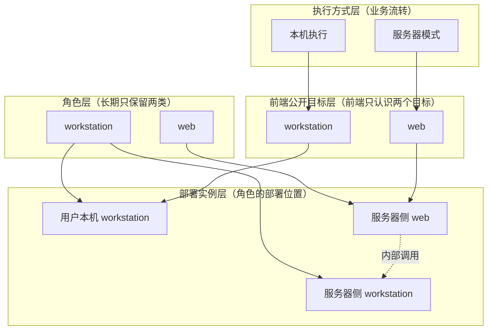
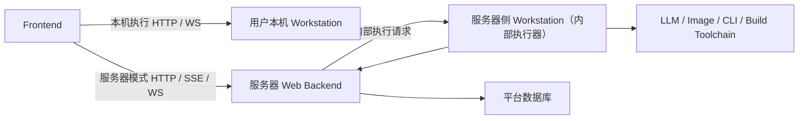

# 2026-04-10 后端双角色与服务器内部执行器边界收口方案

## 1. 目的

本文不是对当前代码现状的描述，而是对后端边界的**收口方案**。

目标是把当前容易混淆的几个概念彻底拆开：

- 后端角色
- 部署实例
- 前端公开目标
- 执行方式

核心收口结论只有一句话：

**后端长期只保留两个角色：`workstation` 与 `web`。服务器侧 `workstation` 只是内部执行器实例，不是第三个公开后端角色。**

---

## 2. 收口结论

### 2.1 后端角色

长期只保留两个后端角色：

- `workstation`
- `web`

这里的“角色”指的是职责类型，而不是部署位置。

### 2.2 部署实例

同一个角色可以有不同部署实例：

- 用户本机 `workstation`
- 服务器侧 `workstation`
- 服务器侧 `web`

这些是**实例**，不是新的角色。

### 2.3 前端公开目标

前端长期只认识两个公开目标：

- `workstation`
- `web`

前端不应新增：

- `serverWorkstation`
- `remoteWorkstation`
- 任何“服务器执行器直连地址”

### 2.4 执行方式

执行方式是业务流转，不是后端角色：

- 本机执行
- 服务器模式

它们与“后端有几个角色”是两个不同维度。

---

## 3. Mermaid 边界图

### 3.1 四层边界图

这张图表达的是：

- `workstation` 是一个角色，可以部署在用户本机，也可以部署在服务器内部。
- `web` 是另一个角色，对外承接服务器模式的统一入口。
- 前端只感知 `workstation` 和 `web` 两个公开目标。
- 服务器上的 `workstation` 只被 `web` 内部调用，不直接暴露给前端。

### 3.2 运行拓扑图

这张图强调的是：

- 前端在本机执行时，只连接用户自己的 `workstation`
- 前端在服务器模式时，只连接 `web`
- `web` 再调用服务器内部的 `workstation`
- 服务器内部 `workstation` 是执行器，不是新的对外服务入口

---

## 4. 各层职责说明

## 4.1 `workstation` 的职责

`workstation` 负责执行和工作台相关能力：

- 本地工作流执行
- 配置
- 知识库检查与刷新
- 审批链
- 构建与部署
- 本地日志分析
- Mod 分析
- 工作流阶段事件与执行结果产出

服务器侧 `workstation` 复用的是同一类执行能力，只是部署位置不同。

它的本质仍然是：

- 工作流执行器
- 本地/内部环境操作器
- subprocess / CLI / toolchain 调用器

而不是平台公开控制面。

## 4.2 `web` 的职责

`web` 负责平台控制面和对外统一出口：

- 认证
- 用户中心
- 任务创建、开始、取消
- 历史记录
- 配额、返还、计费
- 审计
- 对前端统一输出服务器模式任务状态与事件流
- 对服务器内部 `workstation` 发起执行请求

`web` 是服务器模式下的唯一公开入口和真源。

---

## 5. 为什么不把服务器侧 workstation 视为第三个角色

如果把服务器侧 `workstation` 当成第三个角色，会立即带来三类问题：

### 5.1 前端模型变复杂

前端将不得不判断：

- 连本机 `workstation`
- 连服务器 `web`
- 还是连服务器 `workstation`

这样会让前端从“双目标模型”退化成“三目标模型”，复杂度明显上升。

### 5.2 角色与部署位置混淆

“角色”表达的是职责类型；
“部署位置”表达的是它运行在哪里。

服务器侧 `workstation` 只是 `workstation` 角色在服务器上的部署实例，不应该被提升成新的架构角色。

### 5.3 平台控制面与执行面边界会重新变糊

如果服务器侧 `workstation` 被视为公开后端，就会诱导前端直接连接执行器，最终导致：

- 控制面真源不清
- 状态真源不清
- 事件流出口不统一
- 取消与审计边界漂移

---

## 6. 收口后的判断规则

以后凡是讨论某个能力应该归哪边时，先按下面顺序判断。

### 6.1 先判断是不是新角色

只有两种合法答案：

- 属于 `workstation`
- 属于 `web`

如果讨论里出现“第三种 backend”，默认先判定为边界表达有问题。

### 6.2 再判断是不是部署实例差异

如果只是：

- 用户本机运行
- 服务器内部运行

这属于部署实例差异，不属于角色新增。

### 6.3 再判断前端是否应该知道它

如果某个能力只被 `web` 内部调用，前端就不应该知道它的存在，更不应该直接配置它的地址。

### 6.4 最后判断它属于哪种执行方式

如果是：

- 用户自己的工作站链路 -> 本机执行
- 平台任务链路 -> 服务器模式

这是执行方式，不是角色扩张。

---

## 7. 建议的正式口径

后续文档、代码、测试和讨论中，建议统一使用下面这套表述：

### 7.1 正式表述

- 后端长期只有两个角色：`workstation` 与 `web`
- 前端长期只认识两个公开目标：`workstation` 与 `web`
- 服务器侧 `workstation` 是 `web` 的内部执行器实例
- 服务器模式下，对前端公开的唯一入口是 `web`
- 本机执行与服务器模式是业务执行方式，不是后端角色

### 7.2 不建议继续使用的表述

- “服务器 workstation 是第三个 backend”
- “远程 workstation 是一个单独角色”
- “服务器模式等于新增一种后端角色”
- “前端未来可以直接连服务器 workstation”

---

## 8. 对后续代码收口的直接影响

如果采用这套方案，后续代码收口应满足：

1. 删除把 `full` 当长期角色的表达
2. 不再把服务器侧 `workstation` 暴露成前端公开目标
3. `web` 成为服务器模式唯一对外入口
4. `workstation` 只表达执行与工作站能力，不再混入平台公开控制面职责
5. 前端只基于 `workstation` / `web` 两个目标做能力分流

---

## 9. 最终方案口径

本方案最终建议冻结为：

- 后端角色只有两个：`workstation`、`web`
- 服务器侧 `workstation` 是内部执行器实例，不是第三个角色
- 前端公开只连接：
  - 用户本机 `workstation`
  - 服务器 `web`
- 服务器模式统一由 `web` 承接任务入口、状态、事件、历史与计费
- 服务器内部执行由 `web -> server workstation` 调度完成

这套口径的价值在于：

- 前端模型保持简单
- 后端角色边界稳定
- 服务器内部仍可复用 `workstation` 执行链
- 后续扩展到多节点执行器时，不需要改动前端公开模型
