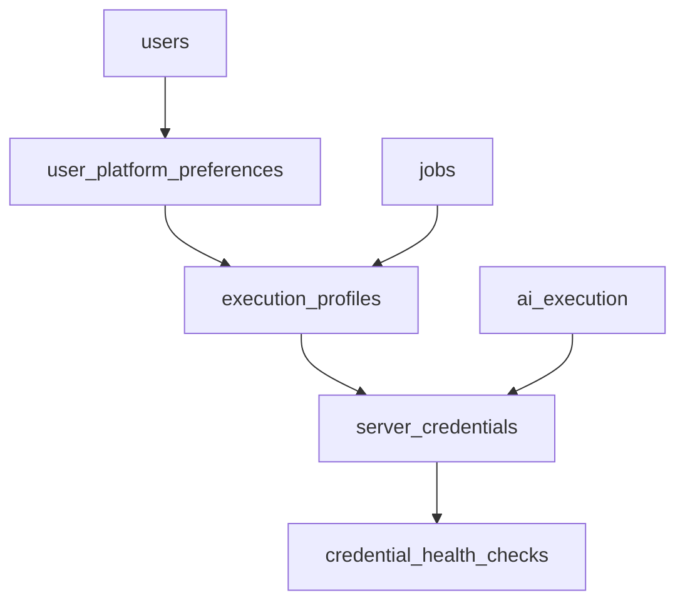

# 2026-04-14 服务器模式 CLI 模型选择与凭据池表结构冻结稿

## 0. 文档定位

- 本文是 `服务器模式 CLI / 模型选择与凭据池` 专题的第二份冻结产出。
- 本文只冻结第一版数据表、字段、关系和索引方向，不直接等同于 migration SQL 或 ORM 代码。
- 本文默认受以下文档约束：
  - [`未开始-2026-04-14-服务器模式CLI模型选择与凭据池实施计划.md`](./未开始-2026-04-14-服务器模式CLI模型选择与凭据池实施计划.md)
  - [`未开始-2026-04-14-服务器模式CLI模型选择与凭据池接口冻结稿.md`](./未开始-2026-04-14-服务器模式CLI模型选择与凭据池接口冻结稿.md)
  - [`2026-04-13-服务器模式CLI模型选择与凭据池草案.md`](./2026-04-13-服务器模式CLI模型选择与凭据池草案.md)

## 1. 冻结目标

本文只解决 4 件事：

1. 冻结 `execution_profiles`
2. 冻结 `server_credentials`
3. 冻结 `credential_health_checks`
4. 冻结 `user_platform_preferences`

同时补充：

- `job` 与 `ai_execution` 的服务器模式快照字段落点
- 表之间的最小外键关系
- 第一版必须具备的唯一约束、索引和安全边界

本文不解决：

- 具体 migration 文件命名
- ORM 模型类实现
- 加密存储代码
- 管理员鉴权与 service 代码

## 2. 全局建模原则

### 2.1 用户可见组合与后台真实凭据分层

- `execution_profiles` 只表达用户可见的 `CLI + 模型` 组合
- `server_credentials` 只表达后台真实凭据
- `credential_health_checks` 只表达检测历史
- `user_platform_preferences` 只表达用户偏好

第一版禁止把这些职责混在一张表里。

### 2.2 用户默认值不进入认证主表

用户默认服务器配置继续冻结为独立偏好表，不塞进认证用户主表。

### 2.3 任务快照优先落在 `job`

第一版继续冻结：

- `job` 记录用户选择快照
- `ai_execution` 记录实际命中事实
- `job_item` 不额外落 `execution_profile_id`

## 3. 表结构冻结

## 3.1 `execution_profiles`

### 用途

- 表达普通用户可见的服务器侧能力组合
- 对外语义是 `CLI + 模型`

### 第一版字段冻结

- `id`
- `code`
- `display_name`
- `agent_backend`
- `model`
- `description`
- `enabled`
- `recommended`
- `sort_order`
- `created_at`
- `updated_at`

### 字段说明

- `code`
  - 稳定内部标识，用于日志、配置和迁移
- `display_name`
  - 前端直接展示的组合名
- `agent_backend`
  - 当前先冻结为 CLI 类型，不表达 provider
- `model`
  - 对用户暴露的模型名
- `enabled`
  - 是否可进入普通用户列表
- `recommended`
  - 是否推荐
- `sort_order`
  - 前端排序辅助字段

### 第一版约束冻结

- 主键：`id`
- 唯一约束：`code`
- 索引建议：
  - `enabled`
  - `(recommended desc, sort_order asc, id asc)` 对应的排序索引可按数据库能力实现

### 明确不进此表的字段

- provider
- base_url
- 任何凭据密文
- 健康状态
- 用户默认值

## 3.2 `server_credentials`

### 用途

- 表达后台真实服务器凭据
- 支撑同组合内多凭据池与优先级切换

### 第一版字段冻结

- `id`
- `execution_profile_id`
- `provider`
- `auth_type`
- `credential_ciphertext`
- `secret_ciphertext`
- `base_url`
- `label`
- `priority`
- `enabled`
- `health_status`
- `last_checked_at`
- `last_error_code`
- `last_error_message`
- `created_at`
- `updated_at`

### 字段说明

- `execution_profile_id`
  - 外键指向 `execution_profiles.id`
- `credential_ciphertext`
  - 主凭据密文
- `secret_ciphertext`
  - 辅助密文；如不需要可为空
- `label`
  - 管理员可读备注
- `priority`
  - 同组合内调度优先级
- `enabled`
  - 是否进入可调度集合
- `health_status`
  - 当前健康状态摘要，不等于完整历史

### 第一版约束冻结

- 主键：`id`
- 外键：`execution_profile_id -> execution_profiles.id`
- 非空：
  - `execution_profile_id`
  - `provider`
  - `auth_type`
  - `credential_ciphertext`
  - `priority`
  - `enabled`
  - `health_status`
- 索引建议：
  - `execution_profile_id`
  - `(execution_profile_id, enabled, priority)`
  - `(execution_profile_id, health_status, enabled)`

### 安全边界冻结

- 表中只保存密文，不保存明文 key
- 原始 key 只允许在创建 / 更新请求时短暂出现
- 查询接口不返回 `credential_ciphertext / secret_ciphertext`

## 3.3 `credential_health_checks`

### 用途

- 记录单次主动检测或被动检测结果
- 为熔断、恢复和审计提供历史事实

### 第一版字段冻结

- `id`
- `server_credential_id`
- `trigger_source`
- `status`
- `error_code`
- `error_message`
- `latency_ms`
- `checked_at`

### 字段说明

- `server_credential_id`
  - 外键指向 `server_credentials.id`
- `trigger_source`
  - 第一版建议至少支持：
    - `manual`
    - `runtime_failure`
- `status`
  - 本次检测结果
- `error_code`
  - 机器可读错误分类
- `error_message`
  - 人类可读摘要
- `latency_ms`
  - 可选，允许为空

### 第一版约束冻结

- 主键：`id`
- 外键：`server_credential_id -> server_credentials.id`
- 索引建议：
  - `server_credential_id`
  - `(server_credential_id, checked_at desc)`
  - `(status, checked_at desc)`

### 明确边界

- 这张表记录历史，不承担当前调度真源
- 当前调度真源仍以 `server_credentials.health_status` 为准

## 3.4 `user_platform_preferences`

### 用途

- 保存用户在平台服务器模式下的默认偏好

### 第一版字段冻结

- `user_id`
- `default_execution_profile_id`
- `updated_at`

### 字段说明

- `user_id`
  - 外键指向用户主表
- `default_execution_profile_id`
  - 可为空，表示未设置默认值

### 第一版约束冻结

- 主键建议：`user_id`
- 外键：
  - `user_id -> users.id`
  - `default_execution_profile_id -> execution_profiles.id`，允许为空
- 索引建议：
  - `default_execution_profile_id`

### 明确边界

- 只存默认值，不存历史
- 不承担运行时实际命中记录

## 4. 任务快照字段冻结

## 4.1 `job`

第一版新增字段冻结为：

- `selected_execution_profile_id`
- `selected_agent_backend`
- `selected_model`

用途：

- 记录用户创建任务时选择了哪个服务器配置组合

## 4.2 `ai_execution`

第一版新增字段冻结为：

- `provider`
- `model`
- `credential_ref`
- `retry_attempt`
- `switched_credential`

用途：

- 记录单次执行实际命中了哪一把凭据
- 记录是否发生同组合内自动切换

## 4.3 当前不进入 `job_item` 的字段

- `execution_profile_id`

原因：

- 第一版用户不是按 item 选择服务器配置
- 过早落到 `job_item` 会引入不必要复杂度

## 5. 枚举冻结建议

本文先冻结需要后续统一实现的最小枚举集合。

### 5.1 `execution_profiles.agent_backend`

- `codex`
- `claude`

### 5.2 `server_credentials.auth_type`

- `api_key`
- `ak_sk`

### 5.3 `server_credentials.health_status`

- `healthy`
- `degraded`
- `rate_limited`
- `auth_failed`
- `quota_exhausted`
- `disabled`

### 5.4 `credential_health_checks.trigger_source`

- `manual`
- `runtime_failure`

## 6. 最小关系图

## 7. 当前不冻结的内容

为避免过早细化，以下内容暂不在本文冻结：

- 精确 SQL 类型
- ORM 字段声明写法
- 具体 migration 文件拆分方式
- `credential_ref` 的具体编码方案
- 是否增加软删除字段
- 是否增加成本统计字段

## 8. 本稿验收标准

当以下条件满足时，可认为“表结构冻结稿”完成：

- 4 张新表的字段集合固定
- 核心外键关系固定
- 关键唯一约束和索引方向固定
- `job` 与 `ai_execution` 的快照字段落点固定
- 后续实现人员不需要再回到草案对表字段做二次裁决

## 9. 当前建议

本稿完成后，下一步应进入：

1. `管理员权限边界冻结稿`
2. 再决定是否开始 migration 与接口实现

在管理员权限边界未冻结前，不建议直接进入管理员凭据写接口实现。
