# 2026-04-21 知识库代码优先与跨游戏 Prompt 组装改造方案

## 2026-04-22 当前状态说明

- 本文已从“未开始”升级为“进行中”。
- 截至 2026-04-22，当前主链已经完成四个连续阶段：
  - 第一阶段：结构化知识链路接入
  - 第二阶段：`codegen` 模板变量切换到 `facts / guidance / lookup / knowledge_warnings`
  - 第三阶段：`planning` 接入结构化知识链路，并保持 `guidance 主导 + facts 校准`
  - 第四阶段：清理 `codegen / planning` 主链兼容变量
- 已落地内容：
  - 共享知识模型：`backend/app/shared/contracts/knowledge.py`
  - Prompt 上下文组装器：`backend/app/shared/prompting/prompt_context_assembler.py`
  - STS2 provider / resolver：`backend/app/modules/knowledge/infra/sts2_code_facts_provider.py`、`sts2_guidance_provider.py`、`sts2_lookup_provider.py`、`sts2_knowledge_resolver.py`
  - `PromptAssembler` 新旧链路兼容：保留 `knowledge_source` / `lookup_provider` fallback，同时主模板统一只消费 `facts`、`guidance`、`lookup`、`knowledge_warnings`
  - `codegen/api.py` 已装配 `Sts2KnowledgeResolver` 与 `PromptContextAssembler`
- `PlanningService` 已接入 `Sts2KnowledgeResolver` 与 `PromptContextAssembler`，并新增 planner fallback：
  - resolver 可用时，planner prompt 按 `Planner Guidance -> Code Facts Check -> Further Lookup` 组织
  - resolver 不可用时，继续回退到本地 guidance 摘要资源，同时向结构化变量填充兼容内容
- `backend/app/modules/planning/api.py` 已装配新的 resolver，fallback 统一走 `Sts2GuidanceKnowledgeSource`
- `backend/app/shared/resources/prompts/codegen.md` 的 `asset_prompt`、`custom_code_prompt`、`asset_group_prompt` 已切到结构化知识骨架，显式声明 `Code Facts > Rules And Guidance > Further Lookup`
- 为避免模板切换后旧路径变空，`PromptAssembler` 在无 resolver 或 resolver 未返回有效知识时，会启用 legacy fallback，向新变量填充：
  - `facts`：显式声明当前处于 legacy fallback，要求生成前核对代码事实
  - `guidance`：承接旧 `knowledge_source` 文本
  - `lookup`：承接旧 `api_lookup`
  - `knowledge_warnings`：显式告知这是 fallback 模式
- `backend/app/shared/resources/prompts/runtime_agent.md` 的 `planning_planner_prompt` 已切到“摘要主导、事实校准”的结构化骨架
- `PromptAssembler` 与 `PlanningService` 已不再向主模板传递以下兼容变量：
  - `docs`
  - `api_lookup`
  - `combined_docs`
  - `api_hints`
- 当前主链模板只依赖：
  - `facts`
  - `guidance`
  - `lookup`
  - `knowledge_warnings`
- 服务器单资产文本方案链路 `platform_single_asset_server_user` 现已同步切到结构化知识变量：
  - `backend/app/modules/platform/runner/single_asset_plan_handler.py` 不再调用 `get_docs_for_type`
  - 改为使用 `Sts2KnowledgeResolver + PromptContextAssembler`
  - prompt 不再传 `docs`，统一改为 `facts / guidance / lookup / knowledge_warnings`
- 摘要资源接口命名已同步去除旧 `docs / hints` 语义：
  - `agents/sts2_guidance.py`
    - 对外统一暴露 `get_guidance_for_asset_type`、`get_planner_guidance`、`get_full_guidance_bundle`
  - `backend/app/modules/knowledge/infra/sts2_guidance_source.py`
    - 统一使用 `Sts2GuidanceKnowledgeSource`
  - `codegen/planning` 的 fallback 装配已全部切到新命名
- lookup 辅助命名链已统一收口：
  - `knowledge_facade`、`codegen/api.py`、`codegen.md` bundle key 与 `PromptAssembler` 构造参数现统一使用 `lookup` 语义
- 截至当前，这一专题下“历史命名清理”已完成：
  - 主链 prompt 变量
  - 非主链单资产服务器文本方案变量
  - 摘要资源接口命名
  - lookup helper / bundle key / facade 命名
- 已完成的定向验证：
  - `python -m pytest backend/tests/test_prompt_context_assembler.py backend/tests/test_sts2_code_facts_provider.py backend/tests/test_knowledge_resolver.py backend/tests/test_codegen_module.py backend/tests/test_code_agent_lookup.py backend/tests/test_planning_module.py -q`
  - 结果：`60 passed in 1.42s`
  - `python -m pytest backend/tests/test_codegen_module.py backend/tests/test_code_agent_lookup.py backend/tests/test_planning_module.py -q`
  - 结果：`44 passed in 0.60s`
  - `python -m pytest backend/tests/test_planning_module.py backend/tests/test_planner.py -q`
  - 结果：`34 passed in 0.19s`
  - `python -m pytest backend/tests/test_codegen_module.py backend/tests/test_planning_module.py backend/tests/test_planner.py -q`
  - 结果：`54 passed in 0.79s`
  - `python -m pytest backend/tests/platform/runner/test_single_asset_plan_handler.py -q`
  - 结果：`7 passed in 0.19s`
  - `python -m pytest backend/tests/test_sts2_guidance.py backend/tests/test_sts2_guidance_source.py -q`
  - 结果：`27 passed in 0.51s`
  - `python -m pytest backend/tests/test_code_agent_lookup.py backend/tests/test_planner.py -q`
  - 结果：`16 passed in 0.22s`
  - `python -m pytest backend/tests/test_knowledge_facade.py backend/tests/test_code_agent_lookup.py backend/tests/test_codegen_module.py backend/tests/test_sts2_guidance.py backend/tests/test_sts2_guidance_source.py backend/tests/test_planning_module.py backend/tests/test_planner.py backend/tests/platform/runner/test_single_asset_plan_handler.py -q`
  - 结果：`97 passed in 0.83s`
- 当前仍待后续阶段处理：
  - 面向多游戏领域的进一步抽象与接入
  - 将当前 STS2 专用装配点收口为“领域适配器 + 最小 registry”的标准版接法

## 0. 背景与结论

- 当前知识库主线已经完成“运行时唯一真源”收口，`runtime/knowledge/` 已是运行时唯一有效知识目录。
- 但 `planning` 与 `codegen` 现状仍然是“文档摘要主注入，反编译代码辅助查阅”：
  - `backend/agents/sts2_guidance.py` 会把 `common.md`、`card.md`、`power.md`、`planner_guidance.md` 等文本直接注入 Prompt。
  - `backend/app/modules/codegen/api.py` 暴露的 `api_lookup` 主要还是提示 Agent 去读运行时知识目录，而不是先把代码事实组织为 Prompt 主体。
- 这意味着只更新反编译代码并不能自动解决生成阶段仍吃旧文档的问题。
- 因此后续阶段不应再把“文档摘要”视为生成代码时的主事实源，而应收口为：
  - 代码事实优先
  - 文档摘要辅助
  - Prompt 拼装能力独立模块化
  - 后续可扩展到不止一个游戏或 Mod 域
- 截至本轮讨论，跨游戏抽象方向已进一步收口为：
  - 不做“跨游戏超级 PromptAssembler”
  - 采用“通用 Prompt 管线 + 领域适配器 + 最小 registry”的标准版
  - 只抽协议与装配边界，不抽模板正文、资产类型、构建命令和领域术语

## 1. 当前问题

### 1.1 事实源与摘要层混在一起

- `KnowledgeSource` 当前只暴露 `load_context(context_type, asset_type)`，返回值是单个字符串。
- 该接口无法区分：
  - 代码事实
  - 经验规则
  - 路径提示
  - 冲突告警
- 结果是 `PromptAssembler` 只能把一整段文本当成 `docs` 注入，丢失知识分层。

### 1.2 代码知识没有进入主 Prompt 结构

- 当前 `codegen` 模板里，`docs` 直接进入正文。
- `api_lookup` 虽然会注入 `runtime/knowledge/game/` 与 `runtime/knowledge/baselib/` 路径，但仍是“需要时继续查看”的附带说明。
- 这会让模型先接受文档设定，再去局部修正 API 细节。

### 1.3 文档天然滞后于代码

- `backend/app/modules/knowledge/resources/sts2/*.md` 是人工维护的摘要层。
- STS2 / BaseLib 代码变化后，文档更新通常滞后于反编译结果更新。
- 因此文档适合作为“解释与约束”，不适合作为“实时事实真源”。

### 1.4 现有实现难以扩展到多游戏

- `Sts2DocsKnowledgeSource` 的命名与职责都直接绑定 STS2 文档。
- `PromptAssembler` 同时知道 STS2 的文档结构、lookup 说明和模板变量结构。
- 如果未来接入第二个游戏，这种耦合会迅速演化为大量 `if game == ...` 分支。

## 2. 目标

本阶段的目标不是重做知识库真源收口，而是把消费链路升级为：

1. `runtime/knowledge/` 继续作为运行时唯一知识真源
2. 生成链路默认先消费代码事实，再消费文档摘要
3. 文档层退化为规则摘要层、经验层、提示层
4. Prompt 组装流程模块化，支持未来新增其它游戏领域

## 3. 设计原则

### 3.1 优先级原则

- `代码事实 > 文档摘要 > 进一步查阅提示`
- 若代码事实与文档摘要冲突，以代码事实为准
- 文档只能补充：
  - 经验规则
  - 常见坑
  - 推荐模式
  - 术语解释

### 3.2 分层原则

- 事实层：来自 `runtime/knowledge/game/` 与 `runtime/knowledge/baselib/`
- 摘要层：来自 `runtime/knowledge/resources/<domain>/`
- 组装层：负责把不同层次的知识按优先级拼装进 Prompt
- 模板层：只负责表达场景，不负责决定事实优先级

### 3.3 可扩展原则

- 通用层不出现 `card / relic / power / STS2` 这类具体业务词
- 游戏或领域差异放到领域适配层
- 模板允许按领域区分，不强制统一成一套通用 Prompt 文案

### 3.4 抽象边界原则

- 后续跨游戏抽象的重点是统一：
  - 知识查询协议
  - 知识解析入口
  - fallback 流程
  - Prompt 上下文装配流程
  - 领域注册方式
- 明确不进入通用层的内容：
  - 各游戏的 `asset_type` 枚举
  - 构建 / 部署 / 注册说明
  - 模板正文
  - 领域术语、典型基类名和目录结构
- 如果把这些领域内容也抽到通用层，最终只会得到一个充满条件分支的“最低公分母”大类，反而削弱生成效果。

## 4. 建议架构

### 4.0 当前结构与目标结构

当前结构的问题不是缺少通用组件，而是领域选择点仍然分散在业务入口和业务装配器内部。

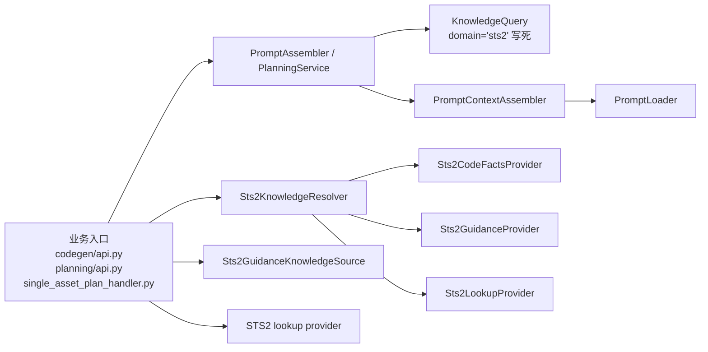

目标结构应收口为：

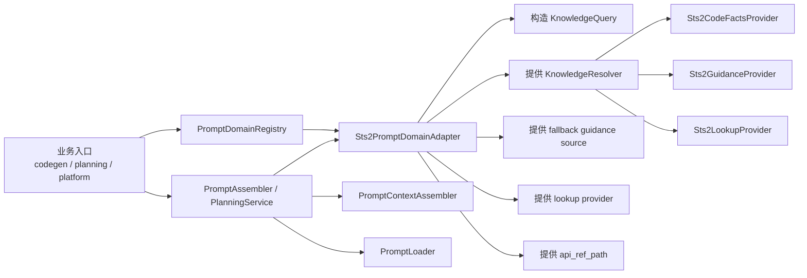

这意味着后续阶段真正要做的不是“重写通用 PromptAssembler”，而是把 STS2 从主链分发点中拔出来，改成领域适配器接入。

## 4.1 通用模型

建议引入结构化查询与结果，而不是继续返回单个字符串。

```python
from dataclasses import dataclass
from pathlib import Path
from typing import Literal


@dataclass
class KnowledgeQuery:
    scenario: Literal["planner", "asset_codegen", "custom_code_codegen", "asset_group_codegen"]
    domain: str
    asset_type: str | None = None
    project_root: Path | None = None
    requirements: str | None = None
    symbols: list[str] | None = None


@dataclass
class KnowledgePacket:
    facts: str
    guidance: str
    lookup: str
    warnings: list[str]
    evidence_paths: list[str]
```

## 4.2 通用知识解析合同

```python
from typing import Protocol


class KnowledgeResolver(Protocol):
    def resolve(self, query: KnowledgeQuery) -> KnowledgePacket: ...
```

这个合同比当前 `KnowledgeSource.load_context()` 更适合表达：

- 事实和规则的分离
- 证据路径
- 告警信息
- 多场景、多领域扩展

## 4.3 通用 Prompt 上下文组装模块

建议新增独立模块，例如：

- `backend/app/shared/knowledge/models.py`
- `backend/app/shared/knowledge/contracts.py`
- `backend/app/shared/knowledge/prompt_context_assembler.py`

其中 `prompt_context_assembler.py` 只负责把 `KnowledgePacket` 变成模板变量：

```python
class PromptContextAssembler:
    def assemble(self, packet: KnowledgePacket) -> dict[str, str]:
        return {
            "facts": packet.facts,
            "guidance": packet.guidance,
            "lookup": packet.lookup,
            "knowledge_warnings": "\n".join(packet.warnings).strip(),
        }
```

该层不关心 STS2，也不关心 card / relic 的业务含义。

## 4.4 领域适配层

以 STS2 为例，建议拆成：

- `backend/app/domains/sts2/knowledge/resolver.py`
- `backend/app/domains/sts2/knowledge/code_facts_provider.py`
- `backend/app/domains/sts2/knowledge/guidance_provider.py`
- `backend/app/domains/sts2/knowledge/lookup_provider.py`

职责划分如下：

- `code_facts_provider`
  - 从 `runtime/knowledge/game/`、`runtime/knowledge/baselib/` 中摘取与当前场景相关的类、签名、路径、约束
- `guidance_provider`
  - 从 `runtime/knowledge/resources/sts2/*.md` 提取规则摘要和经验提示
- `lookup_provider`
  - 提供继续 grep / 阅读的目录路径和入口提示
- `resolver`
  - 组合三者，输出 `KnowledgePacket`

### 4.4.1 标准版固定接口建议

本轮讨论后，跨游戏抽象统一采用“标准版：adapter + 最小 registry”，不采用“只抽 adapter、不做 registry”的保守版。

建议固定一层领域协议，例如：

```python
class PromptDomainAdapter(Protocol):
    domain: str

    def build_planner_query(self, requirements: str) -> KnowledgeQuery: ...

    def build_asset_query(self, request: AssetCodegenRequest) -> KnowledgeQuery: ...

    def build_custom_code_query(self, request: CustomCodegenRequest) -> KnowledgeQuery: ...

    def build_asset_group_query(self, request: AssetGroupRequest) -> KnowledgeQuery: ...

    def knowledge_resolver(self) -> KnowledgeResolver: ...

    def guidance_source(self): ...

    def lookup_provider(self): ...

    def api_ref_path(self) -> Path: ...
```

这里的边界必须明确：

1. adapter 负责“把领域世界翻译成通用 Prompt 管线能消费的输入”
2. adapter 不负责模板正文，也不负责统一不同领域的业务语义

也就是说：

- `PromptAssembler / PlanningService` 是“场景装配器”
- `PromptContextAssembler` 是“知识文本渲染器”
- `PromptDomainAdapter` 是“领域翻译器”
- `Sts2*Provider / Resolver` 是“领域知识实现”

### 4.4.2 最小 registry 设计

本阶段只需要一个极简 registry：

```python
class PromptDomainRegistry:
    def register(self, adapter: PromptDomainAdapter) -> None: ...

    def get(self, domain: str) -> PromptDomainAdapter: ...
```

它只承担两件事：

1. `domain -> adapter` 的集中映射
2. 未注册领域的显式报错

明确不在本阶段做：

- 自动发现 adapter
- 多级 registry
- 动态热插拔
- 配置驱动模板扫描
- 能力矩阵

保持 registry 极简，才能避免这一步抽象演变成过度工程。

### 4.4.3 最终接口收口

在继续讨论后，本专题对“标准版”的接口边界进一步收紧如下：

- `PromptDomainAdapter` 最终应是“场景导向接口”，而不是“零件导向接口”
- 主链最终只应依赖：
  - query builder
  - resolve
  - fallback guidance
  - fallback lookup
  - `api_ref_path`
- 主链最终不应继续理解 adapter 内部是否由：
  - `KnowledgeResolver`
  - `guidance_source`
  - `lookup_provider`
  - 或其它 provider 组合实现

推荐的最终接口如下：

```python
class PromptDomainAdapter(Protocol):
    domain: str

    def build_planner_query(self, input: PlannerQueryInput) -> KnowledgeQuery: ...

    def build_asset_query(self, input: AssetPromptQueryInput) -> KnowledgeQuery: ...

    def build_custom_code_query(self, input: CustomCodePromptQueryInput) -> KnowledgeQuery: ...

    def build_asset_group_query(self, input: AssetGroupPromptQueryInput) -> KnowledgeQuery: ...

    def resolve(self, query: KnowledgeQuery) -> KnowledgePacket: ...

    def load_fallback_guidance(self, query: KnowledgeQuery) -> list[KnowledgeGuidanceItem]: ...

    def build_fallback_lookup(self, query: KnowledgeQuery) -> list[KnowledgeLookupItem]: ...

    def api_ref_path(self) -> Path: ...
```

对应职责图如下：

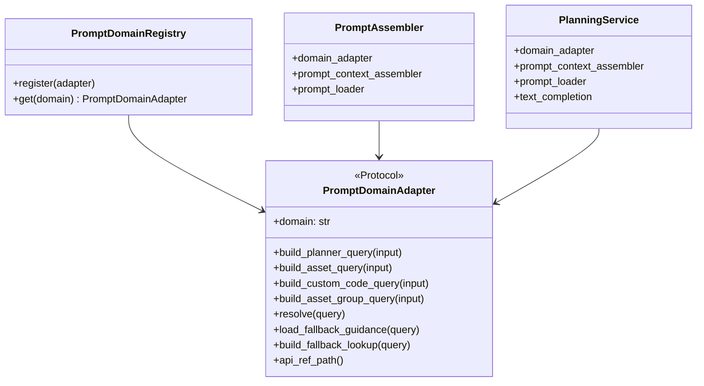

这一定义背后的判断是：

1. 若 adapter 继续暴露 `knowledge_resolver()`、`guidance_source()`、`lookup_provider()` 等内部零件，则主链只是“少看到 STS2 类型名”，并未真正摆脱对领域内部结构的理解。
2. 只有把主链依赖收口到“场景能力结果”，后续第二个游戏接入时，`PromptAssembler / PlanningService` 才能真正保持稳定。

同时，本轮讨论对 `build_*_query()` 的输入边界也已收口：

- 迁移期允许 adapter 直接吃现有 request，以降低改造风险
- 最终接口不再直接暴露：
  - `AssetCodegenRequest`
  - `CustomCodegenRequest`
  - `AssetGroupRequest`
  - 这类业务模块私有 request 类型
- 最终接口应改为接收“最小场景输入 DTO”，只保留构造 `KnowledgeQuery` 所必需的字段

原因如下：

1. 如果 `PromptDomainAdapter` 最终直接依赖现有 request 类型，那么通用 adapter 协议会反向依赖 `codegen / planning` 模块，破坏分层边界。
2. 如果为了避免这种依赖而抽一个“大而全的共享 DTO”，又会把领域输入统一成新的最低公分母，造成重复建模和空洞抽象。
3. 最稳妥的收口方式是：
   - 迁移期：直接吃现有 request，先把主链跑通
   - 最终期：改为轻量场景 DTO，只保留 query 构造所需字段

### 4.4.4 request 与最小场景 DTO 的边界

本专题后续实现明确不采用以下两种极端方案：

1. 最终接口永久直接吃现有 request
2. 提前抽一层“大而全共享 DTO”

推荐方案是“迁移期 request，最终期最小场景 DTO”。

对比如下：

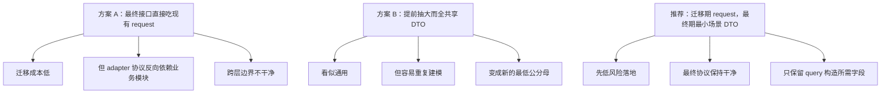

这里的“最小场景 DTO”不是新的业务主模型，而只是 adapter 协议的入参边界。建议按场景拆成：

```python
@dataclass
class PlannerQueryInput:
    requirements: str


@dataclass
class AssetPromptQueryInput:
    asset_type: str
    project_root: Path
    requirements: str
    item_name: str


@dataclass
class CustomCodePromptQueryInput:
    project_root: Path
    requirements: str
    item_name: str


@dataclass
class AssetGroupPromptQueryInput:
    project_root: Path
    group_asset_types: list[str]
    symbols: list[str]
```

这层 DTO 的使用原则是：

1. 只服务于 `KnowledgeQuery` 构造
2. 不替代现有 `AssetCodegenRequest / CustomCodegenRequest / AssetGroupRequest`
3. 不承载模板正文、构建逻辑、注册逻辑或其它业务决策
4. 若某字段不会影响 query 构造，就不应进入 DTO

对应的推荐主链边界如下：

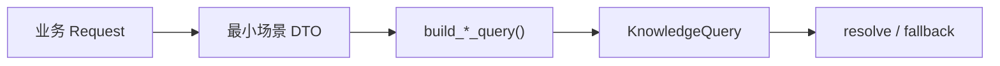

这张图的含义是：

- request 仍然是业务层主对象
- adapter 不直接暴露业务 request 类型
- DTO 只承担“从业务请求过渡到知识查询”的窄职责

### 4.4.5 最小场景 DTO 的放置层级

本轮讨论后，`PlannerQueryInput / AssetPromptQueryInput / CustomCodePromptQueryInput / AssetGroupPromptQueryInput` 的放置层级也已收口。

结论：

- 不放在最顶层 `shared`
- 不继续留在 `codegen / planning` 各自模块内部
- 推荐放在“知识接入边界”这一层，作为 adapter 协议的配套 contracts

建议路径：

- `backend/app/modules/knowledge/application/prompt_domain_adapter.py`
  - 放 `PromptDomainAdapter`
- `backend/app/modules/knowledge/application/prompt_domain_registry.py`
  - 放 `PromptDomainRegistry`
- `backend/app/modules/knowledge/application/prompt_query_inputs.py`
  - 放最小场景 DTO

不推荐放到 `shared` 的原因：

1. 这些 DTO 虽然会被多个模块使用，但它们不是全局基础模型。
2. 它们只服务于“Prompt 领域适配器 -> KnowledgeQuery 构造”这一条窄链路。
3. 如果放进 `shared`，会给人一种“这是全项目通用输入模型”的错误暗示，后续更容易被滥用到不相关场景。

不推荐继续留在 `codegen / planning` 模块内部的原因：

1. 这些 DTO 同时被：
   - `PromptAssembler`
   - `PlanningService`
   - `PromptDomainAdapter`
   使用，本质上已经跨出单一业务模块边界。
2. 如果放在 `codegen` 或 `planning` 内部，adapter 协议就会反向依赖业务模块目录，破坏层级方向。
3. 未来 `platform` 或第二个游戏领域接入时，还会重复遇到同样的跨层依赖问题。

推荐放在 `knowledge/application` 边界层的原因：

1. 这些 DTO 的唯一职责就是帮助 adapter 构造 `KnowledgeQuery`
2. 它们天然属于“知识接入协议”的一部分，而不是业务主模型
3. 把它们和 `PromptDomainAdapter` 放在同一层，最符合“谁消费这组 DTO，谁拥有这组 DTO”的原则

对应层级关系如下：

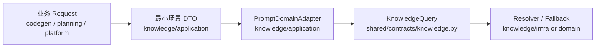

这张图表达的边界是：

- `KnowledgeQuery` 仍然属于通用结构化知识合同，放在 `shared/contracts`
- 最小场景 DTO 不属于全局共享合同，而属于“进入知识层之前的协议输入”
- 因此它们最适合放在 `knowledge/application`，而不是 `shared`

进一步的固定约束：

1. DTO 文件中不应引用模板 key、构建参数、注册逻辑等业务字段
2. DTO 文件中不应出现 STS2 专有术语
3. DTO 的字段必须能够一一映射到 `KnowledgeQuery`，超出 query 构造需求的字段不得进入 DTO

### 4.4.6 三个文件的最终目录与文件名

本轮讨论后，标准版抽象涉及的三个核心文件路径正式收口如下：

1. `PromptDomainAdapter`
   - `backend/app/modules/knowledge/application/prompt_domain_adapter.py`
2. `PromptDomainRegistry`
   - `backend/app/modules/knowledge/application/prompt_domain_registry.py`
3. 最小场景 DTO
   - `backend/app/modules/knowledge/application/prompt_query_inputs.py`

推荐职责拆分如下：

`prompt_domain_adapter.py`
- 只放：
  - `PromptDomainAdapter`
- 不放：
  - registry 实现
  - DTO
  - 具体领域 adapter

`prompt_domain_registry.py`
- 只放：
  - `PromptDomainRegistry`
- 不放：
  - 具体领域注册脚本
  - adapter 协议
  - DTO

`prompt_query_inputs.py`
- 只放：
  - `PlannerQueryInput`
  - `AssetPromptQueryInput`
  - `CustomCodePromptQueryInput`
  - `AssetGroupPromptQueryInput`

这样拆分的原因是：

1. `PromptDomainAdapter` 是协议定义，应该保持最轻，不和 registry/DTO 混在一起
2. `PromptDomainRegistry` 是运行期装配入口，后续若需要更换注册策略，不应影响 adapter 协议文件
3. `prompt_query_inputs.py` 是窄职责输入边界，和协议并列即可，不需要合并进单一“大 contracts 文件”

不采用以下命名方式：

1. `contracts.py`
   - 过于宽泛，后续容易继续塞入无关协议
2. `registry.py`
   - 在 `knowledge/application/` 下语义过宽，不利于后续并存其它 registry
3. `inputs.py`
   - 缺少 prompt/query 语义，后续容易和其它输入模型混淆

对应的目录边界如下：

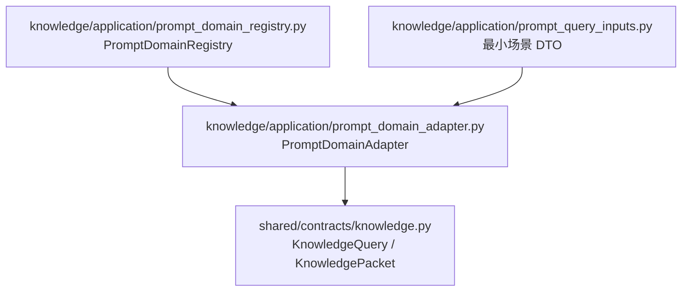

实现阶段的附加约束：

1. 具体领域 adapter 不放在 `knowledge/application/`
2. STS2 具体实现应放在领域侧，例如：
   - 不再继续放在 `knowledge/infra/`
   - 直接放到更清晰的领域目录
3. `codegen/api.py`、`planning/api.py`、`single_asset_plan_handler.py` 只依赖这三个 application 层文件暴露的协议与装配入口，不再直接依赖具体路径决策细节

### 4.4.8 `domains/sts2/prompting/` 目录下放哪些文件

本轮讨论后，`backend/app/domains/sts2/prompting/` 目录的内容也正式收口。

结论：

- 当前阶段只放一个核心文件：
  - `backend/app/domains/sts2/prompting/sts2_prompt_domain_adapter.py`
- 不额外新增：
  - `sts2_prompt_domain_factory.py`
  - `factory.py`
  - `registry.py`
  - 其它同层“组装器”文件

推荐目录形态如下：

```text
backend/app/domains/sts2/prompting/
├─ __init__.py
└─ sts2_prompt_domain_adapter.py
```

不单独新增 factory 文件的原因：

1. 当前 STS2 领域只有一种明确的 Prompt 接入方式，还没有出现多种装配变体。
2. registry 已经承担了“领域分发”职责，再引入 factory 会形成“registry + factory + adapter”三层串联，当前复杂度没有必要。
3. 若现在提前做 `factory.py`，大概率只会成为一层机械转发，增加文件数而不增加真实边界清晰度。

当前更稳的做法是：

- `Sts2PromptDomainAdapter` 的构造逻辑直接收在 `sts2_prompt_domain_adapter.py` 内
- 默认构造入口采用文件级函数：
  - `build_sts2_prompt_domain_adapter()`
- 不再同时提供：
  - `Sts2PromptDomainAdapter.build_default()`

这样做的原因是：

1. `Sts2PromptDomainAdapter` 应保持为纯实现类，避免同时承担“运行时行为”和“默认装配入口”两类职责。
2. 文件级函数更清楚地表达“这是 wiring 入口”，而不是类本身的业务能力。
3. 这也与前面已确定的 `build_default_prompt_domain_registry.py` 风格保持一致，避免工程内出现一半用 classmethod、一半用文件级构建函数的风格漂移。

推荐边界如下：

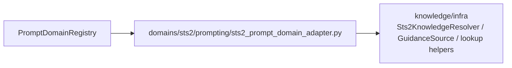

上图表达的含义是：

- registry 负责“按 domain 找 adapter”
- `sts2_prompt_domain_adapter.py` 负责“STS2 adapter 自身及其默认构造”
- `knowledge/infra` 继续承载 resolver、guidance source、lookup helper 等可复用实现

只有在未来出现以下事实之一时，才考虑再拆独立 factory 文件：

1. 同一 STS2 领域下出现两种以上真正不同的 adapter 装配变体
2. adapter 的构造逻辑明显膨胀，已经让 `sts2_prompt_domain_adapter.py` 同时承担协议实现和复杂装配脚本两类职责
3. 第二个游戏接入后，多个领域都出现相同的 adapter 构造套路，值得抽出统一 factory 模式

在这些条件未出现前，`domains/sts2/prompting/` 维持“一个 adapter 文件 + 可选 `__init__.py`”是当前最稳的目录决策。

补充定稿：

- `sts2_prompt_domain_adapter.py` 内当前推荐只暴露两个核心符号：
  1. `Sts2PromptDomainAdapter`
  2. `build_sts2_prompt_domain_adapter()`

不再额外暴露：

1. `build_default()`
2. 其它同义默认构造入口

这样可以避免后续同一领域同时存在“文件级函数入口”和“类方法入口”两套默认构造方式，造成使用习惯分裂。

### 4.4.7 `sts2_prompt_domain_adapter.py` 的最终放置路径

本轮讨论后，`Sts2PromptDomainAdapter` 的最终放置路径正式收口为：

- `backend/app/domains/sts2/prompting/sts2_prompt_domain_adapter.py`

不采用以下方案：

1. `backend/app/modules/knowledge/infra/sts2_prompt_domain_adapter.py`
2. 先放 `knowledge/infra/`，后续再迁

原因如下：

1. `Sts2PromptDomainAdapter` 虽然会调用知识解析能力，但它的职责不是“基础设施实现”，而是“STS2 领域如何接入通用 Prompt 管线”。
2. 如果继续放在 `knowledge/infra/`，会把“知识基础设施层”和“具体领域装配层”继续混在一起，后面接第二个游戏时目录边界会再次发散。
3. 当前既然已经明确跨游戏方向是“通用 Prompt 管线 + 领域适配器 + 最小 registry”，那具体领域 adapter 就应该从一开始放在领域目录，而不是再走一轮临时过渡路径。

推荐的目录心智如下：

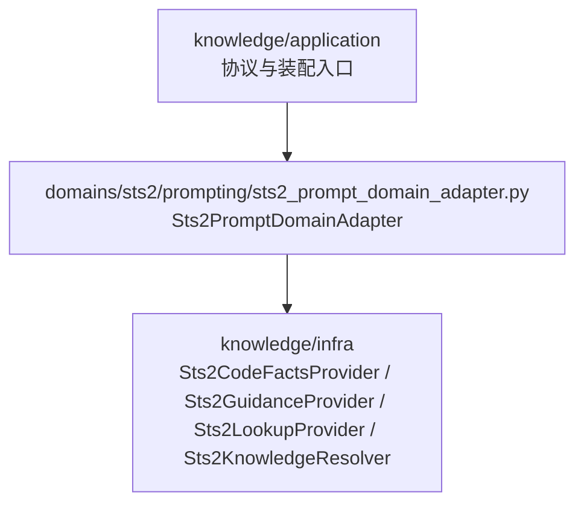

这张图表达的边界是：

- `knowledge/application`
  - 负责协议、registry、query input DTO
- `domains/sts2/prompting`
  - 负责“STS2 如何挂到这套协议上”
- `knowledge/infra`
  - 继续承载当前可复用的知识解析实现

附加约束：

1. `domains/sts2/prompting/` 目录只放 STS2 的 Prompt 接入相关对象，不继续堆放通用知识协议。
2. `Sts2PromptDomainAdapter` 可以依赖 `knowledge/infra` 中现有的 `Sts2KnowledgeResolver`、`Sts2GuidanceKnowledgeSource`、lookup helper，但这些依赖方向必须保持单向。
3. 未来若第二个游戏接入，应平行新增：
   - `backend/app/domains/<game>/prompting/<game>_prompt_domain_adapter.py`
   而不是回头往 `knowledge/infra/` 塞新的 `<game>_prompt_domain_adapter.py`

### 4.4.9 `build_default_prompt_domain_registry.py` 的职责边界

本轮讨论后，`PromptDomainRegistry` 的默认构建方式也已正式收口。

结论：

- `PromptDomainRegistry` 保持纯类，不做模块级默认单例自动注册
- 默认构建函数单独放文件：
  - `backend/app/modules/knowledge/application/build_default_prompt_domain_registry.py`
- `build_default_prompt_domain_registry()` 当前只负责：
  - 创建 `PromptDomainRegistry`
  - 注册默认领域 adapter
  - 返回 registry

推荐形态如下：

```python
def build_default_prompt_domain_registry() -> PromptDomainRegistry:
    registry = PromptDomainRegistry()
    registry.register(Sts2PromptDomainAdapter.build_default())
    return registry
```

当前明确不让该文件承担以下职责：

1. 不构造 `PromptAssembler`
2. 不构造 `PlanningService`
3. 不构造 `PromptContextAssembler`
4. 不构造 `PromptLoader`
5. 不在 import 时自动注册全局单例

推荐该方案的原因是：

1. `PromptDomainRegistry` 本身是纯容器，文件职责应保持在“注册表结构”层面。
2. 默认注册哪些 domain adapter，属于应用装配逻辑，不应与 registry 类定义混在一个文件里。
3. 如果让 `build_default_prompt_domain_registry.py` 顺手承担更多默认 wiring，它会很快从“registry builder”膨胀成“prompt 子系统组合根”，边界重新变糊。

因此当前正式口径是：

- registry builder 只解决“默认 domain registry 从哪里来”
- 不解决“整个 prompt 子系统怎么组起来”

对应边界如下：

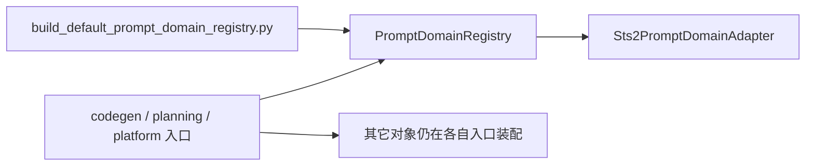

不采用以下方案：

1. 把 `build_default_prompt_domain_registry()` 混进 `prompt_domain_registry.py`
2. 在 import 时自动生成模块级全局 registry 单例
3. 让该文件继续向上承担 prompt 子系统的完整组合根职责

只有在未来出现以下事实之一时，才考虑再新增更高层组合文件，而不是扩张当前 registry builder：

1. `codegen/api.py`、`planning/api.py`、`single_asset_plan_handler.py` 明显重复创建同一整套 prompt 相关依赖
2. 重复的不再只是 registry，而是完整的 prompt 子系统 wiring
3. 测试与生产环境都需要成体系地替换一整套默认 prompt wiring

在这些条件未出现前，最稳的结构是：

1. `prompt_domain_registry.py`
   - 只放 `PromptDomainRegistry`
2. `build_default_prompt_domain_registry.py`
   - 只放默认 registry 构建逻辑
3. 其它 prompt 相关对象继续在各自入口显式装配

### 4.4.10 默认构建函数与领域 adapter 的依赖方向

本轮讨论后，`build_default_prompt_domain_registry()` 与 `build_sts2_prompt_domain_adapter()` 的依赖方向也已正式收口。

最终规则如下：

1. `build_default_prompt_domain_registry.py` 可以 import：
   - `PromptDomainRegistry`
   - `build_sts2_prompt_domain_adapter()`
2. `sts2_prompt_domain_adapter.py` 不可以 import：
   - `PromptDomainRegistry`
   - `build_default_prompt_domain_registry.py`
3. `knowledge/infra` 不可以 import：
   - `domains/sts2/prompting/*`
4. 以下 application 层纯协议文件不可以 import 具体领域实现：
   - `prompt_domain_adapter.py`
   - `prompt_domain_registry.py`
   - `prompt_query_inputs.py`

推荐依赖方向如下：

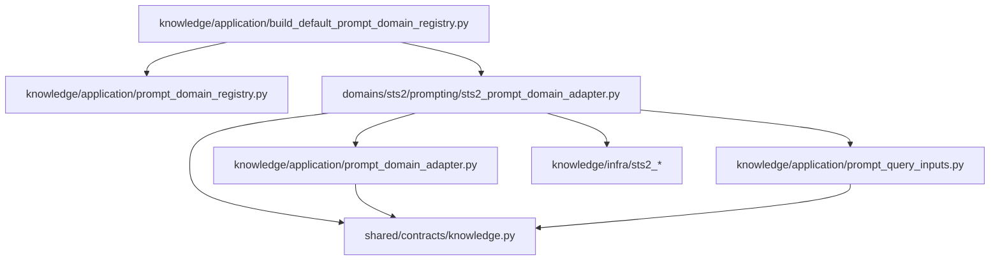

该图表达的核心边界是：

- `build_default_prompt_domain_registry.py` 是唯一允许同时知道：
  - registry
  - 具体领域 adapter builder
  的默认装配入口
- 其它 application 协议文件、domain adapter 文件、infra 文件都不得跨越这条边界反向 import

为什么要这样收口：

1. `build_default_prompt_domain_registry.py` 本质上就是默认装配入口，知道 registry 和默认领域实现是合理的。
2. `Sts2PromptDomainAdapter` 只负责 STS2 领域如何接入通用 Prompt 管线，不应反向知道应用默认装配策略。
3. `knowledge/infra` 继续保持“知识解析实现层”定位，不应反向依赖领域 Prompt 装配层。
4. `prompt_domain_adapter.py / prompt_domain_registry.py / prompt_query_inputs.py` 若反向 import 具体领域实现，会把 application 边界重新污染成领域耦合层。

实现阶段的附加硬约束：

1. DTO 文件不得 import 现有业务 request 类型
2. adapter builder 只能向下拿依赖，不能向上 import 组合根
3. registry 类文件不得直接 import STS2 adapter builder
4. 如果后续出现循环依赖，优先检查是否破坏了以上四条规则，而不是临时引入动态 import 或局部规避技巧

补充收口结论：

1. `load_fallback_guidance()` 与 `build_fallback_lookup()` 都统一接收完整 `KnowledgeQuery`
2. 它们不再直接吃业务 request，也不拆成多个零散参数
3. `api_ref_path()` 暂时保持无参

这样做的原因是：

- request 只负责被翻译为 `KnowledgeQuery`
- 进入 query 阶段后，后续所有知识决策都应留在知识层内部完成
- 若 fallback 方法继续吃 request，主链会重新混入业务语义，破坏 adapter 的边界
- 若 fallback 方法拆成零散参数，后续每次扩展 query 字段都要反复改签名

关于 `api_ref_path()`，本轮讨论也已固定如下结论：

- `api_ref_path()` 继续保持无参
- 当前不升级为 `api_ref_path(query)`

原因是：

1. 在现阶段心智模型中，`api_ref_path` 仍是“领域级稳定入口”，不是“场景级动态事实”
2. `resolve(query)`、fallback guidance、fallback lookup 都已经承担了随场景变化的知识分流职责
3. 如果过早把 `api_ref_path()` 也升级成 query 驱动接口，会让一个本应稳定的领域入口被误抽象成场景变量，增加主链理解成本

因此当前建议是：

- `resolve(query)`：场景相关，接收 `KnowledgeQuery`
- `load_fallback_guidance(query)`：场景相关，接收 `KnowledgeQuery`
- `build_fallback_lookup(query)`：场景相关，接收 `KnowledgeQuery`
- `api_ref_path()`：领域稳定入口，保持无参

仅当未来出现以下事实之一时，才考虑升级为 `api_ref_path(query)`：

1. 同一领域下，不同 scenario 需要读取完全不同的 API 参考文件
2. 同一领域下，不同 `asset_type` 的主参考入口已经不再能由 resolver / lookup 补足
3. 领域内出现多份并列且必须显式分流的“主 API 参考文档”

在这些条件未出现前，保持 `api_ref_path()` 无参更稳，也更符合“领域适配器只暴露必要变化点”的原则。

这里还需进一步固定一个重要边界：

- `build_fallback_lookup()` 最终返回 `list[KnowledgeLookupItem]`
- 不返回单个 `str`

原因如下：

1. fallback lookup 不应重新绕回“拼字符串”的旧链路
2. 结构化返回才能继续复用 `PromptContextAssembler` 的统一渲染逻辑
3. 结构化项更便于做排序、去重、快照和单条断言测试
4. 未来不同领域或不同场景下的 lookup 粒度可以变化，但主链不需要知道这些差异

同理，`load_fallback_guidance()` 的最终方向也应与 lookup 一致，返回结构化 `list[KnowledgeGuidanceItem]`，而不是单个 `str`。  
这意味着 fallback 不再是“另一套文本通道”，而是“对结构化知识包的补丁来源”。

对应的最终心智模型如下：

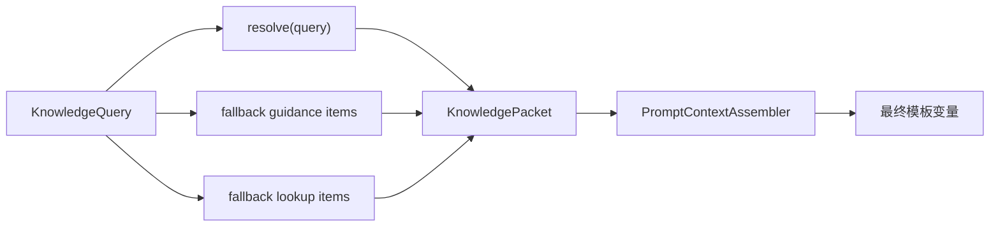

上图表达的约束是：

- 正常路径与 fallback 路径都必须汇入结构化 `KnowledgePacket`
- 主链始终只走“结构化知识 -> 统一渲染”这一条装配路径
- 不再保留 fallback 直接拼文本、直接注入模板的旁路

### 4.4.11 `PromptDomainRegistry` 的重复注册与异常策略

在继续讨论后，`PromptDomainRegistry` 的错误语义与重复注册策略也已正式收口。

最终结论：

- `register(adapter)` 遇到重复 `domain` 时直接报错
- 不采用“后注册覆盖前注册”
- 不采用“首次成功、后续重复忽略”
- `get(domain)` 遇到未注册领域时直接报错
- registry 保留最小只读辅助接口：
  - `domains() -> tuple[str, ...]`
- 当前不增加 `has(domain)`

推荐接口如下：

```python
class DuplicatePromptDomainError(ValueError):
    pass


class UnknownPromptDomainError(KeyError):
    pass


class PromptDomainRegistry:
    def register(self, adapter: PromptDomainAdapter) -> None: ...

    def get(self, domain: str) -> PromptDomainAdapter: ...

    def domains(self) -> tuple[str, ...]: ...
```

之所以采用“重复即报错”，而不是默认覆盖，原因如下：

1. `domain -> adapter` 在当前标准版中是单值映射，重复注册本质上是装配错误，应尽早暴露。
2. 当前阶段主目标是把“代码优先知识链路”收稳，而不是为未来插件覆盖预留隐式行为。
3. 若默认允许覆盖，后续 import 顺序、测试装配顺序或临时兼容代码都可能静默改变主链实际使用的 adapter，增加排查成本。
4. 若默认改为“重复忽略”，则更容易出现“以为新 adapter 已接上，实际没有生效”的隐蔽错误。

同时，异常类型也明确采用专用异常，而不是直接复用 `ValueError`：

1. `DuplicatePromptDomainError`
   - 表达“默认装配或测试装配出现重复领域”
2. `UnknownPromptDomainError`
   - 表达“业务入口请求了当前未注册的领域”

推荐该策略的直接收益是：

- 错误语义清晰
- 测试断言稳定
- API / 日志层后续更容易区分“参数问题”和“领域装配问题”

当前不增加 `has(domain)` 的原因是：

1. 它容易诱导调用方写出“先 `has()` 再 `get()`”的双查模式。
2. 对当前最小 registry 来说，`get()` 已足够表达存在性。
3. `domains()` 已能满足诊断、报错文案和测试快照的只读需求。

### 4.4.12 `build_default_prompt_domain_registry()` 不承担默认领域完整性校验

本轮讨论后，默认 registry builder 的职责边界进一步收紧如下：

- `build_default_prompt_domain_registry()` 只负责：
  - 创建 registry
  - 注册默认 adapter
  - 返回 registry
- 它不负责校验“默认领域集合是否完整”
- 如果未来某个启动场景要求某些领域必须存在，应在更上层组合根或入口层显式校验

之所以不把“默认领域完整性校验”放进 builder，原因如下：

1. builder 的职责是装配，不是产品策略判断。
2. 当前阶段仍以 STS2 单主领域为主，过早把“必须有哪些领域”写死在 builder 中，会把通用装配层重新绑定到具体业务清单。
3. 若未来存在裁剪版、测试版、局部接入版，不同环境对“默认领域完整”的定义可能并不一致。

因此当前正式口径是：

- `PromptDomainRegistry`
  - 负责存取与显式报错
- `build_default_prompt_domain_registry()`
  - 负责默认装配
- 更上层组合根 / 入口层
  - 若某业务场景要求特定 domain 必须存在，则在那里显式校验

这也意味着第一版不引入：

1. `expected_domains` 之类的 builder 参数
2. builder 内置的固定领域白名单校验
3. import 时自动触发的启动期隐式自检

### 4.4.13 入口层获取 adapter 的统一模式

本轮讨论后，`PromptAssembler`、`PlanningService`、`single_asset_plan_handler` 这类主链入口的 adapter 获取模式也已明确。

最终结论：

- 不新增额外的 `PromptDomainResolver` / `DomainAdapterProvider`
- `PromptDomainRegistry` 只停留在装配点
- 业务服务内部只依赖已经解析好的 `PromptDomainAdapter`
- 各入口统一采用：
  - 先构建 default registry
  - 再 `registry.get(domain)`
  - 再把得到的 adapter 注入下游服务

推荐链路如下：

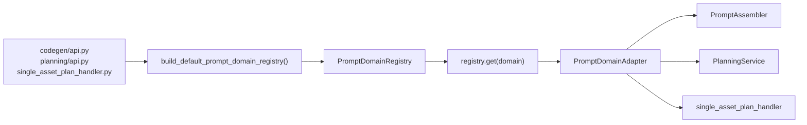

这一定义背后的判断是：

1. `registry` 是装配工具，不是业务服务依赖。
2. 若再增加一层 `PromptDomainResolver` / `DomainAdapterProvider`，第一版大概率只是包装一次 `registry.get(domain)`，属于抽象空转。
3. 一旦多包一层 provider，后续很容易继续往里面塞默认领域选择、fallback、日志、兼容策略，最终重新长成新的隐式分发中心。
4. 让业务服务直接依赖 adapter，更利于单测替换 fake adapter，也更符合“领域分发集中、知识拼装稳定”的目标。

因此当前固定边界是：

- `PromptDomainRegistry`
  - 只出现在组合根与装配点
- `PromptAssembler / PlanningService / single_asset_plan_handler`
  - 不直接持有 registry
  - 不自己做 `domain` 分发
  - 只消费已经注入的 `PromptDomainAdapter`

现阶段关于 `domain` 来源的进一步收口也已明确：

- 当前阶段允许在入口层显式传入 `domain="sts2"`
- 暂不在本轮引入“自动 domain 判定”

原因是：

1. 当前主矛盾仍然是把 adapter 边界和代码优先知识链路收稳。
2. 自动 domain 路由属于下一层问题，若现在提前引入，容易把讨论重新带回配置分发和策略选择，而偏离当前主线。
3. 只要 registry、adapter 和入口装配边界已经固定，未来再升级 domain 选择规则，改动面会更可控。

## 4.5 场景模板层

模板继续按场景维护，但变量语义统一收口到：

- `facts`
- `guidance`
- `lookup`
- `knowledge_warnings`

示意结构如下：

```md
### Source Of Truth
{{ facts }}

---

### Rules And Guidance
{{ guidance }}

---

### Further Lookup
{{ lookup }}

{{ knowledge_warnings }}
```

模板中必须显式声明：

1. `Source Of Truth` 为优先事实源
2. 若 `Rules And Guidance` 与 `Source Of Truth` 冲突，以事实源为准
3. `Further Lookup` 只用于补充未覆盖细节

## 4.6 讨论收口后的固定设计

截至 2026-04-21，本专题进一步讨论后，以下设计已收口，可直接作为后续实现约束：

### 4.6.1 代码优先不等于删除文档

- 本次改造不是移除文档层，而是重排知识消费顺序。
- 正确顺序应为：
  1. 先组织代码事实
  2. 再补规则摘要
  3. 最后给继续查阅入口
- 因此文档层从“事实源”降级为“策略源”。

### 4.6.2 生成链路采用两段式

- 对 `codegen`，推荐采用两段式处理，而不是把“继续读代码目录”完全交给最终 Agent 自主决定。
- 两段式定义如下：
  1. 先做一次轻量事实提取，生成小而准的 `facts` 包
  2. 再把 `facts + guidance + lookup` 一起放入最终 Prompt
- 这样可以避免模型先接受旧文档心智，再边写边补查代码导致的“半旧半新”输出。

### 4.6.3 `planning` 与 `codegen` 分开处理

- `planning`
  - 继续允许高层摘要主导
  - 但输出前必须经过关键事实校准
- `codegen`
  - 明确采用 `facts > guidance > lookup`
  - 默认先消费事实包，不再把文档摘要当主输入

### 4.6.4 冲突必须显式化

- `KnowledgePacket` 中保留 `warnings` 不是可选装饰，而是必要能力。
- 当文档与当前代码事实冲突时，应显式输出例如：
  - 文档中提到的类在当前运行时知识目录中不存在
  - 文档中的注册方式与当前代码结构不一致
  - 文档中的旧路径或旧基类在当前版本中已失效
- 不允许继续保持“静默冲突”，否则模型仍容易被旧文档误导。

### 4.6.5 默认采用“公共事实包 + 类型事实包 + 需求补充检索”

- 事实提取不采用“整目录注入”，也不采用“完全自由检索”。
- 默认策略固定为三段：
  1. 公共事实包
  2. 资产类型默认事实包
  3. 基于需求文本的补充检索
- 这是当前认为在稳定性、准确性和 token 成本之间最均衡的方案。

### 4.6.6 跨游戏抽象采用“标准版”

截至当前讨论，跨游戏 Prompt 组装抽象的正式口径如下：

1. 采用“通用 Prompt 管线 + 领域适配器 + 最小 registry”
2. 不采用“保守版只抽 adapter、不做 registry”
3. 不采用“跨游戏超级 PromptAssembler”
4. 不在本阶段接入第二个游戏，只先把 STS2 改造成标准版接法

该结论的工程含义是：

- 现在要解决的是“主链分发问题”，不是“把所有领域业务统一到一个大类里”
- registry 负责领域分发
- adapter 负责领域翻译
- `PromptAssembler / PlanningService` 负责场景装配

### 4.6.7 `codegen` 与 `planning` 共用 adapter，不共用所有策略

`codegen` 与 `planning` 应共用同一个 domain adapter，但不强行共用完全相同的 Prompt 组织策略。

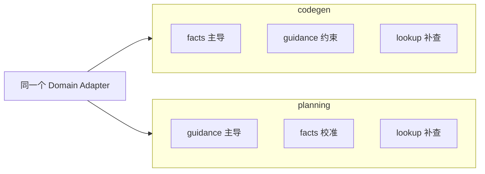

这意味着：

- 可以共用：
  - domain
  - resolver
  - fallback guidance source
  - lookup source
  - query builder 入口
- 不必共用：
  - `facts / guidance` 的排序策略
  - 模板正文
  - 各场景提示语气与结构

### 4.6.8 `PromptDomainAdapter` 当前不承载展示型或声明型元信息

本轮讨论后，`PromptDomainAdapter` 的边界继续保持最小，不新增以下只读元信息：

- `display_name`
- `description`
- `supported_scenarios`
- 其它展示型或声明型字段

当前正式口径是：

- adapter 只承载执行主链所必需的能力接口
- `domain` 继续保留，作为领域标识
- 不把展示层、管理层、能力声明层的诉求提前塞进 adapter 协议

之所以这样收口，原因如下：

1. `PromptDomainAdapter` 当前职责是“领域执行协议”，不是“领域描述对象”。
2. 一旦在 adapter 中加入 `display_name`、`supported_scenarios` 等字段，很容易继续扩张出：
   - `priority`
   - `is_default`
   - `tags`
   - `description`
   最终让 adapter 从执行接口膨胀成半配置对象。
3. `supported_scenarios` 会与 `build_*_query()` 等实际方法形成双重真相源：
   - 列表声明支持，但实现未必可用
   - 实现可用，但列表可能忘记更新
4. `display_name` 更偏向展示、日志和管理用途，不属于代码优先主链的必需输入。

因此在当前阶段，推荐继续保持：

- `adapter = 执行协议`
- `registry = 领域映射`

仅当未来出现以下事实之一时，才考虑引入单独的描述层，而不是扩张 adapter：

1. UI 或日志系统需要稳定展示领域名称
2. 第二个领域接入后，不同领域并不支持全部场景
3. 路由层或管理层需要在执行前做能力判断
4. 测试或配置系统开始显式依赖领域元信息

若未来确实需要该层，建议新增独立对象，例如：

- `PromptDomainDescriptor`
- `PromptDomainCapabilities`

而不是回头把这些字段再塞进 `PromptDomainAdapter`。

### 4.6.9 某领域不支持某场景时，先用显式异常表达

本轮讨论后，对“领域存在但暂不支持某个场景”的表达方式也已收口。

当前推荐方案：

- 第一版不新增 capability / descriptor 层
- 若某个领域不支持某个场景，直接在对应 adapter 方法里抛显式异常
- 推荐异常名：
  - `UnsupportedPromptScenarioError`

与 registry 相关异常的边界区分如下：

1. `UnknownPromptDomainError`
   - 该 `domain` 根本未注册
2. `UnsupportedPromptScenarioError`
   - 该 `domain` 已存在，但当前 adapter 不支持这个场景

推荐该方案的原因是：

1. 这是当前最小、最直接的表达方式，不需要为了尚未出现的需求，提前引入一整层能力声明模型。
2. 是否支持某场景，直接由实际实现负责，不再维护一份额外的声明式真相源。
3. 失败点贴近真实调用位置，定位更直接。
4. 与当前阶段目标一致：先把主链跑顺、边界收稳，再按真实需求扩层。

该方案的已知代价是：

1. 错误发生在调用时，而不是更早的静态校验阶段。
2. 若未来 UI 或调度层需要“执行前先判断能力”，单靠异常不足以支撑全部场景。

但在这些真实前置能力判断需求出现之前，当前正式口径仍是：

- 不提前引入 `supported_scenarios`
- 不提前引入 `PromptDomainCapabilities`
- 不提前引入 `PromptDomainDescriptor`
- 先用显式异常表达“不支持某场景”

### 4.6.10 当前阶段 `domain="sts2"` 继续留在三个主入口内部显式传入

本轮讨论后，关于当前阶段 `domain` 来源的装配位置也已最终收口。

当前正式口径是：

- `domain="sts2"` 继续显式留在以下三个主入口内部：
  - `codegen/api.py`
  - `planning/api.py`
  - `single_asset_plan_handler.py`
- 当前不再往更外层上提一个“全局 domain 决定入口”
- 当前不做配置驱动的 domain 选择
- 当前不做基于上下文的自动 domain 推断

之所以保持在这三个入口内部显式传入，原因如下：

1. 这三个文件本来就是当前 prompt 主链的装配点，最清楚自己正在装配哪条链路以及当前使用哪个领域。
2. 在当前阶段，唯一合法主领域仍然是 `sts2`，若此时再往更外层提一层统一入口，大概率只会形成“看似通用、实际只返回 `sts2`”的空抽象。
3. 当前更重要的是把：
   - `domain selection`
   - `domain lookup`
   这两件事分开；前者暂时仍由业务入口显式决定，后者由 registry 负责。
4. 若现在提前引入全局 `resolve_domain()` 或自动路由层，后续很容易把配置分发和领域装配重新混在一起，偏离当前“先收稳 adapter 边界”的主线。

因此当前固定分工如下：

- 主入口
  - 决定本链路使用哪个 `domain`
- `PromptDomainRegistry`
  - 在拿到 `domain` 后，负责查找对应 adapter
- 下游业务服务
  - 只消费已经注入的 adapter

该方案的已知代价是：

1. `domain="sts2"` 会在三个入口各写一次，存在少量重复。
2. 将来若第二领域接入，需要重新讨论这些入口的 domain 来源规则。

但当前判断是：这属于健康重复，优于过早抽象。

仅当未来出现以下事实之一时，才考虑把 domain 来源再往外提：

1. 第二个领域真实接入，且同一业务入口需要按请求或项目动态切换 domain
2. `codegen`、`planning`、`platform` 三条链路开始共享同一套稳定的 domain 选择规则
3. domain 的来源已经明确来自：
   - 请求参数
   - 项目配置
   - 运行时上下文
   - 工作区元数据
   中的一种或多种真实业务事实

在这些条件未出现前，继续由三个主入口显式传入 `domain="sts2"` 更稳。

## 4.7 STS2 默认事实提取清单

### 4.7.1 公共事实包

每次进入 STS2 `codegen` 前，先固定提取一份公共事实包，至少包含：

1. 项目骨架事实
   - `MainFile.cs` 中的命名空间
   - `ModId`
   - 是否已存在 `harmony.PatchAll()`
   - 当前项目已有目录结构
2. 构建与资源路径事实
   - Godot 资源根目录
   - `localization/eng/`
   - `localization/zhs/`
   - 当前 `.csproj` 名称与输出方式
3. BaseLib / 游戏入口事实
   - 最常用的 BaseLib 入口类型
   - 当前运行时知识目录路径
   - 最小 lookup 提示
4. 冲突规则
   - 文档摘要与代码事实冲突时，以代码事实为准

### 4.7.2 `card` 默认事实包

必取事实：

1. 当前卡牌推荐基类或入口模型
2. 必需特性与硬约束
   - 包括 `[Pool(typeof(...))]` 这类会直接影响运行的属性
3. 构造与核心字段设置方式
   - 费用、稀有度、目标、类型、基础数值
4. 必需重写方法
   - 出牌、升级、描述刷新、数值更新等关键入口
5. 注册 / 发现机制
6. 本地化 JSON 结构
7. 1 到 2 个最小真实示例

按需补取事实：

1. 选牌与筛牌
2. 临时牌、耗尽、保留、升级分支
3. 与 `Power`、`Relic`、自定义命令的交互方式
4. 卡池类型与稀有度映射

### 4.7.3 `power` 默认事实包

必取事实：

1. 当前 Power 推荐基类
2. 核心字段
   - 名称、层数、图标、buff/debuff 标记、描述刷新
3. 常见触发入口
   - 回合开始、打牌后、受伤后、回合结束等
4. 描述刷新模式
5. 图标与资源路径
6. 1 到 2 个真实示例

按需补取事实：

1. 堆叠与移除语义
2. 与原生 Power 组合方式
3. 与 Action / Command 的交互方式

### 4.7.4 `relic` 默认事实包

必取事实：

1. 当前 Relic 推荐基类
2. 生命周期入口
   - 战斗开始、胜利后、回合开始、出牌后等
3. 稀有度、音效、展示信息等基础配置
4. 资源与本地化路径
5. 注册 / 自动发现机制
6. 1 到 2 个真实示例

按需补取事实：

1. 充能类 relic 语义
2. 每战 / 每回合重置逻辑
3. 与角色、卡牌、Power 的联动方式

### 4.7.5 `custom_code` 默认事实包

`custom_code` 不再视为一个完全自由文本类型，而是默认先提供以下事实包：

必取事实：

1. 当前项目 Harmony 使用方式
2. 常见扩展点
   - 自定义命令、事件、被动效果、战斗流程插入点
3. 最常见基础类或接口
4. 当前项目已存在的模式
   - `Extensions`
   - `Services`
   - `Patches`
   - `Utils`
5. 文件组织约束
6. 1 到 2 个真实示例

按需补取事实：

1. 目标类与目标方法签名
2. Prefix / Postfix / Transpiler 使用边界
3. 状态读取与上下文获取方式

### 4.7.6 `character` 预留位

- 即使当前第一阶段不优先改 `character`，也建议在设计层预留单独事实包。
- 原因是角色类通常与 `card / power / relic / custom_code` 的结构差异明显，后续大概率需要独立处理。

### 4.7.7 事实包输出格式

默认不直接向 Prompt 注入大段原始反编译代码，而是整理为统一格式：

```text
[Code Facts]
- Base class:
- Required attributes:
- Required methods:
- Registration/discovery:
- Localization/resource paths:
- Canonical examples:
- Evidence paths:
```

这样更利于模型吸收，也更方便后续做快照测试和字符串断言。

## 4.8 `KnowledgePacket` 工程化字段建议

在继续实现前，建议把 `KnowledgePacket` 从“几个大字符串字段”进一步细化为更适合测试和演进的工程化结构。

第一版建议字段如下：

```python
@dataclass
class KnowledgeFactItem:
    title: str
    body: str
    evidence_paths: list[str]
    keywords: list[str]


@dataclass
class KnowledgeGuidanceItem:
    title: str
    body: str
    source_path: str


@dataclass
class KnowledgeLookupItem:
    title: str
    path: str
    note: str


@dataclass
class KnowledgePacket:
    facts: list[KnowledgeFactItem]
    guidance: list[KnowledgeGuidanceItem]
    lookup: list[KnowledgeLookupItem]
    warnings: list[str]
    summary: str
```

这样做的价值：

1. 更容易对单条事实做断言，而不是只能对整段 prompt 文本做脆弱字符串比对。
2. `evidence_paths` 可以明确告诉后续 Agent 事实来自哪里。
3. `keywords` 可以作为后续需求补充检索的桥接信息。
4. 最终模板渲染前仍可由 `PromptContextAssembler` 把结构化数据压平成字符串，不影响现有 `PromptLoader`。

## 4.9 STS2 资产类型到事实提取入口的映射

本节不是要求第一阶段就做复杂索引系统，而是先把默认映射表冻结下来，避免后续“每种资产查什么”继续漂移。

### 4.9.1 公共事实包的默认入口

公共事实包默认优先从以下位置抽取：

1. 项目内文件
   - `MainFile.cs`
   - 当前项目 `.csproj`
   - `localization/eng/`
   - `localization/zhs/`
2. 运行时知识目录
   - `runtime/knowledge/game/sts2_api_reference.md`
   - `runtime/knowledge/baselib/BaseLib.decompiled.cs`
3. 运行时摘要目录
   - `runtime/knowledge/resources/sts2/common.md`

公共 lookup 目录默认包含：

1. `runtime/knowledge/game/`
2. `runtime/knowledge/baselib/BaseLib.decompiled.cs`
3. `runtime/knowledge/resources/sts2/`

### 4.9.2 `card` 的默认映射

已确认的优先事实入口：

1. BaseLib 基类
   - `CustomCardModel`
   - 证据：`runtime/knowledge/resources/sts2/card.md`
   - 证据：`runtime/knowledge/baselib/BaseLib.decompiled.cs`
2. 命令与动作
   - `DamageCmd`
   - `PowerCmd`
   - `CreatureCmd`
   - 证据：`runtime/knowledge/game/sts2_api_reference.md`
3. 选牌相关
   - `CardSelectorPrefs`
   - 证据：`runtime/knowledge/game/sts2_api_reference.md`
4. 文档摘要入口
   - `runtime/knowledge/resources/sts2/card.md`

建议默认关键词：

- `CustomCardModel`
- `Pool`
- `CardType`
- `CardRarity`
- `TargetType`
- `DamageCmd`
- `PowerCmd`
- `CardSelectorPrefs`

建议默认 lookup 子目录：

- `MegaCrit.Sts2.Core.Commands\`
- `MegaCrit.Sts2.Core.Models.Cards\`
- `MegaCrit.Sts2.Core.CardSelection\`

### 4.9.3 `power` 的默认映射

已确认的优先事实入口：

1. 直接基类
   - `PowerModel`
   - 已确认无 `CustomPowerModel`
   - 证据：`runtime/knowledge/resources/sts2/power.md`
2. 命令入口
   - `PowerCmd`
   - `CreatureCmd`
   - 证据：`runtime/knowledge/resources/sts2/power.md`
   - 证据：`runtime/knowledge/game/sts2_api_reference.md`
3. 文档摘要入口
   - `runtime/knowledge/resources/sts2/power.md`

建议默认关键词：

- `PowerModel`
- `PowerType`
- `PowerCmd`
- `CreatureCmd`
- `StrengthPower`
- `DexterityPower`

建议默认 lookup 子目录：

- `MegaCrit.Sts2.Core.Commands\`
- `MegaCrit.Sts2.Core.Entities.Powers\`
- `MegaCrit.Sts2.Core.Models\`

### 4.9.4 `relic` 的默认映射

已确认的优先事实入口：

1. BaseLib 基类
   - `CustomRelicModel`
   - 证据：`runtime/knowledge/resources/sts2/relic.md`
2. Pool 与自动发现
   - `[Pool(typeof(SharedRelicPool))]`
   - 证据：`runtime/knowledge/resources/sts2/relic.md`
3. 文档摘要入口
   - `runtime/knowledge/resources/sts2/relic.md`

建议默认关键词：

- `CustomRelicModel`
- `SharedRelicPool`
- `Pool`
- `Task.CompletedTask`

建议默认 lookup 子目录：

- `MegaCrit.Sts2.Core.Models.RelicPools\`
- `MegaCrit.Sts2.Core.Models\`

### 4.9.5 `custom_code` 的默认映射

已确认的优先事实入口：

1. Harmony 能力
   - `HarmonyLib`
   - `PatchAll`
   - `HarmonyPatch`
   - 证据：`runtime/knowledge/resources/sts2/custom_code.md`
   - 证据：`runtime/knowledge/baselib/BaseLib.decompiled.cs`
2. 常用命令
   - `DamageCmd`
   - `PowerCmd`
   - `CreatureCmd`
   - 证据：`runtime/knowledge/game/sts2_api_reference.md`
3. 选牌结构
   - `CardSelectorPrefs`
   - 证据：`runtime/knowledge/resources/sts2/custom_code.md`
   - 证据：`runtime/knowledge/game/sts2_api_reference.md`
4. 文档摘要入口
   - `runtime/knowledge/resources/sts2/custom_code.md`

建议默认关键词：

- `HarmonyPatch`
- `PatchAll`
- `Prefix`
- `Postfix`
- `DamageCmd`
- `PowerCmd`
- `CreatureCmd`
- `CardSelectorPrefs`

建议默认 lookup 子目录：

- `MegaCrit.Sts2.Core.Commands\`
- `MegaCrit.Sts2.Core.CardSelection\`
- `runtime/knowledge/baselib/BaseLib.decompiled.cs`

### 4.9.6 `character` 的预留映射

已确认的可用入口：

1. BaseLib 基类
   - `PlaceholderCharacterModel`
   - 证据：`runtime/knowledge/baselib/BaseLib.decompiled.cs`
   - 证据：`runtime/knowledge/game/sts2_api_reference.md`
2. 文档摘要入口
   - `runtime/knowledge/resources/sts2/character.md`

建议默认关键词：

- `PlaceholderCharacterModel`
- `CharacterModel`
- `CreateVisuals`
- `GenerateAnimator`

## 4.10 `codegen` 模板骨架建议

当前 `codegen.md` 仍以 `{{ docs }}` + `{{ api_lookup }}` 为中心变量。后续建议明确改成“事实优先模板骨架”。

### 4.10.1 建议变量

第一版固定变量建议为：

- `facts`
- `guidance`
- `lookup`
- `knowledge_warnings`
- `project_context`
- `task_context`

其中：

- `facts`：来自两段式事实提取结果
- `guidance`：来自摘要层
- `lookup`：后续继续 grep / 打开目录的提示
- `knowledge_warnings`：冲突显式化结果
- `project_context`：当前项目骨架与资源路径事实
- `task_context`：资产名、资产类型、设计描述、图片路径等业务输入

### 4.10.2 `asset_prompt` 骨架建议

```md
You are an expert STS2 mod developer using Godot 4 + C# + BaseLib.

Priority rules:
1. Code Facts are the source of truth.
2. If Rules And Guidance conflict with Code Facts, follow Code Facts.
3. Use Further Lookup only for details not already covered.

### Project Context
{{ project_context }}

---

### Code Facts
{{ facts }}

---

### Rules And Guidance
{{ guidance }}

---

### Further Lookup
{{ lookup }}

{{ knowledge_warnings }}

---

### Task
{{ task_context }}
```

### 4.10.3 `custom_code_prompt` 骨架建议

与 `asset_prompt` 保持相同骨架，但 `facts` 中优先输出：

1. 项目内现有 Patch 模式
2. `PatchAll` 现状
3. 当前目标类 / 目标方法
4. 相关 `HarmonyPatch` 示例

### 4.10.4 `asset_group_prompt` 骨架建议

`asset_group_prompt` 需要在骨架里额外强调：

1. group 内依赖关系已展开
2. 共享事实只注入一次
3. 类型事实按出现类型去重合并

### 4.10.5 过渡期兼容策略

在第一阶段迁移过程中，允许：

- 先保留 `docs` 变量
- 但其内容改为 `facts + guidance` 的兼容拼接结果

这样可以避免一次性打穿所有模板和测试；待 `codegen` 侧稳定后，再删除旧变量名。

## 4.11 `KnowledgeResolver.resolve()` 的接口收口

结合当前代码边界，第一阶段最稳的做法是：只让新知识解析层为 `PromptAssembler` 服务，不要求同步改掉 `CodegenService` 或 `agent_runner` 的调用方式。

### 4.11.1 第一阶段目标

维持以下调用链不变：

1. `CodegenService.create_*()`
2. `PromptAssembler.assemble_*_prompt()`
3. `PromptLoader.render()`
4. `agent_runner(prompt, project_root, ...)`

也就是说，第一阶段新增的知识解析层只负责把“结构化知识”变成更好的模板上下文，最终输出仍然是单个 Prompt 字符串。

### 4.11.2 推荐方法签名

建议把第一阶段的 `KnowledgeResolver` 接口固定为：

```python
class KnowledgeResolver(Protocol):
    def resolve(self, query: KnowledgeQuery) -> KnowledgePacket: ...
```

其中 `KnowledgeQuery` 第一版建议字段如下：

```python
@dataclass
class KnowledgeQuery:
    scenario: Literal["planner", "asset_codegen", "custom_code_codegen", "asset_group_codegen"]
    domain: str
    asset_type: str | None = None
    project_root: Path | None = None
    requirements: str | None = None
    item_name: str | None = None
    symbols: list[str] = field(default_factory=list)
    group_asset_types: list[str] = field(default_factory=list)
```

增加 `item_name` 与 `group_asset_types` 的原因：

1. `asset_codegen` 需要带资产名做补充检索
2. `asset_group_codegen` 需要对多种资产类型做事实合并与去重

补充判断：

- 当前 `scenario` 用共享 `Literal[...]` 约束，适合作为第一阶段和 STS2 单领域阶段的安全边界。
- 但从跨游戏长期演进角度看，`scenario` 不适合永久冻结在共享 `Literal` 中。
- 更稳妥的最终方向是：
  - 在迁移阶段继续沿用当前 `Literal[...]`
  - 等第二个领域真正进入设计时，再评估是否收口为更宽的 `str` 协议或领域自管枚举映射

也就是说：

- 现在不为了“理论上的未来领域”提前打散当前合同
- 但文档上明确记录：`scenario` 未来存在从共享 `Literal[...]` 放宽的可能

同时，围绕 fallback 参数边界，本轮讨论已固定如下约束：

- `resolve(query)`、`load_fallback_guidance(query)`、`build_fallback_lookup(query)` 全部统一接收完整 `KnowledgeQuery`
- 不再退回 request 层，也不再拆成：
  - `scenario`
  - `asset_type`
  - `group_asset_types`
  - `requirements`
  这类零散参数列表

收口原因是：

1. 一旦主链已经从业务 request 进入 `KnowledgeQuery` 阶段，后续所有知识决策都应停留在知识层
2. 这样既能保持主链边界干净，也能避免后续 query 字段扩展时重复修改多组方法签名

补充约束：

- `api_ref_path()` 目前继续保持无参
- 该方法在当前设计中属于“领域稳定入口”，不属于“场景动态路由”
- 只有当未来证据表明同一领域内部必须按 scenario 或 `asset_type` 切换不同主参考文件时，才考虑升级为 `api_ref_path(query)`

### 4.11.3 `PromptAssembler` 对应查询构造建议

`assemble_asset_prompt()`：

```python
KnowledgeQuery(
    scenario="asset_codegen",
    domain="sts2",
    asset_type=request.asset_type,
    project_root=request.project_root,
    requirements=request.design_description,
    item_name=request.asset_name,
)
```

`assemble_custom_code_prompt()`：

```python
KnowledgeQuery(
    scenario="custom_code_codegen",
    domain="sts2",
    asset_type="custom_code",
    project_root=request.project_root,
    requirements=request.description,
    item_name=request.name,
)
```

`assemble_asset_group_prompt()`：

```python
KnowledgeQuery(
    scenario="asset_group_codegen",
    domain="sts2",
    project_root=request.project_root,
    group_asset_types=[asset["item"].type for asset in request.assets],
    symbols=[asset["item"].name for asset in request.assets],
)
```

`planning` 第一阶段不强制切到新 resolver，但若后续切换，建议独立构造：

```python
KnowledgeQuery(
    scenario="planner",
    domain="sts2",
    requirements=requirements,
)
```

补充约束：

- 上述写法代表“当前 STS2 主线的现状”，不是后续跨游戏阶段的最终边界
- 进入标准版抽象后，`PromptAssembler` 与 `PlanningService` 不再自己写死 `domain="sts2"`
- query 必须改由 `PromptDomainAdapter` 构造，否则未来第二个领域接入时仍会迫使主链代码继续增长 `if domain == ...` 分支
- 迁移期可继续由现有 request 直接进入 adapter
- 最终接口则应先把 request 压缩成最小场景 DTO，再由 adapter 构造 `KnowledgeQuery`

### 4.11.4 返回约定

第一阶段约束如下：

1. `resolve()` 必须是纯读取，不负责写文件
2. 不允许在 `resolve()` 内触发知识刷新或反编译
3. 若事实不足，应通过 `warnings` 表达，而不是静默回退到旧文档
4. 若某资产类型没有专属事实包，也必须至少返回公共事实包

## 4.12 `code_facts_provider` 第一版摘取算法

第一版不引入复杂索引系统，采用“低风险、可解释、便于测试”的规则式摘取算法。

### 4.12.1 算法目标

目标不是抽取全部代码，而是稳定地产出“小而准的事实包”，供最终 Prompt 使用。

### 4.12.2 输入

`code_facts_provider` 输入：

1. `KnowledgeQuery`
2. 当前项目根目录
3. 运行时知识目录路径

### 4.12.3 输出

输出为若干 `KnowledgeFactItem`，至少包含：

1. 公共项目事实
2. 类型默认事实
3. 需求补充事实

### 4.12.4 三段式摘取流程

第一步：抽取公共项目事实

固定读取：

1. `MainFile.cs`
2. 当前 `.csproj`
3. 现有本地化目录
4. 运行时知识目录主路径

产出：

1. 命名空间
2. `ModId`
3. 是否已存在 `PatchAll()`
4. 当前资源根目录
5. 本地化目录现状

第二步：按资产类型加载默认事实映射

处理逻辑：

1. 根据 `asset_type` 或 `group_asset_types` 选择默认映射表
2. 读取对应摘要文件
3. 补充对应基类、命令类、关键枚举、典型类名
4. 对 group 场景按类型去重

第三步：按需求文本做补充检索

第一版仅做轻量关键词触发，不做全文向量检索。

建议规则：

1. 若需求命中“选择牌 / 选牌 / upgrade / remove / exhaust”
   - 追加 `CardSelectorPrefs`
2. 若需求命中“施加力量 / 力量 / 敏捷 / buff / debuff”
   - 追加 `PowerCmd` 与典型 Power
3. 若需求命中“造成伤害 / attack / aoe / 随机敌人”
   - 追加 `DamageCmd`
4. 若需求命中“事件 / 开场 / Neow / patch / hook”
   - 追加 `HarmonyPatch`、相关 hook 提示

### 4.12.5 第一版不做的事

第一版明确不做：

1. 向量数据库
2. 全目录大规模 grep 结果直接灌入 Prompt
3. 自动生成事实摘要的复杂 LLM 二次总结链
4. 运行时动态修改知识资产

### 4.12.6 第一版优先保证的性质

1. 可解释
2. 可断言
3. 可控 token 成本
4. 结果稳定

## 4.13 `PromptAssembler` 兼容迁移方案

### 4.13.1 现状约束

当前 `PromptAssembler` 依赖以下旧变量：

1. `docs`
2. `api_lookup`
3. `api_ref_path`

而 `codegen.md` 当前也是围绕这三个变量组织。

### 4.13.2 第一阶段最小改法

不直接删除旧变量，而是新增以下内部步骤：

1. `PromptAssembler` 调 `knowledge_resolver.resolve(query)`
2. 调 `PromptContextAssembler.assemble(packet)`
3. 先生成：
   - `facts`
   - `guidance`
   - `lookup`
   - `knowledge_warnings`
4. 再兼容生成旧变量：
   - `docs = facts + "\n\n" + guidance`
   - `api_lookup = lookup`

这样第一阶段对外仍然能满足旧模板输入，但知识来源已经发生变化。

### 4.13.3 第一阶段推荐实现顺序

1. 保留 `PromptAssembler.__init__(knowledge_source, api_lookup_provider, api_ref_path, ...)`
2. 新增可选参数：
   - `knowledge_resolver=None`
   - `prompt_context_assembler=None`
3. 若 `knowledge_resolver` 存在，则优先走新链路
4. 若不存在，则继续走旧链路

对应伪代码：

```python
if self.knowledge_resolver is not None:
    packet = self.knowledge_resolver.resolve(query)
    ctx = self.prompt_context_assembler.assemble(packet)
    docs = compat_join(ctx["facts"], ctx["guidance"])
    api_lookup = ctx["lookup"]
else:
    docs = self.knowledge_source.load_context(...)
    api_lookup = self.api_lookup_provider()
```

这样可以做到：

1. 新旧链路并存
2. 定向测试可逐步迁移
3. `planning` 暂时不受影响

### 4.13.4 迁移期接口与最终接口的区别

本专题后续实现必须明确区分“迁移期兼容接口”和“最终收口接口”，否则兼容参数会长期滞留在主构造函数中，造成新的技术债。

迁移期接口：

- 允许 `PromptAssembler` 继续持有：
  - `knowledge_source`
  - `lookup_provider`
  - `api_ref_path`
  - `knowledge_resolver`
- 允许 `PlanningService` 继续通过兼容参数平滑过渡
- 目标是低风险改造，不一次性打穿全部调用点

最终收口接口：

- `PromptAssembler` 最终只依赖：
  - `domain_adapter`
  - `prompt_context_assembler`
  - `prompt_loader`
- `PlanningService` 最终只依赖：
  - `domain_adapter`
  - `prompt_context_assembler`
  - `prompt_loader`
  - `text_completion`
- 旧注入点：
  - `knowledge_source`
  - `lookup_provider`
  - `api_ref_path`
  - `knowledge_resolver`
  最终都应并入 `PromptDomainAdapter` 边界

结论上要强调：

- 迁移期允许“多参数并存”
- 最终期必须“主链只看 adapter”
- 如果第二个领域接入时仍需要改 `PromptAssembler` 主体逻辑，就说明最终接口没有真正收口

### 4.13.5 第二阶段再切模板变量

待 `PromptAssembler` 和测试稳定后，再改 `codegen.md`：

1. 从 `{{ docs }}` 迁到 `{{ facts }}` + `{{ guidance }}`
2. 从 `{{ api_lookup }}` 迁到 `{{ lookup }}`
3. 显式增加 `{{ knowledge_warnings }}`

### 4.13.6 与 `planning` 的边界

第一阶段不建议把 `planning` 一起迁入同一套变量结构。

更稳的做法是：

1. 先只让 `codegen` 吃新知识包
2. `planning` 继续用旧 `api_hints`
3. 等 `codegen` 链路稳定后，再单独评估 planner 的事实校准方案

## 4.14 知识条目的精确字段与序列化约定

前文已经定义了 `KnowledgeFactItem / KnowledgeGuidanceItem / KnowledgeLookupItem`，本节进一步冻结其精确字段与序列化边界，避免实现时再次发散。

### 4.14.1 `KnowledgeFactItem`

第一版建议字段：

```python
@dataclass
class KnowledgeFactItem:
    key: str
    title: str
    body: str
    priority: int
    evidence_paths: list[str]
    keywords: list[str]
    asset_types: list[str]
```

字段含义：

1. `key`
   - 稳定标识，用于测试断言和去重
   - 例如：
     - `sts2.card.base_class`
     - `sts2.card.pool_required`
     - `sts2.custom_code.patchall_present`
2. `title`
   - 面向 Prompt 的小标题
3. `body`
   - 精简事实正文
4. `priority`
   - 数值越小越靠前，便于排序
5. `evidence_paths`
   - 当前事实的证据来源
6. `keywords`
   - 后续补充检索与调试使用
7. `asset_types`
   - 该事实适用的资产类型列表

### 4.14.2 `KnowledgeGuidanceItem`

第一版建议字段：

```python
@dataclass
class KnowledgeGuidanceItem:
    key: str
    title: str
    body: str
    source_path: str
    asset_types: list[str]
```

这里不需要 `priority`，默认按来源和静态顺序控制即可。因为 guidance 的核心职责是补充规则，不承担事实真源排序。

### 4.14.3 `KnowledgeLookupItem`

第一版建议字段：

```python
@dataclass
class KnowledgeLookupItem:
    key: str
    title: str
    path: str
    note: str
    keywords: list[str]
```

`lookup` 项目建议保持短小，避免重新变成第二份大文档。

### 4.14.4 `KnowledgePacket`

建议最终定成：

```python
@dataclass
class KnowledgePacket:
    domain: str
    scenario: str
    summary: str
    facts: list[KnowledgeFactItem]
    guidance: list[KnowledgeGuidanceItem]
    lookup: list[KnowledgeLookupItem]
    warnings: list[str]
```

### 4.14.5 序列化原则

第一阶段建议坚持两个原则：

1. 域模型内部使用 dataclass
2. `PromptContextAssembler` 才负责把结构化条目压平为字符串

不建议在第一阶段直接把 `KnowledgePacket` 序列化成 JSON 再塞 Prompt。原因：

1. 最终 Prompt 需要自然语言结构，而不是机器结构
2. 现有 `PromptLoader` 和模板机制已经围绕字符串变量设计
3. JSON 结构更适合测试或调试，而不适合作为最终面向模型的上下文表达

### 4.14.6 渲染排序规则

`PromptContextAssembler` 第一版建议按以下顺序输出 `facts`：

1. 公共项目事实
2. 资产类型基类事实
3. 硬约束事实
4. 常见命令与关键枚举事实
5. 需求补充事实

排序规则由：

1. `priority`
2. `key`

共同决定，避免测试不稳定。

## 4.15 `code_facts_provider` 关键词触发表

在 4.12 的“三段式摘取流程”基础上，第一版补充检索规则建议冻结成显式触发表，而不是散落在实现代码里。

### 4.15.1 `card` 相关触发词

| 需求关键词 | 追加事实 | 备注 |
|---|---|---|
| `选牌` / `选择牌` / `upgrade` / `remove` / `exhaust` | `CardSelectorPrefs` | 走选牌结构 |
| `伤害` / `attack` / `aoe` / `随机敌人` | `DamageCmd` | 卡牌伤害统一命令 |
| `施加 buff` / `施加 debuff` / `力量` / `敏捷` / `中毒` | `PowerCmd` | 需要补典型 Power 应用方式 |
| `所有敌人` / `群体` | `TargetType.AllEnemies` | 目标类型补充 |
| `生成临时牌` / `复制卡牌` | 追加卡牌生成与结果区说明 | 第一版只补摘要，不做深检索 |

### 4.15.2 `power` 相关触发词

| 需求关键词 | 追加事实 | 备注 |
|---|---|---|
| `回合开始` / `turn start` | 回合开始 hook | 补具体触发入口 |
| `回合结束` / `turn end` | 回合结束 hook | 补移除/递减语义 |
| `打牌后` / `after card played` | 打牌后 hook | 常见触发点 |
| `递减` / `duration` / `倒计时` | `PowerCmd.TickDownDuration` | 时效型 Power |
| `移除 power` / `消失` | `PowerCmd.Remove` | 清除语义 |

### 4.15.3 `relic` 相关触发词

| 需求关键词 | 追加事实 | 备注 |
|---|---|---|
| `战斗开始` | 战斗开始 hook | relic 生命周期 |
| `胜利后` / `战斗结束` | 胜利后 hook | relic 生命周期 |
| `每回合` / `回合开始` | 回合 hook | 循环型 relic |
| `充能` / `计数` | 计数状态 | 第一版只补状态提示 |
| `闪光` / `反馈` | `Flash()` | UI 反馈习惯 |

### 4.15.4 `custom_code` 相关触发词

| 需求关键词 | 追加事实 | 备注 |
|---|---|---|
| `patch` / `hook` / `前缀` / `后缀` | `HarmonyPatch` | Harmony 补丁链 |
| `开场` / `Neow` / `事件` | `Neow.GenerateInitialOptions` 示例 | 事件 patch 入口 |
| `选牌` / `upgrade` / `remove` / `exhaust` | `CardSelectorPrefs` | 选牌结构 |
| `伤害` / `造成伤害` | `DamageCmd` / `CreatureCmd` | 伤害相关 |
| `施加 power` / `增益` / `减益` | `PowerCmd` | Power 应用 |

### 4.15.5 第一版触发表规则

1. 允许一条需求命中多条规则
2. 同一个 `key` 只能进入结果一次
3. 触发表追加的是“事实条目”，不是“原始代码文本”
4. 若需求未命中任何补充规则，仍然必须返回公共事实包和默认类型事实包

## 4.16 第一阶段最小测试迁移清单

结合当前仓库已有测试，第一阶段建议优先新增或修改以下测试，而不是一上来做全量回归。

### 4.16.1 必改测试

1. [test_codegen_module.py](I:/WebCode/AgentTheSpire/backend/tests/test_codegen_module.py)
   - 当前大量断言建立在 `docs` 和 `api_lookup` 上
   - 第一阶段应补：
     - 新 resolver 存在时，`PromptAssembler` 优先走新链路
     - `docs` 兼容变量来自 `facts + guidance`
     - `api_lookup` 兼容变量来自 `lookup`
2. [test_code_agent_lookup.py](I:/WebCode/AgentTheSpire/backend/tests/test_code_agent_lookup.py)
   - 后续需要从单测 `api_lookup` 文案，过渡到单测 `lookup` 仍可兼容旧变量输出
3. [test_planning_module.py](I:/WebCode/AgentTheSpire/backend/tests/test_planning_module.py)
   - 第一阶段原则上不改行为
   - 需要补一条“planner 仍走旧 `api_hints`”的保护测试，防止误伤

### 4.16.2 建议新增测试

1. `backend/tests/test_knowledge_resolver.py`
   - 断言 `KnowledgeResolver.resolve()` 返回结构化 `KnowledgePacket`
   - 断言无专属事实时仍返回公共事实包
2. `backend/tests/test_prompt_context_assembler.py`
   - 断言 `facts` 排序稳定
   - 断言 `warnings` 被正确拼接
   - 断言空 guidance / 空 lookup 时渲染稳定
3. `backend/tests/test_sts2_code_facts_provider.py`
   - 断言 `card` 会返回 `CustomCardModel`
   - 断言 `power` 会返回 `PowerModel`
   - 断言 `relic` 会返回 `CustomRelicModel`
   - 断言 `custom_code` 会返回 `HarmonyPatch` / `PatchAll`
   - 断言关键词触发能追加 `CardSelectorPrefs` / `DamageCmd` / `PowerCmd`

### 4.16.3 第一阶段最小断言建议

优先保证以下断言存在：

1. `PromptAssembler` 新旧链路并存
2. `facts` 在 `guidance` 之前
3. `lookup` 可独立生成
4. `warnings` 不为空时会进入模板变量
5. `asset_group_codegen` 会对类型事实去重

### 4.16.4 暂不优先修改的测试

以下测试第一阶段不建议主动扩散修改范围：

1. [test_sts2_guidance.py](I:/WebCode/AgentTheSpire/backend/tests/test_sts2_guidance.py)
   - 继续验证摘要资源本身是否存在和内容是否完整
   - 不把它升级成“代码优先链路”测试
2. [test_knowledge_runtime.py](I:/WebCode/AgentTheSpire/backend/tests/test_knowledge_runtime.py)
   - 继续只验证知识资产目录和刷新语义
   - 不与 Prompt 组装逻辑耦合
3. 平台 runner 相关测试
   - 第一阶段不建议让平台执行链同时迁移

### 4.16.5 第一阶段建议验证命令

若后续进入实现，最小建议验证集为：

```powershell
python -m pytest `
  backend/tests/test_codegen_module.py `
  backend/tests/test_code_agent_lookup.py `
  backend/tests/test_planning_module.py `
  backend/tests/test_knowledge_resolver.py `
  backend/tests/test_prompt_context_assembler.py `
  backend/tests/test_sts2_code_facts_provider.py -q
```

若新增测试文件尚未创建，则先跑已有三项：

```powershell
python -m pytest `
  backend/tests/test_codegen_module.py `
  backend/tests/test_code_agent_lookup.py `
  backend/tests/test_planning_module.py -q
```

## 4.17 第一阶段建议文件路径与类名

结合当前仓库目录结构，第一阶段建议遵循“最小新增、最小迁移”的原则，不在一开始就引入新的顶层 domain 目录。

### 4.17.1 建议新增文件

建议新增：

1. `backend/app/shared/contracts/knowledge.py`
   - 放置：
     - `KnowledgeQuery`
     - `KnowledgeFactItem`
     - `KnowledgeGuidanceItem`
     - `KnowledgeLookupItem`
     - `KnowledgePacket`
2. `backend/app/shared/prompting/prompt_context_assembler.py`
   - 放置：
     - `PromptContextAssembler`
3. `backend/app/modules/knowledge/infra/sts2_code_facts_provider.py`
   - 放置：
     - `Sts2CodeFactsProvider`
4. `backend/app/modules/knowledge/infra/sts2_guidance_provider.py`
   - 放置：
     - `Sts2GuidanceProvider`
5. `backend/app/modules/knowledge/infra/sts2_lookup_provider.py`
   - 放置：
     - `Sts2LookupProvider`
6. `backend/app/modules/knowledge/infra/sts2_knowledge_resolver.py`
   - 放置：
     - `Sts2KnowledgeResolver`

### 4.17.2 保留并过渡的文件

第一阶段继续保留：

1. `backend/app/modules/knowledge/application/contracts.py`
   - 旧 `KnowledgeSource` 接口先不删除
2. `backend/app/modules/knowledge/infra/sts2_guidance_source.py`
   - 继续服务 `planning` 与旧链路
3. `backend/app/modules/codegen/application/prompt_assembler.py`
   - 在原文件上做兼容式增强，不拆文件
4. `backend/app/modules/codegen/api.py`
   - 仅补 resolver 装配，不改对外 API 形状

### 4.17.3 建议类名与职责

`KnowledgeQuery`
- 纯查询参数对象

`KnowledgeFactItem`
- 单条事实

`KnowledgeGuidanceItem`
- 单条规则摘要

`KnowledgeLookupItem`
- 单条继续查阅入口

`KnowledgePacket`
- 一次查询的结构化结果

`PromptContextAssembler`
- 把结构化知识压平为模板变量字符串

`Sts2CodeFactsProvider`
- 负责公共事实包、默认类型事实包、需求补充事实

`Sts2GuidanceProvider`
- 负责从 `runtime/knowledge/resources/sts2/*.md` 读取摘要规则

`Sts2LookupProvider`
- 负责生成目录与入口提示

`Sts2KnowledgeResolver`
- 聚合上述三个 provider，产出 `KnowledgePacket`

## 4.18 `PromptAssembler` 第一阶段具体改动点

### 4.18.1 构造函数改动建议

当前构造函数：

```python
def __init__(self, knowledge_source, api_lookup_provider, api_ref_path: Path, prompt_loader: PromptLoader | None = None) -> None:
```

第一阶段建议改为：

```python
def __init__(
    self,
    knowledge_source,
    api_lookup_provider,
    api_ref_path: Path,
    prompt_loader: PromptLoader | None = None,
    knowledge_resolver=None,
    prompt_context_assembler=None,
) -> None:
```

这样现有调用方不需要立刻全部改动。

### 4.18.2 建议新增私有方法

建议在 `PromptAssembler` 内新增：

1. `_build_asset_query(request: AssetCodegenRequest) -> KnowledgeQuery`
2. `_build_custom_code_query(request: CustomCodegenRequest) -> KnowledgeQuery`
3. `_build_asset_group_query(request: AssetGroupRequest) -> KnowledgeQuery`
4. `_resolve_prompt_knowledge(query: KnowledgeQuery) -> dict[str, str]`
5. `_compat_join_docs(facts: str, guidance: str) -> str`

### 4.18.3 各方法改动边界

`assemble_asset_prompt()`
- 增加 query 构造
- 若存在 resolver，则走新知识链路
- 保留现有 `img_list`、`zhs_hint`、`build_step` 拼装逻辑

`assemble_custom_code_prompt()`
- 同上
- 保留现有 `build_steps` 逻辑

`assemble_asset_group_prompt()`
- 改为通过 resolver 统一拿 group 级知识
- 旧的“按类型去重 common docs”逻辑可在第一阶段保留为 fallback

`assemble_build_prompt()`
- 不改

`assemble_create_mod_project_prompt()`
- 不改

`assemble_package_prompt()`
- 不改

### 4.18.4 第一阶段不建议改的点

1. `CodegenService`
2. `run_agent_task`
3. `PromptLoader`
4. `PlanningService`

原因是这几层当前都不需要知道知识包结构；第一阶段目标只是让 `PromptAssembler` 能消费新 resolver。

## 4.19 新增测试文件与测试函数命名建议

### 4.19.1 `backend/tests/test_knowledge_resolver.py`

建议测试函数：

1. `test_sts2_knowledge_resolver_returns_public_facts_for_asset_codegen()`
2. `test_sts2_knowledge_resolver_merges_type_specific_facts_for_card()`
3. `test_sts2_knowledge_resolver_adds_requirement_triggered_facts()`
4. `test_sts2_knowledge_resolver_returns_lookup_and_warnings_fields()`
5. `test_sts2_knowledge_resolver_group_codegen_deduplicates_asset_type_facts()`

### 4.19.2 `backend/tests/test_prompt_context_assembler.py`

建议测试函数：

1. `test_prompt_context_assembler_sorts_facts_by_priority_then_key()`
2. `test_prompt_context_assembler_renders_guidance_and_lookup_sections()`
3. `test_prompt_context_assembler_includes_warning_block_when_present()`
4. `test_prompt_context_assembler_handles_empty_guidance_and_lookup()`

### 4.19.3 `backend/tests/test_sts2_code_facts_provider.py`

建议测试函数：

1. `test_sts2_code_facts_provider_returns_card_base_class_fact()`
2. `test_sts2_code_facts_provider_returns_power_base_class_fact()`
3. `test_sts2_code_facts_provider_returns_relic_base_class_fact()`
4. `test_sts2_code_facts_provider_returns_custom_code_patch_fact()`
5. `test_sts2_code_facts_provider_adds_card_selector_fact_for_selection_keywords()`
6. `test_sts2_code_facts_provider_adds_damage_cmd_fact_for_damage_keywords()`
7. `test_sts2_code_facts_provider_adds_power_cmd_fact_for_buff_keywords()`

### 4.19.4 `backend/tests/test_codegen_module.py` 需补的测试函数

建议新增：

1. `test_prompt_assembler_prefers_knowledge_resolver_when_available()`
2. `test_prompt_assembler_falls_back_to_legacy_knowledge_source_when_resolver_missing()`
3. `test_prompt_assembler_builds_compat_docs_from_facts_and_guidance()`
4. `test_prompt_assembler_uses_lookup_as_compat_api_lookup()`
5. `test_asset_group_prompt_uses_resolver_result_when_available()`

### 4.19.5 `backend/tests/test_planning_module.py` 需补的保护测试

建议新增：

1. `test_planning_service_still_uses_legacy_api_hints_in_stage_one()`

目的不是增强 planner，而是防止第一阶段 codegen 改造误伤 planner。

## 4.20 第一阶段建议的实现顺序

若后续正式进入实现，建议按以下粒度推进，而不是一口气改完全部文件：

1. 新增共享知识模型与 `PromptContextAssembler`
2. 新增 `Sts2CodeFactsProvider`
3. 新增 `Sts2GuidanceProvider` 与 `Sts2LookupProvider`
4. 新增 `Sts2KnowledgeResolver`
5. 为新增 provider / resolver / assembler 写单测
6. 改 `PromptAssembler` 接入 resolver，但保留旧参数兼容
7. 改 `backend/app/modules/codegen/api.py` 装配 resolver
8. 最后再评估是否进入模板变量切换阶段

## 5. 对现有模块的改造建议

### 5.1 `knowledge_source` 改造方向

当前：

- `backend/app/modules/knowledge/application/contracts.py`
- `backend/app/modules/knowledge/infra/sts2_guidance_source.py`

建议：

- 保留旧接口一段过渡期，用于兼容现有 `planning` / `codegen`
- 新增 `KnowledgeResolver` 与 `KnowledgePacket`
- 逐步把 `Sts2DocsKnowledgeSource` 退场，改为：
  - `Sts2KnowledgeResolver`
  - 或 `CompositeKnowledgeResolver`

### 5.2 `PromptAssembler` 改造方向

当前 `PromptAssembler` 直接拿：

- `docs`
- `api_lookup`

建议改为：

1. 按场景构造 `KnowledgeQuery`
2. 调用 `knowledge_resolver.resolve(query)` 获得 `KnowledgePacket`
3. 调用通用 `PromptContextAssembler`
4. 将组装结果与业务变量一起传入 `PromptLoader.render()`

这样 `PromptAssembler` 的职责将收缩为：

- 处理请求对象
- 注入业务变量
- 调用模板渲染

而不再承担知识真源决策职责。

在标准版下，还需要进一步补一条硬约束：

- `PromptAssembler` 不再自己持有任何 `Sts2*` 具体实现，也不再写死 `domain="sts2"`
- 它只依赖：
  - 一个场景请求对象
  - 一个 `PromptDomainAdapter`
  - 一个 `PromptContextAssembler`
  - 一个 `PromptLoader`

如果后续第二个游戏接入需要修改 `PromptAssembler` 主体逻辑，则说明当前 adapter 边界仍然抽得不够干净。

### 5.3 `planning` 的特殊处理

`planning` 不建议第一步就切成“纯代码优先”。

原因：

- 规划阶段更依赖高层语义摘要
- 原始反编译代码不适合作为 planner 的主输入
- 但 planner 输出前仍需要关键事实校准

因此建议：

- 第一阶段：`planning = guidance 主导 + facts 校准`
- 第二阶段：如后续 planner 误判仍高，再评估引入更细粒度的事实摘取

在标准版下，对 `PlanningService` 的额外约束是：

- `PlanningService` 不再直接构造 `domain="sts2"` 的 query
- planner query 也必须通过 domain adapter 构造
- 这样才能避免 `planning` 和 `codegen` 各自长出一套独立的领域分发逻辑

### 5.4 `codegen` 的特殊处理

`codegen` 是最应该先改的链路。

原因：

- 直接产出代码，对 API、基类、命名空间、目录结构最敏感
- 当前“文档先注入、代码后补查”的模式最容易导致生成半旧半新

因此建议：

- `codegen = facts 主导 + guidance 约束 + lookup 补查`
- 默认先做轻量事实提取，再进入最终 Prompt 渲染

## 6. 多游戏扩展策略

未来若支持不止一个游戏或 Mod 域，建议按以下边界扩展：

### 6.1 可复用部分

- `KnowledgeQuery`
- `KnowledgePacket`
- `KnowledgeResolver` 合同
- `PromptContextAssembler`
- `PromptDomainAdapter` 协议
- `PromptDomainRegistry`
- Prompt 变量优先级约定
- 两段式“先提取事实、再渲染最终 Prompt”的处理管线

### 6.2 按领域独立部分

- 代码事实摘取规则
- 文档摘要来源目录
- lookup 路径组织
- 各场景模板内容
- 构建命令、注册方式、资源目录、领域术语

### 6.3 明确不建议抽象的部分

以下内容不应过早强行统一：

- 各游戏的 `asset_type` 枚举
- 构建 / 部署 / 注册文案
- 场景模板正文
- 典型参考类名与目录结构

否则抽象层会变成大而空的“最低公分母”，反而损害生成效果。

补充判断：

- 如果未来第二个领域仍然是“反编译代码 + 摘要 guidance + lookup”模式，那么当前标准版几乎可以直接承载
- 如果未来第二个领域的语言、构建链或资源组织完全不同，adapter 协议仍然成立，但 `KnowledgeQuery` 字段可能需要扩展
- 因此本阶段应把稳定性押在 adapter 边界上，而不是押在一套过早冻结的全领域统一 schema 上

## 7. 实施顺序建议

### 第一阶段：建立知识包与组装骨架

- 新增 `KnowledgeQuery`、`KnowledgePacket`、`KnowledgeResolver`
- 新增通用 `PromptContextAssembler`
- 为 STS2 新建领域 resolver，但暂不删除旧接口
- 固定公共事实包与四类资产默认事实包的输出格式

### 第二阶段：先切 `codegen`

- 改 `backend/app/modules/codegen/application/prompt_assembler.py`
- 改 `backend/app/modules/codegen/api.py`
- 改 `backend/app/shared/resources/prompts/codegen.md`
- 增加最小测试：
  - facts 在 guidance 之前
  - guidance 与 facts 冲突时优先事实
  - 不同 `asset_type` 的知识摘取分支

### 第三阶段：评估并改 `planning`

- 保留当前摘要能力
- 在 Prompt 中加入关键事实校准段
- 避免一开始就把 planner 直接切到原始代码主导

### 第四阶段：抽出领域目录结构

- 将 STS2 领域知识解析迁移到独立目录
- 为未来第二游戏预留平行扩展位

### 7.1 现阶段建议落地顺序

结合当前讨论，后续实现建议明确按“最小标准版”推进：

1. 新增 `PromptDomainAdapter` 与 `PromptDomainRegistry`
2. 新增 `Sts2PromptDomainAdapter`
3. 改 `PromptAssembler`
   - 去掉内部 `domain="sts2"` 硬编码
4. 改 `PlanningService`
   - planner query 改由 adapter 构造
5. 改 `codegen/api.py`、`planning/api.py`、`single_asset_plan_handler.py`
   - 不再直接装配 `Sts2*Provider / Resolver`
   - 改为先拿 adapter，再走统一装配链路
6. 保持现有 STS2 模板正文与行为不变
7. 最后再评估是否进入第二个游戏接入

本顺序的核心原则是：

- 先解决领域分发边界
- 再考虑新增领域
- 不把“支持多游戏”误做成“提前统一所有领域业务”

## 8. 风险

### 8.1 Prompt 变重

- 若把过多反编译代码直接塞入 Prompt，会增加 token 成本并降低稳定性。
- 必须做“与场景相关的事实摘取”，不能整目录硬塞。

### 8.2 事实摘取不准

- 若摘取策略过粗，模型仍需要大量二次查阅。
- 若摘取策略过窄，则容易遗漏必要类和规则。

### 8.3 经验规则丢失

- 当前文档里沉淀了不少“代码里不显性表达”的经验规则。
- 若迁移过程中只强调代码事实，忽略 guidance，生成结果可能更准确但更笨。

### 8.4 测试与模板回归

- 现有测试和 Prompt 断言大概率还建立在 `docs` / `api_lookup` 变量结构之上。
- 改造时需要同步更新定向测试和文档口径。

## 9. 验收标准

- `codegen` 主 Prompt 中，代码事实位于文档摘要之前
- Prompt 内显式声明 `facts > guidance > lookup`
- `KnowledgeSource` 不再只是返回单一字符串，而能表达结构化知识包
- 更新 `runtime/knowledge/game/` 与 `runtime/knowledge/baselib/` 后，生成链路能直接消费新的事实
- 文档摘要仍然保留，但不再被当作唯一事实源
- STS2 实现拆分出清晰的领域适配层
- 新增第二个领域时，不需要复制一份通用 Prompt 组装基础设施

## 10. 本文与现有文档关系

- 本文建立在“知识库运行时唯一真源”已经完成的前提上，不回退该主线。
- 本文是“知识库资产化改造”的后续深入阶段，重点不在目录收口，而在消费链路升级。
- 本文同时补足了“硬编码 Prompt 与知识文本模板化改造计划”里尚未明确的下一步：如何让 Prompt 模板化之后继续沿着“代码事实优先”演化，而不是仅做文本外置。

## 11. 当前建议

若该主题后续正式立项，建议作为独立后端专题推进，优先顺序放在：

1. `codegen` 代码优先链路改造
2. STS2 领域 resolver 拆分
3. `planning` 事实校准增强
4. 第二领域接入前的通用层稳定化
