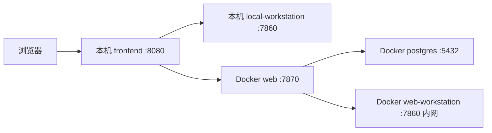

# 2026-05-04 打包部署与配置唯一真实源收口计划

> 文档定位：本文定义打包、部署、运行配置的当前主线收口方案。
>
> 事实依据：基于当前 `tools/latest/`、`tools/tools.ps1`、Docker Compose、README 与后端 role 配置加载方式调查。
>
> 权威入口：上级入口为 `docs/03-方案/后端专题/README.md`；协作规则见 `PROJECT_SPEC.md`。
>
> 最后更新：2026-05-04
>
> 当前状态：进行中

## 当前结论

项目尚未上线，本次采用破坏性收口：不保留旧部署入口兼容，不维护多套配置真源。

最终部署拓扑固定为：

| 组件 | 运行位置 | 职责 |
| --- | --- | --- |
| `frontend` | 本机进程 | 托管静态前端，向浏览器暴露统一入口 |
| `local-workstation` | 本机进程 | 用户本机 STS2、Godot、Mods、CLI、本地知识库与本地工作流 |
| `web` | Docker | 平台 API、认证、用户中心、任务、额度、管理端 |
| `web-workstation` | Docker | 平台服务器执行面，只接受 `web` 内网调度 |
| `postgres` | Docker | 平台数据库 |



## 唯一真实源

人工只编辑：

```text
runtime/agentthespire.config.json
```

部署脚本生成：

```text
runtime/generated/local-workstation.config.json
runtime/generated/web.config.json
runtime/generated/web-workstation.config.json
runtime/generated/runtime-config.js
runtime/generated/docker.env
```

生成物可删除重建，不承载人工配置真源。

运行态目录约定：

```text
runtime/knowledge              # Web 与 web-workstation 共享的服务器知识库目录
runtime/web                    # Docker web 私有 runtime
runtime/web-workstation        # Docker web-workstation 私有 runtime
runtime/logs                   # 本机进程日志
```

`runtime/knowledge` 是服务器知识库唯一真实源在部署层的共享挂载点。Docker compose 必须将该目录同时挂载到 `web` 和 `web-workstation` 的 `/app/runtime/knowledge`，且挂载顺序必须位于各自 `/app/runtime` 私有目录之后，避免被父目录挂载覆盖。

部署脚本会在生成 Docker env 前执行一次性数据归并：如果旧版部署已经在 `runtime/web/knowledge/active-knowledge-pack.json` 写入激活包，而新的 `runtime/knowledge/active-knowledge-pack.json` 尚不存在，则复制旧目录内容到共享目录。归并只为保住当前未上线环境的真实运行数据，不保留旧目录作为后续读写来源。

## 入口收口

唯一推荐入口：

```powershell
powershell -File .\tools\tools.ps1 package app
powershell -File .\tools\tools.ps1 deploy app
powershell -File .\tools\tools.ps1 stop app
```

底层脚本：

```text
tools/latest/package-app.ps1
tools/latest/deploy-app.ps1
tools/latest/stop-app.ps1
tools/latest/templates/compose.app.yml
```

旧入口不再作为当前主线：

```text
tools/docker/*
docker-compose.web.yml
docker-compose.workstation.yml
.env.web.example
.env.workstation.example
tools/latest/package-release.ps1
tools/latest/deploy-docker.ps1
tools/latest/stop-deploy.ps1
```

## 配置规则

| 配置内容 | 真源位置 |
| --- | --- |
| 本机端口、Web 端口、Postgres 宿主端口 | `deployment` |
| 本机工作站配置、LLM、生图、游戏路径 | `local_workstation.config` |
| Web 数据库、认证密钥、凭据加密密钥 | `web` |
| Web 调度执行面 token 与内网地址 | `web_workstation` |
| Docker 项目名、网络名、基础镜像 | `docker` |

## 验收标准

- README 只推荐一个部署主线。
- `tools.ps1` 菜单不再暴露旧 Docker 双脚手架或旧 latest 多目标部署。
- `deploy app -DryRun` 能生成统一配置派生物并打印拓扑。
- Docker compose 中 `web-workstation` 不暴露宿主端口。
- Docker compose 中 `web` 与 `web-workstation` 使用同一个 `runtime/knowledge` 挂载到 `/app/runtime/knowledge`。
- 前端 runtime config 不出现 `web-workstation` 地址。
- `web` 的 `platform_execution.workstation_url` 为 `http://web-workstation:7860`。

## 风险与处理

- 旧测试可能仍引用旧脚本名：本轮允许破坏性变更，后续按新入口调整测试。
- 旧文档可能仍残留历史命令：本轮至少更新 README 与后端专题索引/边界文档，后续按搜索结果继续清理。
- Docker build 与真实启动属于重型验证：本轮不默认执行，只提供建议命令。
