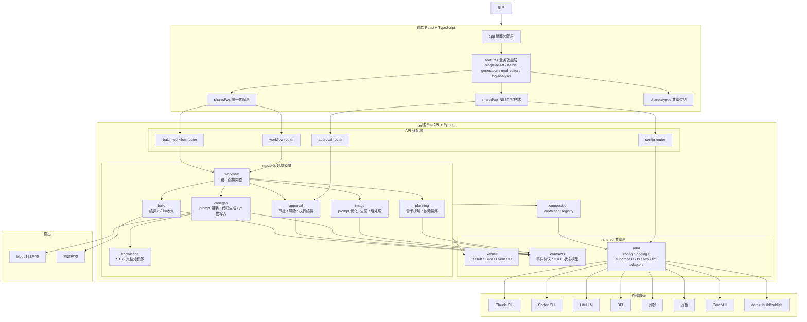
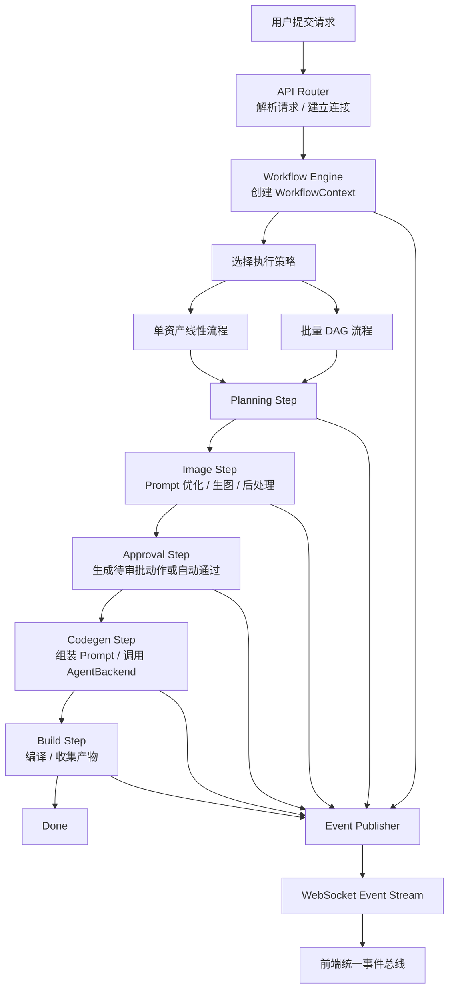
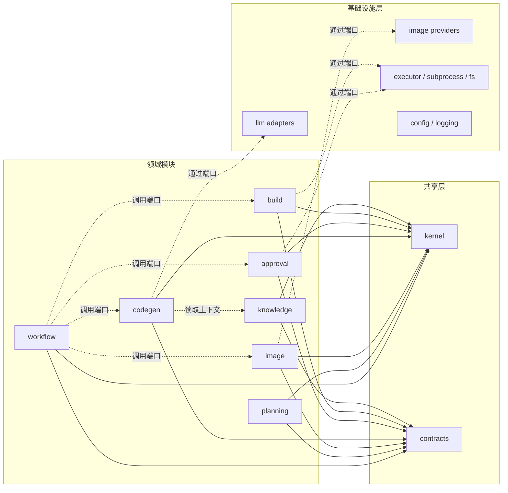
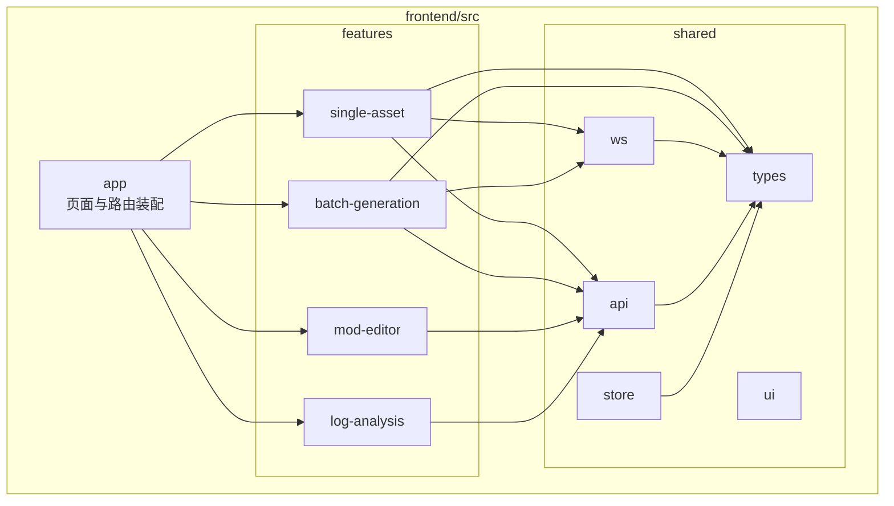
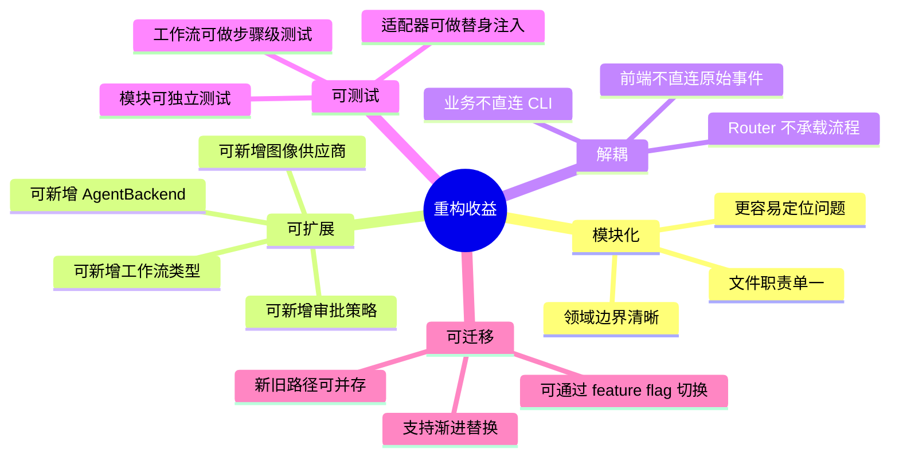

# AgentTheSpire 重构后项目分析

## 重构目标

重构后的 AgentTheSpire 不再以 `routers / agents / image / llm / approval` 这种技术分层作为主边界，而是转为：

- 后端以领域模块组织：`workflow / planning / image / codegen / approval / build / knowledge`
- 共享能力沉淀到 `shared/kernel + shared/contracts + shared/infra`
- 外部系统通过 adapter 接入，不让业务模块直接依赖 Claude、Codex、BFL、ComfyUI 等具体实现
- 单资产与批量流程共用一个统一工作流编排内核
- 前端从页面直连 WebSocket，重构为 `features + shared/ws + shared/types`

---

## 重构后整体架构

## 统一工作流编排模型

## 模块依赖边界

## 前端重构后结构

## 重构收益

## 结论

重构后的 AgentTheSpire 会从“多个大文件串联外部能力”的形态，转成“统一编排内核驱动多个领域模块”的形态。

最关键的设计判断是：

- 把 `workflow` 提升为系统中心
- 把 `llm / image provider / executor / build` 下沉为 adapter
- 把前端状态和传输层从页面中剥离
- 用共享契约统一前后端和单资产、批量两条链路
