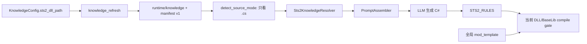

# Game Pack Stage 1 职责清单与迁移设计

> 状态：进行中
>
> 对应任务：`.trellis/tasks/07-29-game-pack-stage1`
>
> 决策依据：[`ADR 0004`](../../../04-决策/0004-generic-mod-pipeline-and-game-pack.md)

## 1. 结论

当前 STS2 支持不是由一个可选择、可验证的 Game Pack 驱动，而是由以下隐式假设共同维持：

- 所有工程默认都是 STS2 工程，`project.json` 没有 `game_id`。
- `KnowledgePaths` 固定指向 `runtime/knowledge/{game,baselib,resources}`。
- `SourceMode::RuntimeDecompiled` 只表示目录中存在 C# 文件，不表示这些文件匹配当前游戏 DLL。
- `PromptAssembler` 直接构造 `Sts2KnowledgeResolver` 并写死 `domain = "sts2"`。
- STS2 的资产类型、本地化表、资源路径、relic 图片规格、语义规则、工程模板和构建输入分别散落在 Core、Tauri 与前端。

2026-07-29 新候选已经证明该结构会把旧知识缓存标记为当前证据：Evidence Record 使用旧 STS2 DLL 和 BaseLib `v3.2.1` 的两参数 hook，compile gate 却引用当前 STS2 `v0.107.1` 与 BaseLib `v3.3.8`，最终以 `CS0115` 失败。

本阶段采用已经确认的破坏性纵向切片方案：不再给旧 `detect_source_mode` 增加过渡参数，而是先建立 Game Pack identity、loader 和内容寻址 Truth Snapshot；生成链切换后直接删除旧状态推导和隐式 fallback。

## 2. 职责清单

| 维度 | 当前生产者或真相源 | 当前消费者 | 目标所有者 | 切换与删除条件 |
| --- | --- | --- | --- | --- |
| 游戏身份 | 代码和 UI 隐式假定 STS2；`ProjectMeta` 无游戏字段 | project create/open、prompt、knowledge、build | Game Pack registry；`ProjectMeta.game_id` | 工程创建必须显式写入已加载 Pack ID；未知或缺失 ID 确定性拒绝 |
| Pack schema | 不存在 | 不存在 | Core `game_pack` loader | Good/Base/Bad fixture 通过；未知版本、缺字段和路径越界在加载期拒绝 |
| 游戏 DLL 配置 | `KnowledgeConfig.sts2_dll_path` | knowledge refresh、`local.props`、Tauri build/codegen | Pack truth-source input declaration + workstation 的 pack input values | 所有消费者通过 active project 的 Pack 解析输入后，删除裸 STS2 配置读取 |
| 游戏发现 | `platform::discovery::discover_sts2_dll` 写死 Steam/STS2 路径 | Settings/Tauri | Core 有限 discovery runner + Pack 路径候选声明 | STS2 路径常量离开 Core；runner 只执行声明的候选探测 |
| BaseLib 获取 | `GitHubBaselibSource` 写死仓库并获取 latest | knowledge refresh | Pack 声明精确 release、asset/provider；Core 执行 HTTP/cache/hash | 源码证据、NuGet 编译版本和 manifest 最低版本由同一 Pack 基线派生 |
| 反编译执行 | `knowledge::decompile` 的 `ilspycmd` runner | knowledge refresh | Core 通用 `dotnet_decompile` runner | runner 保留在 Core；输入、输出角色和完整性条件来自 Pack |
| Knowledge 布局 | `KnowledgePaths` 固定 `runtime/knowledge` | resolver、status、refresh、import/export、prompt | `runtime/game-packs/<game-id>/snapshots/<snapshot-id>` | 新 snapshot 激活并完成生成等价性后删除旧布局和 manifest v1 |
| Knowledge 新鲜度 | `SourceMode` + `.cs` 是否存在 | codegen、health、lookup | `VerifiedGameContext` / `VerifiedTruthSnapshot` | 生成 API 不再接受调用方伪造的 `SourceMode`；删除 `detect_source_mode` |
| Knowledge manifest | 路径、size、mtime、文件数 | refresh cache hit、Evidence Record | snapshot manifest：Pack/schema、SHA-256、版本、tool、索引摘要 | SHA-256 成为身份；path/size/mtime 仅可作快速检查，不作为最终证据 |
| Knowledge import/export | `knowledge::pack` 原地覆盖目录 | Tauri KnowledgeCard | snapshot export/import | 导入必须校验 schema、hash、相对路径和完整性；删除旧 overwrite API |
| 代码事实检索 | `Sts2CodeFactsProvider` | `Sts2KnowledgeResolver` | STS2 Pack provider reference；Core provider registry/executor | 相同 query 在旧刷新基线与 snapshot 上选出等价事实后切换 |
| Guidance/lookup | `crates/ats-core/templates/sts2`、`Sts2GuidanceProvider`、`Sts2LookupProvider` | PromptAssembler、状态 UI | Pack 专属资源和声明映射 | 所有模板消费者改读 Pack 后删除 Core 内嵌 STS2 slot 映射 |
| Prompt/Evidence | `PromptAssembler::built_in()` 写死 STS2 resolver/domain/API ref | code/asset/batch/preview | 通用 PromptAssembler + `VerifiedGameContext` | Evidence Record 包含 Pack ID、snapshot ID、源哈希、provider 和实际 excerpt；无 snapshot 不生成 |
| 资产类型 | Core/前端枚举 `card/card_fullscreen/relic/power/character/custom_code` | planner、prompt、asset handler、UI | Pack asset capability IDs；Core 使用受验证的字符串/newtype ID | UI 从 active Pack 读取支持能力；删除 STS2 枚举作为通用领域类型 |
| 本地化契约 | `AssetKind` 写死表名和必填 suffix | prompt、bundle validator、落盘 | Pack resource specification | 同 fixture 的 key、表名和输出路径等价后切换 |
| 图片资源规格 | `asset_bundle.rs` 写死 STS2 目录与 relic normal/outline/big | image delivery、role derivation、quality gate | Pack resource specification；Core 保留图片变换/质量算法 | 新声明生成相同路径、尺寸和角色；删除 `STS2_RELIC_IMAGE_SPECS` |
| 语义规则 | Core 通用执行器和 `STS2_RULES` 同文件 | generated C# pre-write gate | Core rule executor + Pack rule data | 等价测试通过后删除 `validate_sts2_generated_csharp` 和 STS2 常量 |
| 工程模板 | 根目录 `mod_template/` 由 `include_dir!` 直接嵌入 | `ProjectFolder::create` | Pack stable project template + Core 占位符渲染器 | 工程按 `game_id` 选择模板；删除全局唯一 `MOD_TEMPLATE_DIR` |
| Mod manifest | `mod_template/ModTemplate.json` | scaffold、build/package copy | Pack manifest contract/template | JSON 内容等价测试通过；版本升级只改 Pack 声明和取证记录 |
| 编译依赖 | csproj 中 BaseLib/Analyzers `Version="*"`，游戏 DLL 来自 `Sts2DataDir` | compile gate、publish | Pack build recipe/input bindings；BaseLib 使用精确版本 | snapshot、compile 和 package 记录同一 BaseLib 版本；删除 wildcard |
| `local.props` | `sync_local_props` 写死 `SteamLibraryPath`、`GodotPath` 及 STS2 DLL 到 steamapps 的关系 | project create/open、asset/build 提交 | Pack build input bindings + Core XML property writer | Core 只接收声明解析后的属性集合；删除 `LocalBuildPaths.sts2_dll_path` |
| compile/build runner | `dotnet build` / `dotnet publish` handler | asset compile、build job | Core 有限 runner | runner 保留；命令类型、参数绑定和预期产物来自 Pack，不允许任意脚本 |
| PCK 与 package layout | csproj/export preset 含 STS2/Godot 规则；zip handler只压指定目录 | build/package job | Pack build recipe/package layout；Core Godot/dotnet/zip runner | 产物清单等价后切换；Core 不包含 STS2 文件名和目录角色 |
| 状态与 GUI | health 以 `.cs` 存在判 ready；KnowledgeCard 写死 STS2/BaseLib | 用户配置、健康状态、刷新 | active Pack + verified snapshot status | UI 展示 Pack、snapshot 和可行动错误；旧 knowledge ready 语义删除 |
| E2E 注入 | `ATS_E2E_STS2_DLL_PATH` 等 STS2 环境变量 | GUI/driver E2E | Pack input override map | Stage 1 可保留测试别名，但生产解析不得读取 STS2 E2E 键 |

## 3. 当前数据流



错误边界在 `Detect`：旧源码存在即可被提升为“当前证据”，而 compile gate 使用另一组真实输入。

## 4. 目标数据流

```mermaid
flowchart LR
    Project["ProjectMeta.game_id"] --> Registry["GamePackRegistry"]
    Registry --> Pack["LoadedGamePack"]
    Inputs["workstation pack inputs"] --> Ensure["TruthSourceManager.ensure_current"]
    Pack --> Ensure
    Ensure --> Stage["staging snapshot"]
    Stage --> Verify{"hash/index/provider 验证"}
    Verify -- 失败 --> Reject["生成前拒绝；不调用图片/LLM"]
    Verify -- 通过 --> Current["原子激活 snapshot"]
    Current --> Context["VerifiedGameContext"]
    Context --> Search["Pack provider 检索当前证据"]
    Search --> Prompt["通用 PromptAssembler"]
    Prompt --> Generate["图片/LLM"]
    Generate --> Validate["Pack 规则 + Core 执行器"]
    Validate --> Build["Pack recipe + Core runner"]
    Build --> Package["Pack layout + Core zip"]
```



## 5. 最小边界类型

第一批只建立已有事实所需字段，不纳入图片、manifest 和 build/package 完整声明：

```text
LoadedGamePack
  identity: id, display_name
  schema_version
  capabilities
  truth_sources[]
    id
    kind: local_file | github_release_asset
    input_key / pinned_release / asset
    sha256（远端固定资源需要）
    indexer: dotnet_project | dotnet_file
    provider

VerifiedTruthSnapshot
  snapshot_id
  game_pack_id / pack_schema_version
  sources[]: id, version, source_sha256, source_size
  indexes[]: provider, relative_root, file_count, total_bytes
  tool_versions
  created_at

VerifiedGameContext
  pack
  snapshot
```

约束：

- Pack 相对路径必须 canonicalize 后仍位于 Pack 根内。
- 未知 schema、source kind、indexer、provider 或 capability 在加载期拒绝。
- 不允许 Pack 携带任意 shell 命令。
- `VerifiedGameContext` 不能由普通调用方直接构造。
- 一个 job 从开始到结束固定使用同一 snapshot；并发刷新不能改变其中途证据。
- BaseLib `3.3.8` 是当前 STS2 Pack 的精确生成/编译证据版本；Mod manifest 仍表达最低运行版本 `v3.3.8`。

## 6. 破坏性删除清单

### Truth-source 切换时删除

- `knowledge::SourceMode`
- `knowledge::runtime::detect_source_mode`
- 仅根据文件存在性给出 Fresh/Ready 的逻辑
- `KnowledgePaths` 的固定 STS2 资源布局
- `KnowledgeManifest` / `DecompileRecord` v1 运行时契约
- Prompt API 中的 `KnowledgePaths + SourceMode`
- `PromptAssembler::built_in()` 对 `Sts2KnowledgeResolver` 的直接构造
- 旧 `knowledge::pack` 原地覆盖导入路径

### 后续按维度删除

- `STS2_RULES` 与 `validate_sts2_generated_csharp`
- `AssetKind` 中的 STS2 资产集合、本地化表和 suffix
- `STS2_RELIC_IMAGE_SPECS` 与 STS2 图片目标路径分支
- 全局 `mod_template` 嵌入入口
- `LocalBuildPaths.sts2_dll_path` 和 Core 中的 Steam/STS2 路径常量
- csproj 的 BaseLib wildcard 与散落版本常量
- 前端硬编码资产类型和 STS2 knowledge 文案

删除发生在对应新路径测试和等价性证据通过之后，但不保留运行时双读或 fallback。

## 7. 调整后的实施顺序

1. **Gate 1 — 本文职责清单与数据流**：完成。
2. **Slice 1 — Pack kernel**：schema、loader、registry、路径安全、Good/Base/Bad fixture、工程 `game_id` 绑定。
3. **Slice 2 — Truth Snapshot**：SHA-256、staging、索引完整性、原子激活、固定 job snapshot。
4. **Slice 3 — Evidence cutover**：provider registry、`VerifiedGameContext`、Prompt/Evidence 切换、旧 truth-source API 删除。
5. **Gate 0 回归闭环**：在新路径刷新当前 STS2/BaseLib，重新生成候选并完成 compile/build/package；用户人工复验。
6. **逐维度迁移**：validation → resource specifications → templates/manifest → build recipe → package layout。
7. **最小非 STS2 fixture**：证明 loader/runner 不依赖 `sts2` 名称，但不宣称支持第二个真实游戏。

该顺序有意调整原 PRD 的 Gate 0/1 顺序：当前 Gate 0 失败正是旧 truth-source 边界造成的，不再为待删除链增加修复；新候选将作为 Truth Snapshot 纵向切片的首个真实验收。

## 8. 第一批实施范围

第一批只实现 Pack kernel 和设计固定，不刷新真实缓存、不运行新候选：

- 新增 `crates/ats-core/src/game_pack/`：model、loader、registry、error。
- 新增 `game_packs/sts2/game-pack.json`：identity、schema、capabilities、truth-source 最小声明。
- `ProjectMeta` 增加必填 `game_id` 并提升工程 schema；旧工程没有隐式 STS2 fallback。
- project create/Tauri API 明确传入 `game_id`；当前 UI 只提供已安装的 `sts2`。
- loader 覆盖合法最小 Pack、缺省可选字段、未知 schema、缺失字段、未知 runner/provider、路径越界和重复 Pack ID。

第一批不包含：

- 真实 DLL 反编译或缓存删除。
- Prompt/knowledge 生产链切换。
- 图片规格、validation、manifest、build/package 迁移。
- 全量测试或真实游戏操作。

## 9. 第一批验收

```text
cargo test -p ats-core game_pack::
cargo test -p ats-core project::folder::tests
cargo check -p ats-core
cargo check -p agentthespire-desktop
npx tsc --noEmit
```

验收条件：

- 合法 STS2 Pack 可以加载并按 ID 查询。
- schema/version/capability/provider/path 错误均为确定性、带字段路径的错误。
- 新工程持久化 `game_id = "sts2"`；缺失或未知 ID 的旧工程拒绝打开，并给出破坏性升级说明。
- loader 和通用类型不包含 STS2 资源路径、hook 或 asset 常量。
- 不运行 workspace 全量构建或全量测试。

## 10. 风险与控制

- **旧工程不可直接打开**：这是本次允许的破坏性边界；错误必须明确提示重建或后续使用显式迁移工具，不能静默当作 STS2。
- **外部 Pack 路径攻击**：首批即覆盖 canonical path containment；后续导入也必须先解包到 staging 并验证。
- **schema 过度设计**：首批只有 identity、capability 和 truth source；资源/build 字段在对应真实迁移时再加入。
- **双路径漂移**：新模块可以在切换前仅用于 fixture，但 Slice 3 必须在同一阶段删除旧运行时入口。
- **自动刷新成本与网络失败**：game DLL 本地 SHA-256 成本很低；远端 BaseLib 固定版本可复用现有 hash cache，失败发生在图片和 LLM 调用前。

## 11. Slice 1 实施结果（2026-07-30）

已完成：

- 新增通用 `game_pack` kernel：严格 schema v1 loader、显式能力目录、registry、字段路径错误和 Pack 相对路径 containment。
- 新增内置 `game_packs/sts2/game-pack.json`，声明 `game` 与固定 `v3.3.8` 的 BaseLib truth source；第一批不虚构尚未取证的远端 asset SHA-256。
- 工程 schema 提升到 v2，`ProjectMeta.game_id` 成为必填字段；create、open 和 save 均通过已加载 registry 验证 Pack ID。
- Tauri `create_project` 和 TypeScript adapter 改为显式传入 `game_id`；当前 GUI 只暴露已安装的 `sts2` Pack，并显示活动工程的 game ID。
- 旧工程缺少 `game_id`、未知 Pack ID 或 schema v1 时确定性拒绝，不使用隐式 STS2 fallback。

验证结果：

```text
cargo test -p ats-core game_pack::                 # 9 passed
cargo test -p ats-core project::folder::tests      # 10 passed
cargo check -p ats-core                            # passed
cargo check -p agentthespire-desktop               # passed
npx tsc --noEmit                                   # passed
```

本切片没有刷新或删除旧 knowledge 缓存，也没有改动 Prompt、Evidence、图片、validation、template、build 或 package 的生产路径。下一步是 Slice 2 Truth Snapshot；只有其内容身份、staging、原子激活和 job 固定语义通过后，才进入 Evidence cutover。
