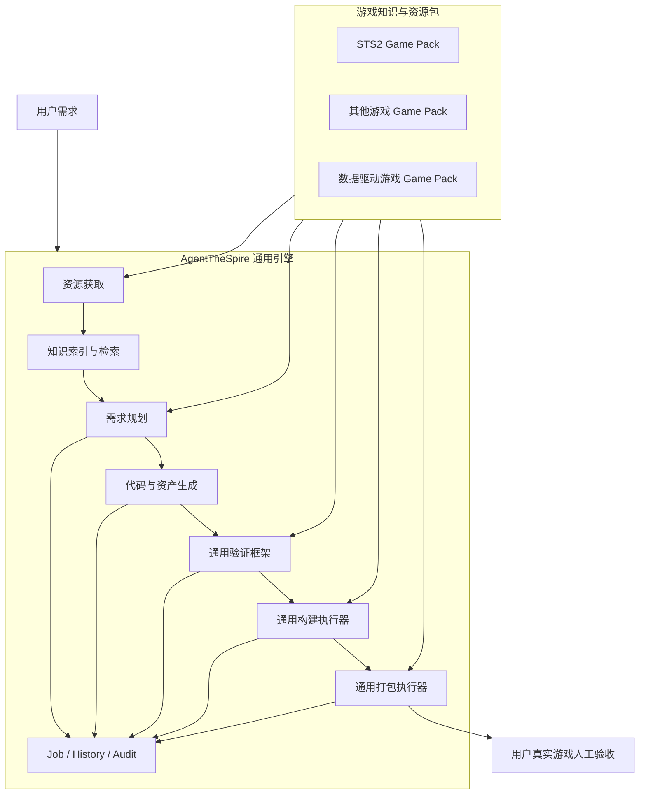
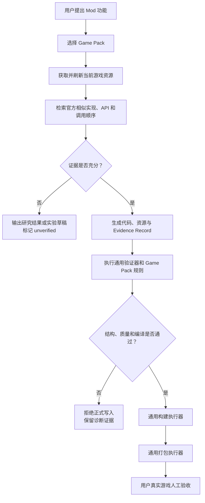

# ADR 0004 — 通用 Mod 生产流水线与 Game Pack 边界

| 项 | 值 |
| --- | --- |
| 状态 | Accepted |
| 决议日期 | 2026-07-29 |
| 适用范围 | AgentTheSpire 多游戏 Mod 生成、验证、构建与打包架构 |
| 当前实施状态 | 架构边界已确认；现有 STS2 实现尚未按本 ADR 完成全部资源化收口 |
| 相关决策 | [ADR 0001 — Rust + Tauri 整体架构](./0001-rust-tauri-workspace-architecture.md) |
| 问题来源 | [真实游戏加载与资产质量问题审查](../05-审查与验证/进行中/2026-07-28-真实游戏加载与资产质量问题审查.md) |

## 1. 背景

AgentTheSpire 当前首先服务于 STS2 Mod 开发，但长期目标是接入多个游戏、Mod 框架和技术栈。不同游戏都需要完成资源获取、知识检索、需求规划、代码/资产生成、验证、构建和打包；真正变化的是真相来源、游戏专属资源及各步骤的声明数据。

真实游戏验收同时证明，把 STS2 行为示例手写进通用模板，会将过期或错误的时序语义扩散到代码生成。为每个游戏建立一套厚 `GameAdapter` 又会重复生成、构建和打包能力。为每种行为建立持久化“行为契约”则会引入契约选择、版本迁移和错误结论集中扩散的新风险。

## 2. 决策

AgentTheSpire 采用：

> **一条通用 Mod 生产流水线 + 多个可加载的游戏知识与资源包（Game Pack）。**

平台统一提供资源获取、索引检索、LLM 生成、资产处理、验证、构建、打包、job/history/audit 与人工验收串联。Game Pack 只提供真相源声明、游戏专属资源、工程骨架、目标资产规格、稳定验证规则和构建/打包步骤的声明数据；它不重新实现一套游戏专属 handler。

### 2.1 总体关系



### 2.2 通用引擎与 Game Pack 的边界

| 通用引擎负责 | Game Pack 负责 |
| --- | --- |
| 获取、缓存和刷新资源 | 声明获取什么、来自哪里 |
| 建立索引并检索当前证据 | 提供真相源和专属资源 |
| 调用 LLM 并处理结构化输出 | 提供稳定工程骨架与上下文 |
| 生成、变换、写入和回滚资产 | 声明目标资产类型、规格和路径 |
| 执行结构、schema、质量与回归规则 | 提供稳定约束与已知错误规则数据 |
| 运行构建图、捕获日志、处理取消 | 描述工具、参数、依赖和预期产物 |
| 收集、校验、哈希和压缩文件 | 描述必需文件、目录布局与 include/exclude |
| 记录 job/history/audit 并展示验收项 | 提供游戏和资源版本、人工验收清单 |

这一边界的判定句是：

> **引擎实现“怎么做”；Game Pack 声明“针对当前游戏做什么”。**

## 3. 核心领域术语

| 术语 | 定义 | 非本术语含义 |
| --- | --- | --- |
| `Game Pack` | 一个可加载的游戏知识与资源包，包含真相源、专属资源及流水线声明数据 | 不是为某游戏重写一套生成/构建/打包能力的厚 Adapter |
| `Truth Source` | 当前游戏版本的可追溯事实来源，如 SDK、schema、源码、二进制元数据或反编译结果 | 不是 LLM 对某个功能的持久化语义结论 |
| `Source Provider` | 可被多个游戏复用的来源获取方式，如本地目录、Git、HTTP 文档、反编译器或 schema provider | 不是游戏专属 handler |
| `Resource Specification` | Game Pack 对代码、图片、音频、本地化等目标资产的声明 | 不自己实现资产处理算法 |
| `Build Recipe` | 对构建步骤、工具、参数、依赖与预期产物的声明式描述 | 不是游戏专属构建代码 |
| `Package Layout` | 对最终交付目录/压缩包布局与收集规则的声明 | 不是游戏专属打包 handler |
| `Evidence Record` | 本次生成实际使用的当前来源、symbol、版本与用途记录 | 不是下次生成可直接复用的行为答案缓存 |

## 4. Game Pack 的逻辑结构

下列只是目标逻辑布局，不表示本 ADR 已创建了所有目录或锁定了最终文件格式：

```text
games/<game-id>/
  game.json          # 游戏标识、版本与能力需求
  sources.json       # 真相源与 Source Provider 组合
  resources/         # SDK、schema、指南、框架依赖等资源
  templates/         # 稳定工程骨架，不固化易变行为答案
  asset-specs/       # 目标资产类型、规格和路径
  validation/        # schema、稳定约束与已知错误规则
  build.json         # 构建图声明
  package.json       # 交付布局声明
```

为了避免过早抽象，第一阶段只需定义当前 STS2 必需的最小字段。只有第二个游戏接入后仍确实共用的结构，才应上升为通用 schema。

## 5. 真相源优先的生成流程

游戏行为代码不从持久化“功能答案”直接生成，而是在每次任务中检索当前版本真相源，并将实际使用的证据写入本次任务记录。



检索结果可以缓存以减少 IO 和 token 成本，但缓存项必须带有真相源版本并可失效。LLM 对某个功能的语义推导不作为跨任务权威答案。

## 6. 模板、验证和构建的边界

### 6.1 模板

Game Pack 模板只保留工程文件、目录、依赖、入口、资源路径和本地化格式等稳定结构。不在通用模板或长期手写 guidance 中固化“某个功能必须使用某个 hook”这类易变行为答案。

### 6.2 验证

验证引擎实现可复用的规则类型，Game Pack 提供规则数据。例如，引擎实现 `forbidden_call_in_method`，STS2 Game Pack 可以提供“`BeforeCombatStart` 中禁止调用 `PlayerCmd.GainEnergy`”的已知回归规则。规则用于表达稳定 schema 或已证实的错误模式，不企图完整建模游戏行为。

### 6.3 构建与打包

通用构建器负责步骤依赖、命令执行、环境、超时、取消、日志、预期产物和失败分类；Game Pack 只描述使用哪些工具、参数和产物。通用打包器负责路径安全、文件收集、哈希、必需文件校验和压缩；Game Pack 只描述布局和 include/exclude。

## 7. STS2 映射示例

| 通用概念 | STS2 当前实例 |
| --- | --- |
| Truth Source | `sts2.dll`、BaseLib、反编译 C#、manifest schema、游戏日志 |
| Source Provider | 本地文件、GitHub Release、HTTP 下载、`ilspycmd` 反编译 |
| Resource Specification | relic normal/outline/big、`eng/zhs` 本地化、C# 与 manifest |
| Build Recipe | `dotnet build/publish` 后调用 Godot `export-pack` |
| Package Layout | Mod DLL、PCK、manifest 与 BaseLib 依赖布局 |
| Validation Rule | manifest schema、资源路径、compile gate、已知 hook 错误规则 |
| Manual Acceptance | 由用户在真实游戏内确认文本、视觉、行为和稳定性 |

这些是 STS2 Game Pack 的内容，不是 STS2 独占的平台能力。图片处理、质量检测、编译执行、打包、文件事务与任务追踪应保持通用。

## 8. 接入新游戏的验收标准

当新游戏只使用平台已支持的 Source Provider、资源处理器、验证器、build runner 和 package runner 时：

- 只新增 Game Pack 及声明配置。
- 不新增游戏专属 asset/code/build/package handler。
- 不复制 job、history、audit、文件事务或 UI 流程。
- 通过同一条主链完成资源获取、生成、验证、构建、打包和人工验收。

只有遇到新的、可跨游戏复用的基础能力时，才修改通用引擎，例如新反编译格式、新资源编码器、新 build runner 或新压缩格式。这类能力不得以游戏名称命名或只能被单个 Game Pack 调用。

## 9. 明确不采用的方案

### 9.1 每游戏一套厚 GameAdapter

不让 STS2、Unity/BepInEx 或其他游戏分别重写资源生成、构建、打包、job 与 UI 流程。这会形成平行子系统，增加漂移和维护成本。

### 9.2 每功能一条持久化行为契约

不建立庞大的“行为配方 SSOT”。它本质上是对某次源码解释的语义缓存，会引入选择错误、过期迁移和“错误契约驱动全链一致犯错”的风险。平台保留当前真相源检索、本次 Evidence Record 和少量确定性回归规则。

### 9.3 把当前 STS2 实现当成通用抽象

不将 C#、Godot、BaseLib、DLL/PCK、relic/card/power 或 STS2 hook 写入通用领域接口。这些只是第一个 Game Pack 的当前内容。

## 10. 结果与取舍

### 正向结果

- 多游戏复用同一条产品主链，避免复制生成、验证、构建和打包能力。
- 游戏差异收敛为可审查、可更新和可版本化的资源与声明数据。
- 行为生成以当前真相源为依据，不把历史 Markdown 示例当作永久答案。
- 新增基础能力时必须能被多个 Game Pack 复用，防止游戏特例渗入通用核心。

### 成本和风险

- 行为代码每次生成都需要针对当前真相源检索和推理，会增加少量 IO、时间和 token 成本。
- 声明式 build/package/resource schema 需要在表达能力与复杂度之间保持节制，不应发展成一门新的通用编程语言。
- 当某游戏确实需要新基础能力时，可能需要扩展 Source Provider、资源处理器或 runner；扩展前必须检查是否可复用。
- 源码证据与静态/编译验证仍无法完全代替真实游戏行为和视觉验收。

## 11. 实施约束

- 本 ADR 固化目标边界，不授权立即大范围重构现有 STS2 实现。
- 当前问题修复应优先使用最小可验证的通用抽象：源码取证、轻量回归规则、图片质量门禁和 schema 校验。
- Game Pack 文件格式、加载路径和 runner 协议属于后续实施设计，需要基于当前代码和第二个游戏用例单独确认。
- 接入第二个游戏时，以“是否只需新增 Game Pack”作为通用化验收；不在只有 STS2 一个样本时预测并穷举所有游戏差异。
