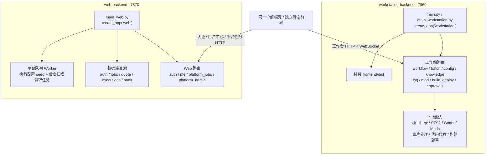
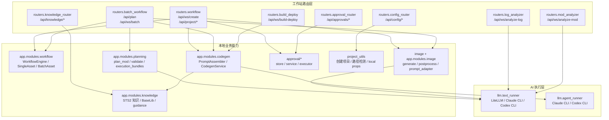
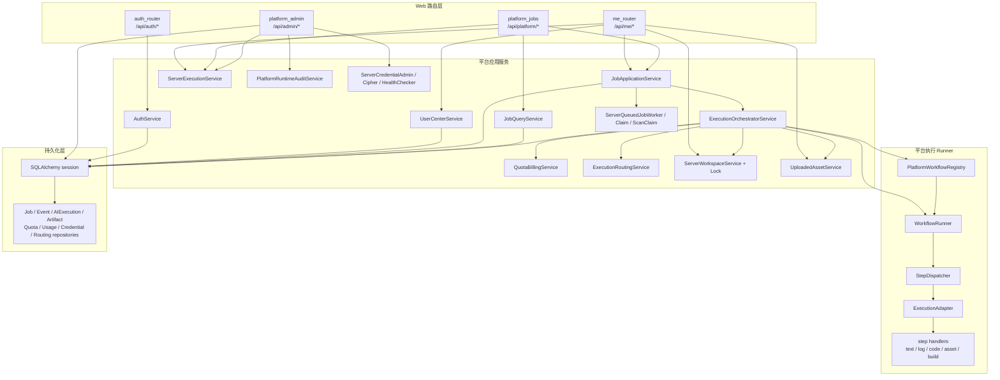
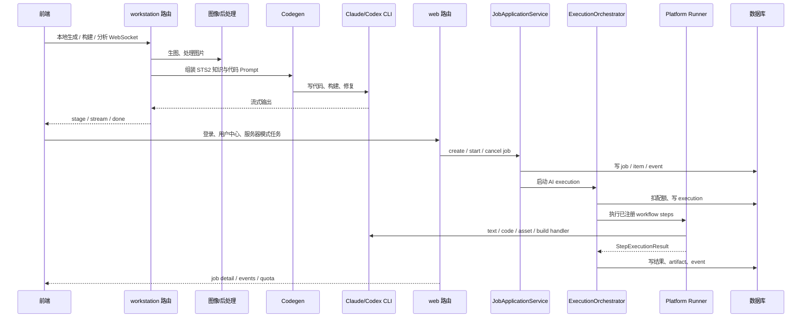

# 2026-04-02 工作站端与 Web 端边界说明

> 文档定位：本文固化当前代码实现中的 `workstation-backend` 与 `web-backend` 边界，回答入口、路由、模块、运行依赖和职责归属问题。
>
> 事实依据：基于当前 `backend/app_factory.py`、`backend/routers/__init__.py`、`backend/app/composition/container.py`、`backend/app/shared/infra/config/settings.py` 与平台 runner 代码核实。
>
> 权威入口：上级入口为 `docs/04-决策/后端/README.md`；接口细节见 `docs/02-现状/当前前后端接口文档.md`。
>
> 最后更新：2026-04-27

## 1. 当前结论

当前后端运行角色已经收口为 **`workstation` 与 `web` 两类**：

- `workstation-backend`：本地创作工作站，负责前端静态资源、本地项目工作流、配置、知识库、日志/Mod 分析、构建部署和审批。
- `web-backend`：平台 API 服务，负责认证、当前用户中心、平台任务、配额、执行记录、凭据、审计和后台队列执行。
- `full` 不再是当前代码中的有效运行角色；`backend/main.py` 当前等价于工作站入口，调用 `create_app("workstation")`。

## 2. 运行角色与入口

| 角色 | 入口文件 | 默认端口 | 前端静态文件 | 路由来源 | 数据库要求 |
| --- | --- | --- | --- | --- | --- |
| `workstation` | `backend/main_workstation.py`、`backend/main.py` | `7860` | 是，挂载 `frontend/dist` | 仅工作站路由 | 默认不要求 |
| `web` | `backend/main_web.py` | `7870` | 否 | 仅 Web 路由 | 要求 `database.url` 与 `auth.session_secret` |

运行时校验来自 `Settings.validate_for_role(role)`：

- `workstation` 主要校验 CORS 与认证 cookie 名称。
- `web` 额外要求数据库连接与 session secret。

## 3. 边界总图

## 4. 路由装配边界

`backend/routers/__init__.py` 定义两个固定路由集合。

### 4.1 工作站路由集合

| 路由模块 | 典型路径 | 作用 | 边界判断 |
| --- | --- | --- | --- |
| `routers.workflow` | `/api/ws/create`、`/api/project/create`、`/api/project/build`、`/api/project/package` | 单资产创建、生图、代码生成、项目创建、构建与打包 | 依赖本地项目目录、图片处理、代码 Agent、本地文件系统 |
| `routers.batch_workflow` | `/api/plan`、`/api/plan/review`、`/api/ws/batch` | 批量规划与批量资产创建 | 面向本地 Mod 工程生成流程 |
| `routers.config_router` | `/api/config/*` | 工作站配置、路径探测、本机 AI 能力、平台队列诊断、生图测试 | 依赖本机配置和本地环境 |
| `routers.knowledge_router` | `/api/knowledge/*` | 运行时知识库状态检查与刷新 | 服务本地 STS2 知识库与代码生成上下文 |
| `routers.log_analyzer` | `/api/ws/analyze-log` | 读取本机游戏日志并交给 LLM 分析 | 本地诊断能力 |
| `routers.mod_analyzer` | `/api/ws/analyze-mod` | 扫描本地 Mod 项目源码与 localization 内容并分析 | 本地项目分析能力 |
| `routers.build_deploy` | `/api/ws/build-deploy` | 构建项目并部署到本机 STS2 Mods 目录 | 直接依赖本地构建链路和游戏安装目录 |
| `routers.approval_router` | `/api/approvals/*` | 审批请求读取、批准、拒绝、执行 | 当前归属工作站路由，服务本地工作流执行链路 |

### 4.2 Web 路由集合

| 路由模块 | 典型路径 | 作用 | 边界判断 |
| --- | --- | --- | --- |
| `routers.auth_router` | `/api/auth/*` | 注册、登录、登出、当前登录态、邮箱验证、找回密码 | 平台身份体系 |
| `routers.me_router` | `/api/me/*` | 当前用户 profile、quota、jobs、server preferences、upload assets、server workspaces | 当前用户视角的平台 API |
| `routers.platform_jobs` | `/api/platform/jobs/*`、`/api/platform/quota`、`/api/platform/execution-profiles` | 平台任务、任务事件、配额、执行配置兼容接口 | 数据库驱动的平台任务接口 |
| `routers.platform_admin` | `/api/admin/*` | 执行记录、退款、审计、服务器凭据、执行配置管理 | 平台后台管理能力 |

当前 `app_factory.create_app(role)` 的装配规则是：

- `role == "workstation"`：只加载 `WORKSTATION_ROUTER_MODULES`，并挂载前端静态资源。
- `role == "web"`：只加载 `WEB_ROUTER_MODULES`，不挂载前端静态资源，并注册 Web 队列 worker 生命周期。

## 5. 工作站主要模块关系

工作站侧的判断标准：

- 要操作本地项目目录、本地配置、本机日志、STS2/Godot/Mods 路径。
- 要通过 WebSocket 给工作台页面推送长流程状态。
- 要调用本地 CLI 代码代理或构建部署链路。
- 要服务单人创作工作流，而不是平台多用户任务管理。

## 6. Web 主要模块关系

Web 侧的判断标准：

- 要管理 `Job`、`AIExecution`、`Quota`、`Audit`、`Credential` 等平台数据。
- 要使用数据库会话、仓储、查询服务或平台应用服务。
- 面向多用户、多任务、服务器运行态。
- 不依赖前端静态文件托管，也不应直接读取用户本机路径。

## 7. 主链路关系

## 8. 共享模块与特殊模块

### 8.1 共享模块

以下模块可被两端复用，但不能因此模糊归属：

- `llm/*`：文本补全、Claude/Codex CLI 代码代理。
- `app.modules.codegen`：代码生成 prompt 组装、代码写入、构建触发。
- `app.modules.knowledge`：STS2 / BaseLib 知识上下文。
- `app.shared.*`：配置、契约、错误、prompt、基础设施。

共享模块的归属判断看“入口和运行语义”，不是看目录是否被两边 import。

### 8.2 审批模块

`approval_router` 当前仍在工作站路由集合中，使用 `approval.runtime`、`approval.store`、`approval.service` 和 `approval.executor`。平台侧存在 `ApprovalAdapter` / facade 方向的演进痕迹，但当前 `web` 路由集合没有挂载 `/api/approvals/*`。

因此审批能力当前准确表述为：

- 路由归属：工作站端。
- 主要服务对象：本地工作流执行链路。
- 后续若要平台化，需要迁入 Web 端并补齐数据库、权限、审计和跨用户隔离边界。

## 9. 新增接口归属规则

应归到工作站端：

- 要操作用户本机项目目录、日志、配置、STS2/Godot/Mods 路径。
- 要驱动本地构建、部署、图片处理或本地 CLI 工作流。
- 要给工作台页面做 WebSocket 长流程推流。

应归到 Web 端：

- 要管理用户、任务、执行、配额、凭据、审计。
- 要通过数据库持久化查询或命令。
- 要面向服务器部署、平台队列、平台后台或多用户运行态。

需要单独评审的混合接口：

- “工作站触发，但平台落库”的流程。
- 审批相关接口。
- Build/Deploy 的平台化改造接口。
- 既想本地运行又想服务器运行的兼容接口。

## 10. 当前建议

后续默认采用以下口径：

- “工作站端后端” = `create_app("workstation")` + `WORKSTATION_ROUTER_MODULES` + 前端静态托管 + 本地工作流。
- “Web 端后端” = `create_app("web")` + `WEB_ROUTER_MODULES` + 数据库 + 平台应用服务 + 队列 worker。
- `backend/main.py` 不是 `full`，而是工作站入口兼容文件。
- `full`、迁移开关条件挂载等说法只应作为历史阶段记录，不再作为当前实现基线。
