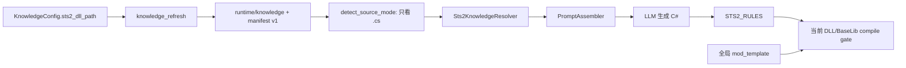

# Game Pack Stage 1 职责清单与迁移设计

> 归档说明：本文记录已完成的 Stage 1 迁移基线，仅供追溯，不代表当前任务状态。
>
> 状态：已完成
>
> 对应任务：`.trellis/tasks/archive/2026-07/07-29-game-pack-stage1`
>
> 决策依据：[`通用 Mod 流水线与 Game Pack 边界`](../../03-当前方案/通用Mod流水线与Game-Pack边界.md)

## 1. 结论

当前 STS2 支持不是由一个可选择、可验证的 Game Pack 驱动，而是由以下隐式假设共同维持：

- 所有工程默认都是 STS2 工程，`project.json` 没有 `game_id`。
- `KnowledgePaths` 固定指向 `runtime/knowledge/{game,baselib,resources}`。
- `SourceMode::RuntimeDecompiled` 只表示目录中存在 C# 文件，不表示这些文件匹配当前游戏 DLL。
- `PromptAssembler` 直接构造 `Sts2KnowledgeResolver` 并写死 `domain = "sts2"`。
- STS2 的资产类型、本地化表、资源路径、relic 图片规格、语义规则、工程模板和构建输入分别散落在 Core、Tauri 与前端。

2026-07-29 新候选已经证明该结构会把旧知识缓存标记为当前证据：Evidence Record 使用旧 STS2 DLL 和 BaseLib `v3.2.1` 的两参数 hook，compile gate 却引用当前 STS2 `v0.107.1` 与 BaseLib `v3.3.8`，最终以 `CS0115` 失败。

本阶段采用已经确认的破坏性纵向切片方案：不再给旧 `detect_source_mode` 增加过渡参数，而是先建立 Game Pack identity、loader 和内容寻址 Truth Snapshot；生成链切换后直接删除旧状态推导和隐式 fallback。

## 2. 职责清单

| 维度 | 当前生产者或真相源 | 当前消费者 | 目标所有者 | 切换与删除条件 |
| --- | --- | --- | --- | --- |
| 游戏身份 | 代码和 UI 隐式假定 STS2；`ProjectMeta` 无游戏字段 | project create/open、prompt、knowledge、build | Game Pack registry；`ProjectMeta.game_id` | 工程创建必须显式写入已加载 Pack ID；未知或缺失 ID 确定性拒绝 |
| Pack schema | 不存在 | 不存在 | Core `game_pack` loader | Good/Base/Bad fixture 通过；未知版本、缺字段和路径越界在加载期拒绝 |
| 游戏 DLL 配置 | `KnowledgeConfig.sts2_dll_path` | knowledge refresh、`local.props`、Tauri build/codegen | Pack truth-source input declaration + workstation 的 pack input values | 所有消费者通过 active project 的 Pack 解析输入后，删除裸 STS2 配置读取 |
| 游戏发现 | `platform::discovery::discover_sts2_dll` 写死 Steam/STS2 路径 | Settings/Tauri | Core 有限 discovery runner + Pack 路径候选声明 | STS2 路径常量离开 Core；runner 只执行声明的候选探测 |
| BaseLib 获取 | `GitHubBaselibSource` 写死仓库并获取 latest | knowledge refresh | Pack 声明精确 release、asset/provider；Core 执行 HTTP/cache/hash | 源码证据、NuGet 编译版本和 manifest 最低版本由同一 Pack 基线派生 |
| 反编译执行 | `knowledge::decompile` 的 `ilspycmd` runner | knowledge refresh | Core 通用 `dotnet_decompile` runner | runner 保留在 Core；输入、输出角色和完整性条件来自 Pack |
| Knowledge 布局 | `KnowledgePaths` 固定 `runtime/knowledge` | resolver、status、refresh、import/export、prompt | `runtime/game-packs/<game-id>/snapshots/<snapshot-id>` | 新 snapshot 激活并完成生成等价性后删除旧布局和 manifest v1 |
| Knowledge 新鲜度 | `SourceMode` + `.cs` 是否存在 | codegen、health、lookup | `VerifiedGameContext` / `VerifiedTruthSnapshot` | 生成 API 不再接受调用方伪造的 `SourceMode`；删除 `detect_source_mode` |
| Knowledge manifest | 路径、size、mtime、文件数 | refresh cache hit、Evidence Record | snapshot manifest：Pack/schema、SHA-256、版本、tool、索引摘要 | SHA-256 成为身份；path/size/mtime 仅可作快速检查，不作为最终证据 |
| Knowledge import/export | `knowledge::pack` 原地覆盖目录 | Tauri KnowledgeCard | snapshot export/import | 导入必须校验 schema、hash、相对路径和完整性；删除旧 overwrite API |
| 代码事实检索 | `Sts2CodeFactsProvider` | `Sts2KnowledgeResolver` | STS2 Pack provider reference；Core provider registry/executor | 相同 query 在旧刷新基线与 snapshot 上选出等价事实后切换 |
| Guidance/lookup | `crates/ats-core/templates/sts2`、`Sts2GuidanceProvider`、`Sts2LookupProvider` | PromptAssembler、状态 UI | Pack 专属资源和声明映射 | 所有模板消费者改读 Pack 后删除 Core 内嵌 STS2 slot 映射 |
| Prompt/Evidence | `PromptAssembler::built_in()` 写死 STS2 resolver/domain/API ref | code/asset/batch/preview | 通用 PromptAssembler + `VerifiedGameContext` | Evidence Record 包含 Pack ID、snapshot ID、源哈希、provider 和实际 excerpt；无 snapshot 不生成 |
| 资产类型 | Core/前端枚举 `card/card_fullscreen/relic/power/character/custom_code` | planner、prompt、asset handler、UI | Pack asset capability IDs；Core 使用受验证的字符串/newtype ID | UI 从 active Pack 读取支持能力；删除 STS2 枚举作为通用领域类型 |
| 本地化契约 | `AssetKind` 写死表名和必填 suffix | prompt、bundle validator、落盘 | Pack resource specification | 同 fixture 的 key、表名和输出路径等价后切换 |
| 图片资源规格 | `asset_bundle.rs` 写死 STS2 目录与 relic normal/outline/big | image delivery、role derivation、quality gate | Pack resource specification；Core 保留图片变换/质量算法 | 新声明生成相同路径、尺寸和角色；删除 `STS2_RELIC_IMAGE_SPECS` |
| 语义规则 | Core 通用执行器和 `STS2_RULES` 同文件 | generated C# pre-write gate | Core rule executor + Pack rule data | 等价测试通过后删除 `validate_sts2_generated_csharp` 和 STS2 常量 |
| 工程模板 | 根目录 `mod_template/` 由 `include_dir!` 直接嵌入 | `ProjectFolder::create` | Pack stable project template + Core 占位符渲染器 | 工程按 `game_id` 选择模板；删除全局唯一 `MOD_TEMPLATE_DIR` |
| Mod manifest | `mod_template/ModTemplate.json` | scaffold、build/package copy | Pack manifest contract/template | JSON 内容等价测试通过；版本升级只改 Pack 声明和取证记录 |
| 编译依赖 | csproj 中 BaseLib/Analyzers `Version="*"`，游戏 DLL 来自 `Sts2DataDir` | compile gate、publish | Pack build recipe/input bindings；BaseLib 使用精确版本 | snapshot、compile 和 package 记录同一 BaseLib 版本；删除 wildcard |
| `local.props` | `sync_local_props` 写死 `SteamLibraryPath`、`GodotPath` 及 STS2 DLL 到 steamapps 的关系 | project create/open、asset/build 提交 | Pack build input bindings + Core XML property writer | Core 只接收声明解析后的属性集合；删除 `LocalBuildPaths.sts2_dll_path` |
| compile/build runner | `dotnet build` / `dotnet publish` handler | asset compile、build job | Core 有限 runner | runner 保留；命令类型、参数绑定和预期产物来自 Pack，不允许任意脚本 |
| PCK 与 package layout | csproj/export preset 含 STS2/Godot 规则；zip handler只压指定目录 | build/package job | Pack build recipe/package layout；Core Godot/dotnet/zip runner | 产物清单等价后切换；Core 不包含 STS2 文件名和目录角色 |
| 状态与 GUI | health 以 `.cs` 存在判 ready；KnowledgeCard 写死 STS2/BaseLib | 用户配置、健康状态、刷新 | active Pack + verified snapshot status | UI 展示 Pack、snapshot 和可行动错误；旧 knowledge ready 语义删除 |
| E2E 注入 | `ATS_E2E_STS2_DLL_PATH` 等 STS2 环境变量 | GUI/driver E2E | Pack input override map | Stage 1 可保留测试别名，但生产解析不得读取 STS2 E2E 键 |

## 3. 当前数据流



错误边界在 `Detect`：旧源码存在即可被提升为“当前证据”，而 compile gate 使用另一组真实输入。

## 4. 目标数据流

```mermaid
flowchart LR
    Project["ProjectMeta.game_id"] --> Registry["GamePackRegistry"]
    Registry --> Pack["LoadedGamePack"]
    Inputs["workstation pack inputs"] --> Ensure["TruthSourceManager.ensure_current"]
    Pack --> Ensure
    Ensure --> Stage["staging snapshot"]
    Stage --> Verify{"hash/index/provider 验证"}
    Verify -- 失败 --> Reject["生成前拒绝；不调用图片/LLM"]
    Verify -- 通过 --> Current["原子激活 snapshot"]
    Current --> Context["VerifiedGameContext"]
    Context --> Search["Pack provider 检索当前证据"]
    Search --> Prompt["通用 PromptAssembler"]
    Prompt --> Generate["图片/LLM"]
    Generate --> Validate["Pack 规则 + Core 执行器"]
    Validate --> Build["Pack recipe + Core runner"]
    Build --> Package["Pack layout + Core zip"]
```



## 5. 最小边界类型

第一批只建立已有事实所需字段，不纳入图片、manifest 和 build/package 完整声明：

```text
LoadedGamePack
  identity: id, display_name
  schema_version
  capabilities
  truth_sources[]
    id
    kind: local_file | github_release_asset
    input_key / pinned_release / asset
    sha256（远端固定资源需要）
    indexer: dotnet_project | dotnet_file
    provider

VerifiedTruthSnapshot
  snapshot_id
  game_pack_id / pack_schema_version
  sources[]: id, version, source_sha256, source_size
  indexes[]: provider, relative_root, file_count, total_bytes
  tool_versions
  created_at

VerifiedGameContext
  pack
  snapshot
```

约束：

- Pack 相对路径必须 canonicalize 后仍位于 Pack 根内。
- 未知 schema、source kind、indexer、provider 或 capability 在加载期拒绝。
- 不允许 Pack 携带任意 shell 命令。
- `VerifiedGameContext` 不能由普通调用方直接构造。
- 一个 job 从开始到结束固定使用同一 snapshot；并发刷新不能改变其中途证据。
- BaseLib `3.3.8` 是当前 STS2 Pack 的精确生成/编译证据版本；Mod manifest 仍表达最低运行版本 `v3.3.8`。

## 6. 破坏性删除清单

### Truth-source 切换时删除

- 生成 Prompt/Job 对 `knowledge::SourceMode`、`detect_source_mode` 和 `KnowledgePaths` 的读取
- Prompt API 中的 `KnowledgePaths + SourceMode`
- lookup 的 ilspy/可变目录 fallback

旧 `KnowledgePaths`、`SourceMode`、refresh/status、manifest v1 与 import/export 暂时只服务旧知识维护 UI；Work Order 6 接入 Snapshot 获取/刷新后再整体删除，生产生成链不得读取这些接口。

### 后续按维度删除

- `STS2_RULES` 与 `validate_sts2_generated_csharp`
- `AssetKind` 中的 STS2 资产集合、本地化表和 suffix
- `STS2_RELIC_IMAGE_SPECS` 与 STS2 图片目标路径分支
- 全局 `mod_template` 嵌入入口
- `LocalBuildPaths.sts2_dll_path` 和 Core 中的 Steam/STS2 路径常量
- csproj 的 BaseLib wildcard 与散落版本常量
- 前端硬编码资产类型和 STS2 knowledge 文案

删除发生在对应新路径测试和等价性证据通过之后，但不保留运行时双读或 fallback。

## 7. 调整后的实施顺序

1. **Gate 1 — 本文职责清单与数据流**：完成。
2. **Slice 1 — Pack kernel**：schema、loader、registry、路径安全、Good/Base/Bad fixture、工程 `game_id` 绑定。
3. **Slice 2 — Truth Snapshot**：SHA-256、staging、索引完整性、原子激活、固定 job snapshot。
4. **Slice 3 — Evidence cutover**：provider registry、`VerifiedGameContext`、Prompt/Evidence 切换、旧 truth-source API 删除。
5. **Gate 0 回归闭环**：在新路径刷新当前 STS2/BaseLib，重新生成候选并完成 compile/build/package；用户人工复验。
6. **逐维度迁移**：validation → resource specifications → templates/manifest → build recipe → package layout。
7. **最小非 STS2 fixture**：证明 loader/runner 不依赖 `sts2` 名称，但不宣称支持第二个真实游戏。

该顺序有意调整原 PRD 的 Gate 0/1 顺序：当前 Gate 0 失败正是旧 truth-source 边界造成的，不再为待删除链增加修复；新候选将作为 Truth Snapshot 纵向切片的首个真实验收。

## 8. 第一批实施范围

第一批只实现 Pack kernel 和设计固定，不刷新真实缓存、不运行新候选：

- 新增 `crates/ats-core/src/game_pack/`：model、loader、registry、error。
- 新增 `game_packs/sts2/game-pack.json`：identity、schema、capabilities、truth-source 最小声明。
- `ProjectMeta` 增加必填 `game_id` 并提升工程 schema；旧工程没有隐式 STS2 fallback。
- project create/Tauri API 明确传入 `game_id`；当前 UI 只提供已安装的 `sts2`。
- loader 覆盖合法最小 Pack、缺省可选字段、未知 schema、缺失字段、未知 runner/provider、路径越界和重复 Pack ID。

第一批不包含：

- 真实 DLL 反编译或缓存删除。
- Prompt/knowledge 生产链切换。
- 图片规格、validation、manifest、build/package 迁移。
- 全量测试或真实游戏操作。

## 9. 第一批验收

```text
cargo test -p ats-core game_pack::
cargo test -p ats-core project::folder::tests
cargo check -p ats-core
cargo check -p agentthespire-desktop
npx tsc --noEmit
```

验收条件：

- 合法 STS2 Pack 可以加载并按 ID 查询。
- schema/version/capability/provider/path 错误均为确定性、带字段路径的错误。
- 新工程持久化 `game_id = "sts2"`；缺失或未知 ID 的旧工程拒绝打开，并给出破坏性升级说明。
- loader 和通用类型不包含 STS2 资源路径、hook 或 asset 常量。
- 不运行 workspace 全量构建或全量测试。

## 10. 风险与控制

- **旧工程不可直接打开**：这是本次允许的破坏性边界；错误必须明确提示重建或后续使用显式迁移工具，不能静默当作 STS2。
- **外部 Pack 路径攻击**：首批即覆盖 canonical path containment；后续导入也必须先解包到 staging 并验证。
- **schema 过度设计**：首批只有 identity、capability 和 truth source；资源/build 字段在对应真实迁移时再加入。
- **双路径漂移**：新模块可以在切换前仅用于 fixture，但 Slice 3 必须在同一阶段删除旧运行时入口。
- **自动刷新成本与网络失败**：game DLL 本地 SHA-256 成本很低；远端 BaseLib 固定版本可复用现有 hash cache，失败发生在图片和 LLM 调用前。

## 11. Slice 1 实施结果（2026-07-30）

已完成：

- 新增通用 `game_pack` kernel：严格 schema v1 loader、显式能力目录、registry、字段路径错误和 Pack 相对路径 containment。
- 新增内置 `game_packs/sts2/game-pack.json`，声明 `game` 与固定 `v3.3.8` 的 BaseLib truth source；第一批不虚构尚未取证的远端 asset SHA-256。
- 工程 schema 提升到 v2，`ProjectMeta.game_id` 成为必填字段；create、open 和 save 均通过已加载 registry 验证 Pack ID。
- Tauri `create_project` 和 TypeScript adapter 改为显式传入 `game_id`；当前 GUI 只暴露已安装的 `sts2` Pack，并显示活动工程的 game ID。
- 旧工程缺少 `game_id`、未知 Pack ID 或 schema v1 时确定性拒绝，不使用隐式 STS2 fallback。

验证结果：

```text
cargo test -p ats-core game_pack::                 # 9 passed
cargo test -p ats-core project::folder::tests      # 10 passed
cargo check -p ats-core                            # passed
cargo check -p agentthespire-desktop               # passed
npx tsc --noEmit                                   # passed
```

本切片没有刷新或删除旧 knowledge 缓存，也没有改动 Prompt、Evidence、图片、validation、template、build 或 package 的生产路径。

## 12. Slice 2 实施结果（2026-07-30）

已完成：

- `LoadedGamePack` 记录 loader 实际接受的 Pack manifest 字节 SHA-256；`github_release_asset.sha256` 成为必填字段并统一为小写。
- STS2 Pack 固定 BaseLib `v3.3.8` 官方 `BaseLib.dll`：`1,014,272` 字节，SHA-256 为 `e92213e9286cb8cb9db42b83735cc9ddc2d642a7c90c67c5350c983d734407a8`。
- 新增 `TruthSnapshotStore`、`TruthSnapshotDraft`、`TruthSnapshotManifest` 和 `VerifiedTruthSnapshot`。源文件流式复制并计算 SHA-256；索引树按排序后的相对路径、大小与文件哈希形成稳定摘要。
- draft 位于 `runtime/game-packs/<game-id>/.staging/`，完成验证后同卷重命名到不可变的 `snapshots/<snapshot-id>/`；`current.json` 仅在快照验证成功后原子更新。
- Snapshot ID 绑定 Pack ID/schema/内容哈希、全部 source 身份、provider/indexer/索引树摘要和工具版本；`created_at` 与 staging 目录名不参与身份，相同内容复用同一快照。
- `open_current` / `open_snapshot` 重新校验 Pack 绑定、manifest 身份、source SHA-256/大小和 index tree 完整性；路径穿越和 index symlink 被拒绝。
- 一个生成 job 可以持有既有 `VerifiedTruthSnapshot`；后续激活新 current 不改变旧 handle 指向的证据目录。

针对性验证：

```text
cargo test -p ats-core game_pack::truth_snapshot::   # 11 passed
cargo test -p ats-core game_pack::loader::tests      # 7 passed
cargo test -p ats-core game_pack::registry::tests    # 3 passed
cargo check -p ats-core                              # passed
```

边界与下一步：

- 本切片是新 Snapshot Store 的旁路能力，尚未改动旧 `KnowledgePaths`、`knowledge_refresh`、`SourceMode`、Prompt/Evidence 或正式 `runtime/knowledge` 缓存。
- 本切片不负责 Snapshot 获取器、反编译 runner、GC、导入/导出或真实缓存刷新。
- 下一步先建立“旧刷新基线 vs Snapshot provider”事实选择等价性夹具，固定相同 query 的 symbol、路径、excerpt 和警告语义；夹具通过后再进入 Slice 3 Evidence cutover，并在同一切片删除旧 truth-source API 和 fallback。

## 13. Snapshot provider 等价性夹具（2026-07-30）

已完成：

- `VerifiedTruthSnapshot::provider_index_roots` 按 Pack 声明选择一个 provider 的全部已验证 index roots，并保留 manifest 的确定性 source-id 顺序。
- STS2 Pack 的 game 与 BaseLib source 统一声明 `sts2_code_facts`。provider 在查询前聚合两个 index，继续共享一个 `CodeFactsIndex`、一次全局排序、一个 `MAX_FACTS` 预算和一次行为证据选择；不采用两个 source 分别查询后拼接。
- `Sts2CodeFactsProvider::build_facts_from_snapshot` 只接受 `VerifiedTruthSnapshot`，为 evidence path 生成 `snapshot://<snapshot-id>/<source-id>/<relative-path>` 稳定坐标；未映射 provider 确定性返回 `SnapshotCodeFactsError::MissingProvider`。
- 复用同一份 Lantern、CombatManager 和 BaseLib fixture，同时建立旧 `KnowledgePaths` 布局与内容相同的 Truth Snapshot。比较时只归一化旧绝对根目录与 Snapshot URI，fact key/title/body/priority/evidence path/keywords/asset types、顺序和 warnings 必须完全相同。
- 等价性覆盖首回合能量行为证据、BaseLib 精确 symbol 和普通 relic 查询。路径根和 snapshot ID 是已声明的非语义差异，source-id 后的相对路径必须一致。

针对性验证：

```text
cargo test -p ats-core knowledge::sts2_code_facts_provider::tests  # 14 passed
cargo test -p ats-core game_pack::                                 # 21 passed
```

边界与下一步：

- 当前只是 Snapshot provider 的可验证旁路，`PromptAssembler` 和 handlers 仍使用 `KnowledgePaths + SourceMode`；正式 Evidence Record 尚未改为 Snapshot URI。
- 下一步进入 Slice 3 Evidence cutover：新增不可伪造的 `VerifiedGameContext`，让 Prompt/Evidence 与生成 job 固定使用同一 Pack/Snapshot，切换全部调用方后删除 `detect_source_mode`、旧 Prompt truth-source 参数和静默 fallback。

## 14. Slice 3 Evidence cutover 实施结果（2026-07-30）

已完成：

- 新增不可直接构造的 `VerifiedGameContext`。Desktop/Web 入口从工程 `project.json.game_id`、内置 registry 与 `TruthSnapshotStore::open_current` 创建；不存在 current Snapshot 时在创建 Job、图片生成或 LLM 调用前明确失败。
- `Sts2KnowledgeResolver` 与 `Sts2LookupProvider` 只读取 context 中固定的 `VerifiedTruthSnapshot`。facts 使用已通过等价性门禁的聚合 provider；lookup 只暴露 `snapshot://<snapshot-id>/<source-id>/`，不再提供 ilspy 或可变缓存路径 fallback。
- 生成 Prompt API 删除 `KnowledgePaths + SourceMode` 参数。Evidence Record 序列化 Pack ID/display/schema/SHA、Snapshot ID/schema、全部 source/index 摘要、tool versions 与 `created_at`，并记录实际 injected facts。
- `JobApplicationService` 的 code、asset、batch 提交接口按值持有 context，spawn 后不会受并发 current 切换影响；Job payload 的 `_gameContext` 固化同一身份。
- code/asset/batch handlers 删除 `detect_source_mode`；Tauri prompt preview 与提交链从活动工程创建 context，Web prompt preview 从请求工程 metadata 创建 context。
- 旧 `Sts2CodeFactsProvider::build_facts` 仅在 `cfg(test)` 下保留，用于已提交的 legacy ↔ Snapshot 等价性夹具。旧 refresh/status 仍暂时存在，但生产生成链搜索不到其类型或探测函数。

针对性验证：

```text
cargo test -p ats-core codegen::prompt_assembler::tests                 # 9 passed
cargo test -p ats-core knowledge::sts2_knowledge_resolver::tests       # 1 passed
cargo test -p ats-core knowledge::sts2_lookup_provider::tests          # 1 passed
cargo test -p ats-core platform::application::handlers::batch_custom_code::tests  # 4 passed
cargo test -p ats-core platform::application::handlers::asset_generate::tests      # 11 passed
cargo test -p ats-core --test job_lifecycle code_generate_writes_files_via_public_api # 1 passed
cargo test -p ats-web routes::codegen::tests::missing_current_snapshot_is_rejected_as_bad_request # 1 passed
cargo check -p ats-core                                                # passed
cargo check -p agentthespire-desktop                                   # passed
cargo check -p ats-web                                                 # passed
```

边界与下一步：

- Slice 3 提交时尚未实现生产刷新链；该限制已由下述 Slice 4A 解除。
- 当前 STS2 `v0.107.1` / BaseLib `v3.3.8` Snapshot 已由下述 Slice 4B 建立；Gate 0 候选和后续职责迁移已由 Slice 4C 完成。真实游戏复验仍由用户人工执行。

## 15. Slice 4A Snapshot refresh cutover 实施结果（2026-07-30）

已完成：

- 新增 Pack 驱动的 `TruthSnapshotRefresher`。本地输入由活动工程和 workstation 配置绑定；远程输入只访问 Pack 固定 GitHub release tag 和精确 asset，并由 Snapshot staging 校验 Pack SHA-256。
- `dotnet_project` / `dotnet_file` 是当前唯一允许的 indexer；`ilspycmd --version` 进入 Snapshot 身份。所有 indexer 只消费 staging 副本。
- verified current 的 Pack、local SHA、remote identity、index 和 tool version 未变化时返回 cache hit；本地源变化时可复用仍通过完整校验的固定远程源；`force` 重新获取并索引，但相同内容仍按 Snapshot ID 去重。
- 刷新持有 OS 文件锁。fetch/hash/index/finalize 任一步失败都不会更新 `current.json`；Pack 声明的 BaseLib 不再是可选 warning。
- 新增 `TruthSnapshotRefresh` Job，结果记录 Pack ID、Snapshot ID、cache hit、source/index 数和 tool versions。请求只含 `force`，不能伪造 game/source/indexer。
- Refresh-only Job service 不构造也不要求 LLM client；没有配置 API key 时仍可建立首次 Snapshot。
- Desktop 状态切换为 `ready | missing | invalid`，展示 Pack、Snapshot、source/index/tool 身份；health readiness 只认可完整 verified current。
- 删除旧 `knowledge_refresh` handler、latest BaseLib 客户端、manifest v1、runtime status、ZIP import/export 和 Web 全局 knowledge status route。`KnowledgeRefresh` 只保留为历史 Job 反序列化枚举；legacy `SourceMode` / `KnowledgePaths` 仅在 `cfg(test)` 等价性夹具中存在。
- GitHub API token 只发给 API 请求，不转发给 release 响应提供的 asset download URL。

针对性验证：

```text
cargo test -p ats-core game_pack::truth_snapshot::refresh::tests                  # 10 passed
cargo test -p ats-core platform::application::handlers::truth_snapshot_refresh::tests # 1 passed
cargo check -p ats-core                                                           # passed
cargo check -p agentthespire-desktop                                              # passed
cargo check -p ats-web                                                            # passed
npx tsc -b --pretty false                                                         # passed
```

边界与下一步：

- Slice 4A 收口时尚未通过新入口刷新本机真实 Snapshot；该项已由下述 Slice 4B 完成，Gate 0 候选已由 Slice 4C 完成。
- 未运行全量测试、全量构建或真实游戏 UI。
- 后续自动迁移与候选结果见 Slice 4C；最终真实游戏复验交由用户执行。

## 16. Slice 4B 真实 current Snapshot 验证结果（2026-07-30）

真实桌面 E2E 使用当前 Tauri Job/UI 入口和临时 STS2 工程，不操作游戏 UI。首次真实刷新暴露 GitHub asset 在慢链路下被 60 秒 whole-request timeout 中断；API 和 CDN 均可达，但 BaseLib 只传输部分字节，旧实现没有续传。修复后：

- GitHub asset 获取使用独立 connect/read-stall/total timeout，并在同一次刷新内限定重试。
- 中断后只在 `206 Content-Range` 起点精确匹配本地长度时追加；完整 `200` 截断重下，错误 range 确定性拒绝。
- `toolVersions.ilspycmd` 归一化为 `9.1.0.7988`，避免 value 重复工具名并污染 Snapshot 身份/UI。
- 定点 Snapshot 测试 `24 passed`，`cargo check -p ats-core` 通过。
- 最终真实桌面 E2E `1 passing`，Job、`current.json` 和 manifest 的 Snapshot ID 一致。

当前 verified Snapshot：

- 最终候选使用的 Snapshot ID：`5bd4e6ffd7e667bfac6613d6c6a7c3185e9fd9fafe7a07974c9a3faef03c4b6d`。
- STS2：`9,364,480` 字节，SHA-256 `a1f9e653f1e28e4076558fee1e60d218619cb7e057b887c6417f62c62c6d7a52`。
- BaseLib `v3.3.8`：`1,014,272` 字节，SHA-256 `e92213e9286cb8cb9db42b83735cc9ddc2d642a7c90c67c5350c983d734407a8`。
- game index：`dotnet_project`，3,425 个 C# 文件；BaseLib index：`dotnet_file`，1 个 C# 文件。
- 工具身份：`ilspycmd 9.1.0.7988`。

该切片建立 Snapshot 时尚未完成的候选与 GUI E2E 迁移均已由 Slice 4C 收口。真实游戏行为、视觉、加载和稳定性仍必须由用户人工复验。

## 17. Slice 4C Game Pack Stage 1 自动收口结果（2026-07-30）

已完成：

- validation、resource specifications、guidance/template/manifest、build recipe 与 package layout 已逐维度迁移到 `game_packs/sts2/game-pack.json` 及其受控资源；消费者统一通过 Pack loader/registry 读取，旧 `Sts2GuidanceProvider`、Core 内嵌 STS2 templates、全局 `mod_template` 和对应 fallback 已删除。
- Core 只保留有限执行器：声明校验、资源派生、模板渲染、`dotnet_publish` 和精确文件布局打包。最小非 STS2 fixture 证明执行器不依赖 `sts2` 名称。
- `local.props` 改由 Pack 的本地输入绑定和 build recipe 生成；STS2 游戏 DLL 与 Godot 路径不再以 Core 专属字段作为公开契约。
- 从空 Snapshot 根执行正式桌面 E2E。首次 compile gate 以 `CS0246` 暴露 relic guidance 缺少 `MegaCrit.Sts2.Core.Combat`；补齐 Pack guidance 和防回归断言后重新刷新并生成最终候选。

最终自动证据：

- 候选目录：`.tmp/e2e-runs/1785417051-99088`，WDIO `1 passing`。
- Pack SHA-256：`81238b4f679c9bc994d596021903446aa0091edaa576c5c604f1e4ed2985dd39`；Snapshot ID：`5bd4e6ffd7e667bfac6613d6c6a7c3185e9fd9fafe7a07974c9a3faef03c4b6d`。
- Snapshot 固定 STS2 SHA-256 `a1f9e653f1e28e4076558fee1e60d218619cb7e057b887c6417f62c62c6d7a52`、BaseLib `v3.3.8` SHA-256 `e92213e9286cb8cb9db42b83735cc9ddc2d642a7c90c67c5350c983d734407a8` 和 `ilspycmd 9.1.0.7988`。
- 最终源码使用三参数 `AfterSideTurnStart`，拒绝非 Owner side 和 `TurnNumber > 1`，再调用 `PlayerCmd.GainEnergy(1, Owner)`；`BeforeCombatStart` 不存在，compile/build 均通过。
- 模板固定 `Alchyr.Sts2.BaseLib 3.3.8` 和 E2E 实际解析过的 `Alchyr.Sts2.ModAnalyzers 0.1.9`，脚手架断言不再允许 `Version="*"`；模板树 SHA-256 为 `a08225ec2054415f559993a3c7b11eab9726f0227da9d67f33344736a1e388ea`。
- 图片质量 `accepted = true`：透明覆盖约 70.48%、边缘前景 0、最大主体连通度 100%；normal/outline/big 尺寸分别为 `128x128`、`128x128`、`1024x1024` 且 SHA-256 互不相同。
- manifest 使用 `min_game_version: "0.107.1"` 和 BaseLib `v3.3.8` 对象 dependency；ZIP 恰好包含 BaseLib 与 E2ESingleRelic 的 6 个声明文件。
- 自动证据文件：`.tmp/e2e-runs/1785417051-99088/gate0-candidate-evidence.json`。

Stage 1 自动化部分已经收口。未执行 workspace 全量测试/构建，Agent 未操作真实游戏 UI。2026-07-30 用户完成最终候选人工复验，确认图片与背景、中文描述、Mod 本体和游戏内功能正常；日志确认 BaseLib 266 patches/0 failed 及 E2ESingleRelic DLL/PCK/initializer 成功。Gate 0、Gate 5 和 Gate 7 已闭环。

Stage 1 不宣称完整多游戏 UI 已完成：当前只有一个已安装 Pack，因此 workstation Settings/发现命令仍以 STS2 DLL 为用户可见输入；`Sts2CodeFactsProvider` 仍是 Pack 选择的有限 provider executor。它们不参与已迁移维度的 STS2 常量 fallback，是否提升为多 Pack 声明由第二个真实游戏需求决定，避免在单一样本上继续预测 schema。
